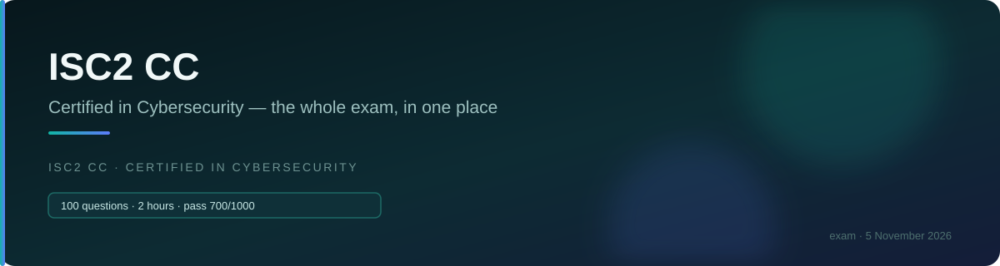

# 🔥 Read this when you want to quit

### *For the evening you're tired, behind schedule, and asking why you started this.*

---

## If you landed here mid-study, this page is for you

You didn't open this file because things are going well. You opened it because it's week 3 or
week 6, the schedule slipped, a mock came back lower than you hoped, or you're just tired after
a full day of work and the last thing you want to do is read about access control models.

That's normal. Nobody studies for a certification on a smooth, motivated, straight line. Read
one section below, close the laptop if you need to, and come back tomorrow. **A missed day is
not a failed attempt. Quitting is the only thing that actually costs you the exam.**

---

## 🧗 On starting when you don't feel like it

> "You don't have to be great to start, but you have to start to be great."
> — Zig Ziglar

> "Discipline is choosing between what you want now and what you want most."
> — Abraham Lincoln

> "Motivation is what gets you started. Habit is what keeps you going."
> — Jim Ryun

> "We are what we repeatedly do. Excellence, then, is not an act, but a habit."
> — Will Durant, paraphrasing Aristotle

---

## 🌊 On the middle, when it feels endless

> "It always seems impossible until it's done."
> — Nelson Mandela

> "The struggle you're in today is developing the strength you need for tomorrow."
> — Robert Tew

> "Fall seven times, stand up eight."
> — Japanese proverb

> "Perseverance is not a long race; it is many short races one after another."
> — Walter Elliot

> "You don't have to see the whole staircase, just take the first step."
> — Martin Luther King Jr.

---

## 📉 On a bad mock score, or a topic that won't stick

> "It's not that I'm so smart, it's just that I stay with problems longer."
> — Albert Einstein

> "I have not failed. I've just found 10,000 ways that won't work."
> — Thomas Edison

> "Success is not final, failure is not fatal: it is the courage to continue that counts."
> — Winston Churchill

> "The expert in anything was once a beginner who refused to give up."
> — Helen Hayes

A mediocre score on Mock 1 is not a verdict — it's the entire reason Mock 1 exists. Go re-read
[`00-foundations/study-schedule/`](../00-foundations/study-schedule/README.md) if you've forgotten
why it's placed where it is.

---

## 🎯 On remembering why you're doing this

> "The future belongs to those who learn more skills and combine them in creative ways."
> — Robert Greene

> "An investment in knowledge pays the best interest."
> — Benjamin Franklin

> "Choose a job you love, and you will never have to work a day in your life."
> — Confucius

> "Continuous effort — not strength or intelligence — is the key to unlocking our potential."
> — Winston Churchill

You are not studying this for a piece of paper. You're building the vocabulary and judgment
that will make you better at the job you already do, or the one you're trying to get. The
certificate is just proof of something that will already be true.

---

## 🌙 The night before

> "Believe you can and you're halfway there."
> — Theodore Roosevelt

> "Do the best you can until you know better. Then when you know better, do better."
> — Maya Angelou

If it's the night before your exam and you found this page instead of `EXAM-DAY.md` — go read
[`EXAM-DAY.md`](../EXAM-DAY.md) instead. You've done the work. Trust it.

---

## 🤝 If you're building this alongside someone else

If this repo is public and someone you don't know is reading this file right now, mid-study,
having a hard week — this line is for you specifically:

**You are not behind. You are exactly as far along as someone who started and kept going. That
already puts you ahead of everyone who didn't.**

Now close this file, and go do one topic. Just one.

---

<a href="../README.md">← back to the repo index</a> &nbsp;·&nbsp; <a href="../00-foundations/study-schedule/README.md">back to the schedule →</a>

</content>
