# EMOJI Topic Title

### *A one-line subtitle that says what this actually is, in plain words*

📌 *One sentence on what the exam wants from this topic specifically.*

---

## 🧸 The big idea

<!-- Plain English. No jargon yet. A comparison to something already understood.
     Two or three short paragraphs at most. -->

---

## 📖 Words you will keep seeing

<!-- Define every term BEFORE it is used below. ISC2's wording, not industry slang. -->

| Word | What it means on this exam |
|---|---|
| **Term** | Definition in ISC2's phrasing. |

---

## 🔍 The explanation

<!-- Short sections. A diagram where it genuinely clarifies. Cut anything the exam
     cannot ask about. -->

---

## ⚖️ Told apart

<!-- The highest-value block on the page. Term pairs the exam deliberately confuses. -->

| | Means | Not to be confused with |
|---|---|---|
| **Term A** | … | **Term B**, which is … |

---

## ⚠️ Where your instinct is wrong

<!-- Only include if there is a genuine practitioner-vs-textbook gap. Delete otherwise. -->

> [!WARNING]
> **In the job:** …
> **On the exam:** …

---

## 🧠 How to remember it

<!-- Only if a hook genuinely helps. Delete the section otherwise — do not invent one. -->

---

## ✅ Check you actually got it

Answer all five before expanding anything.

**Q1.** …

- **A.** …
- **B.** …
- **C.** …
- **D.** …

<b>Answer</b>

**X — …**  Why the right answer is right, in one or two sentences.

- **A** is wrong because …
- **B** is wrong because …
- **D** is wrong because …

<!-- Repeat to Q5 -->

---

## 🎓 The grown-up version

<b>Extra depth — open this on a second read, never needed for the pass</b>

<!-- Real-world nuance, exact figures, related concepts that are out of scope.
     Delete this section if there is nothing worth putting in it. -->

---

## 📝 Cram lines

Destined for [`EXAM-DAY.md`](../../EXAM-DAY.md):

- …
- …

---

<a href="../README.md">← back to MODULE NAME</a>

