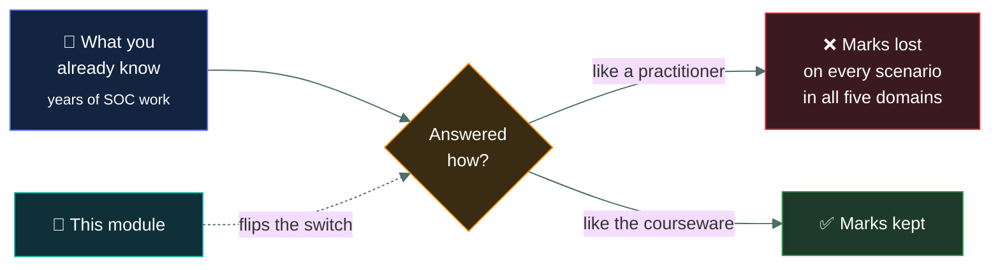

# 🧱&nbsp; 00 · Foundations

### *How the exam works, and how ISC2 wants you to think.*

---

## 👋 01 · Read this first

None of this module is on the exam. All of it changes how you answer the exam.

The CC paper does not reward depth. It rewards recognising which of four words matches a
definition, and picking the answer the ISC2 courseware would pick. Those are two different
skills from the one you use at work, and this module is where you pick them up — before you
spend seven weeks reading domain content through the wrong lens.

Every page in this repo is built the same way, so you always know where you are:

| Section | What it gives you |
|---|---|
| 🧸 **The big idea** | A plain-English handle on the thing before any jargon |
| 📖 **Words you will keep seeing** | Every term defined *before* it gets used |
| 🔍 **The explanation** | Short sections and diagrams, with the tested parts called out |
| ⚖️ **Told apart** | The term pairs the exam deliberately confuses |
| ⚠️ **Where your instinct is wrong** | Where doing the job well and answering well diverge |
| 🧠 **How to remember it** | A hook, where one genuinely helps |
| ✅ **Check you actually got it** | Five questions, every wrong option explained |
| 🎓 **The grown-up version** | Collapsed. Depth for a second read — never needed to pass |
| 📝 **Cram lines** | The two or three facts that end up on your final page |

> [!TIP]
> If you read only one page in this entire repo before starting the domains, make it
> [`how-isc2-thinks/`](how-isc2-thinks/). For anyone who already works in security, it is
> worth more marks than any single domain topic.

---

## 📂 02 · The 6 topics

Work top to bottom. The whole module is about **90 minutes**, and it is the best ninety
minutes you will spend on this exam.

| | Topic | What you will be able to do afterwards |
|:--:|---|---|
| &#9744; | 📋 [`how-the-exam-works/`](how-the-exam-works/) | Say exactly what you are sitting: format, length, pass mark, and what the scaled score does and does not mean. |
| &#9744; | 🧠 [`how-isc2-thinks/`](how-isc2-thinks/) | Recognise the ISC2 house answer, and spot the five places your job experience will actively mislead you. |
| &#9744; | 🎯 [`answering-technique/`](answering-technique/) | Eliminate distractors systematically, read qualifier words correctly, and budget the two hours. |
| &#9744; | 🗺️ [`the-five-domains/`](the-five-domains/) | Name what is actually inside each domain, so nothing on the paper is a surprise. |
| &#9744; | 📅 [`study-schedule/`](study-schedule/) | Follow a day-by-day plan from today to 5 November that fits around full-time work. |
| &#9744; | 🎫 [`exam-day-logistics/`](exam-day-logistics/) | Book it correctly, turn up with the right ID, and know what happens in the ten minutes after you finish. |

---

## 🎯 03 · What this module is worth

Nothing, directly — there is no "exam mechanics" domain.

Indirectly, it is the highest-leverage module in the repo. A candidate who knows the
material but answers like a practitioner loses marks on every scenario question in all five
domains. That is a systematic loss, and it is entirely fixable in an afternoon.

---

## ⏭️ 04 · Where to go next

When all six boxes above are ticked, start [`01-security-principles/`](../01-security-principles/README.md)
— the heaviest domain at 26%, and the vocabulary the other four are written in.

---

<a href="../README.md">← back to the repo index</a>

