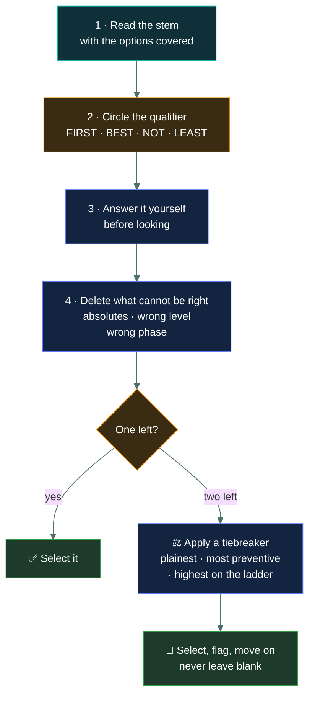

# 🎯 Answering technique

### *How to get marks out of questions you are not sure about — which will be more of them than you expect*

📌 *A repeatable method for working four options down to one, reading qualifier words correctly, and spending the two hours so nothing is left blank.*

---

## 🧸 The big idea

You will not know the answer to every question. Nobody does. A pass is built out of the
questions you know **plus** the questions you worked out, and the second pile is bigger than
most candidates expect.

Working one out is a mechanical process, not a flash of insight:

**Cover the options. Read the stem. Decide what you think. Then read the options and delete
the ones that cannot be right.**

Covering the options first matters more than it sounds. Four plausible statements sitting in
front of you will pull your thinking towards whichever one you read last. Forming your own
answer before you look is the difference between choosing an option and being chosen by one.

---

## 📖 Words you will keep seeing

| Word | What it means on this exam |
|---|---|
| **Stem** | The question text, before the options. |
| **Option** | One of the four answers, A–D. |
| **Key** | The correct option. |
| **Distractor** | An incorrect option, written to be plausible. |
| **Qualifier** | A word in the stem that narrows what is being asked: *first, best, primary, most, least, except, not*. |
| **Absolute** | A word admitting no exceptions: *always, never, all, none, completely, guarantees*. |
| **Flag** | The exam software's marker for "come back to this". CC is linear, so flagging works. |

---

## 🔍 The five-step method

Run every question you are not immediately sure about through these five steps. It takes
about twenty seconds once it is habit.

### Step 1 · Read the stem with the options covered

On screen you cannot literally cover them, so read the stem twice before letting your eyes
drop. The habit is what matters.

### Step 2 · Find the qualifier

There is almost always one, and it decides the answer more often than the technical content
does. Find it before you read the options, not after.

### Step 3 · Answer it yourself

Say the answer in your head. If it is there among the options, that is a strong signal. If
nothing resembles it, you have probably misread the stem — go back and read it again rather
than reaching for whichever option looks nearest.

### Step 4 · Delete what cannot be right

Three deletions cover most of what you will meet:

- **Absolutes.** *Always, never, all, none, completely eliminates, guarantees.* Usually false.
- **Wrong level of authority.** An analyst accepting risk. An administrator setting
  classification. A technical role making a business decision.
- **Wrong phase.** A recovery action offered as the answer to a containment question, or a
  technical action offered where the stem asked what comes FIRST.

### Step 5 · Break the tie, then commit

Two options left is the normal end state, not a failure. Take the one that is:

- the **plainest textbook statement** rather than the most sophisticated,
- the **preventive** control rather than the detective one, unless the stem asked to detect,
- **highest on the safety → plan → notify → decide → act ladder**, if it is a FIRST question.

Then select it, flag it, and move on. A flagged answer you revisit with a fresh mind is worth
far more than three extra minutes of grinding at it now.

---

## ⚖️ Told apart

The qualifier words, and what each is really asking for.

| Qualifier | Asking for | Common mistake |
|---|---|---|
| **FIRST** | The earliest correct step in a sequence. | Choosing the most *effective* action instead of the earliest one. Several options are usually things you would genuinely do. |
| **BEST** | The highest-quality option overall. | Choosing something that merely works, when a more complete or more preventive option is present. |
| **PRIMARY** | The main purpose of something. | Choosing a real but secondary benefit. A firewall's primary purpose is controlling traffic, not logging it — even though it does log. |
| **MOST LIKELY** | The common case. | Choosing a sophisticated attack when the mundane explanation fits. |
| **LEAST** | The weakest or the exception. | Forgetting the inversion halfway through the options. |
| **NOT / EXCEPT** | The one false statement among three true ones. | Reading the first true statement and selecting it out of momentum. |

> [!CAUTION]
> **Inverted stems are the highest-error question type on any exam**, and the errors come from
> candidates who knew the material perfectly well. When you see NOT, EXCEPT or LEAST, pause for
> one full second and restate the question to yourself: *"three of these are true — I am hunting
> the false one."*

---

## ⏱️ Spending the two hours

120 minutes, 100 questions. Most CC questions are recall and take twenty to thirty seconds,
so the time pressure is mild — but only if you refuse to get stuck.

| Pass | What you do | Roughly |
|---|---|---|
| **1** | Answer every question. Anything not resolved in ~60 seconds: best guess, flag, move on. | 60–75 min |
| **2** | Revisit flagged questions only, with a fresh head. | 20 min |
| **3** | Confirm all 100 have an answer selected. | 5 min |
| — | Spare | 20+ min |

**The one-minute rule.** No question gets more than sixty seconds on pass one. Not one. A
question that has beaten you for sixty seconds will not fall to ninety, and the two questions
you never reached because of it were probably ones you knew.

> [!IMPORTANT]
> Pass 3 is not optional. Finishing with an unanswered question on a no-negative-marking exam
> is the only way this paper actively punishes you, and it happens to people every sitting.

---

## 🔄 On changing answers

The folklore says never change your first instinct. The folklore is wrong, with one condition.

Change an answer when you have a **reason**: you misread the qualifier, you spotted an
absolute you had glossed over, a later question reminded you of the definition. Research on
multiple-choice testing consistently finds that reasoned changes go from wrong to right more
often than the reverse.

Do **not** change an answer out of vague unease on a second reading. Free-floating doubt with
no new information behind it is the one case where the folklore holds.

> 🧠 **The test:** can you say *why* in a sentence? If yes, change it. If it is just a feeling,
> leave it.

---

## ⚠️ Where your instinct is wrong

> [!WARNING]
> **In the job:** a question that seems to have two right answers means the question is badly
> framed, and you push back on it.
>
> **On the exam:** two right answers means the qualifier is doing the work, and you have not
> used it yet. Go back to the stem and find *first*, *best* or *primary*. It is there.

> [!WARNING]
> **In the job:** unfamiliar terminology is worth stopping to investigate.
>
> **On the exam:** it may be an unscored pretest item, or wording the syllabus simply does not
> use. Guess from the stem's context, flag it, move on. Never let one strange question cost you
> three questions' worth of time and your composure.

---

## 🧠 How to remember it

🧠 **"Cover, qualify, answer, delete, commit."**

Five words, in order, matching the five steps. Under pressure it collapses neatly to three:
**qualify, delete, commit.**

---

## ✅ Check you actually got it

Answer all five before expanding anything.

**Q1.** Which of the following is NOT a characteristic of a strong password policy?

- **A.** Requiring a minimum password length
- **B.** Requiring passwords to be changed every 30 days without exception
- **C.** Prohibiting the reuse of previous passwords
- **D.** Screening new passwords against lists of known compromised passwords

<b>Answer</b>

**B — requiring changes every 30 days without exception.** The stem is inverted: three options
are good practice and you are hunting the one that is not. Aggressive forced rotation is no
longer considered strong practice, because it pushes users towards predictable incremental
passwords. Note also the absolute, *without exception*.

- **A** is standard good practice, and a minimum length requirement appears in essentially
  every password policy.
- **C** is standard good practice — reuse prohibition stops a compromised password returning
  to service.
- **D** is standard good practice, and screening against known-breached password lists is
  specifically recommended in modern guidance.

The trap here is momentum: **A** is true and sits first, so a candidate who lost the NOT
selects it and moves on feeling fine.

**Q2.** A question asks: "What is the PRIMARY purpose of an intrusion detection system?" Which
reasoning is correct?

- **A.** Choose the option describing blocking malicious traffic, since that is what an IDS ultimately achieves
- **B.** Choose the option describing identifying and alerting on suspicious activity, since that is what an IDS is for
- **C.** Choose the option describing log collection, since an IDS generates logs
- **D.** Choose whichever option is longest, since PRIMARY questions require the most complete answer

<b>Answer</b>

**B — identifying and alerting on suspicious activity.** PRIMARY asks for the main purpose of
the thing. An IDS detects and alerts; blocking is what an IPS does.

- **A** confuses IDS with IPS. This is exactly the distinction the exam wants, and "ultimately
  achieves" is the kind of reasoning that talks you past the plain answer.
- **C** names a real by-product. Secondary benefits are never the answer to a PRIMARY question.
- **D** is a superstition about option length, not a method. Option length has no reliable
  relationship to correctness on a professionally written exam.

**Q3.** A candidate has spent nearly two minutes on a question about a term they do not
recognise. What should they do?

- **A.** Continue working on it, since abandoning it guarantees losing the mark
- **B.** Leave it blank and return at the end if time allows
- **C.** Select the most plausible option, flag the question, and move on
- **D.** Select option C, since it is statistically most often correct

<b>Answer</b>

**C — select, flag, move on.** This protects the mark whatever happens afterwards, and frees
time for questions you can actually answer. The one-minute rule was already broken by a full
minute.

- **A** ignores the opportunity cost. Time spent here is taken from questions you know, and
  the question has already proven resistant.
- **B** is the dangerous option, and it is the one most candidates pick. "Return at the end"
  depends on time you may not have, and on a no-penalty exam a blank is a guaranteed zero where
  a guess is a free 25%.
- **D** is a myth. Professionally developed exams balance key positions deliberately; there is
  no lucky letter.

**Q4.** During the final review, a candidate feels uneasy about an answer but cannot identify
anything wrong with their original reasoning. What should they do?

- **A.** Change it, because second instincts are generally more considered
- **B.** Leave it, because the doubt is not based on new information
- **C.** Change it to the option they considered second, to hedge
- **D.** Flag it for post-exam comment to ISC2

<b>Answer</b>

**B — leave it.** A reasoned change is good; a change driven by free-floating unease is the one
case where the "trust your first instinct" folklore actually holds. No new information has
arrived, so there is nothing to act on.

- **A** overgeneralises. Second thoughts help when they are *reasoned* — a misread qualifier, a
  missed absolute. Unease alone is not a reason.
- **C** describes hedging, which is not a thing on a single-answer exam. You cannot half-select
  an option; you either keep the better-reasoned answer or replace it.
- **D** confuses exam technique with the content-dispute process. Commenting is for genuinely
  defective items, not for your own uncertainty, and it does not change your score.

**Q5.** Which option can be eliminated on structural grounds alone, without knowing the topic?

- **A.** Implementing access controls reduces the likelihood of unauthorised data access
- **B.** Regular backups support recovery following a ransomware incident
- **C.** Antivirus software completely prevents all malware infections
- **D.** Security awareness training may reduce the success rate of phishing attempts

<b>Answer</b>

**C — "completely prevents all malware infections."** Two absolutes in one clause, *completely*
and *all*. No control eliminates a risk entirely, and this can be deleted without knowing
anything about antivirus.

- **A** is hedged with "reduces the likelihood" and is a reasonable claim.
- **B** is hedged with "support" and is a reasonable claim.
- **D** is hedged twice, with "may reduce" and "success rate", and is a reasonable claim.

The structural pattern — three hedged statements and one absolute — is worth recognising on
sight. It appears repeatedly.

---

## 🎓 The grown-up version

<b>Extra depth — open this on a second read, never needed for the pass</b>

**Why absolutes are usually wrong.** This is not a quirk of ISC2's writing; it falls out of how
exam items are built. A distractor has to be *defensibly* wrong — if a candidate challenges it,
the item writer must be able to point to why. Overstating a true claim into an absolute is the
cleanest way to manufacture a defensibly wrong option out of correct material, so it appears
constantly. It is also why the heuristic degrades on well-written harder exams, where distractors
are built from subtler errors instead.

**Why option-letter superstitions fail.** Professional item development balances key positions
across a form, and options are frequently reordered between forms of the same exam. Any pattern
you think you have spotted in a practice bank is an artefact of that bank's author, not of ISC2.

**The real reason to flag rather than grind.** Beyond the arithmetic of time, there is a
retrieval effect: coming back to a question after twenty minutes of other material often
surfaces the term you could not reach, because intervening questions have primed related
concepts. Grinding at a question in the moment mostly re-runs the same failed retrieval path.

**When the one-minute rule should bend.** Long scenario stems with a lot of detail legitimately
take more than sixty seconds just to read. The rule is about sixty seconds of *deliberation*
after you have understood the question, not sixty seconds total. On CC these are rare — the
paper is mostly short items — but do not let the rule make you rush your reading of the few
long ones.

---

## 📝 Cram lines

Destined for [`EXAM-DAY.md`](../../EXAM-DAY.md):

- **Cover, qualify, answer, delete, commit.** Read the stem twice before looking at the options.
- **Find the qualifier first** — FIRST, BEST, PRIMARY, MOST, LEAST, NOT, EXCEPT.
- **NOT / EXCEPT / LEAST:** say it out loud in your head. Three are true; hunt the false one.
- **Delete:** absolutes, wrong level of authority, wrong phase.
- **One-minute rule.** Guess, flag, move on. Never leave a blank.
- **Change an answer only if you can say why** in a sentence.
- **Two passes plus a final check** that all 100 are answered.

---

<a href="../README.md">← back to 00 · Foundations</a> &nbsp;·&nbsp; <a href="../the-five-domains/">next: The five domains →</a>

