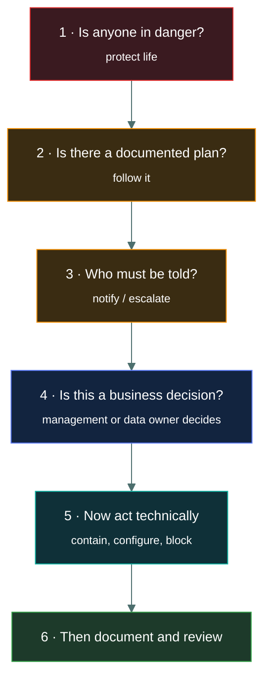

# 🧠 How ISC2 thinks

### *Why the person who knows the most about security is not automatically the person who scores highest*

📌 *The seven rules that decide which of four plausible options ISC2 considers correct — and the places where doing the job well produces the wrong answer.*

---

## 🧸 The big idea

Every CC question has four options. Usually **two or three of them are things a competent
security person might genuinely do.** That is not an accident — it is how the exam is
designed. The test is not "do you know what to do", it is "**do you know which one the
courseware says to do first**".

There is a personality behind those answers. It is consistent, it is a little bureaucratic,
and once you can hear it, a large share of the paper becomes predictable.

The ISC2 house voice believes, in roughly this order:

1. People matter more than assets.
2. Written procedure matters more than individual judgement.
3. Management decides; you advise and execute.
4. Prevention is better than detection, detection better than reaction.
5. The simplest correct definition beats the most technically impressive one.

If you internalise nothing else from this repo, internalise that list. It resolves more
questions than any single domain topic.

---

## 📖 Words you will keep seeing

| Word | What it means on this exam |
|---|---|
| **Distractor** | A wrong option written to look plausible. On CC, distractors are usually *real* security practices placed in the wrong order or at the wrong level. |
| **Stem** | The question itself, before the options. |
| **Qualifier** | A word in the stem that narrows the answer: *first, best, most, primary, least, except*. These decide the answer more often than the technical content does. |
| **Scenario item** | A question that sets a situation and asks what to do. This is where practitioner instinct costs the most marks. |
| **Senior management** | ISC2's term for the people who own risk decisions. They appear in correct answers constantly. |
| **Data owner** | The person accountable for a data set — classification, and who may access it. Not the person who administers the system. |
| **Due care** | Doing what a reasonable person would do to protect the organisation. |
| **Due diligence** | Investigating and understanding the risks in the first place. |

---

## 🔍 The seven rules

### Rule 1 · Human safety outranks everything

If any option protects a person and any other option protects data, systems, money, evidence
or the building, **the person wins**. This is absolute. There is no scenario on this exam
where preserving evidence beats evacuating a human being.

> 🎯 It shows up in fire suppression questions, evacuation questions, physical security
> questions, and anything mentioning a data centre emergency. The answer is always the one
> with people in it.

### Rule 2 · Follow the plan; do not improvise

The correct first action in an incident is almost never a technical one. It is **follow the
documented incident response plan**, **notify the appropriate people**, or **escalate per
procedure**.

This is the single biggest trap for working responders. In the job, you contain the host
because waiting costs you the environment. On the exam, containing before following the
documented process is the wrong answer, because the exam is testing whether you know a
process exists and takes precedence.

> 🎯 If one option says "follow the plan / notify / escalate" and the others are technical
> actions, the process option is very likely correct.

### Rule 3 · Management owns risk; you do not

You identify, assess, report and implement. **You do not accept risk, approve exceptions,
set risk tolerance, or decide classification.** Those belong to senior management or the
data owner.

A question offering "the security analyst decides to accept the risk" is offering you a wrong
answer, however sensible it sounds operationally.

> 🎯 Watch for options where a technical role makes a business decision. They are distractors
> almost every time.

### Rule 4 · Policy before technology

When a question asks what an organisation should do about a recurring problem — personal
devices, weak passwords, shadow IT, data leaving on USB sticks — ISC2 reaches for a
**policy**, and then **awareness training**, before it reaches for a technical control.

This is genuinely different from how most engineers think. Your instinct is to block the USB
port. The courseware's instinct is to write an acceptable use policy, train people on it,
*and then* enforce it technically.

> 🎯 "Which is the BEST first step" + an organisation-wide behaviour problem = a policy answer.

### Rule 5 · Prevent, then detect, then correct

Given several valid controls, the preventive one usually wins, because ISC2 prefers stopping
a thing over noticing it. Detective beats corrective for the same reason.

The exception is when the stem explicitly asks for detection ("which control would *identify*
unauthorised changes") — then you give it the detective control and do not get clever.

### Rule 6 · The plainest definition is the right one

CC is an entry-level exam. When one option is a clean, slightly boring textbook definition and
another is a more sophisticated, more precise, more real-world-nuanced statement, **pick the
boring one**.

Experienced candidates lose marks by reasoning their way past the obvious answer into the
clever one. The clever one is usually the distractor written specifically to catch them.

### Rule 7 · Absolutes are almost always wrong

Options containing *always*, *never*, *all*, *none*, *guarantees*, *completely eliminates* are
usually false, because security does not deal in absolutes. Options containing *helps*,
*reduces*, *supports*, *may* are more often true.

This is a generic test-taking heuristic, but CC rewards it unusually well.

> [!CAUTION]
> Rule 7 is a tiebreaker, not a rule of physics. Some correct CC answers *are* absolute —
> "human safety is always the first priority" is one of them. Use it to break a genuine
> 50/50, not to override knowledge.

---

## 🗺️ The decision order, as a picture

When a scenario question gives you four plausible actions, run them down this ladder and take
the highest one that appears as an option.

Read it as a sentence: **protect people, follow the plan, tell the right people, let the
business decide, then touch the technology, then write it down.**

Your working instinct starts at step 5. The exam starts at step 1.

---

## ⚖️ Told apart

The stem's qualifier word decides which of several *correct* options is *the* answer.

| Qualifier | What it is really asking | How to handle it |
|---|---|---|
| **FIRST** | Ordering. Several options may be things you would genuinely do. | Pick the earliest on the ladder above — usually safety, plan, or notification. Not the most effective action. |
| **BEST** | Quality. All options may work. | Pick the most complete and most preventive, and the one at the right level of authority. |
| **PRIMARY** | Purpose. The main reason a thing exists. | Ignore the secondary benefits, however true they are. |
| **MOST LIKELY** | Probability. | Pick the common case, not the sophisticated edge case. |
| **LEAST** / **EXCEPT** / **NOT** | Inversion. Three options are true. | Read it twice. Mark the stem mentally. This is the highest-error-rate question type on any exam. |

> [!TIP]
> When you see **NOT**, **EXCEPT** or **LEAST**, say the word out loud in your head before
> reading the options. More marks are lost to misreading an inverted stem than to not knowing
> the material.

---

## ⚠️ Where your instinct is wrong

These are the five specific gaps between a working SOC role and the CC answer key.

> [!WARNING]
> **1 · Containment first.**
> **In the job:** isolate the host, then raise it.
> **On the exam:** follow the incident response plan and notify. Containment is a *phase*, and
> phases happen in order.

> [!WARNING]
> **2 · "It depends."**
> **In the job:** the honest answer to most questions.
> **On the exam:** there is one answer, and the stem gives you enough to choose it. If you find
> yourself constructing a scenario where option C would be right, you are overthinking a
> question that wanted option A.

> [!WARNING]
> **3 · Tooling as the answer.**
> **In the job:** the fix for a repeated user mistake is a technical control.
> **On the exam:** the fix is policy plus awareness training. The technical control comes after,
> and often is not the "BEST first step" at all.

> [!WARNING]
> **4 · Owning the decision.**
> **In the job:** you make risk calls within your remit all day.
> **On the exam:** you never accept risk, never set classification, never approve an exception.
> You recommend; management decides.

> [!WARNING]
> **5 · Precision beyond the syllabus.**
> **In the job:** the distinction between an IDS and an IPS in a specific deployment is nuanced.
> **On the exam:** IDS detects and alerts, IPS detects and blocks. Full stop. Answering from
> deeper knowledge will lead you to a distractor built out of exactly that nuance.

---

## 🧠 How to remember it

🧠 **"People, Paper, Permission, then Ports."**

- **People** — is anyone in danger?
- **Paper** — is there a documented plan or policy?
- **Permission** — whose decision is this, and have they been told?
- **Ports** — only now do you touch the technology.

Four words, in order. If you can recall them under exam pressure, you will answer most
scenario questions correctly even on topics you only half-remember.

---

## ✅ Check you actually got it

Answer all five before expanding anything.

**Q1.** A security analyst detects ransomware encrypting files on a file server. What should
the analyst do FIRST?

- **A.** Disconnect the server from the network to stop the spread
- **B.** Follow the organisation's incident response plan
- **C.** Restore the affected files from the most recent backup
- **D.** Identify the ransomware variant to determine whether a decryptor exists

<b>Answer</b>

**B — follow the organisation's incident response plan.** The qualifier is **FIRST**, and the
ISC2 position is that a documented process exists and governs the response. Every other option
is a step *within* that process.

- **A** is the strongest distractor, and in real life it is what you would do. But containment
  is a defined phase of incident response, not the starting point. Choosing it means acting
  before the process, which is exactly the habit this exam penalises.
- **C** is a recovery action. Recovery is the wrong phase entirely — restoring while the
  encryption is still running re-encrypts the restored data.
- **D** is analysis, which is useful but comes later and does not stop anything happening now.

**Q2.** Employees keep connecting personal USB drives to corporate workstations. Which is the
BEST first step for the organisation?

- **A.** Disable USB ports on all workstations via group policy
- **B.** Deploy data loss prevention software to monitor removable media
- **C.** Establish an acceptable use policy covering removable media and train staff on it
- **D.** Issue encrypted corporate USB drives to employees who need them

<b>Answer</b>

**C — establish a policy and train staff on it.** Rule 4: policy and awareness come before
technology. The organisation cannot fairly enforce, monitor or discipline against a rule it
has never written down and communicated.

- **A** is a legitimate technical control, and may well be implemented *after* the policy
  exists. As a first step it enforces an unwritten rule, and it will break the legitimate use
  cases nobody has documented yet.
- **B** is detective and monitoring-focused. It tells you the problem is still happening
  without establishing that it is prohibited.
- **D** solves a convenience problem rather than the governance problem, and does nothing to
  stop personal drives being used alongside the corporate ones.

**Q3.** A risk assessment identifies a vulnerability whose remediation would cost far more than
the potential loss. Who has the authority to formally accept this risk?

- **A.** The security analyst who performed the assessment
- **B.** The system administrator responsible for the affected system
- **C.** Senior management
- **D.** The organisation's external auditor

<b>Answer</b>

**C — senior management.** Rule 3: risk acceptance is a business decision, and it belongs to
the people accountable for the business. Technical staff identify, assess and recommend.

- **A** is wrong because performing the assessment confers no authority to accept its findings.
  This distractor is designed to feel natural to the person doing the work.
- **B** is wrong for the same reason — administering a system is not owning the risk it carries.
- **D** is wrong because auditors assess and report independently. An auditor accepting risk
  would destroy the independence that makes the audit worth anything.

**Q4.** Which of the following is LEAST likely to be the correct answer on this exam?

- **A.** Implementing multi-factor authentication reduces the risk of credential compromise
- **B.** Encrypting data at rest completely eliminates the risk of data disclosure
- **C.** Security awareness training helps reduce susceptibility to social engineering
- **D.** Network segmentation limits the lateral movement available to an attacker

<b>Answer</b>

**B — "completely eliminates".** Rule 7: absolutes are almost always wrong. Encryption at rest
does not eliminate disclosure risk — it does nothing against an attacker with valid
credentials on a running system where the data is decrypted for use.

- **A** is correctly hedged with "reduces the risk", and is true.
- **C** is correctly hedged with "helps reduce", and is true.
- **D** is correctly hedged with "limits", and is true.

Notice that the three correct statements all use soft verbs, and the false one uses an
absolute. That pattern is worth real marks on the day.

**Q5.** A fire alarm activates in a data centre during an active security incident investigation.
What is the PRIMARY consideration?

- **A.** Preserving the chain of custody for evidence already collected
- **B.** Ensuring all personnel safely evacuate the facility
- **C.** Initiating a graceful shutdown of critical systems to prevent data corruption
- **D.** Notifying the incident response team leader of the interruption

<b>Answer</b>

**B — ensuring all personnel safely evacuate.** Rule 1, and it is absolute. Human safety
outranks evidence, data, systems, and continuity of an investigation, without exception.

- **A** is a real obligation in an investigation, and it is exactly the kind of professional
  concern designed to pull an experienced candidate away from the right answer. Evidence is
  replaceable in a way that people are not.
- **C** protects data integrity at the cost of keeping people inside a building that is on fire.
- **D** is correct procedure at some point, but communication does not outrank evacuation.

---

## 🎓 The grown-up version

<b>Extra depth — open this on a second read, never needed for the pass</b>

**Why the exam is built this way.** ISC2 certifies across a very wide range of organisations,
sectors and jurisdictions. The only answers that can be correct for all of them are the ones
grounded in governance rather than implementation — because "block the USB port" is wrong in a
hospital with medical devices and right in a call centre, whereas "have a policy and train
people on it" is correct everywhere. The bureaucratic flavour of the answer key is not a flaw;
it is the necessary consequence of writing one exam for every environment.

**Where the courseware position is also just correct.** It is easy to read this page as "the
exam is out of touch". Often it is not. The reason mature incident response programmes insist
on following the plan before containing is that improvised containment destroys volatile
evidence, tips off the attacker, and in regulated environments can breach notification
obligations. The exam's preference for process over reflex reflects genuine incident-response
doctrine — it just states it more rigidly than a live console at 03:00 allows for.

**Due care and due diligence.** These two appear as a distractor pair and are worth getting
straight, because the usual mnemonics get them backwards. **Due diligence is the research** —
investigating, assessing, understanding what the risks are. **Due care is the action** — doing
what a reasonable person would do about them. Diligence is knowing the roof might leak; care
is fixing it. In legal terms, failing at either is negligence, but they are separately named
because an organisation can genuinely do one without the other.

**The limits of reading the examiner.** These seven rules will resolve scenario questions and
break ties. They will not answer "which port does SMTP use" or "which access control model
uses labels and clearances". Roughly two thirds of the paper is straight recall, and no amount
of test-craft substitutes for knowing it. Treat this page as a multiplier on your knowledge,
not a replacement for it.

---

## 📝 Cram lines

Destined for [`EXAM-DAY.md`](../../EXAM-DAY.md):

- **People, Paper, Permission, then Ports.** Safety → follow the plan → notify → management decides → act technically.
- **Human safety always wins.** No exceptions, ever.
- **FIRST = ordering** (earliest step), **BEST = quality** (most complete and preventive).
- **You never accept risk.** Senior management does. You never set classification. The data owner does.
- **Policy and training come before technical controls** for organisation-wide behaviour problems.
- **Absolutes** — always, never, completely eliminates — **are almost always wrong.**
- **Pick the boring textbook answer**, not the clever one.

---

<a href="../README.md">← back to 00 · Foundations</a> &nbsp;·&nbsp; <a href="../answering-technique/">next: Answering technique →</a>

