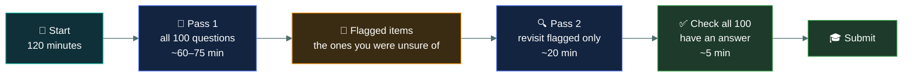

# 📋 How the exam works

### *What you are actually sitting on 5 November — and what the score at the end really means*

📌 *The shape of the paper, the pass mark, and the three things about scoring that change how you should behave in the exam room.*

---

## 🧸 The big idea

CC is a **100-question, two-hour, multiple-choice exam**. Four options per question, one
correct answer, no partial credit, no negative marking for a wrong guess.

That last part is the most useful sentence in this page. **There is no penalty for being
wrong**, so a blank answer and a wrong answer score identically — zero. A guess is strictly
better than a blank, always, with no downside. You should finish with 100 answers selected,
even if some of them are coin flips.

The pass mark is **700 out of 1000**. That is not 70% of the questions. It is a *scaled*
score, which is a different thing, and the next few sections explain why that matters less
than people think but still changes one decision.

---

## 📖 Words you will keep seeing

| Word | What it means on this exam |
|---|---|
| **Item** | ISC2's word for a single exam question. Their documentation uses it constantly. |
| **Linear exam** | A fixed set of questions that does not adapt to your performance. CC is linear. |
| **Scaled score** | A raw number of correct answers converted onto a 0–1000 scale so that different exam forms are equally hard to pass. |
| **Cut score** | The scaled score you must reach to pass. For CC it is **700**. |
| **Pretest item** | An unscored question mixed into the paper so ISC2 can gather statistics on it. You are not told which ones they are. |
| **Exam form** | One particular assembled set of questions. Different candidates get different forms. |
| **Provisional result** | The pass/fail you are handed on the day, before ISC2 confirms it. |

---

## 🔍 The shape of the paper

| | |
|---|---|
| **Questions** | 100 |
| **Time** | 2 hours (120 minutes) |
| **Format** | Multiple choice, 4 options, exactly one correct |
| **Type** | Linear — it does not adapt as you go |
| **Pass** | 700 / 1000 scaled |
| **Negative marking** | None |
| **Language** | English, and several others |
| **Delivery** | Pearson VUE — test centre or online proctored |

That works out at **72 seconds per question** if you spread the time evenly. In practice you
will answer most CC questions in 20–30 seconds, because most of them are "which word means
this" rather than a scenario to reason through. The time pressure on this exam is mild. Most
candidates finish with a good deal of time left.

---

## 🔢 What the scaled score actually is

A scaled score exists to solve one problem: **not every assembled exam is exactly as hard as
every other one.** If your 100 questions happened to be slightly harder than someone else's
100 questions, it would be unfair to require the same raw number of correct answers from
both of you.

So ISC2 converts raw correct answers onto a fixed 0–1000 scale, adjusting for how hard that
particular form was. The cut score stays at 700 for everyone; the raw number needed to reach
it moves slightly between forms.

Three consequences that matter:

**1 · 700/1000 is not 70%.** It is a point on a converted scale. Depending on the form, the
raw percentage behind a 700 can sit either side of 70%. You cannot compute your scaled score
from your raw score, and neither can anyone selling you a practice test.

**2 · The scale is not linear in a useful way.** A 750 is not "50 points of comfort" in any
measurable sense. Treat the score report as pass/fail plus a rough signal, nothing finer.

**3 · Some questions do not count.** A number of items on the paper are unscored pretest
items being trialled for future forms. You are not told which. This is the real reason not
to dwell on a question that seems bizarre or unfairly obscure — there is a genuine chance it
counts for nothing at all.

> [!NOTE]
> The practical upshot of all three is the same: **answer every question, do not agonise,
> and do not try to estimate your score as you go.** People who track "I think I've got about
> 68 right" mid-exam rattle themselves over arithmetic that does not apply.

---

## 🎯 What a pass actually takes

Aim for a raw **80%+ on mock exams** before you sit the real one. That is not because 80% is
the pass mark — it is a safety margin against three things you cannot control:

- **Form difficulty.** Your paper may be at the harder end of the range.
- **Exam-room degradation.** Nearly everyone performs a few points below their quiet-desk
  practice score under proctoring.
- **Practice-bank flattery.** Question banks, including the one in this repo, are written by
  people who are not ISC2 and tend to be slightly kinder than the real thing.

Consistently scoring 80%+ across two different mock exams is a solid readiness signal.
Scoring 72% once is not.

---

## ⚖️ Told apart

| | Means | Not to be confused with |
|---|---|---|
| **Raw score** | The number of scored questions you got right. | **Scaled score**, which is that number converted onto the 0–1000 range. Only the scaled one is reported. |
| **Cut score** | The scaled score required to pass — 700. | **Percentage correct**, which is not what 700 represents. |
| **Linear exam** | A fixed question set, same length for everyone, questions reviewable. | **Adaptive exam** (which the CISSP CAT is), where difficulty shifts as you answer and you cannot go back. CC is linear, so **you can flag and revisit**. |
| **Pretest item** | An unscored question being trialled. | **Scored item.** You cannot tell them apart, so treat every question as scored. |
| **Provisional result** | The printout you get in the room. | **Confirmed result**, which ISC2 issues afterwards. Provisional is reliable in practice, but it is not the certificate. |

---

## ⚠️ Where your instinct is wrong

> [!WARNING]
> **In the job:** if you are not sure, you investigate further before committing.
>
> **On the exam:** there is no further investigation, and no penalty for being wrong. Leaving
> a question blank to "come back properly" and then running out of time is the only way this
> exam actively punishes you. Put down your best guess immediately, flag it, move on.

> [!WARNING]
> **In the job:** an obscure, badly-worded ticket usually means something important is being
> missed, and it is worth chasing.
>
> **On the exam:** an obscure, badly-worded question may literally be an unscored pretest
> item. Give it thirty seconds, guess, flag, move on. Do not let it cost you three questions'
> worth of time and a chunk of composure.

---

## 🧠 How to remember it

🧠 **The three numbers: 100 · 120 · 700**
One hundred questions, one hundred and twenty minutes, seven hundred to pass. Everything else
about the format follows from those three.

---

## ✅ Check you actually got it

Answer all five before expanding anything.

**Q1.** A candidate reaches the end of the exam with four minutes left and six questions
unanswered because they wanted to return to them properly. What is the best use of the
remaining time?

- **A.** Leave them blank rather than risk lowering the score with wrong answers
- **B.** Select an answer for all six, guessing where necessary
- **C.** Answer only the ones they can be confident about, and leave the rest
- **D.** Submit early to avoid a timing error invalidating the attempt

<b>Answer</b>

**B — select an answer for all six.** CC has no negative marking, so a wrong answer and a
blank answer both score zero. A guess has a 25% chance of being worth a mark and no downside
whatsoever.

- **A** is wrong because it assumes a wrong-answer penalty that does not exist on this exam.
  A blank cannot score; a guess can.
- **C** is wrong for the same reason — it leaves guaranteed-zero answers on the paper when
  free expected value is available.
- **D** is wrong because submitting early gains nothing. Unanswered questions are not
  preserved, and there is no timing mechanism that invalidates an attempt for using the full
  window.

**Q2.** What does a scaled score of 700 represent?

- **A.** Exactly 70% of the questions answered correctly
- **B.** 700 of 1000 available marks across the paper
- **C.** The minimum converted score required to pass, adjusted for the difficulty of that exam form
- **D.** The average score achieved by passing candidates

<b>Answer</b>

**C — the minimum converted score required to pass, adjusted for form difficulty.** Scaling
exists so that candidates who receive a slightly harder set of questions are not
disadvantaged.

- **A** is wrong because scaled scores do not map one-to-one onto percentage correct. The raw
  percentage behind a 700 varies by form.
- **B** is wrong because there are 100 questions, not 1000 marks. The 0–1000 range is a scale,
  not a mark total.
- **D** is wrong because 700 is the cut score — the pass threshold — not a statistic about
  the people who cleared it.

**Q3.** During the exam, a candidate encounters a question using terminology they have never
seen in any study material. What is the most likely explanation, and the correct response?

- **A.** The exam has moved to an adaptive section; answer carefully as difficulty is increasing
- **B.** It may be an unscored pretest item; give it a reasonable attempt, flag it, and move on
- **C.** The study material was inadequate; the remaining questions should be treated with more caution
- **D.** It is an error in the exam and should be reported to the proctor for removal

<b>Answer</b>

**B — it may be an unscored pretest item.** ISC2 mixes unscored trial questions into live
papers to gather statistics on them. Candidates are not told which ones they are.

- **A** is wrong because CC is a linear exam. It does not adapt to your performance, and there
  are no adaptive sections.
- **C** is wrong because it turns one odd question into a loss of composure across the rest of
  the paper, which is far more costly than the single item.
- **D** is wrong because a proctor cannot remove exam items, and content disputes are handled
  through ISC2's post-exam comment process, not in the room.

**Q4.** Which statement about the CC exam format is correct?

- **A.** Questions cannot be revisited once answered
- **B.** Each question may have more than one correct option
- **C.** Questions can be flagged and returned to before submission
- **D.** The exam ends early once enough questions have been answered correctly

<b>Answer</b>

**C — questions can be flagged and returned to.** CC is a linear, fixed-form exam, so full
review is available for the whole 120 minutes.

- **A** describes an adaptive exam such as the CISSP CAT format, not CC.
- **B** is wrong because CC items are single-answer multiple choice — four options, exactly
  one correct.
- **D** describes adaptive early termination, which does not apply to a linear exam.

**Q5.** A candidate consistently scores 71% on practice exams and is two weeks from their
test date. What does this most reasonably indicate?

- **A.** They are ready, since 71% exceeds the 70% pass mark
- **B.** They are marginal, because practice banks are not scaled and real performance typically drops under exam conditions
- **C.** They will fail, since the required raw score is always above 75%
- **D.** Nothing useful, because practice scores have no relationship to exam outcomes

<b>Answer</b>

**B — marginal.** A practice percentage is a raw score, not a scaled one, and most candidates
perform somewhat below their practice average under proctored conditions. 71% leaves no
margin for a harder form or exam-room nerves.

- **A** is wrong because it treats 700/1000 as "70% correct", which is the central
  misunderstanding this page exists to correct.
- **C** is wrong because it states a fixed raw threshold. The raw score behind a 700 varies by
  form, so no single number like 75% is "always" required.
- **D** overstates the case. Practice scores are an imperfect but genuinely useful readiness
  signal — that is precisely why the schedule in this repo builds around them.

---

## 🎓 The grown-up version

<b>Extra depth — open this on a second read, never needed for the pass</b>

**How the cut score gets set.** Certification bodies set a cut score through a standard-setting
study, most commonly a modified Angoff procedure: a panel of qualified subject-matter experts
estimates, for each item, the proportion of *minimally competent candidates* who would answer
it correctly. Those estimates are aggregated into a raw cut score for that form, which is then
mapped onto the reported scale so that the reported threshold stays constant at 700 regardless
of which form a candidate sat.

**Why the scale is 0–1000.** The range is arbitrary — it exists to be stable and comparable
across forms and across time. Because the mapping between raw and scaled scores is
form-dependent and not published, reverse-engineering your raw performance from a reported
score is not possible. This is deliberate.

**Equating.** The statistical process that makes two forms comparable is called equating, and
it depends on having reliable difficulty data for each item. That data comes from the pretest
items seeded into live exams. So the unscored questions that occasionally irritate candidates
are exactly the mechanism that keeps the exam fair between forms.

**Failing.** A failed attempt is not the end of anything. ISC2 operates a retake policy with a
waiting period before a second attempt and longer waits for subsequent ones, along with a
per-attempt limit within a rolling year. If you fail, the score report gives domain-level
feedback indicating relative strength and weakness, which is genuinely useful for targeting a
second attempt. Check current retake timings on ISC2's own site rather than relying on any
third-party summary, including this one — these policies change.

---

## 📝 Cram lines

Destined for [`EXAM-DAY.md`](../../EXAM-DAY.md):

- **100 questions · 120 minutes · 700/1000 to pass.**
- **No negative marking.** Never leave a blank. Guess, flag, move on.
- **700 is not 70%** — it is a scaled score adjusted for form difficulty.
- **Linear exam** — you can flag questions and revisit them. Use two passes.
- Some items are **unscored pretest questions**. A bizarre question may be worth nothing.

---

<a href="../README.md">← back to 00 · Foundations</a> &nbsp;·&nbsp; <a href="../how-isc2-thinks/">next: How ISC2 thinks →</a>

