# 📋 How the exam works

### *What you are actually sitting on 5 November — and what the score at the end really means*

📌 *The shape of the paper, the pass mark, and why CAT changes the one habit most candidates walk in with — going back to check earlier answers.*

---

## 🧸 The big idea

CC is a **100–125 item, two-hour exam** delivered as a **Computerized Adaptive Test (CAT)**.
Item types are multiple choice **and advanced items** — not only the classic four-option
question. There is no partial credit and no penalty for a wrong guess.

The part that actually changes how you sit the exam: **on a CAT you generally cannot go back
to an item once you have answered it.** There is no "flag and return at the end". Every
answer is closer to final the moment you submit it, so the two-pass strategy that works on a
fixed-form exam does not apply here.

The pass mark is **700 out of 1000**. That is not 70% of the questions — it is a *scaled*
score, and that stays true under CAT exactly as it did under the old format.

---

## 📖 Words you will keep seeing

| Word | What it means on this exam |
|---|---|
| **Item** | ISC2's word for a single exam question. |
| **CAT (Computerized Adaptive Testing)** | A test delivery model where the set and sequence of items presented can respond to how the candidate is performing, rather than every candidate seeing a fixed, identical form. |
| **Advanced item** | An item type beyond a plain four-option multiple choice question — ISC2's outline names this as a format alongside multiple choice, without publishing further internal detail. |
| **Scaled score** | A raw result converted onto a 0–1000 scale so that different exams are equally hard to pass. |
| **Cut score** | The scaled score required to pass. For CC it is **700**. |
| **Pretest item** | An unscored item mixed into the exam to gather statistics for future use. You are not told which ones they are. |
| **Provisional result** | The pass/fail you are handed on the day, ahead of ISC2's confirmation. |

---

## 🔍 The shape of the paper

| | |
|---|---|
| **Items** | 100–125 |
| **Time** | 2 hours |
| **Format** | Computerized Adaptive Testing (CAT) |
| **Item types** | Multiple choice and advanced items |
| **Pass** | 700 / 1000 scaled |
| **Negative marking** | None |
| **Languages** | English and others |
| **Delivery** | Pearson VUE — test centre or online proctored |
| **Prerequisite** | None — no prior cybersecurity experience is required for CC |

> [!NOTE]
> ISC2 does not publish the internal mechanics of its CAT engine — how difficulty is
> selected, when the exam decides to stop, or how many items any one candidate will actually
> see within the 100–125 range. Do not trust a study guide, video, or practice bank
> (including this one) that claims to know those details. What follows is only what ISC2
> states publicly. For anything beyond it, see
> [isc2.org/certifications/computerized-adaptive-testing](https://www.isc2.org/certifications/computerized-adaptive-testing).

---

## 🔢 What the scaled score actually is

A scaled score exists to solve one problem: **not every exam a candidate sits is exactly as
hard as every other one.** Under CAT this is even more true than under a fixed form, since two
candidates can legitimately see different numbers of items. ISC2 converts the result onto a
fixed 0–1000 scale so the same cut score — 700 — is fair regardless of the exact set of items
a candidate saw.

Three consequences that matter:

**1 · 700/1000 is not 70%.** It is a point on a converted scale, not a percentage of items
answered correctly. You cannot compute your scaled score from a raw count, and neither can
anyone selling you a practice test.

**2 · The scale is not linear in a useful way.** Treat the score report as pass/fail plus a
rough signal, nothing finer.

**3 · Some items do not count.** A number of items on the paper are unscored pretest items.
You are not told which. This is the real reason not to dwell on an item that seems bizarre or
unfairly obscure — there is a genuine chance it counts for nothing at all.

> [!NOTE]
> The practical upshot is the same as always: **answer what is in front of you, do not
> agonise, and do not try to estimate your score as you go.** Under CAT, trying to track "am I
> doing well" is even less reliable than it was on the old linear exam — you have no way to
> know whether the last item was scored, pretest, or chosen adaptively for a reason you can't
> see.

---

## 🎯 What a pass actually takes

Aim for a raw **80%+ on fixed-form mock exams** before you sit the real one. That is not
because 80% is the pass mark — it is a safety margin against three things you cannot control:

- **Item selection.** CAT can present a run of items that feels harder than average.
- **Exam-room degradation.** Nearly everyone performs a few points below their quiet-desk
  practice score under proctoring.
- **Practice-bank flattery.** Question banks, including the one in this repo, are written by
  people who are not ISC2 and tend to be slightly kinder than the real thing. They are also
  fixed-form, not CAT — a useful proxy for knowledge, not a simulation of the real delivery.

Consistently scoring 80%+ across two different mock exams is a solid readiness signal.
Scoring 72% once is not.

---

## ⚖️ Told apart

| | Means | Not to be confused with |
|---|---|---|
| **Raw score** | The number of scored items you got right. | **Scaled score**, which is that number converted onto the 0–1000 range. Only the scaled one is reported. |
| **Cut score** | The scaled score required to pass — 700. | **Percentage correct**, which is not what 700 represents. |
| **CAT (adaptive)** | The live CC delivery model. Items and the decision to stop respond to performance; **answered items generally cannot be revisited.** | A **linear / fixed-form exam** (what this repo's mock exams are), where every candidate gets the same items in the same order and can move freely back and forth. |
| **Pretest item** | An unscored item being trialled. | **Scored item.** You cannot tell them apart, so treat every item as scored. |
| **Provisional result** | The printout you get in the room. | **Confirmed result**, which ISC2 issues afterwards. |

---

## ⚠️ Where your instinct is wrong

> [!WARNING]
> **Old habit (and the old CC format):** answer everything in a first pass, flag the unsure
> ones, come back at the end with a clear head.
>
> **On the live CAT exam:** that strategy does not work. You typically cannot return to an
> answered item. Treat each item as effectively final the moment you submit it — think it
> through once, commit, and move on. There is no second pass to rely on.

> [!WARNING]
> **In the job:** if you are not sure, you investigate further before committing.
>
> **On the exam:** there is no further investigation, and no penalty for being wrong. If the
> interface lets you move on without answering, guess rather than leave it blank — but check
> whether the item requires a response before it will advance, since that also varies by
> platform and is not something to assume either way.

> [!WARNING]
> **In the job:** an obscure, badly-worded ticket usually means something important is being
> missed, and it is worth chasing.
>
> **On the exam:** an obscure, badly-worded item may be an unscored pretest item. Give it a
> reasonable attempt and move on. Do not let one strange item cost you your composure for the
> rest of the exam — especially now that you cannot go back and fix a rushed answer caused by
> rattled nerves on a later item.

---

## 🧠 How to remember it

🧠 **"Commit, don't circle back."**
The single behavioural change from the old format: there is no flag-and-return. Decide once,
move forward, don't try to track a running score in your head.

---

## ✅ Check you actually got it

Answer all five before expanding anything.

**Q1.** A candidate is midway through the exam and unsure about an item they just answered.
What is the most appropriate response?

- **A.** Flag it and plan to return to it during a second pass at the end
- **B.** Move on — CAT delivery generally does not allow returning to an already-answered item
- **C.** Stop and re-derive the answer from scratch before continuing, since it can be corrected later
- **D.** Skip ahead and leave it unanswered so it can be revisited

<b>Answer</b>

**B — move on.** CC is delivered as a Computerized Adaptive Test. Once an item is answered,
it generally cannot be revisited, so there is no "second pass" to plan around.

- **A** describes the old linear-exam strategy, which does not apply to CAT delivery.
- **C** wastes time on the false premise that the item can be fixed later.
- **D** describes a flag-and-skip approach that assumes a return trip CAT does not offer.

**Q2.** What does a scaled score of 700 represent?

- **A.** Exactly 70% of the items answered correctly
- **B.** 700 of 1000 available marks across the paper
- **C.** The minimum converted score required to pass, adjusted for the difficulty of the items presented
- **D.** The average score achieved by passing candidates

<b>Answer</b>

**C — the minimum converted score required to pass, adjusted for difficulty.** Scaling exists
so that candidates are not disadvantaged by which items they were adaptively given.

- **A** is wrong because scaled scores do not map one-to-one onto percentage correct.
- **B** is wrong because there is no fixed count of "1000 marks" — the scale is a converted
  range, not a mark total.
- **D** is wrong because 700 is the cut score — the pass threshold — not a statistic about
  the people who cleared it.

**Q3.** During the exam, a candidate encounters an item using terminology they have never
seen in any study material. What is the most likely explanation, and the correct response?

- **A.** The exam has become harder because performance is trending well; slow down and be careful
- **B.** It may be an unscored pretest item; give it a reasonable attempt and move on
- **C.** The study material was inadequate; treat the remaining items with more caution
- **D.** It is an error in the exam and should be reported to the proctor for removal

<b>Answer</b>

**B — it may be an unscored pretest item.** ISC2 mixes unscored trial items into live exams
to gather statistics on them. Candidates are not told which ones they are.

- **A** invents a mechanism ISC2 has not published about how difficulty selection feels from
  the inside. Do not reason from assumed internals.
- **C** turns one odd item into a loss of composure across the rest of the exam.
- **D** is wrong because a proctor cannot remove exam items; content disputes go through
  ISC2's post-exam process, not the room.

**Q4.** Which statement about the live CC exam format is correct?

- **A.** It is a fixed 100-item exam identical for every candidate
- **B.** All items are traditional four-option multiple choice
- **C.** It is delivered as a Computerized Adaptive Test with 100–125 items, including advanced item types
- **D.** The exam ends the moment the candidate reaches a 700 scaled score

<b>Answer</b>

**C — CAT delivery, 100–125 items, multiple choice and advanced items.** This is what ISC2's
own outline states about the live exam.

- **A** describes the pre-September-2026 format, not the current one.
- **B** is wrong because the outline explicitly lists advanced items alongside multiple choice.
- **D** invents a stopping rule ISC2 has not published — do not assume you can infer your
  running score from how the exam behaves.

**Q5.** A candidate consistently scores 71% on fixed-form mock exams and is two weeks from
their test date. What does this most reasonably indicate?

- **A.** They are ready, since 71% exceeds the 70% pass mark
- **B.** They are marginal — mock scores are raw and fixed-form, while the real exam is scaled and adaptive, and performance typically drops under exam conditions
- **C.** They will fail, since the required raw score is always above 75%
- **D.** Nothing useful, because mock scores have no relationship to exam outcomes

<b>Answer</b>

**B — marginal.** A mock percentage is a raw, fixed-form score; the real exam is scaled and
delivered adaptively. Most candidates perform somewhat below their practice average under
proctored conditions.

- **A** treats 700/1000 as "70% correct", the central misunderstanding this page corrects.
- **C** states a fixed raw threshold that does not exist — there is no published number.
- **D** overstates the case. Mock scores are an imperfect but genuinely useful readiness
  signal, which is why the schedule in this repo builds around them.

---

## 🎓 The grown-up version

<b>Extra depth — open this on a second read, never needed for the pass</b>

**How the cut score gets set.** Certification bodies typically set a cut score through a
standard-setting study, most commonly a modified Angoff procedure: a panel of qualified
subject-matter experts estimates, for each item, the proportion of *minimally competent
candidates* who would answer it correctly. Those estimates are aggregated and mapped onto the
reported scale so the threshold stays constant at 700 regardless of which items a candidate
saw.

**Why CAT exists.** Adaptive delivery lets a testing body reach a reliable pass/fail decision
with a variable-length exam rather than forcing everyone through the same fixed set, and it
makes item banks harder to compromise because no two candidates necessarily see the same
sequence. ISC2 has not published its selection algorithm, and this repo will not guess at it.

**Equating and pretest items.** The statistical process that keeps different exams comparable
depends on reliable difficulty data for each item, which comes from pretest items seeded into
live exams. So the unscored items that occasionally puzzle candidates are exactly the
mechanism that keeps the exam fair.

**Failing.** A failed attempt is not the end of anything. ISC2 operates a retake policy with a
waiting period before a second attempt and longer waits for subsequent ones, along with a
per-attempt limit within a rolling year. Check current retake timings on ISC2's own site
rather than relying on any third-party summary, including this one — these policies change.

---

## 📝 Cram lines

Destined for [`EXAM-DAY.md`](../../EXAM-DAY.md):

- **100–125 items · 2 hours · CAT delivery · MCQ + advanced items · 700/1000 to pass.**
- **No negative marking.** Guess rather than leave a blank, if the interface allows moving on.
- **700 is not 70%** — it is a scaled score.
- **CAT: you generally cannot go back.** No flag-and-return. Commit to each item once.
- Some items are **unscored pretest questions**. A bizarre item may be worth nothing.
- **No cybersecurity experience is required** to sit CC.

---

<a href="../README.md">← back to 00 · Foundations</a> &nbsp;·&nbsp; <a href="../how-isc2-thinks/">next: How ISC2 thinks →</a>

</content>
