# 📅 Study schedule

### *54 days, around a full-time job, ending on Thursday 5 November*

📌 *Eight weeks, planned backwards from the exam, with the heavy domains first and three mock exams placed where they can still change something.*

---

## 🧸 The big idea

Fifty-four days is comfortable for this exam — **if the time is spent in weight order and the
mocks land early enough to act on.**

Under the live outline, weight order is **1 (24%) → 4 (21.3%) → 3 (20%) → 2 and 5, tied at
17.3% each.** Domain 2 (Security Governance) and Domain 5 (Security Operations and Incident
Response) are no longer wildly different sizes — one is not "the small one" the way the old
Domain 2 (10%) used to be. Budget them roughly evenly.

**Budget 45–60 minutes on weekdays and one longer session at the weekend.** That is enough.
This is an entry-level exam and you already work in the field — the risk is not insufficient
hours, it is disorganised ones.

---

## 📖 How to use this page

| | |
|---|---|
| **Weekday sessions** | 45–60 min. One or two topics, plus five minutes of term-bank recall. |
| **Weekend sessions** | 90–120 min. Finish the week's topics, then the domain's question-bank drill. |
| **Rest days** | Sunday is deliberately light. Take it. Retention needs the gap. |
| **Slippage** | If a week slips, drop material from the *bottom* of the list — never from Domain 1 or 4. |

---

## 🗓️ The eight weeks

```mermaid
%%{init: {'theme':'base','themeVariables':{'fontSize':'13px','lineColor':'#4d6f6e','textColor':'#dbe7e6'}}}%%
flowchart LR
    W0["Now<br/>12–13 Sep<br/>Foundations"] --> W1["W1–2<br/>14–27 Sep<br/>Domain 1 · 24%"]
    W1 --> W3["W3<br/>28 Sep–4 Oct<br/>Domain 4 · 21.3%"]
    W3 --> W4["W4<br/>5–11 Oct<br/>Domain 3 · 20%"]
    W4 --> W5["W5<br/>12–18 Oct<br/>Domain 5 · 17.3%<br/>MOCK 1"]
    W5 --> W6["W6<br/>19–25 Oct<br/>Domain 2 · 17.3%<br/>+ repair"]
    W6 --> W7["W7<br/>26 Oct–1 Nov<br/>Mixed drills<br/>MOCK 2"]
    W7 --> W8["W8<br/>2–5 Nov<br/>MOCK 3 · cram<br/>EXAM"]

    style W0 fill:#0f3038,stroke:#12B5A5,color:#fff
    style W1 fill:#12243f,stroke:#5C7CFA,color:#fff
    style W3 fill:#12243f,stroke:#5C7CFA,color:#fff
    style W4 fill:#12243f,stroke:#5C7CFA,color:#fff
    style W5 fill:#3a2c12,stroke:#F08C00,color:#fff
    style W6 fill:#3a2c12,stroke:#F08C00,color:#fff
    style W7 fill:#3a2c12,stroke:#F08C00,color:#fff
    style W8 fill:#1d3a2a,stroke:#2F9E44,color:#fff
```

---

### 🧱 Now · Sat 12 – Sun 13 September · Foundations

Before any domain content. About 90 minutes total.

- [ ] `how-the-exam-works/` — CAT format, 100–125 items, 700/1000
- [ ] `how-isc2-thinks/` ← the one that matters
- [ ] `answering-technique/` — updated for CAT: no flag-and-return
- [ ] `the-five-domains/` — the live weights: 24 / 21.3 / 20 / 17.3 / 17.3
- [ ] `study-schedule/` (this page)
- [ ] **Book the exam this weekend if it is not already booked**

> [!IMPORTANT]
> Book the seat now. A booked date is the thing that makes the rest of this schedule real, and
> test-centre availability for early November thins out through October.

---

### 🧭 Week 1 · Mon 14 – Sun 20 September · Domain 1, first half

The heaviest domain, and the vocabulary everything else is written in.

| Day | Work |
|---|---|
| Mon | `cia-triad/` |
| Tue | `authentication/` |
| Wed | `authorization-and-accounting/` |
| Thu | `non-repudiation/` + `privacy/` |
| Fri | `risk-concepts/` — now covers the risk **lifecycle**, not only terms |
| Sat | `risk-assessment/` + `risk-treatment/` |
| Sun | Light — re-read the ⚖️ **Told apart** blocks from the week |

---

### 🧭 Week 2 · Mon 21 – Sun 27 September · Domain 1, second half

| Day | Work |
|---|---|
| Mon | `security-controls/` |
| Tue | `governance-documents/` — now names **ISO and CIS** explicitly |
| Wed | `isc2-code-of-ethics/` + `due-care-and-due-diligence/` |
| Thu | Term bank — Domain 1 terms, first recall pass |
| Fri | Question bank — Domain 1 drill, first half |
| Sat | Question bank — Domain 1 drill, second half. **Review every miss.** |
| Sun | Light — re-read anything the drill exposed |

> Start the daily five-minute term-bank habit this week and keep it to the end.

---

### 🌐 Week 3 · Mon 28 September – Sun 4 October · Domain 4 · 21.3%

Familiar material. The work is converting what you know into ISC2's simpler phrasing, plus
three sub-areas that are genuinely new: wireless, IoT/ICS, and the cloud characteristics list.

| Day | Work |
|---|---|
| Mon | `network-fundamentals/` + `osi-and-tcpip/` |
| Tue | `ip-addressing/` |
| Wed | `ports-and-protocols/` — **memorise the port table** |
| Thu | `network-threats/` + `common-attacks/` |
| Fri | `network-defence-devices/` + `segmentation-and-dmz/` (now covers **micro-segmentation**) |
| Sat | `vpn-and-remote-access/` + `cloud-and-virtualisation/` (now covers **NIST cloud characteristics**) + `zero-trust/` + `defence-in-depth/` |
| Sun | `wireless-and-bluetooth/` + `iot-and-ics/` — new topics, then Question bank — Domain 4 drill |

---

### 🚪 Week 4 · Mon 5 – Sun 11 October · Domain 3 · 20%

Two sub-areas only, but both are deep: identity lifecycle, and the access control models.

| Day | Work |
|---|---|
| Mon | `access-control-fundamentals/` |
| Tue | `logical-access-controls/` |
| Wed | `dac-mac-rbac-abac/` — **the highest-value single page in this domain** |
| Thu | `least-privilege-and-sod/` |
| Fri | `privileged-access/` |
| Sat | `identity-lifecycle/` — now expanded with frameworks/tools (JML, access reviews) |
| Sun | Question bank — Domain 3 drill |

> Physical access control is no longer a named Domain 3 objective. If you want the material,
> it now lives at `05-security-operations/physical-penetration-testing/`.

---

### ⚙️ Week 5 · Mon 12 – Sun 18 October · Domain 5 · 17.3% + **Mock 1**

Now the home of incident response too, plus data security, testing, and asset protection.

| Day | Work |
|---|---|
| Mon | `data-handling/` (now covers **masking and sanitization**) + `data-classification/` |
| Tue | `encryption-concepts/` + `hashing-and-integrity/` + `quantum-resistant-cryptography/` |
| Wed | `logging-and-monitoring/` + `event-triage-and-cti/` |
| Thu | `incident-terminology/` + `incident-response-plan/` (moved here from old Domain 2) |
| Fri | `system-hardening/` + `configuration-management/` + `asset-lifecycle-and-eol/` |
| Sat | `security-testing-methods/` + `physical-penetration-testing/` + Domain 5 drill |
| **Sun** | **🎯 MOCK EXAM 1 — full 100 questions, timed, no notes** |

> [!CAUTION]
> Take Mock 1 under real conditions: two hours, one sitting, phone away, nothing open. A mock
> taken with the material to hand measures nothing and burns one of only three papers. The
> mocks in this repo are **fixed-form practice papers**, not a CAT simulation — see
> [`08-mock-exams/README.md`](../../08-mock-exams/README.md) for what that does and doesn't mean.

**Expect a mediocre score.** Mock 1 is a diagnostic, not a verdict — it exists to tell you where
weeks 6 and 7 should go.

---

### 🚨 Week 6 · Mon 19 – Sun 25 October · Domain 2 · 17.3% + repair

Security Governance: GRC, redundancy (BC/DR), awareness, and measuring effectiveness.

| Day | Work |
|---|---|
| Mon | Mock 1 review — work through **every** wrong answer, and note which domain each came from |
| Tue | `grc-fundamentals/` + `measuring-cybersecurity-effectiveness/` |
| Wed | `business-impact-analysis/` + `rto-rpo-mtd/` |
| Thu | `business-continuity/` + `disaster-recovery/` |
| Fri | `security-awareness-training/` (moved here from old Domain 5) + Domain 2 drill |
| Sat | **Weakest domain from Mock 1** — re-read its topics |
| Sun | Second-weakest domain — re-read its topics |

---

### 🔁 Week 7 · Mon 26 October – Sun 1 November · Mixed drills + **Mock 2**

All content is written by now. This week is retrieval, not reading.

| Day | Work |
|---|---|
| Mon | `most-confused-pairs.md` — the term pairs that cost the most marks |
| Tue | Mixed drill 1 — cross-domain, exam order |
| Wed | Review mixed drill 1 misses |
| Thu | Mixed drill 2 |
| **Fri** | **🎯 MOCK EXAM 2 — full conditions** |
| Sat | Mock 2 review, every miss |
| Sun | Term bank — full recall pass, all five domains |

> **Readiness signal:** 80%+ on Mock 2 means you are on track. Below 75% means week 8 is
> targeted repair rather than light revision — and the plan below adjusts, not the exam date.

---

### 🎓 Week 8 · Mon 2 – Thu 5 November · Final

| Day | Work |
|---|---|
| **Mon 2** | **🎯 MOCK EXAM 3 — full conditions.** Final calibration. |
| **Tue 3** | Mock 3 review. Then finish `EXAM-DAY.md`. **Last day of new material.** |
| **Wed 4** | `EXAM-DAY.md` only. Two readings, morning and evening. Nothing else. Sleep early. |
| **Thu 5** | 🎓 **Exam.** Re-read the cram page once at breakfast, then close it. Remember: **CAT, no going back — commit to each item.** |

> [!WARNING]
> **Nothing new goes into your head on the 4th.** Late cramming of unfamiliar material
> displaces things you already knew and costs more marks than it adds. One page, twice, then stop.

---

## ⚖️ Told apart

| | Means | Not to be confused with |
|---|---|---|
| **Reading a topic** | Working through the page and answering its five questions honestly. | **Skimming it.** A skim feels like progress and produces no retrieval. If you did not attempt the questions, the topic is not done. |
| **A mock exam** | 100 questions, two hours, one sitting, nothing open — a fixed-form practice paper. | **The live CAT exam**, which is adaptive and does not let you revisit items. The mocks train knowledge and pacing, not the CAT experience itself. |
| **Review** | Working through every wrong answer until you can say why the right one is right. | **Checking your score.** The score is the least informative part of a mock. |

---

## ⚠️ Where your instinct is wrong

> [!WARNING]
> **In the job:** you learn a system by working in it until it makes sense, and the timeline
> flexes to fit.
>
> **On the exam:** the date does not flex. When a week slips, cut material from the light end —
> Mock 3 first, then compress whichever of Domain 2 or 5 you reach last — and protect Domains
> 1, 4 and 3. Slipping the mocks to make room for more reading is the single worst trade
> available, because reading without retrieval is the weakest study there is.

> [!WARNING]
> **In the job:** familiar material can be skipped.
>
> **On the exam:** Domain 4 is where your knowledge is *broadest* and your phrasing risk is
> *highest*. Do not skip week 3 because networking feels easy — read it specifically for how
> ISC2 words things.

---

## 🧠 How to remember it

🧠 **"Heavy first, mock early, one page last."**

Three decisions carry this schedule. Everything else is arrangement.

---

## ✅ Check you actually got it

**Q1.** A candidate scores 68% on Mock 1 at the end of week 5. What is the correct response?

- **A.** Postpone the exam, since the score is below the pass mark
- **B.** Use the domain breakdown to target weeks 6 and 7, and continue as planned
- **C.** Retake Mock 1 immediately to confirm the result
- **D.** Move directly to Mock 2 to get a second data point

<b>Answer</b>

**B — target the remaining weeks using the breakdown.** Mock 1 is placed at week 5 precisely so
that a mediocre score still has three weeks of runway behind it. That is its whole purpose.

- **A** overreacts to a diagnostic taken with three weeks of preparation still to come.
- **C** wastes a paper. A retaken mock measures recall of that mock, not readiness, because you
  have now seen the questions.
- **D** burns the second paper with no intervening study, so it measures the same thing again.

**Q2.** Which is the correct study order for the five domains under the live outline?

- **A.** Domain order: 1, 2, 3, 4, 5
- **B.** Weight order, heaviest first: 1, 4, 3, then 2 and 5 tied
- **C.** Weakest to strongest, based on self-assessment
- **D.** Lightest first, to build momentum

<b>Answer</b>

**B — weight order, heaviest first.** Domains 2 and 5 are tied at 17.3% each — neither is "the
small domain" the way the old 10%-weighted BC/DR domain was, but both still trail Domains 1, 4
and 3.

- **A** puts a 17.3% domain second, ahead of 21.3% and 20% domains.
- **C** sounds reasonable but ignores weighting entirely.
- **D** optimises for feeling productive early at the cost of the domains that carry the exam.

**Q3.** What should be studied on 4 November, the day before the exam?

- **A.** The two weakest domains, to close remaining gaps
- **B.** A full mock exam, for final calibration
- **C.** The one-page cram sheet, twice, and nothing else
- **D.** The question bank, mixed drills only

<b>Answer</b>

**C — the cram sheet, twice, and nothing else.** New or half-learned material on the final day
displaces things you already knew, and the anxiety costs more than the content gains.

- **A** is exactly the well-intentioned cramming this rule exists to prevent.
- **B** is too late to change anything and risks arriving at the exam already tired.
- **D** is lighter than A or B but still introduces fresh misses the evening before, with no time
  to repair them.

**Q4.** Why is the first mock exam placed at the end of week 5 rather than in the final week?

- **A.** Because all content is complete by week 5
- **B.** Because a diagnostic is only useful while there is still time to act on it
- **C.** Because mock scores improve with practice, so earlier is better
- **D.** Because the exam software is only available for a limited period

<b>Answer</b>

**B — a diagnostic is only useful while there is time to act on it.** Placing Mock 1 at week 5
leaves three weeks to repair whatever it exposes.

- **A** is factually wrong in this schedule — Domain 2 is not covered until week 6. Mock 1 is
  deliberately taken slightly early, and a few unseen items from a domain not yet studied is an
  acceptable price for three weeks of runway.
- **C** states a real effect but not the reason for the placement.
- **D** invents a constraint that does not exist.

**Q5.** A candidate falls a week behind during week 4. What should they cut?

- **A.** Mock exam 3, and compress whichever of Domain 2 or Domain 5 comes later in their plan
- **B.** Domain 3, since access control overlaps with their day job
- **C.** The question bank drills, keeping all the reading
- **D.** The term bank recall sessions

<b>Answer</b>

**A — cut Mock 3 and compress the lighter-weighted domain.** These are the lightest-value items
in the plan: the third mock is calibration on top of two existing data points, and Domains 2
and 5 are tied at the bottom of the weight order.

- **B** cuts 20% of the paper on the strength of job familiarity — which, as Domain 4 shows, is
  exactly where phrasing traps live.
- **C** inverts the value. Retrieval practice teaches more per minute than re-reading does.
- **D** removes the cheapest study in the schedule.

---

## 🎓 The grown-up version

<b>Extra depth — open this on a second read, never needed for the pass</b>

**Why retrieval beats re-reading.** The schedule leans on question drills and daily term recall
rather than repeated reading. Testing yourself on material produces substantially better
long-term retention than re-reading it for the same amount of time. Re-reading also produces a
*fluency illusion*: familiar text feels known, which is why a fourth read of a topic can feel
productive while teaching nothing.

**Spacing.** The daily five-minute term pass exists because material revisited across many days
sticks far better than the same total minutes spent in one block.

**Why Sunday is light.** Consolidation happens between sessions, not during them. A schedule
with no gaps is not a more aggressive schedule; it is a less effective one.

**If the date has to move.** If week 6 arrives with Domains 1 and 4 still shaky, rescheduling is
a legitimate decision rather than a failure — Pearson VUE reschedules are possible outside a
short window before the appointment, usually for a fee. Decide by the end of week 6 if you are
going to decide at all.

---

## 📝 Cram lines

Destined for [`EXAM-DAY.md`](../../EXAM-DAY.md):

- **Heavy first, mock early, one page last.**
- Study order: **1 → 4 → 3 → 5 → 2** (5 and 2 are tied by weight; order between them doesn't matter).
- Mocks: **Sun 18 Oct · Fri 30 Oct · Mon 2 Nov.** Full conditions, every time.
- **3 Nov is the last day of new material.** 4 Nov is the cram page only, twice.
- If time slips, cut **Mock 3 first**, then compress Domain 2 or 5 — never Domains 1, 4 or 3.

---

<a href="../README.md">← back to 00 · Foundations</a> &nbsp;·&nbsp; <a href="../../01-security-principles/README.md">next: 01 · Security Principles →</a>

</content>
