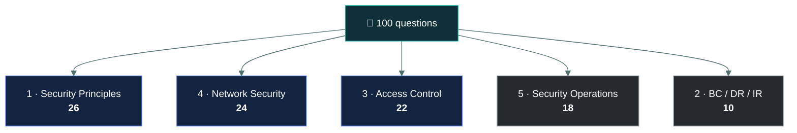

# 🗺️ The five domains

### *What is actually inside each one, so nothing on the paper is a surprise*

📌 *The blueprint in one page: the five domains, their weights, what each genuinely contains, and where the marks actually sit.*

---

## 🧸 The big idea

ISC2 publishes an outline of what CC covers, and the paper is built from it. There are no
surprise topics. Everything the exam can ask you sits under one of five headings, and those
headings have fixed weights.

That makes this a rare kind of exam: **the syllabus is small enough to hold in your head.**
Five domains, roughly twenty-five sub-areas between them. If you can name what lives in each
domain, you have a map of every question you will be asked.

The weights are the other half of the picture. They are not equal, and treating them as equal
is the most common way candidates waste study time.

---

## 📖 Words you will keep seeing

| Word | What it means on this exam |
|---|---|
| **Domain** | One of the five top-level subject headings. Each has a fixed percentage of the paper. |
| **Weight** | The share of the 100 questions drawn from a domain. 26% means roughly 26 questions. |
| **Exam outline** | ISC2's published breakdown of what each domain contains. The blueprint the paper is built from. |
| **Sub-area** | A numbered subdivision within a domain, e.g. "1.2 Understand risk management processes". |

---

## 📊 The five domains and what they are worth

| | Domain | Weight | ≈ Questions | This repo |
|:--:|---|--:|--:|---|
| **1** | Security Principles | **26%** | ~26 | [`01-security-principles/`](../../01-security-principles/README.md) |
| **2** | Business Continuity, Disaster Recovery & Incident Response | **10%** | ~10 | [`02-bc-dr-ir/`](../../02-bc-dr-ir/README.md) |
| **3** | Access Control Concepts | **22%** | ~22 | [`03-access-control/`](../../03-access-control/README.md) |
| **4** | Network Security | **24%** | ~24 | [`04-network-security/`](../../04-network-security/README.md) |
| **5** | Security Operations | **18%** | ~18 | [`05-security-operations/`](../../05-security-operations/README.md) |

> [!IMPORTANT]
> **Domains 1, 4 and 3 are 72% of the paper between them.** Domain 2 is 10%. If your study time
> runs short, it runs short on Domain 2 — never the other way round.

---

## 🧭 Domain 1 · Security Principles — 26%

The largest domain, and the vocabulary the other four are written in. Concepts here reappear
inside questions belonging to every other domain, which means its real influence is larger
than 26%.

**What is in it**

- The **CIA triad** — confidentiality, integrity, availability, and what breaks each
- **Authentication**, including the three factors and what counts as which
- **Authorisation** and **accounting** — the rest of AAA
- **Non-repudiation** and **privacy**
- **Risk management** — assets, threats, vulnerabilities, likelihood, impact
- **Risk assessment** — qualitative versus quantitative
- **Risk treatment** — accept, avoid, mitigate, transfer
- **Security controls** — technical, administrative, physical
- **Governance documents** — policy, standard, procedure, guideline, regulation
- The **ISC2 Code of Ethics** — the four canons, in order

**Where the marks are:** definitions and told-apart pairs. Threat versus vulnerability versus
risk. Policy versus standard versus procedure versus guideline. The four risk treatments.

---

## 🌐 Domain 4 · Network Security — 24%

The second-largest, and for anyone with a technical job the most familiar material on the
paper. The risk here is not the concepts — it is that ISC2's phrasing is simpler and more
rigid than real-world usage.

**What is in it**

- **Network types and topologies** — LAN, WAN, and the devices between them
- The **OSI model** and the **TCP/IP model**, and what lives at each layer
- **IP addressing** — IPv4 and IPv6, public versus private, NAT, DHCP, DNS
- **Ports and protocols** the exam expects you to recognise on sight
- **Threats and attacks** — DoS and DDoS, on-path, spoofing, side-channel, malware types
- **Defence devices** — firewalls, IDS and IPS, proxies
- **Segmentation** — VLANs, DMZ, defence in depth
- **VPNs** and remote access
- **Cloud** — service models, deployment models, shared responsibility
- **Zero trust**, and the service-agreement terms that travel with it

**Where the marks are:** layer placement, port numbers, and the IDS-versus-IPS distinction.
Straight recall, most of it.

---

## 🚪 Domain 3 · Access Control Concepts — 22%

The most definition-dense domain on the paper. Four access control models that must be told
apart cleanly, plus a physical-versus-logical split that generates a lot of questions.

**What is in it**

- **Subjects, objects and rules** — the vocabulary of every access decision
- **Physical access controls** — barriers, guards, badges, mantraps, CCTV, sensors
- **Logical access controls** — the technical side
- **DAC, MAC, RBAC and ABAC** — the four models
- **Least privilege**, **need to know**, **segregation of duties**
- **Privileged accounts** and the controls expected on them
- The **identity lifecycle** — provisioning, review, deprovisioning
- **Defence in depth** as a layered strategy

**Where the marks are:** the four models. Expect several questions that describe a scenario and
ask which model it is. Getting DAC and MAC the right way round is worth real marks.

---

## ⚙️ Domain 5 · Security Operations — 18%

The daily-job domain, described the way a textbook describes it. Broad but shallow.

**What is in it**

- **Data handling** — the lifecycle, the three states of data, retention and destruction
- **Data classification** — labelling, handling rules, and the ownership roles
- **Encryption** — symmetric, asymmetric, keys, and what each is for
- **Hashing** and integrity, digital signatures
- **System hardening** — baselines, patching, least functionality
- **Configuration management** — inventory, baselines, change control
- **Logging and monitoring** — what to log, SIEM, ingress and egress monitoring
- **Security policies** — acceptable use, BYOD, change management, privacy, passwords
- **Security awareness training**, and the social engineering it defends against

**Where the marks are:** the encryption-versus-hashing distinction, and the policy names. Also
several of the Domain-1 governance concepts reappear here in operational clothing.

---

## 🚨 Domain 2 · BC, DR & Incident Response — 10%

The smallest domain, and the one to study last. Short, heavily definitional, and built around
one ordering question and three time metrics.

**What is in it**

- **Incident terminology** — event, alert, incident, breach
- The **incident response plan** and its phases, in ISC2's order
- The **business impact analysis** and what it produces
- **RTO, RPO and MTD** — the three time metrics
- **Business continuity** — running through the disruption
- **Disaster recovery** — getting back to normal, site types, testing types

**Where the marks are:** RTO versus RPO, and the order of the incident response phases. Two
concepts, most of the domain's marks.

---

## ⚖️ Told apart

| | Means | Not to be confused with |
|---|---|---|
| **Domain weight** | The share of questions drawn from a domain. | **Domain difficulty.** Domain 2 is 10% of the paper and among the easiest content on it. Small does not mean hard. |
| **Business continuity** | Keeping operations running *during* a disruption. | **Disaster recovery**, which is restoring normal operations *after* one. Both sit in Domain 2 and are constantly swapped in distractors. |
| **Domain 1 risk content** | Concepts: threat, vulnerability, likelihood, treatment options. | **Domain 5 operational content**, which is the doing: hardening, logging, classification. The same ideas appear in both, at different altitudes. |

---

## ⚠️ Where your instinct is wrong

> [!WARNING]
> **In the job:** Domain 4 is your home ground, so it feels like the safe part of the paper.
>
> **On the exam:** familiarity is exactly what makes Domain 4 risky. You will reach for the
> operationally accurate answer where the exam wants the simplified textbook one — an IPS
> "blocks", full stop, whatever a real deployment does in monitor mode.

> [!WARNING]
> **In the job:** governance material feels like the soft, low-stakes part.
>
> **On the exam:** Domain 1 is the single largest block of marks, and its vocabulary shows up
> inside questions from every other domain. It is the highest-value study you can do.

---

## 🧠 How to remember it

🧠 **26 · 24 · 22 · 18 · 10.** Five numbers, descending, adding to 100.

In domain order — 1, 2, 3, 4, 5 — that is **26 · 10 · 22 · 24 · 18**. The useful version is the
descending one, because it is also your study order: **Principles, Network, Access, Operations,
BC/DR.**

---

## ✅ Check you actually got it

**Q1.** Which domain carries the greatest weight on the CC exam?

- **A.** Network Security
- **B.** Security Principles
- **C.** Access Control Concepts
- **D.** Security Operations

<b>Answer</b>

**B — Security Principles, at 26%.** It is also the domain whose vocabulary appears inside
questions belonging to the other four, so its practical influence exceeds its stated weight.

- **A** is second at 24%, and is the most common wrong answer because the material feels bigger.
- **C** is third at 22%.
- **D** is fourth at 18%.

**Q2.** A candidate has one week left and has not studied BC/DR at all. What is the most
rational allocation of the remaining time?

- **A.** Spend the week on BC/DR, since it is the only untouched domain
- **B.** Spend most of the week reinforcing the heavier domains, with a short focused pass on BC/DR
- **C.** Ignore BC/DR entirely, since 10% cannot affect a pass
- **D.** Split the time evenly across all five domains

<b>Answer</b>

**B — mostly reinforce the heavy domains, with a short focused pass on BC/DR.** Domain 2 is 10%
of the paper and its marks concentrate in a handful of definitions — RTO versus RPO, the
incident phases — which can be picked up quickly. The other 90% deserves the bulk of the week.

- **A** spends a full week on a tenth of the paper. The gap feels urgent, but the arithmetic
  does not support it.
- **C** discards about ten questions that are among the easiest on the exam to secure.
- **D** ignores weighting altogether, which is the mistake this page exists to prevent.

**Q3.** The distinction between business continuity and disaster recovery belongs to which
domain?

- **A.** Domain 1 — Security Principles
- **B.** Domain 2 — BC, DR & Incident Response
- **C.** Domain 5 — Security Operations
- **D.** It is split across Domains 2 and 5

<b>Answer</b>

**B — Domain 2.** Continuity is keeping operations running during a disruption; recovery is
restoring normal operations after one. Both live in Domain 2, and they are swapped in
distractors constantly.

- **A** is wrong — Domain 1 covers risk concepts and governance, not the response to a
  realised disruption.
- **C** is wrong, though it is tempting because continuity planning is operational work in real
  organisations. On this exam it is Domain 2.
- **D** invents a split that the blueprint does not have.

**Q4.** Roughly how many questions on a 100-question paper come from Access Control Concepts?

- **A.** About 10
- **B.** About 18
- **C.** About 22
- **D.** About 26

<b>Answer</b>

**C — about 22.** Access Control Concepts is 22%, the third-heaviest domain.

- **A** is Domain 2's weight, BC/DR/IR.
- **B** is Domain 5's weight, Security Operations.
- **D** is Domain 1's weight, Security Principles.

**Q5.** Which statement about the CC exam outline is correct?

- **A.** Domain weights vary between exam forms, so they cannot guide study
- **B.** The domains are equally weighted, and the numbering reflects difficulty
- **C.** The weights are fixed and published, so study time can be allocated against them
- **D.** Only the three heaviest domains appear on any individual paper

<b>Answer</b>

**C — the weights are fixed and published.** That is precisely what makes allocating study time
against them rational rather than guesswork.

- **A** is wrong. The blueprint weights are stable; individual forms are assembled to match them.
- **B** is wrong on both counts — the domains are not equally weighted, and the numbering is
  organisational, not a difficulty ranking.
- **D** is wrong. All five domains are represented on every paper, in blueprint proportion.

---

## 🎓 The grown-up version

<b>Extra depth — open this on a second read, never needed for the pass</b>

**Where the weights come from.** Certification bodies set domain weights through a job task
analysis: a survey of practitioners asking how frequently and how critically they perform
various tasks. The resulting weights are meant to reflect what entry-level practitioners
actually do, which is why governance and access control outweigh the more technical material —
across the whole population of people entering security roles, policy and access work is more
universal than packet analysis.

**Why the outline is worth reading directly.** This page summarises what each domain contains,
but ISC2 publishes the outline itself, with numbered sub-areas. It is short, and reading the
real thing once is worth doing — partly for completeness, and partly because the phrasing of
the sub-area headings is the phrasing the item writers work from. "Understand the risk
management process" tells you the verb the questions will use.

**Domain boundaries are softer than they look.** A question about classifying data touches
Domain 5 (data handling), Domain 3 (who may access each classification) and Domain 1 (who owns
the decision). ISC2 assigns each item to one domain for weighting purposes, but you are never
told which, and you should not try to guess. Answer the question in front of you rather than
reasoning about which domain it belongs to.

---

## 📝 Cram lines

Destined for [`EXAM-DAY.md`](../../EXAM-DAY.md):

- **26 · 24 · 22 · 18 · 10** — Principles, Network, Access, Operations, BC/DR.
- Domain weight ≈ number of questions. **26% means about 26 questions.**
- Domains **1, 4 and 3 are 72%** of the paper.
- **Domain 1 vocabulary appears inside every other domain's questions.**
- Domain 2's marks concentrate in **RTO vs RPO** and **the incident response phase order**.

---

<a href="../README.md">← back to 00 · Foundations</a> &nbsp;·&nbsp; <a href="../study-schedule/">next: Study schedule →</a>

