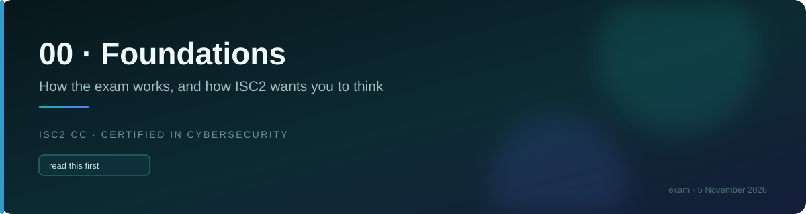

# 🗺️ The five domains

### *What is actually inside each one, so nothing on the paper is a surprise*

📌 *The blueprint in one page: the five domains, their weights, what each genuinely contains, and where the marks actually sit.*

---

## 🧸 The big idea

ISC2 publishes an outline of what CC covers, and the exam is built from it. There are no
surprise topics. Everything you can be asked sits under one of five headings, and those
headings have fixed weights.

That makes this a rare kind of exam: **the syllabus is small enough to hold in your head.**
Five domains, twenty numbered sub-areas between them. If you can name what lives in each
domain, you have a map of every item you will be asked.

The weights are the other half of the picture. They are not equal, and treating them as equal
is the most common way candidates waste study time.

> [!IMPORTANT]
> This page reflects the **live outline, effective 1 September 2026.** It replaces an older
> outline that weighted these domains differently and grouped the content differently —
> notably, Governance used to be folded in with BC/DR under a 10%-weighted Domain 2. It is now
> its own domain, at 17.3%, and BC/DR sits inside it. Incident Response moved the other way —
> out of Domain 2 and into Domain 5.

---

## 📖 Words you will keep seeing

| Word | What it means on this exam |
|---|---|
| **Domain** | One of the five top-level subject headings. Each has a fixed percentage of the exam. |
| **Weight** | The share of items drawn from a domain. 24% means roughly a quarter of what you see. |
| **Exam outline** | ISC2's published breakdown of what each domain contains. The blueprint the exam is built from. |
| **Sub-area** | A numbered subdivision within a domain, e.g. "2.2 Understand redundancy". |

---

## 📊 The five domains and what they are worth

| | Domain | Weight | This repo |
|:--:|---|--:|---|
| **1** | Security Principles | **24%** | [`01-security-principles/`](../../01-security-principles/README.md) |
| **2** | Security Governance | **17.3%** | [`02-security-governance/`](../../02-security-governance/README.md) |
| **3** | Identity and Access Management (IAM) Concepts | **20%** | [`03-access-control/`](../../03-access-control/README.md) |
| **4** | Networking and Cloud Security Concepts | **21.3%** | [`04-network-security/`](../../04-network-security/README.md) |
| **5** | Security Operations and Incident Response | **17.3%** | [`05-security-operations/`](../../05-security-operations/README.md) |

> [!NOTE]
> The three fractional weights (17.3, 17.3, 21.3) do not round to whole numbers that sum to
> 100 — ISC2 publishes them as printed. Where this repo needs whole-number question counts
> (mock exam blueprints), it rounds to **24 / 17 / 20 / 21 / 18** and says so at the point of
> use.

> [!IMPORTANT]
> **Study in weight order: 1, then 4, then 3, then 2 and 5 tied.** Security Principles and
> Networking and Cloud Security Concepts together are 45.3% of the paper. If your schedule
> runs short, it runs short on whichever of Governance or Security Operations you reach last —
> not because either is unimportant, but because they are tied for smallest.

---

## 🧭 Domain 1 · Security Principles — 24%

The largest domain, and the vocabulary the other four are written in. Concepts here reappear
inside items belonging to every other domain, which means its real influence is larger than
24%.

**What is in it**

- **Cybersecurity concepts** — confidentiality, integrity, availability, AAA, non-repudiation,
  privacy
- **Risk management concepts** — the risk lifecycle, and the processes that run it
- **Governance concepts** — regulations and laws; frameworks and guidelines; policies,
  standards (including ISO and CIS by name), and procedures
- **Cybersecurity controls** — technical, administrative, physical
- **Professional and ethical conduct** — professional codes of conduct, due care and due
  diligence, the ISC2 Code of Ethics

**Where the marks are:** definitions and told-apart pairs. Threat versus vulnerability versus
risk. Policy versus standard versus procedure. Due care versus due diligence. The four risk
treatments.

---

## 🌐 Domain 4 · Networking and Cloud Security Concepts — 21.3%

The second-largest, and for anyone with a technical job the most familiar material on the
exam. The risk here is not the concepts — it is that ISC2's phrasing is simpler and more rigid
than real-world usage.

**What is in it**

- **Network security** — OSI, TCP/IP, IPv4, IPv6, VPNs; firewalls (including application
  inspection, not only ports); wireless (Wi-Fi, Bluetooth); embedded systems (ICS) and IoT
- **Network security architecture** — segmentation (firewall zones, VLANs,
  micro-segmentation); Defense in Depth; Zero Trust
- **Cloud security** — the NIST-style characteristics (broad network access, rapid
  elasticity, measured service, on-demand self-service, resource pooling); service models;
  deployment models; the shared responsibility model

**Where the marks are:** layer placement, port numbers, cloud characteristics, and the
segmentation vocabulary — VLAN versus micro-segmentation versus Zero Trust.

---

## 🚪 Domain 3 · IAM Concepts — 20%

Definition-dense. Two sub-areas only, but each is deep: the identity lifecycle, and the access
control models.

**What is in it**

- **Identity life cycle management** — roles definition, provisioning, review, deprovisioning,
  and the frameworks and tools involved (joiner-mover-leaver, access reviews)
- **Logical access controls** — principle of least privilege, separation of duties, and the
  access control models: DAC, MAC, RBAC, ABAC

**Where the marks are:** the four access control models. Expect several items that describe a
scenario and ask which model it is. Getting DAC and MAC the right way round is worth real
marks.

> [!NOTE]
> Physical access controls (badges, mantraps, CCTV) are **no longer a named IAM objective**.
> The live outline keeps a physical thread alive under Domain 5's security testing sub-area —
> physical penetration testing (phishing, tailgating, impersonation) — rather than under IAM.

---

## 🚨 Domain 2 · Security Governance — 17.3%

New as its own domain. This is where business continuity, disaster recovery, and security
awareness now live — grouped under the governance umbrella rather than scattered.

**What is in it**

- **Plan GRC** — the purpose, importance, frameworks and tools of governance, risk and
  compliance
- **Redundancy** — business continuity (BC) and disaster recovery (DR)
- **Security awareness** — organizational culture, security leadership, and the concepts of
  social engineering, password protection, and phishing
- **Measuring cybersecurity effectiveness** — key metrics, key risk indicators (KRIs),
  dashboards, scorecards, reports

**Where the marks are:** BC versus DR, RTO/RPO/MTD (the BIA outputs that test whether BC/DR
plans are adequate), and KRI versus KPI.

> [!NOTE]
> **Incident response is not here.** It moved to Domain 5. If a question is about *building
> resilience before something goes wrong* — BC, DR, awareness, metrics — it's Domain 2. If it's
> about *what happens once an incident is declared*, it's Domain 5.

---

## ⚙️ Domain 5 · Security Operations and Incident Response — 17.3%

The daily-job domain, and now the home of incident response too. Broad, and the most
operationally hands-on of the five.

**What is in it**

- **Data security** — handling (classification, labeling, masking, sanitization); encryption
  (symmetric, asymmetric, hashing, and quantum-resistant cryptography)
- **Security operations** — logging and monitoring; security event triage (use cases,
  prioritization, correlation); threat actors and their motivations; cyber threat intelligence;
  threat frameworks
- **Incident Response** — data-handling policy implementing an incident response plan (IRP);
  IR exercises (testing, tabletop)
- **Asset protection** — asset lifecycle and end-of-life (EOL) software and devices;
  configuration and change management
- **Security testing** — readiness testing (blue, purple, red teaming); application testing
  (vulnerability scanning, static analysis, dynamic analysis, threat modeling); physical
  penetration testing (phishing, tailgating, impersonation)

**Where the marks are:** the encryption-versus-hashing distinction, the incident response
phase order, and telling apart vulnerability scanning, SAST, DAST, and threat modeling.

---

## ⚖️ Told apart

| | Means | Not to be confused with |
|---|---|---|
| **Domain weight** | The share of items drawn from a domain. | **Domain difficulty.** Domain 2 and Domain 5 are tied at 17.3% and are among the more approachable content on the exam. Small does not mean hard. |
| **Business continuity (Domain 2)** | Keeping operations running *during* a disruption. | **Disaster recovery** (also Domain 2), which is restoring normal operations *after* one. Both sit in the same domain and are constantly swapped in distractors. |
| **Security Governance (Domain 2)** | Planning and measuring resilience and awareness *before* anything happens. | **Incident Response (Domain 5)**, which is what happens *after* an incident is declared. These used to sit together; they no longer do. |
| **IAM Concepts (Domain 3)** | Identity lifecycle and logical access control models. | **Physical access controls**, which are no longer a named Domain 3 objective — the surviving physical thread is physical penetration testing under Domain 5. |

---

## ⚠️ Where your instinct is wrong

> [!WARNING]
> **In the job:** Domain 4 is your home ground, so it feels like the safe part of the exam.
>
> **On the exam:** familiarity is exactly what makes Domain 4 risky. You will reach for the
> operationally accurate answer where the exam wants the simplified textbook one — an IPS
> "blocks", full stop, whatever a real deployment does in monitor mode.

> [!WARNING]
> **In the job:** governance and awareness feel like the soft, low-stakes part.
>
> **On the exam:** Domain 1 is the single largest block of marks, and Domain 2 (governance)
> now stands on its own at 17.3% rather than being buried inside a 10% BC/DR domain. Together,
> governance-flavoured content across Domains 1 and 2 is a bigger share of the paper than it
> used to be.

> [!WARNING]
> **If you studied the old outline:** you will instinctively look for incident response inside
> BC/DR.
>
> **On the live outline:** incident response is Domain 5. BC/DR stayed in Domain 2 as
> "redundancy". Re-file this mentally before you start drilling, or you will misjudge which
> domain a scenario question belongs to.

---

## 🧠 How to remember it

🧠 **24 · 21.3 · 20 · 17.3 · 17.3.** Five numbers, descending, adding to 100.

In domain order — 1, 2, 3, 4, 5 — that is **24 · 17.3 · 20 · 21.3 · 17.3**. The useful version
is the descending one, because it is also your study order: **Principles, Networking, IAM,
then Governance and Operations tied.**

---

## ✅ Check you actually got it

**Q1.** Which domain carries the greatest weight on the live CC exam outline?

- **A.** Networking and Cloud Security Concepts
- **B.** Security Principles
- **C.** IAM Concepts
- **D.** Security Governance

<b>Answer</b>

**B — Security Principles, at 24%.** It is also the domain whose vocabulary appears inside
items belonging to the other four, so its practical influence exceeds its stated weight.

- **A** is second at 21.3%, and is the most common wrong answer because the material feels
  bigger to a technical reader.
- **C** is third at 20%.
- **D** is tied for smallest at 17.3%, alongside Domain 5.

**Q2.** A candidate has one week left and has not studied Security Governance at all. What is
the most rational allocation of the remaining time?

- **A.** Spend the week on Governance, since it is the only untouched domain
- **B.** Spend most of the week reinforcing the heavier domains, with a focused pass on
  Governance
- **C.** Ignore Governance entirely, since 17.3% cannot affect a pass
- **D.** Split the time evenly across all five domains

<b>Answer</b>

**B — mostly reinforce the heavy domains, with a focused pass on Governance.** Domain 2 is
17.3% of the exam — not trivial, but still smaller than Domains 1, 4, and 3 combined. It
deserves real time, just not the majority of what's left.

- **A** spends a full week on a domain that is real but not the largest share of the paper.
- **C** discards a domain worth roughly a sixth of the exam — far too costly to skip.
- **D** ignores weighting altogether, which is the mistake this page exists to prevent.

**Q3.** Under the live outline, incident response belongs to which domain?

- **A.** Domain 1 — Security Principles
- **B.** Domain 2 — Security Governance
- **C.** Domain 5 — Security Operations and Incident Response
- **D.** It is split across Domains 2 and 5

<b>Answer</b>

**C — Domain 5.** Incident response moved out of the governance/BC-DR grouping and now sits
with security operations, alongside data security and security testing.

- **A** is wrong — Domain 1 covers risk concepts and governance-adjacent vocabulary, not
  incident handling.
- **B** describes the old grouping. Domain 2 now covers BC/DR, awareness, GRC, and metrics —
  not incident response.
- **D** invents a split the current blueprint does not have.

**Q4.** Roughly what share of a CC exam comes from Networking and Cloud Security Concepts?

- **A.** About 17%
- **B.** About 20%
- **C.** About 21%
- **D.** About 24%

<b>Answer</b>

**C — about 21% (21.3%).** Networking and Cloud Security Concepts is the second-heaviest
domain.

- **A** is Domain 2 or Domain 5's weight (tied at 17.3%).
- **B** is Domain 3's weight, IAM Concepts.
- **D** is Domain 1's weight, Security Principles.

**Q5.** Which statement about the current CC exam outline is correct?

- **A.** Domain weights are unpublished and estimated by test-prep vendors
- **B.** The domains are equally weighted, and the numbering reflects difficulty
- **C.** The weights are fixed and published, so study time can be allocated against them
- **D.** Physical access control is a standalone Domain 3 objective, worth its own share of marks

<b>Answer</b>

**C — the weights are fixed and published.** That is precisely what makes allocating study
time against them rational rather than guesswork.

- **A** is wrong — ISC2 publishes the outline and weights directly.
- **B** is wrong on both counts — the domains are not equally weighted, and the numbering is
  organisational, not a difficulty ranking.
- **D** is wrong under the live outline — physical access controls are not a named Domain 3
  objective; the surviving physical thread is physical penetration testing under Domain 5.

---

## 🎓 The grown-up version

<b>Extra depth — open this on a second read, never needed for the pass</b>

**Where the weights come from.** Certification bodies set domain weights through a job task
analysis: a survey of practitioners asking how frequently and how critically they perform
various tasks. ISC2 revised this outline effective 1 September 2026, which is why the weights
and groupings you'll see in older third-party study material do not match this repo.

**Why the outline is worth reading directly.** This page summarises what each domain contains,
but ISC2 publishes the outline itself, with numbered sub-areas. It is short, and reading the
real thing once is worth doing — partly for completeness, and partly because the phrasing of
the sub-area headings is the phrasing the item writers work from.

**Domain boundaries are softer than they look.** A question about security awareness training
touches Domain 2 (where it now formally lives) and Domain 5 (where social engineering and
phishing show up again as operational threats). ISC2 assigns each item to one domain for
weighting purposes, but you are never told which, and you should not try to guess. Answer the
question in front of you rather than reasoning about which domain it belongs to.

---

## 📝 Cram lines

Destined for [`EXAM-DAY.md`](../../EXAM-DAY.md):

- **24 · 21.3 · 20 · 17.3 · 17.3** — Principles, Networking, IAM, Governance, Operations.
- Study order by weight: **1, then 4, then 3, then 2 and 5 tied.**
- **Domain 2 = Security Governance** (GRC, BC/DR, awareness, metrics) — **not** incident
  response.
- **Domain 5 = Security Operations and Incident Response** — IR lives here now.
- **Physical access control is no longer a named Domain 3 objective** — physical testing
  survives under Domain 5.

---

<a href="../README.md">← back to 00 · Foundations</a> &nbsp;·&nbsp; <a href="../study-schedule/">next: Study schedule →</a>

</content>
