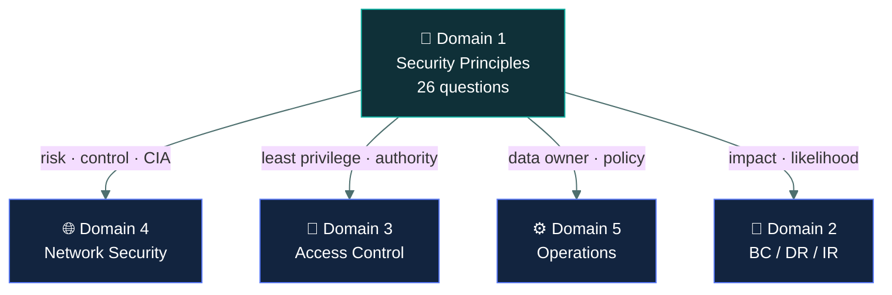

# 🧭&nbsp; 01 · Security Principles

### *The vocabulary the whole exam is written in.*

---

## 👋 01 · Read this first

This is the largest domain on the paper at **26%**, and its real influence is larger still,
because the words defined here are the words every other domain's questions are written in.
A question about firewalls will still use "risk", "control" and "confidentiality" as though
you already know exactly what each one means.

The domain is **definitional**. Very little of it asks you to reason about a situation; most
of it asks whether you can match a term to its meaning, or tell two near-identical terms
apart. That makes it the most learnable domain on the exam, and the one where careless
reading costs the most.

Two things to hold on to as you work through it:

- **The ⚖️ Told apart blocks are the domain.** Threat versus vulnerability versus risk.
  Policy versus standard versus procedure versus guideline. The four risk treatments.
  Qualitative versus quantitative. Those distinctions are most of the 26 marks.
- **Authority matters.** A recurring answer pattern in this domain is *who decides*. Senior
  management accepts risk. The data owner classifies data. You assess and recommend. Options
  that put a technical role in a decision-making seat are distractors.

---

## 📂 02 · The 11 topics

Work top to bottom — each one uses vocabulary the previous ones established.

| | Topic | What you will be able to do afterwards |
|:--:|---|---|
| &#9745; | 🔺 [`cia-triad/`](cia-triad/) | Name the three properties, say precisely what breaks each, and pick the right one from a scenario. |
| &#9745; | 🔑 [`authentication/`](authentication/) | Sort any credential into the right factor, and say what does and does not count as multi-factor. |
| &#9745; | 🎫 [`authorization-and-accounting/`](authorization-and-accounting/) | Separate the three parts of AAA and say which one a given control belongs to. |
| &#9745; | ✍️ [`non-repudiation/`](non-repudiation/) | Say what non-repudiation actually guarantees, and which mechanisms provide it. |
| &#9745; | 🕵️ [`privacy/`](privacy/) | Define PII, name the roles, and recognise the regulations the exam expects. |
| &#9745; | ⚠️ [`risk-concepts/`](risk-concepts/) | Tell asset, threat, threat actor, vulnerability and risk apart without hesitating. |
| &#9744; | 📐 [`risk-assessment/`](risk-assessment/) | Choose between qualitative and quantitative, and recognise SLE, ARO and ALE. |
| &#9744; | 🎯 [`risk-treatment/`](risk-treatment/) | Name the four treatments, match each to a scenario, and say who is allowed to choose. |
| &#9744; | 🛡️ [`security-controls/`](security-controls/) | Classify any control by both type and function — the two axes the exam tests. |
| &#9744; | 📜 [`governance-documents/`](governance-documents/) | Rank policy, standard, procedure and guideline, and say which are mandatory. |
| &#9744; | ⚖️ [`isc2-code-of-ethics/`](isc2-code-of-ethics/) | Recite the four canons **in order** and apply them to a conflict. |

---

## 🎯 03 · Why this domain matters most

26 questions come from here directly. But the vocabulary leaks everywhere: a Domain 4
question about segmentation still turns on what a *preventive control* is, and a Domain 5
question about classification still turns on who the *data owner* is.

Read that as a sentence: **the words defined here are the words the rest of the exam is asked in.**

---

## ⏭️ 04 · Where to go next

When all eleven boxes are ticked, go to [`04-network-security/`](../04-network-security/README.md)
— the second-heaviest domain at 24%.

---

<a href="../README.md">← back to the repo index</a>

