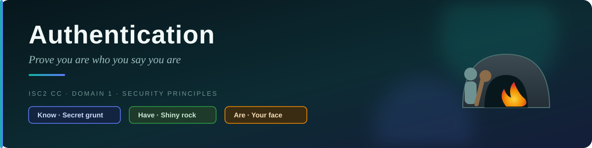
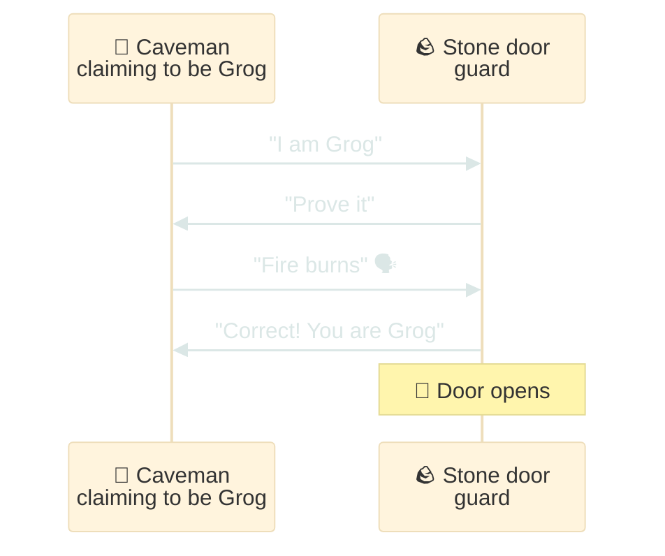
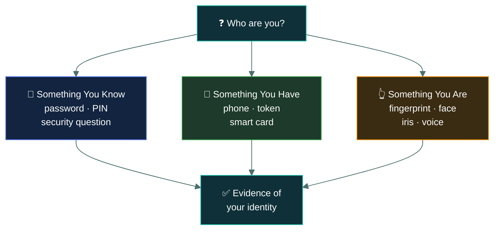
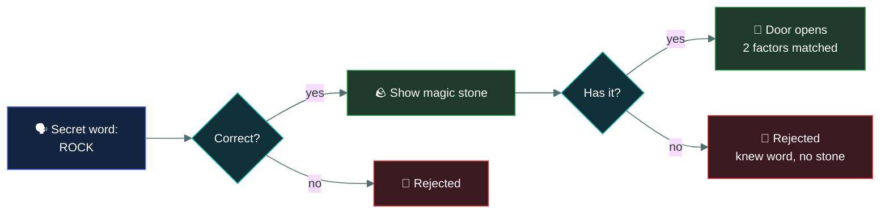
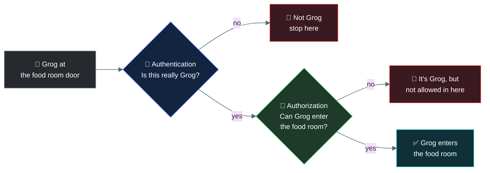

# 🔐 Authentication — Caveman Style

---

Let's continue with our caveman Grog.

Imagine Grog has a secret cave. He doesn't want random cavemen walking inside.

A caveman comes to the entrance and says:

> "I am Grog."

Grog's guard asks:

> "Prove it."

That process of proving who you are is called **authentication**.

## 🧠 Simple definition

**Authentication = Verifying someone's identity.**

In very simple words:

> "Are you really who you say you are?"

## 🪨 Caveman example

Grog has a cave protected by a stone door.

Another caveman walks up:

> 🧑 "I am Grog. Open the door."

The guard doesn't just believe him. The guard asks for proof.

Maybe Grog knows a secret password:

> 🗣️ "Fire burns."

The guard says:

> "Correct! You are Grog."

🚪 Door opens.

That's authentication.

---

## 💻 Authentication in computers

When you log into your Gmail, Instagram, bank account, or computer, the system needs to determine:

> "Who are you?"

You provide some evidence. For example:

### 1 · 🔑 Something You Know

Something that you know. Examples:

- Password
- PIN
- Security question

**Caveman version:** "Tell me the secret word."

### 2 · 📱 Something You Have

Something that you possess. Examples:

- Phone
- Security token
- Smart card
- Authentication app

For example, you enter your password and then receive a code on your phone. The system thinks:

> "You know the password AND you have this phone."

That's stronger authentication.

### 3 · 👆 Something You Are

Something based on your physical characteristics. Examples:

- Fingerprint
- Face
- Iris
- Voice

For example: 👆 Fingerprint scanner → "Yep, that's Grog."

---

## 🔐 Multi-Factor Authentication (MFA)

Now let's make Grog's cave even safer.

Instead of asking for just one proof, the guard asks for two or more **different types** of proof.

For example:

- Step 1: Enter password 🔑
- Step 2: Enter code from your phone 📱

The attacker might know your password, but they may not have your phone. So getting inside becomes
much harder.

That's **Multi-Factor Authentication (MFA)**.

### Caveman version

> **Guard:** "Tell me the secret word."
> **Grog:** "ROCK."
> **Guard:** "Good. Now show me your magic stone."
> **Grog:** 🪨 "Here."
> **Guard:** "Okay, you are probably Grog."
>
> 🚪 OPEN!

---

## ⚠️ Authentication vs Authorization

This is very important because students often confuse them.

> [!IMPORTANT]
> **Authentication = WHO ARE YOU?** The system checks your identity. "Are you really Grog?"
>
> **Authorization = WHAT ARE YOU ALLOWED TO DO?** After the system knows you're Grog, it checks
> your permissions. "Okay, you're Grog. But are you allowed to enter the food room?"

So remember:

- 🔐 **Authentication** = Who are you?
- 🛂 **Authorization** = What can you do?

---

## 🏦 Bank example

You open your banking app. You enter:

- Username: `Grog`
- Password: `******`

The bank verifies your identity. That's:

🔐 **Authentication**

Then the bank checks whether you are allowed to:

- View your balance
- Transfer money
- Change your address
- Add a beneficiary

That's:

🛂 **Authorization**

---

## 🧠 How it connects to the CIA Triad

Authentication helps protect the CIA Triad. For example:

> [!NOTE]
> **🔒 Confidentiality** — Authentication prevents strangers from accessing private information.
> "Only verified users can see the data."

> [!TIP]
> **✏️ Integrity** — Authentication helps ensure only authorized people can modify data. "Only
> verified users can change the information."

> [!WARNING]
> **🟢 Availability** — Strong authentication can help prevent unauthorized users from abusing
> systems, although availability requires additional protections too.

---

## 🎯 Exam-ready definition

If your teacher asks:

> "What is authentication?"

You can answer:

> **Authentication is the process of verifying the identity of a user, device, or system before
> granting access.**

And remember the caveman:

🪨 **Authentication = "PROVE YOU ARE WHO YOU SAY YOU ARE."**

- Password = something you know
- Phone/token = something you have
- Fingerprint/face = something you are
- 2+ different factors = MFA

---

<a href="../README.md">← Back to 01 · Security Principles</a>

