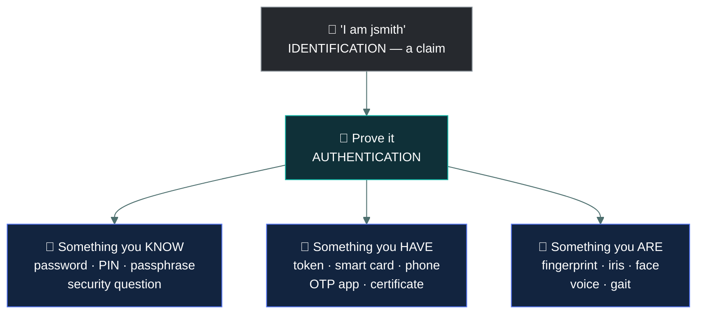
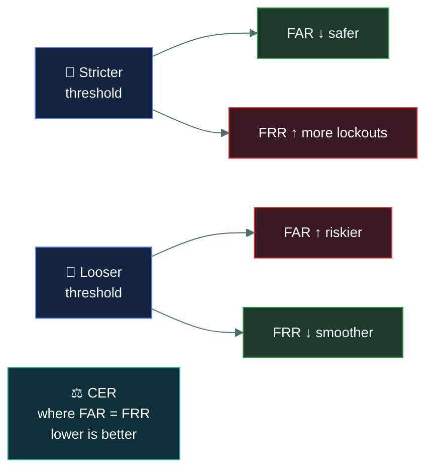

# 🔑 Authentication

### *Proving you are who you claim to be — and what actually counts as a second factor*

📌 *The three factors, how to sort any credential into one of them, and the multi-factor trap that catches almost everybody.*

---

## 🧸 The big idea

Picture a caveman guarding the entrance to his cave. A stranger walks up in the dark and says
"I live here — let me in."

The guard doesn't just believe him. Anyone could say those words. So the guard asks for proof,
and there are only three kinds of proof he'll accept:

- *"What's the secret whistle only cave-dwellers know?"* — a **secret in your head.**
- *"Show me your painted rock — only cave-dwellers carry one."* — **an object you have.**
- *"Turn around, let me see your face."* — **something about your actual body.**

That's the entire topic. **Authentication answers one question: are you really who you say you
are?** — and it always happens in two beats:

1. **Identification** — you *claim* an identity. Saying "I live here." Typing a username.
   Presenting a badge. This claim is not trusted; anybody can make it.
2. **Authentication** — you *prove* the claim with one of the guard's three kinds of proof.

Username is identification. Password is authentication. They arrive together on one login
screen, which is exactly why the exam likes separating them.

The proof always comes from one of three categories, and there are only three:

- **Something you know** — a secret in your head (the whistle)
- **Something you have** — an object in your possession (the rock)
- **Something you are** — a physical characteristic of your body (your face)

---

## 📖 Words you will keep seeing

| Word | What it means on this exam |
|---|---|
| **Identification** | Claiming an identity. Unverified. A username, an account number, a badge presented. |
| **Authentication** | Proving the claimed identity with one or more factors. |
| **Factor** | A category of proof: knowledge, possession, or inherence. |
| **Credential** | The actual thing presented — a password, a token code, a fingerprint. |
| **Multi-factor authentication (MFA)** | Authentication using credentials from **two or more different factors**. |
| **Two-factor authentication (2FA)** | MFA using exactly two different factors. |
| **Single-factor authentication** | One factor, however many credentials. |
| **Biometrics** | Authentication using a measurable physical or behavioural characteristic. |
| **Token** | A physical or software device that generates or holds a possession-factor credential. |
| **OTP** | One-time password. Valid for a single use or a short window. |
| **False acceptance** | A biometric system wrongly accepting an impostor. The dangerous error. |
| **False rejection** | A biometric system wrongly rejecting a legitimate user. The annoying error. |

---

## 🔍 The three factors

### 🧠 Something you know — knowledge

The secret whistle. Passwords, PINs, passphrases, security questions.

- **Cheapest and most common.** Also the weakest.
- **Its weakness:** it can be shared, guessed, phished, shoulder-surfed or reused, and none of
  that leaves a trace. A stolen password does not go missing — the owner still has it.
- **Security questions are a knowledge factor**, not a possession factor, and they are
  considered weak because the answers are often discoverable.

### 📱 Something you have — possession

The painted rock. Hardware tokens, smart cards, a phone receiving a code, an authenticator app,
a certificate on a device, a physical key.

- **Its strength:** theft is noticeable. A stolen token is a missing token.
- **Its weakness:** it can be lost, stolen or cloned, and the user cannot work without it.
- **The code is not the factor.** An OTP is proof that you hold the device that generated it —
  the *device* is the factor, and the code is just how it proves itself.

### 👤 Something you are — inherence

Your actual face. Fingerprint, iris or retina, facial geometry, palm or vein pattern, voice.
Behavioural characteristics — typing rhythm, gait — also fall here.

- **Its strength:** hard to share, impossible to forget, always with you.
- **Its weakness:** it **cannot be reissued.** A breached password is changed in seconds; a
  breached fingerprint is yours for life. Biometric data is therefore extremely sensitive.
- Biometric systems are never perfectly accurate, which gives rise to the error rates below.

---

## 🎯 What counts as multi-factor

**MFA requires credentials from two or more *different* categories.** Two credentials from the
same category is still single-factor, no matter how many there are.

| Combination | Factors used | MFA? |
|---|---|---|
| Password + PIN | know + know | ❌ **No** — single factor, twice |
| Password + security question | know + know | ❌ **No** — the classic trap |
| Password + SMS code | know + have | ✅ Yes |
| Password + authenticator app code | know + have | ✅ Yes |
| Smart card + PIN | have + know | ✅ Yes |
| Fingerprint + password | are + know | ✅ Yes |
| Fingerprint + iris scan | are + are | ❌ **No** — two biometrics, one factor |
| Smart card + hardware token | have + have | ❌ **No** |
| Password + fingerprint + token | know + are + have | ✅ Yes — three factors |

> [!IMPORTANT]
> **Password plus security question is not MFA.** It is the single most commonly tested item on
> this topic. Both are things you know, so an attacker who can phish one can usually phish the
> other.

---

## 📊 Biometric error rates

Three terms, and the exam tests which one matters more.

| Term | Means | Why it matters |
|---|---|---|
| **FAR** — False Acceptance Rate | How often an **impostor is wrongly accepted** | **The security risk.** A wrong person got in. |
| **FRR** — False Rejection Rate | How often a **legitimate user is wrongly rejected** | The usability cost. Frustration, lockouts, help-desk calls. |
| **CER** — Crossover Error Rate | The point where FAR and FRR are **equal** | The standard measure of overall accuracy. **Lower CER = better system.** |

Tuning a biometric system trades one error against the other. Make it stricter and impostors
get in less often (FAR down) but legitimate users get rejected more (FRR up). Loosen it and the
reverse happens.

> 🎯 **FAR is the security failure; FRR is the usability failure.** If a question asks which
> error is more dangerous, it is FAR — an impostor was let in.

---

## ⚖️ Told apart

| | Means | Not to be confused with |
|---|---|---|
| **Identification** | Claiming an identity. Unverified. | **Authentication**, which is proving that claim. Username identifies; password authenticates. |
| **Authentication** | Proving who you are. | **Authorisation**, which is what you are allowed to do *once* proven. Authentication always comes first. |
| **Multi-factor** | Two or more **different** categories. | **Multiple credentials**, which may all be the same category. Password + PIN is not MFA. |
| **FAR** | Impostor wrongly accepted. | **FRR**, legitimate user wrongly rejected. FAR is the security problem. |
| **A token** | The device you possess. | **The code it displays**, which is merely how the device proves possession. |
| **Biometric** | Something you *are*. | **A password manager on your phone** — that is something you *have* holding something you *know*. |

---

## ⚠️ Where your instinct is wrong

> [!WARNING]
> **In the job:** SMS-based one-time codes are weak — SIM swapping, SS7 interception, and any
> serious programme moves off them.
>
> **On the exam:** SMS codes are a legitimate **possession** factor, and password + SMS code
> **is** multi-factor authentication. The exam tests the category, not the strength. If an
> option says "this is not MFA because SMS is insecure", it is a distractor.

> [!WARNING]
> **In the job:** you would argue a phishing-resistant passkey and a password are not
> meaningfully comparable, and that factor-counting is a poor model.
>
> **On the exam:** factor-counting is exactly the model. Sort the credential into know / have /
> are, count the distinct categories, answer.

> [!WARNING]
> **In the job:** biometrics are convenient and increasingly the default.
>
> **On the exam:** the expected weakness of biometrics is that **they cannot be reissued after
> compromise**, plus privacy concerns and error rates. If a question asks for a disadvantage of
> biometrics, that is the answer it wants.

---

## 🧠 How to remember it

🧠 **Know · Have · Are.**

Three words, in that order — and the order is also roughly weakest to strongest, which makes
it easy to keep straight.

🧠 **For MFA: count categories, not credentials.** Write K, H or A next to each credential in the
question. Two different letters means MFA. Two of the same letter does not.

🧠 **FAR = "Fraudster Admitted, Regrettably."** FRR is the other one.

---

## ✅ Check you actually got it

Answer all five before expanding anything.

**Q1.** A system requires users to enter a password and then answer a pre-registered security
question. What type of authentication is this?

- **A.** Two-factor authentication, because two separate credentials are required
- **B.** Single-factor authentication, because both credentials are something the user knows
- **C.** Multi-factor authentication, because the security question is something the user has
- **D.** Three-factor authentication, because the username is also a credential

<b>Answer</b>

**B — single-factor authentication.** A password and a security-question answer are both
knowledge factors. Requiring two of them makes the system harder to attack, but it does not make
it multi-factor.

- **A** counts credentials instead of categories. That is precisely the error the question is
  built to catch.
- **C** miscategorises the security question. Nothing is possessed — the answer lives in the
  user's memory, exactly like the password.
- **D** treats the username as a credential. A username is **identification**, an unverified
  claim, not proof of anything.

**Q2.** Which combination constitutes multi-factor authentication?

- **A.** A fingerprint scan and an iris scan
- **B.** A smart card and a hardware token
- **C.** A PIN and a one-time code from an authenticator app
- **D.** A password and a passphrase

<b>Answer</b>

**C — a PIN (know) and a one-time code from an authenticator app (have).** Two different
categories, so this is genuine MFA.

- **A** is two inherence factors. Both are something you are, so it is single-factor.
- **B** is two possession factors. Both are something you have.
- **D** is two knowledge factors, and a passphrase is simply a long password.

**Q3.** A biometric system is retuned to be more permissive so that staff stop being locked out.
What is the effect?

- **A.** FAR decreases and FRR decreases
- **B.** FAR increases and FRR decreases
- **C.** FAR decreases and FRR increases
- **D.** Neither rate changes; only the CER changes

<b>Answer</b>

**B — FAR increases, FRR decreases.** Loosening the threshold accepts more attempts overall:
more legitimate users get through (FRR down), and so do more impostors (FAR up). This trade-off
is the core of the topic.

- **A** describes both errors improving at once, which retuning a threshold cannot achieve. Only
  a better sensor or algorithm does that.
- **C** is the effect of making the system *stricter*, which is the opposite of what the stem
  describes.
- **D** inverts the relationship. CER is the point where the two curves cross — it is a property
  of the system's accuracy, not something the threshold moves independently.

**Q4.** What is the PRIMARY security concern that distinguishes biometric authentication from
password-based authentication?

- **A.** Biometrics are more expensive to deploy
- **B.** Biometric characteristics cannot be changed if compromised
- **C.** Biometrics require specialised hardware at every access point
- **D.** Biometric systems are slower to authenticate users

<b>Answer</b>

**B — biometric characteristics cannot be changed if compromised.** A leaked password is reset
in seconds. A leaked fingerprint template is a permanent exposure, which is why biometric data
is treated as highly sensitive.

- **A** is true in many deployments but is a cost concern, not a *security* one. The qualifier is
  PRIMARY and the subject is security.
- **C** is an operational constraint, not a security weakness.
- **D** is generally not even true — biometric authentication is usually faster than typing a
  password.

**Q5.** A user presents a badge at a door, then enters a PIN on a keypad. How should this be
classified?

- **A.** Single-factor, because both actions occur at the same door
- **B.** Two-factor, combining something you have with something you know
- **C.** Two-factor, combining something you have with something you are
- **D.** Single-factor, because a badge is an identification method rather than authentication

<b>Answer</b>

**B — two-factor: something you have (the badge) plus something you know (the PIN).** This
combination is one of the most common real deployments of MFA, and a frequent exam example.

- **A** invents a rule about location. Factors are categories of proof; where they are presented
  is irrelevant.
- **C** miscategorises the PIN as inherence. A PIN is memorised, so it is knowledge.
- **D** is the subtle distractor. A badge can *carry* an identity claim, but a badge with an
  embedded credential is also something you possess, and possession is what it proves at the
  door.

---

## 🎓 The grown-up version

<b>Extra depth — open this on a second read, never needed for the pass</b>

**A fourth and fifth factor.** Some frameworks add *somewhere you are* (location, derived from
IP geolocation or GPS) and *something you do* (behavioural patterns — typing cadence, mouse
movement, gait). These are real and widely used as risk signals in adaptive authentication, but
CC tests three factors. If a fourth appears as an option in a question asking how many factors
exist, it is a distractor.

**Why FRR usually costs more in practice.** Security teams focus on FAR because it is the
breach-shaped error, but in deployment FRR is what kills a biometric rollout. Every false
rejection is a help-desk call, a frustrated user, and — most damagingly — pressure to loosen the
threshold or add a weak fallback path. That fallback is often where the real attack goes: an
attacker does not defeat the fingerprint reader, they phone the help desk and get a password
reset. The strength of an authentication system is frequently the strength of its recovery path,
not its primary factor.

**Biometric templates are not images.** A well-built biometric system does not store your
fingerprint. It stores a mathematical template derived from it, designed so the original cannot
be reconstructed. This matters legally — several jurisdictions regulate biometric identifiers
specifically — and it is why "the database was breached so everyone's fingerprints are public"
is usually an overstatement. It is not *nothing*, though: templates can sometimes be used to
generate an input that satisfies the same matcher.

**Passkeys and the direction of travel.** Modern phishing-resistant authentication (FIDO2 /
WebAuthn passkeys) uses public-key cryptography: the device holds a private key and proves
possession by signing a challenge, with a biometric or PIN unlocking local use of that key. In
factor terms this is possession, optionally gated by inherence or knowledge. It is genuinely
better than password-plus-OTP because the signature is bound to the site's origin, so a phishing
site cannot relay it. None of this is on the CC syllabus — but it is where the industry has gone,
and it is worth knowing that the exam's model is a simplification of current practice rather
than a description of it.

---

## 📝 Cram lines

Destined for [`EXAM-DAY.md`](../../EXAM-DAY.md):

- **Know · Have · Are.** Password/PIN · token/card/phone · fingerprint/iris/face.
- **Identification = the claim (username). Authentication = the proof (password).**
- **MFA = two or more DIFFERENT categories.** Count letters, not credentials.
- **Password + security question is NOT MFA.** Both are "know". Most-tested item here.
- **Two biometrics is NOT MFA.** Two tokens is NOT MFA.
- **SMS code IS a valid possession factor** on this exam, whatever its real-world weakness.
- **FAR** = impostor accepted (the security failure). **FRR** = valid user rejected. **CER** = where they cross; lower is better.
- **Biometrics' key weakness: they cannot be reissued** after compromise.

---

<a href="../README.md">← back to 01 · Security Principles</a> &nbsp;·&nbsp; <a href="../authorization-and-accounting/">next: Authorisation and accounting →</a>

