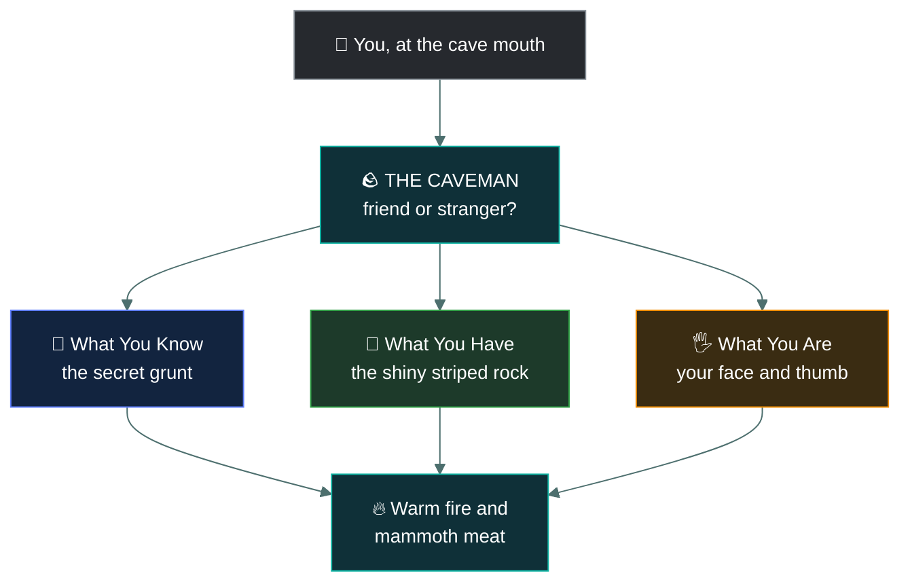
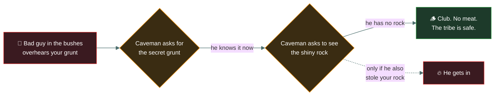
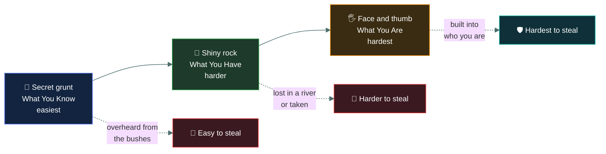

# 🔑 Authentication

### *How you prove you are who you say you are*

---

Imagine a big, safe cave. Inside this cave is a warm fire, the best mammoth meat, and dry furs to
sleep on. You want to go inside.

But there is a problem. A giant, angry **caveman** guard stands at the cave entrance holding a heavy
club.

The caveman's job is simple: Let tribe members in. Keep bad guys and hungry wolves out. When you
walk up to the cave, the caveman grunts and blocks your path. He needs to know if you are a friend
or a stranger.

**Authentication** is simply how you prove to the caveman that you are who you say you are. If you
prove it, you get mammoth meat. If you cannot prove it, the caveman hits you with the club.

Here is how you can prove to the caveman who you are, from the easiest way to the hardest way.

---

## 🤫 1 · The Secret Grunt (What You Know)

**Modern word:** *Passwords or PINs*

The tribe leader gathers everyone around the fire and whispers a secret phrase. The phrase is:
*"Sabertooth-Tiger-Belly-Rub-99."*

When you walk up to the cave, the caveman holds up his hand and says, "Secret grunt?" You whisper,
*"Sabertooth-Tiger-Belly-Rub-99."* The caveman nods and lets you in.

> [!CAUTION]
> **The danger:** If you yell the secret grunt too loudly, a bad guy hiding in the bushes might hear
> it. The caveman is not very smart. If the bad guy walks up to the caveman and says the secret
> grunt, the caveman will let the bad guy in to steal the mammoth meat. This is why you must keep
> your secret grunt hidden, and never use a simple grunt like *"Rock123."*

---

## 💎 2 · The Shiny Striped Rock (What You Have)

**Modern word:** *Security Tokens, Smartcards, or Two-Factor Authentication (2FA)*

The tribe realizes the secret grunt is not safe enough anymore. So, the tribe leader gives you a
special, shiny striped rock. Only you have this exact rock.

Now, when you walk to the cave, the rules are harder:

1. The caveman asks for the secret grunt. You say it.
2. The caveman holds out his hand and grunts, "Show rock." You show him your shiny striped rock.

Only after you do **both** things will the caveman let you in.

> [!TIP]
> **Why this is better:** If a bad guy hears your secret grunt, it does not matter. When he goes to
> the cave, the caveman will ask for the shiny rock. The bad guy does not have your rock, so the
> caveman hits him with the club. To trick the caveman, the bad guy would have to learn your secret
> grunt *and* steal your rock at the exact same time.

---

## 🖐️ 3 · Your Ug-Mug (What You Are)

**Modern word:** *Biometrics (Face ID, Fingerprint Scanner)*

You lost your shiny rock in a river, and you hit your head on a tree and forgot the secret grunt.
How do you get in?

The caveman looks closely at you. He grabs your hand and presses your thumb into a soft patch of
clay to look at your thumb-swirls. He looks at the big scar on your nose. He smells your unique
caveman smell.

The caveman thinks: *"Nobody else has this exact face, this exact thumb-swirl, and smells exactly
like this."* The caveman knows it is you. He lets you in.

> [!IMPORTANT]
> **Why this is the strongest:** A bad guy can steal your rock. A bad guy can guess your secret
> grunt. But a bad guy cannot easily steal your face or your thumb. It is built into who you are.

---

## 📋 The Summary

| Proving to the caveman | Modern Tech Word | How It Works |
| --- | --- | --- |
| **Secret Grunt** | Password | You remember a secret word in your head. |
| **Shiny Rock** | Token / 2FA | You carry a special object in your pocket. |
| **Your Face/Smell** | Biometrics | The guard checks your actual body parts. |

Authentication is just the caveman doing his job. It is the process of presenting your secret grunt,
your shiny rock, or your face to prove you belong by the warm fire.

---

<a href="../README.md">← Back to 01 · Security Principles</a>

