# 🔑 Authentication

### *Proving you are who you claim to be — and what actually counts as a second factor*

📌 *Sort any credential into know / have / are, and never fall for "two credentials = MFA".*

---

## 🧸 The big idea

At an airport, you **say** your name — anyone can do that. Then you **prove** it by showing a
passport. Security splits login into the same two beats:

1. **Identification** — you *claim* who you are (typing a username).
2. **Authentication** — you *prove* the claim (typing the password).

And there are only **three kinds of proof** in the whole world:

- something you **know** — a password in your head
- something you **have** — a phone, a card, a token in your pocket
- something you **are** — your fingerprint, your face

Everything on this page is about sorting proofs into those three boxes and counting the boxes.

---

## 📖 Words you will keep seeing

| Word | What it means on this exam |
|---|---|
| **Identification** | Claiming an identity. Unverified. A username, an account number, a badge presented. |
| **Authentication** | Proving the claimed identity with one or more factors. |
| **Factor** | A *category* of proof: knowledge (know), possession (have), inherence (are). |
| **Credential** | The actual thing presented — a password, a token code, a fingerprint. |
| **MFA** | Multi-factor authentication: credentials from **two or more different factors**. |
| **2FA** | MFA with exactly two different factors. |
| **Single-factor** | One factor — however many credentials of it. |
| **Biometrics** | Authentication by a measurable physical or behavioural characteristic. |
| **OTP** | One-time password. Valid once, or for a short time window. |
| **FAR** | False Acceptance Rate — how often an **impostor is let in**. |
| **FRR** | False Rejection Rate — how often a **real user is turned away**. |
| **CER** | Crossover Error Rate — where FAR = FRR. **Lower is better.** |

---

## 🔍 The explanation

### Claim first, then proof

| Factor | Examples | Strength | Weakness |
|---|---|---|---|
| 🧠 **Know** | Password, PIN, passphrase, security question | Cheap, everywhere | Can be guessed, shared, phished — and theft leaves no trace |
| 📱 **Have** | Hardware token, smart card, phone, authenticator app, certificate | Theft is noticeable — it goes missing | Can be lost, stolen or cloned |
| 👤 **Are** | Fingerprint, iris, face, voice, typing rhythm | Can't be forgotten or easily shared | **Can never be reissued** if compromised |

Two small details the exam likes:

- **The code is not the factor.** An OTP proves you hold the device that made it — the
  *device* is the "have".
- **A security question is "know"**, not a second kind of factor.

### Counting factors — the only MFA rule you need

**MFA needs two or more *different* categories.** More credentials of the same category is still
single-factor.

| Combination | Letters | MFA? |
|---|---|---|
| Password + PIN | K + K | ❌ single factor, twice |
| Password + security question | K + K | ❌ **the classic trap** |
| Password + SMS code | K + H | ✅ |
| Password + authenticator app | K + H | ✅ |
| Smart card + PIN | H + K | ✅ |
| Fingerprint + password | A + K | ✅ |
| Fingerprint + iris scan | A + A | ❌ two biometrics, one factor |
| Smart card + hardware token | H + H | ❌ |

### Biometric error rates

No biometric reader is perfect. It makes two kinds of mistake, and tuning it trades one for the
other:

- **FAR is the dangerous one** — a wrong person got in.
- **FRR is the annoying one** — a right person got turned away.
- **CER** is where the two rates are equal. It's how you compare systems: **lower CER = more
  accurate system.**

---

## ⚖️ Told apart

| | Means | Not to be confused with |
|---|---|---|
| **Identification** | Claiming an identity. Unverified. | **Authentication**, proving it. Username identifies; password authenticates. |
| **Authentication** | Proving who you are. | **Authorisation**, what you may do *after* you're proven. Authentication always comes first. |
| **Multi-factor** | Two or more **different** categories. | **Multiple credentials**, possibly all one category. Password + PIN is not MFA. |
| **FAR** | Impostor wrongly accepted. | **FRR**, real user wrongly rejected. FAR is the security failure. |
| **Token** | The device you possess. | **The code it shows**, which is just how the device proves possession. |

---

## ⚠️ Where your instinct is wrong

> [!WARNING]
> **In the job:** SMS codes are weak — SIM swapping and interception — and you'd move off them.
>
> **On the exam:** an SMS code is a valid **possession** factor, and password + SMS code **is**
> MFA. The exam tests the *category*, not the strength.

> [!WARNING]
> **In the job:** biometrics feel like the modern, convenient default.
>
> **On the exam:** the expected weakness of biometrics is that **they cannot be reissued after
> compromise** (plus privacy and error rates). A leaked password is changed in seconds; a leaked
> fingerprint is yours for life.

---

## 🧠 How to remember it

**Know · Have · Are** — in that order, which is also roughly weakest to strongest.

**For MFA: count letters, not credentials.** K + K is one factor. K + H is two.

**FAR = "Fraudster Admitted, Regrettably."** FRR is the other one.

---

## ✅ Check you actually got it

Answer all five before expanding anything.

**Q1.** A system requires users to enter a password and then answer a pre-registered security
question. What type of authentication is this?

- **A.** Two-factor authentication, because two separate credentials are required
- **B.** Single-factor authentication, because both credentials are something the user knows
- **C.** Multi-factor authentication, because the security question is something the user has
- **D.** Three-factor authentication, because the username is also a credential

<b>Answer</b>

**B — single-factor.** Both are knowledge factors. Two of them make it harder to attack, but not
multi-factor.

- **A** counts credentials instead of categories — exactly the error being tested.
- **C** — nothing is possessed; the answer lives in the user's memory.
- **D** — a username is **identification**, an unverified claim, not proof.

**Q2.** Which combination constitutes multi-factor authentication?

- **A.** A fingerprint scan and an iris scan
- **B.** A smart card and a hardware token
- **C.** A PIN and a one-time code from an authenticator app
- **D.** A password and a passphrase

<b>Answer</b>

**C — PIN (know) + authenticator app (have).** Two different categories.

- **A** — two "are" factors.
- **B** — two "have" factors.
- **D** — two "know" factors; a passphrase is just a long password.

**Q3.** A biometric system is retuned to be more permissive so that staff stop being locked
out. What is the effect?

- **A.** FAR decreases and FRR decreases
- **B.** FAR increases and FRR decreases
- **C.** FAR decreases and FRR increases
- **D.** Neither rate changes; only the CER changes

<b>Answer</b>

**B.** Looser means more attempts accepted: more real users get through (FRR down) and so do more
impostors (FAR up).

- **A** — retuning can't improve both at once; only a better sensor or algorithm can.
- **C** — that's the effect of making it *stricter*.
- **D** — CER is a property of the system's accuracy, not something the threshold moves on its
  own.

**Q4.** What is the PRIMARY security concern that distinguishes biometric authentication from
password-based authentication?

- **A.** Biometrics are more expensive to deploy
- **B.** Biometric characteristics cannot be changed if compromised
- **C.** Biometrics require specialised hardware at every access point
- **D.** Biometric systems are slower to authenticate users

<b>Answer</b>

**B.** A leaked fingerprint template is a permanent exposure; a leaked password is reset in
seconds.

- **A** is a cost concern, not a *security* one.
- **C** is an operational constraint.
- **D** is usually not even true.

**Q5.** A user presents a badge at a door, then enters a PIN on a keypad. How should this be
classified?

- **A.** Single-factor, because both actions occur at the same door
- **B.** Two-factor, combining something you have with something you know
- **C.** Two-factor, combining something you have with something you are
- **D.** Single-factor, because a badge is an identification method rather than authentication

<b>Answer</b>

**B — have (badge) + know (PIN).** One of the most common real-world MFA setups.

- **A** — where the factors are presented is irrelevant.
- **C** — a PIN is memorised, so it's knowledge.
- **D** — a badge carrying a credential is something you *possess*, and possession is what it
  proves at the door.

---

## 🎓 The grown-up version

<b>Extra depth — open this on a second read, never needed for the pass</b>

**Some frameworks add a fourth and fifth factor** — *somewhere you are* (location) and
*something you do* (behaviour such as typing cadence). They're used as risk signals in adaptive
authentication, but CC tests **three** factors. A fourth offered as "the number of factors" is a
distractor.

**How it works under the hood.** Passwords are stored as **slow, salted hashes** (bcrypt, Argon2,
PBKDF2) — never plain text. A **TOTP** code is `HMAC(shared secret, current 30-second window)`
computed independently by your app and the server, which is why a phone with the wrong clock
fails. **Passkeys (FIDO2/WebAuthn)** replace the shared secret with a key pair: the device signs a
challenge bound to the real site's address, so a phishing copy can't relay it.

**The recovery path is often the real weakness.** Attackers rarely beat the fingerprint reader —
they phone the help desk and get a password reset. An authentication system is only as strong as
its fallback.

---

## 📝 Cram lines

Destined for [`EXAM-DAY.md`](../../EXAM-DAY.md):

- **Know · Have · Are.** Identification = the claim (username); authentication = the proof.
- **MFA = two or more DIFFERENT categories.** Password + security question is NOT MFA.
- **SMS code IS a valid possession factor** on this exam.
- **FAR** = impostor accepted (security failure). **FRR** = real user rejected. **Lower CER = better.**
- **Biometrics' key weakness: they cannot be reissued.**

---

<a href="../README.md">← back to 01 · Security Principles</a> &nbsp;·&nbsp; <a href="../authorization-and-accounting/">next: Authorisation and accounting →</a>

