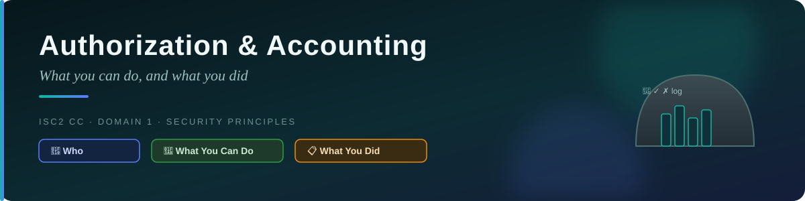
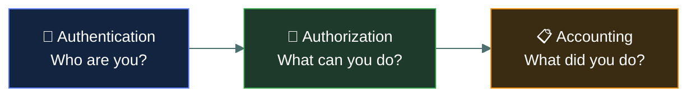
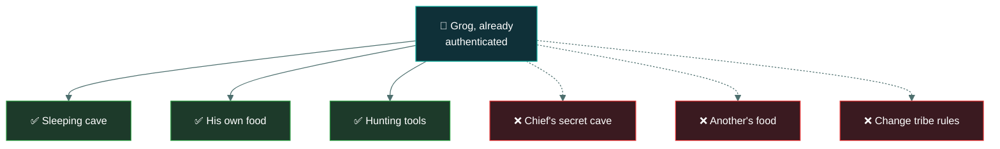
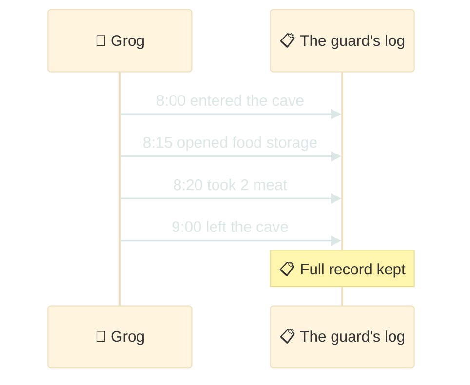
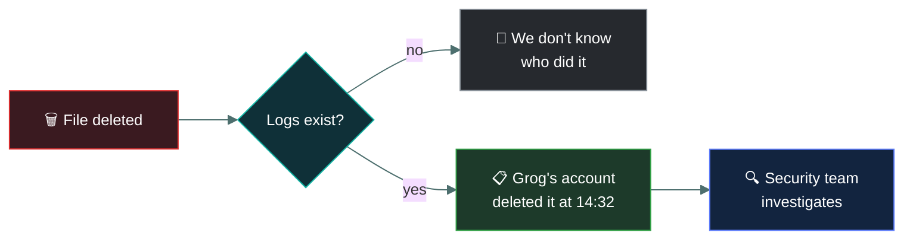
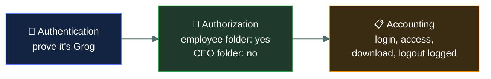

<div align="center">



# 🎫 Authorization and Accounting — Caveman Style

[](../README.md)
[](../README.md)

[](#-1-authorization)
[](#-2-accounting)
[](#-the-aaa-example)

</div>

---

Let's continue with Grog's cave. 🪨

You already learned:

- 🔐 **Authentication** = "Who are you?"
- 🎫 **Authorization** = "What are you allowed to do?"
- 📋 **Accounting** = "What did you do?"

These three are often grouped together as **AAA**:

> Authentication + Authorization + Accounting = **AAA**



---

## 🎫 1. Authorization

Imagine Grog finally proves that he is Grog.

The guard says:

> "Okay, I know who you are. But where are you allowed to go?"

Grog might be allowed to:

- Enter the sleeping cave ✅
- Get his own food ✅
- Use the hunting tools ✅

But maybe Grog is not allowed to:

- Enter the chief's secret cave ❌
- Take another tribe member's food ❌
- Change the tribe's rules ❌

That's authorization.



### 💻 In computers

Authorization determines:

> **What resources can this authenticated user access, and what actions can they perform?**

For example, at a company. Employee:

- View their own files ✅
- Edit their own documents ✅
- View the CEO's private files ❌
- Delete the company's database ❌

The employee has been authenticated, but their permissions determine what they can do.

### 🔐 Authentication vs 🎫 Authorization

This is one of the most important differences to remember.

Imagine a nightclub. 🕺

**Authentication** — The guard checks your ID. "Are you really Grog?" ✅ Authentication

**Authorization** — The guard checks your ticket. "Okay, you're Grog. But does your ticket allow
you into the VIP area?" 🎫 Authorization

> [!IMPORTANT]
> 🔐 **Authentication** = WHO are you?
> 🎫 **Authorization** = WHAT are you allowed to do?

---

## 📋 2. Accounting

Now let's say Grog is allowed into the cave.

The tribe's guard writes down everything Grog does:

> 🕐 8:00 — Grog entered the cave
> 🕐 8:15 — Grog opened the food storage
> 🕐 8:20 — Grog took 2 pieces of meat
> 🕐 9:00 — Grog left the cave

That's accounting.

Accounting means:

> **Recording and tracking what users do on a system.**

It's sometimes called auditing or logging.



### 💻 Computer example

Imagine you work for a company. You log into the company's computer system. The system can record:

```
User: Grog
Login: 08:00
IP: 192.168.1.25

File opened: salary.xlsx
Time: 08:15

File modified: salary.xlsx
Time: 08:20

Logout: 17:00
```

This information can help the company answer:

> "Who did what, and when?"

That's accounting.

### 🚨 Why is Accounting important?

Imagine someone deletes an important company file. The company asks:

> "Who deleted it?"

Without logs: 🤷 "We don't know."

With accounting/logging: 📋 "Grog's account deleted the file at 14:32."

Now security administrators can investigate.

Accounting can help with:

- 🔍 Investigating security incidents
- 🚨 Detecting suspicious activity
- 📊 Monitoring users
- 📝 Keeping audit records
- ⚖️ Providing evidence during investigations
- 💰 Tracking resource usage



---

## 🧑‍💻 The AAA example

Imagine you log into a company's server.

### Step 1 — Authentication 🔐

You enter your username and password. The server asks:

> "Are you really Grog?"

You prove your identity.

✅ Authentication successful.

### Step 2 — Authorization 🎫

The server checks your permissions.

> "Grog is an employee. He can access the employee folder."

You try to access the CEO folder.

❌ Access denied.

That's authorization.

### Step 3 — Accounting 📋

The server records:

```
Grog logged in at 09:01
Grog accessed employee-folder
Grog downloaded report.pdf
Grog logged out at 17:05
```

That's accounting.



---

## 🧠 The easiest way to remember AAA

Think about entering a VIP cave:

- 🔐 **Authentication** — "WHO ARE YOU?"
- 🎫 **Authorization** — "WHAT ARE YOU ALLOWED TO DO?"
- 📋 **Accounting** — "WHAT DID YOU DO?"

So:

> **AAA = Who are you? → What can you do? → What did you do?**

---

## 🎯 Exam-ready definitions

**Authentication:** The process of verifying the identity of a user, device, or system.

**Authorization:** The process of determining what an authenticated user is permitted to access or
do.

**Accounting:** The process of recording and monitoring a user's activities and resource usage.

---

## 🪨 Caveman memory trick

- 🔐 **Authentication:** "PROVE YOU ARE Grog."
- 🎫 **Authorization:** "Grog, YOU MAY ENTER THIS CAVE."
- 📋 **Accounting:** "Grog ENTERED AT 8:00 AND TOOK 2 MEAT."

---

<div align="center">
<sub><a href="../README.md">← Back to 01 · Security Principles</a></sub>
</div>
