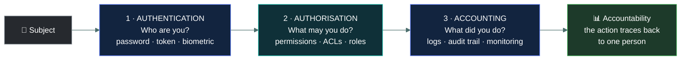
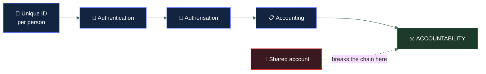
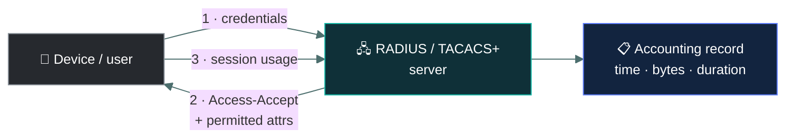

# 🎫 Authorisation and accounting

### *What you are allowed to do once you have proven who you are — and the record that you did it*

📌 *The other two thirds of AAA. The exam tests whether you can put a given control in the right one of the three stages.*

---

## 🧸 The big idea

Back to the cave guard from the last topic. He already proved the stranger's identity — the
whistle checked out, it really is Grog from the next valley. Two more questions remain before
Grog gets anywhere.

*"Fine, you're Grog — but which rooms of this cave are you allowed into? The berry store, sure.
The chief's sleeping area, absolutely not."* That's a decision about **what Grog may do**, made
only now, after his identity was already settled.

And every time Grog walks past, the guard scratches a mark on the cave wall — *Grog, berry
store, this morning.* Not to stop him. Just so that if berries go missing later, there's a
record of who was actually in there.

That's the whole topic. Access happens in three stages, always in the same order.

1. **Authentication** — *who are you?* You prove your identity. (The whistle, last topic.)
2. **Authorisation** — *what are you allowed to do?* The system checks your permissions. (Which
   rooms Grog can enter.)
3. **Accounting** — *what did you actually do?* The system records it. (The scratch marks on the
   wall.)

Together they are **AAA**, and the order is fixed. You cannot authorise someone whose identity
you have not established, and you cannot meaningfully account for actions you cannot attribute
to an identity.

The exam's favourite move is to describe one stage and offer all three as options. If you can
say which question a control answers — *who are you*, *what may you do*, or *what did you do* —
you have the answer.

---

## 📖 Words you will keep seeing

| Word | What it means on this exam |
|---|---|
| **Authorisation** | Granting or denying a proven identity the right to access a resource or perform an action. |
| **Accounting** | Recording what an authenticated identity actually did. Also called **auditing**. |
| **Accountability** | The ability to trace an action back to a specific individual and hold them responsible. |
| **Permission** | A specific right over a specific resource — read, write, execute, delete. |
| **Privilege** | A right to perform a system-level action, such as installing software or changing configuration. |
| **Audit trail** | The chronological record produced by accounting. |
| **Access control list (ACL)** | The list attached to a resource saying which subjects may do what to it. |
| **Principle of least privilege** | Granting only the access needed to perform a role, and nothing more. |
| **Subject** | The active party requesting access — a user, a process, a device. |
| **Object** | The passive thing being accessed — a file, a database, a room. |

---

## 🔍 The three stages

Read it as a sentence: **prove who you are, get told what you may do, and have what you did
written down.**

### 🎫 Authorisation

This is the guard deciding which rooms of the cave Grog can walk into. Authorisation happens
**after** authentication and decides what a proven identity may do.

Two people can authenticate equally successfully and be authorised completely differently — a
clerk and a finance director both log in, and the system permits them different things. That
separation is the point.

**Where authorisation lives:** permissions on files, access control lists, role assignments,
group membership, database grants, firewall rules.

> ⚠️ **Authenticating successfully does not entitle you to anything.** A valid login to a system
> where you have no permissions gets you nowhere. The exam sometimes describes a user who "logged
> in successfully but could not open the file" — that is authorisation working correctly, not an
> authentication failure.

**Least privilege** governs how authorisation should be granted: only what the role requires,
and nothing beyond it. Most real-world over-permissioning comes from access accumulating as
people change jobs and nobody removes the old rights — **privilege creep**.

### 📋 Accounting

This is the scratch marks on the cave wall. Accounting records what was done: who, what, when,
and to which object.

It is a **detective** control. It prevents nothing. Its value is that it makes actions
attributable after the fact, which supports investigation, supports discipline, and — because
people behave differently when they know they are logged — has a real deterrent effect.

**What accounting produces:** audit trails, system and application logs, access records, session
records, change histories.

**Accounting depends on everything above it.** If several people share one account, the logs
show the account, not the person, and attribution is gone. That is why shared accounts are
treated so harshly on this exam: they destroy accountability at the source.

---

## 🔗 Accountability is the outcome, not a stage

This distinction is worth holding clearly.

- **Accounting** is the *activity* — recording what happened.
- **Accountability** is the *property that results* — an action can be traced to a specific
  individual who can be held responsible.

Accountability requires the whole chain to work: unique identification, successful
authentication, correct authorisation, and reliable accounting. Break any link — a shared
account, an unlogged system, a generic "admin" login — and accountability is lost even though
the other stages ran fine.

---

## 🔬 How this actually works under the hood

**AAA started as a real network protocol, not just an exam acronym.** RADIUS and TACACS+ are
still what actually runs when a VPN gateway or Wi-Fi controller checks a login: the device asks
a central RADIUS server to authenticate the credential, the server replies with an Access-Accept
that carries authorisation attributes (which VLAN, what session timeout), and the device reports
usage back for accounting — traditionally billed by the minute, which is the actual historical
reason the third A is "accounting" and not "auditing."

**Authorisation is enforced differently depending on where you are.** On Linux, every file
carries **permission bits** — read/write/execute for owner, group, and everyone else — checked
by the kernel on every single file access; a POSIX **ACL** extends that to named individual
users beyond the three basic categories. On Windows, an NTFS file carries a **DACL** — a list
of **ACEs** (Access Control Entries), each one an allow-or-deny rule tied to a specific user or
group SID, evaluated top to bottom until a match is found. In a web application, authorisation
usually travels as a **JWT** — a signed token containing claims like `role: finance-clerk` that
the server checks on every request without needing to re-query a database each time.

**Accounting has to survive the very people it watches.** A log an administrator can quietly
edit isn't actually evidence of anything. Real audit systems ship logs to storage the writer
can't modify — **WORM** (write-once, read-many) storage, or a **hash chain** where each log
entry includes the hash of the one before it, so altering an old entry breaks every hash after
it and the tampering becomes mathematically obvious.

---

## ⚖️ Told apart

| | Answers | Not to be confused with |
|---|---|---|
| **Identification** | "Who do you claim to be?" | **Authentication** — the proof of that claim. |
| **Authentication** | "Can you prove it?" | **Authorisation** — what you may do once proven. Authentication always comes first. |
| **Authorisation** | "What are you allowed to do?" | **Authentication.** Successfully logging in and being denied a file is authorisation working, not an authentication failure. |
| **Accounting** | "What did you do?" | **Accountability** — the *result*, being able to hold a named person responsible. |
| **Permission** | A right over a specific resource — read this file. | **Privilege** — a system-level right, such as installing software. |
| **Least privilege** | Grant only what the role needs. | **Need to know**, which restricts access to specific *information* required for a task. Related, narrower, often paired. |
| **Privilege creep** | Rights accumulating as someone changes roles. | **Privilege escalation**, which is an attacker gaining rights they were never granted. |

> [!IMPORTANT]
> **Privilege creep versus privilege escalation** is a reliable exam pair. Creep is an
> administrative failure that happens slowly and legitimately, one job change at a time.
> Escalation is an attack.

---

## ⚠️ Where your instinct is wrong

> [!WARNING]
> **In the job:** logging is plumbing — you configure it and move on to detection content.
>
> **On the exam:** accounting is one third of the model and carries real weight. It is the
> **detective** leg of AAA, the foundation of accountability, and the answer to any question
> about proving what a user did.

> [!WARNING]
> **In the job:** a shared service account with a vaulted password is a normal, well-managed
> thing.
>
> **On the exam:** shared accounts are close to always wrong, because they destroy the ability to
> attribute actions to an individual. If an option recommends individual accounts over a shared
> one, it is very likely correct.

> [!WARNING]
> **In the job:** you would say authorisation decisions are increasingly continuous and
> re-evaluated per request.
>
> **On the exam:** AAA is a clean three-step sequence. Authenticate, then authorise, then account.
> Answer in that model.

---

## 🧠 How to remember it

🧠 **Who? · What may? · What did?**

- Authentication — **who** are you
- Authorisation — **what may** you do
- Accounting — **what did** you do

For any control in a question, ask which of those three it answers.

🧠 **AAA is alphabetical in its own order:** Authentication → Authorisation → Accounting. "Authen"
before "Author" before "Account" — and that is the sequence.

---

## ✅ Check you actually got it

Answer all five before expanding anything.

**Q1.** A user successfully signs in to a file server but receives "access denied" when opening a
folder. Which process denied the request?

- **A.** Authentication, because the credentials were insufficient
- **B.** Authorisation, because the user lacks permission to that folder
- **C.** Accounting, because the attempt was logged and blocked
- **D.** Identification, because the user's identity was not established

<b>Answer</b>

**B — authorisation.** The sign-in succeeded, which means authentication already passed. What
failed is the check on what this proven identity may do.

- **A** is contradicted by the stem — the user *successfully signed in*, so authentication worked.
- **C** misunderstands accounting. Accounting records what happened; it has no power to block
  anything. It is detective, not preventive.
- **D** is wrong for the same reason as A: identification and authentication both completed at
  sign-in.

**Q2.** Five administrators share a single `admin` account. Which security property is MOST
directly undermined?

- **A.** Confidentiality
- **B.** Authentication
- **C.** Accountability
- **D.** Availability

<b>Answer</b>

**C — accountability.** The logs record the account, not the person, so no action can be traced
to a named individual. Everything downstream of that — investigation, discipline, deterrence —
fails with it.

- **A** is affected indirectly, in that more people hold a powerful credential, but the direct and
  complete loss is attribution.
- **B** is not undermined: the account still authenticates correctly every time. That is precisely
  the problem — authentication succeeds while telling you nothing about who is behind it.
- **D** is unaffected; the systems remain fully accessible.

**Q3.** An employee moves from finance to marketing. Their finance system access is never removed,
so they now hold rights in both. What is this called?

- **A.** Privilege escalation
- **B.** Privilege creep
- **C.** Separation of duties failure
- **D.** Unauthorised access

<b>Answer</b>

**B — privilege creep.** Access accumulated across role changes because deprovisioning did not
happen. Every grant was legitimate when made; the failure is that none were revoked.

- **A** is an attack, in which someone obtains rights that were never granted to them. Here every
  right was granted deliberately.
- **C** names a related consequence — the employee may now hold a conflicting combination of
  rights — but the term for the accumulation itself is privilege creep.
- **D** is wrong because the access was formally authorised. It is unnecessary, not unauthorised,
  and that distinction is the point of the question.

**Q4.** Which control PRIMARILY supports accounting?

- **A.** Requiring multi-factor authentication at login
- **B.** Assigning permissions through role-based groups
- **C.** Enabling detailed audit logging of file access
- **D.** Encrypting data at rest on the file server

<b>Answer</b>

**C — enabling detailed audit logging.** Recording what identities actually did is exactly what
accounting is.

- **A** is authentication — establishing who the user is.
- **B** is authorisation — deciding what the proven identity may do.
- **D** is a confidentiality control and sits outside AAA entirely.

**Q5.** Which statement about AAA is correct?

- **A.** Authorisation may precede authentication where a resource is public
- **B.** Accounting can substitute for authorisation in low-risk systems
- **C.** Accountability requires unique identification for each individual
- **D.** Authentication and authorisation are two names for the same process

<b>Answer</b>

**C — accountability requires unique identification for each individual.** Without a distinct
identity per person, log entries cannot be tied to anyone, and the whole chain collapses at the
final step.

- **A** inverts the fixed order. If a resource is genuinely public, no authorisation decision about
  a *specific identity* is being made at all.
- **B** confuses a detective control with a preventive one. Recording that someone did something
  they should not have done is not a substitute for stopping them.
- **D** conflates proving identity with granting access. They are separate stages, and the
  distinction is most of what this topic tests.

---

## 🎓 The grown-up version

<b>Extra depth — open this on a second read, never needed for the pass</b>

**Where AAA comes from.** The term is inherited from network access protocols — RADIUS, TACACS+,
Diameter — where a network device asks a central server to authenticate a user, authorise a level
of access, and account for session usage, historically for billing. That billing heritage is why
the third A is "accounting" rather than "auditing": it originally counted minutes and bytes. The
security meaning grew out of the operational one.

**Why "accounting" and "auditing" get used interchangeably.** Some material says AAA is
Authentication, Authorisation and Auditing. Treat them as the same third A. If both appear as
options in one question, read the rest of the option text rather than the label to decide.

**Authorisation models sit on top of this.** *How* the authorisation decision gets made — an ACL
on the object, a role the subject holds, an attribute-based policy evaluated at request time — is
a separate subject, and it is Domain 3 material. AAA describes the sequence; the access control
models describe the logic inside step two.

**Service accounts, honestly.** The exam's position that shared accounts are bad is correct about
human users, and the real world complicates it for machine identities. A service account used by
an application is shared in the sense that several administrators may be able to invoke it, and
the mature answer is not "give each admin their own service account" but to remove standing human
access to it entirely: credentials in a vault, checked out with individual authentication, every
checkout logged. Accountability is preserved at the *checkout* rather than at the login. That
nuance is right in practice and out of scope on the paper — where shared account still means loss
of accountability, full stop.

**Continuous authorisation.** Zero trust architectures re-evaluate authorisation on every request
rather than granting it once at session start, incorporating signals such as device posture,
location and behaviour. This makes AAA less of a three-step pipeline and more of a loop. CC
touches zero trust in Domain 4 but still teaches the sequential model here, and the sequential
model is what to answer with.

---

## 📝 Cram lines

Destined for [`EXAM-DAY.md`](../../EXAM-DAY.md):

- **AAA = Authentication → Authorisation → Accounting.** Order is fixed.
- **Who? · What may? · What did?**
- **Logged in but denied the file = authorisation**, not an authentication failure.
- **Accounting is DETECTIVE.** It records; it never blocks.
- **Accountability = the outcome.** Needs unique IDs + authentication + logging.
- **Shared accounts destroy accountability.** Almost always the wrong answer.
- **Privilege creep** = rights accumulating over role changes (admin failure). **Privilege escalation** = an attack.
- **Least privilege** = only what the role needs. **Need to know** = only the information required for the task.

---

<a href="../README.md">← back to 01 · Security Principles</a> &nbsp;·&nbsp; <a href="../non-repudiation/">next: Non-repudiation →</a>

