# 🎫 Authorisation and Accounting

### *What you are allowed to do once you're proven — and the record that you did it*

📌 *Put any control into the right one of the three AAA stages, and know why shared accounts are almost always wrong.*

---

## 🧸 The big idea

Think of checking into a hotel:

1. The front desk checks your passport — **who are you?** That's **authentication**.
2. Your key card opens **your** room and the gym, but not other guests' rooms or the manager's
   office — **what may you do?** That's **authorisation**.
3. Every door lock quietly records *which card opened it, and when* — **what did you do?** That's
   **accounting**.

Together they're **AAA**, and they always happen in that order. The exam's favourite move is to
describe one control and offer all three stages as answers. Ask which question the control
answers — *who*, *what may*, or *what did* — and you have it.

---

## 📖 Words you will keep seeing

| Word | What it means on this exam |
|---|---|
| **Authorisation** | Granting or denying a **proven** identity the right to access a resource or perform an action. |
| **Accounting** | Recording what an authenticated identity actually did. Also called **auditing**. |
| **Accountability** | Being able to trace an action to **one specific person** and hold them responsible. |
| **Permission** | A right over a specific resource — read, write, execute, delete. |
| **Privilege** | A system-level right — install software, change configuration. |
| **Audit trail** | The chronological record that accounting produces. |
| **ACL** | Access control list — attached to a resource, saying who may do what to it. |
| **Least privilege** | Grant only the access a role needs, and nothing more. |
| **Subject / Object** | The **subject** asks for access (user, process). The **object** is what's accessed (file, room). |

---

## 🔍 The explanation

### Three stages, fixed order

You can't authorise someone whose identity isn't proven, and you can't meaningfully record
actions you can't pin to an identity. So the order never changes.

### 🎫 Authorisation — what may you do?

Authorisation happens **after** a successful login. Two people can both log in perfectly and be
allowed completely different things — a clerk and a finance director use the same login page but
see different systems.

**Where it lives:** file permissions, ACLs, role and group membership, database grants, firewall
rules.

> [!NOTE]
> **"Logged in successfully but got 'access denied'"** is authorisation working correctly — not
> an authentication failure. The exam uses this exact scenario.

### 📋 Accounting — what did you do?

Accounting writes down **who did what, to what, and when**: logs, audit trails, session records,
change histories.

- It's a **detective** control. It **prevents nothing** — it records.
- It still deters: people behave differently when they know they're logged.

### Accountability — the result, not a stage

**Accounting** is the *activity* (recording). **Accountability** is the *outcome* (a named person
can be held responsible). It needs the whole chain to work — and one shared account breaks it:

The shared account still logs in fine every time. That's the problem — authentication succeeds
while telling you nothing about **who** is behind it.

### Creep vs escalation

Two terms that sound alike and mean very different things:

---

## ⚖️ Told apart

| | Answers | Not to be confused with |
|---|---|---|
| **Authentication** | "Can you prove who you are?" | **Authorisation** — what you may do once proven. |
| **Authorisation** | "What are you allowed to do?" | **Authentication.** Logged in + denied the file = authorisation. |
| **Accounting** | "What did you do?" | **Accountability** — the *result*: a named person is responsible. |
| **Permission** | A right over one resource. | **Privilege** — a system-level right. |
| **Least privilege** | Only the **access** the role needs. | **Need to know** — only the **information** the task needs. Narrower, often paired. |
| **Privilege creep** | Legitimate rights piling up over job changes. | **Privilege escalation** — an attacker gaining rights never granted. |

---

## ⚠️ Where your instinct is wrong

> [!WARNING]
> **In the job:** logging is plumbing — you switch it on and move to detection content.
>
> **On the exam:** accounting is one third of the model. It's the **detective** leg of AAA and
> the answer to any question about *proving what a user did*.

> [!WARNING]
> **In the job:** a well-vaulted shared service account is normal.
>
> **On the exam:** shared accounts are almost always wrong, because they destroy
> **accountability**. An option recommending individual accounts is very likely correct.

---

## 🧠 How to remember it

**Who? · What may? · What did?** — Authentication · Authorisation · Accounting.

**The order is alphabetical:** Au**then** → Au**thor** → **Acc**ount.

---

## ✅ Check you actually got it

Answer all five before expanding anything.

**Q1.** A user successfully signs in to a file server but receives "access denied" when opening a
folder. Which process denied the request?

- **A.** Authentication, because the credentials were insufficient
- **B.** Authorisation, because the user lacks permission to that folder
- **C.** Accounting, because the attempt was logged and blocked
- **D.** Identification, because the user's identity was not established

<b>Answer</b>

**B — authorisation.** The sign-in worked, so authentication already passed. What failed is the
check on what this proven identity may do.

- **A** — the stem says the user *successfully signed in*.
- **C** — accounting records; it can't block anything.
- **D** — identification completed at sign-in, like authentication.

**Q2.** Five administrators share a single `admin` account. Which security property is MOST
directly undermined?

- **A.** Confidentiality
- **B.** Authentication
- **C.** Accountability
- **D.** Availability

<b>Answer</b>

**C — accountability.** Logs show the account, not the person, so no action traces to a named
individual.

- **A** — affected only indirectly.
- **B** — the account authenticates correctly every time; that's exactly the problem.
- **D** — systems stay fully accessible.

**Q3.** An employee moves from finance to marketing. Their finance access is never removed, so
they now hold rights in both. What is this called?

- **A.** Privilege escalation
- **B.** Privilege creep
- **C.** Separation of duties failure
- **D.** Unauthorised access

<b>Answer</b>

**B — privilege creep.** Every grant was legitimate; none were revoked.

- **A** is an attack — gaining rights never granted.
- **C** names a possible *consequence*, not the accumulation itself.
- **D** — the access was formally authorised. It's unnecessary, not unauthorised.

**Q4.** Which control PRIMARILY supports accounting?

- **A.** Requiring multi-factor authentication at login
- **B.** Assigning permissions through role-based groups
- **C.** Enabling detailed audit logging of file access
- **D.** Encrypting data at rest on the file server

<b>Answer</b>

**C — audit logging.** Recording what identities did *is* accounting.

- **A** is authentication.
- **B** is authorisation.
- **D** is a confidentiality control, outside AAA.

**Q5.** Which statement about AAA is correct?

- **A.** Authorisation may precede authentication where a resource is public
- **B.** Accounting can substitute for authorisation in low-risk systems
- **C.** Accountability requires unique identification for each individual
- **D.** Authentication and authorisation are two names for the same process

<b>Answer</b>

**C.** Without a distinct identity per person, log entries can't be tied to anyone.

- **A** inverts the fixed order.
- **B** — recording a bad action is not a substitute for stopping it.
- **D** — proving identity and granting access are separate stages.

---

## 🎓 The grown-up version

<b>Extra depth — open this on a second read, never needed for the pass</b>

**AAA started as real network protocols.** RADIUS and TACACS+ still run when a VPN or Wi-Fi
controller checks a login: the server authenticates the credential, replies with authorisation
attributes (which VLAN, what timeout), and receives usage records back. Those records were
originally for **billing** by the minute — which is why the third A is "accounting", not
"auditing". Some material says "auditing"; treat them as the same thing.

**Authorisation looks different everywhere.** Linux permission bits (owner/group/other), Windows
NTFS DACLs made of allow/deny entries, web apps passing a signed JWT carrying `role: clerk` — all
are step two of AAA.

**Logs must survive the people they watch.** A log an admin can quietly edit isn't evidence.
Real systems ship logs to write-once (WORM) storage, or hash-chain the entries so altering one
breaks every hash after it.

**Service accounts, honestly.** The mature real-world answer isn't "no shared service accounts"
but "no standing human access to them": credentials in a vault, checked out with individual
login, every checkout logged — accountability preserved at the checkout. On the exam, shared
still means lost accountability.

---

## 📝 Cram lines

Destined for [`EXAM-DAY.md`](../../EXAM-DAY.md):

- **AAA = Authentication → Authorisation → Accounting.** Who? · What may? · What did?
- **Logged in but denied the file = authorisation.**
- **Accounting is DETECTIVE** — it records, never blocks. **Accountability** is the outcome.
- **Shared accounts destroy accountability.** Almost always the wrong answer.
- **Privilege creep** = admin failure. **Privilege escalation** = an attack.

---

<a href="../README.md">← back to 01 · Security Principles</a> &nbsp;·&nbsp; <a href="../non-repudiation/">next: Non-repudiation →</a>

