# 🔺 The CIA Triad

### *The three things security protects — and the one question that tells them apart*

📌 *Name the three properties, and from any scenario pick the one that was PRIMARILY broken.*

---

## 🧸 The big idea

Think about your phone. Three different things can go wrong with the photos on it:

- A stranger **sees** them → that is a **confidentiality** problem.
- Someone **edits** them without asking → that is an **integrity** problem.
- The phone dies and **you can't get to them** → that is an **availability** problem.

That is the whole triad. Every security control exists to protect one or more of these three.
Every attack breaks one or more of them. On the exam, your job is almost always the same: **read
the scenario and name which one went wrong.**

---

## 📖 Words you will keep seeing

| Word | What it means on this exam |
|---|---|
| **Confidentiality** | Information is disclosed only to people, processes and devices that are **authorised** to see it. |
| **Integrity** | Information is **accurate and complete**, and is changed only in authorised ways — and any unauthorised change can be **detected**. |
| **Availability** | Authorised users get **timely and reliable** access to information and systems when they need it. |
| **Sensitivity** | How much harm **disclosure** would cause. High sensitivity → protect confidentiality. |
| **Criticality** | How much the organisation **depends** on the information. High criticality → protect availability. |
| **DAD** | Disclosure, Alteration, Destruction — the three *failures*, one for each letter of CIA. |

---

## 🔍 The explanation

### One question per letter

| | Ask | Protected by (examples) |
|---|---|---|
| 🔒 **Confidentiality** | *Who can **see** it?* | Encryption, access control, authentication, data classification |
| ✏️ **Integrity** | *Who can **change** it — and would I notice?* | Hashing, digital signatures, change control, audit logs, file-integrity monitoring |
| 🟢 **Availability** | *Can I **reach** it when I need it?* | Backups, redundancy, failover, UPS/generators, DDoS protection |

### How to answer a CIA scenario question

Ignore everything interesting in the story and ask **what actually happened to the
information**:

Two details the exam leans on:

- **Intent doesn't matter.** An email sent to the wrong person by accident is still a
  confidentiality failure. A disk that silently corrupts records is still an integrity failure. CIA
  describes what happened *to the data*, not whether an attacker was involved.
- **"Timely" is part of availability.** If legitimate users are locked out or the system is too
  slow to use, availability has failed even though nothing was lost.

### The ransomware trap

This is the single most-missed CIA question. Split the attack into its two acts:

Encrypted files still exist and their content is not altered — they are simply **unusable**. So
unless the question says data was stolen or leaked, ransomware = **availability**.

### The three pull against each other

You cannot max out all three at once. Tighten one and you usually loosen another:

The balance is a **business decision** — security advises, management decides.

---

## ⚖️ Told apart

This table is the reason to read the page. Every row is a distractor pattern.

| Scenario | Property broken | Why not the others |
|---|---|---|
| An unauthorised user **reads** a payroll file | **Confidentiality** | Nothing changed; nobody lost access. |
| An unauthorised user **edits** a payroll figure | **Integrity** | The harm is the unauthorised change. |
| An unauthorised user **deletes** the payroll file | **Availability** | Authorised users can no longer reach it — pick the *primary* impact. |
| Ransomware **encrypts** production data | **Availability** | Data still exists, content unchanged, but unusable. |
| Ransomware gang **publishes** the stolen data | **Confidentiality** | Now it is disclosure — a separate failure. |
| A DDoS attack floods a web server | **Availability** | Nothing seen or changed; access denied. |
| A laptop with unencrypted data is stolen | **Confidentiality** | Potential disclosure. |
| A failing disk corrupts records | **Integrity** | No attacker needed — accuracy lost. |
| An email goes to the wrong recipient | **Confidentiality** | Accidental disclosure is still disclosure. |
| Staff are locked out by an aggressive password policy | **Availability** | Authorised users can't get timely access. |

| Also not to be confused with | Why |
|---|---|
| **Non-repudiation** | Proves *who did something* and stops them denying it. It is **not** one of the three. If it appears as an option on a "which CIA property" question, it's the distractor. |
| **Privacy** | Confidentiality protects the data. Privacy governs **what you are permitted to do** with personal data. |

---

## ⚠️ Where your instinct is wrong

> [!WARNING]
> **In the job:** ransomware is obviously a breach too — modern gangs steal data before they
> encrypt it.
>
> **On the exam:** unless the question explicitly says data was stolen or leaked, encryption for
> ransom is **availability**. Answer the scenario you were given, not the one you have worked.

> [!WARNING]
> **In the job:** you'd argue a deleted file hits both integrity and availability.
>
> **On the exam:** pick the **primary** impact. Deleted or unreachable = availability. Content
> changed = integrity. Don't reason your way into the more interesting answer.

---

## 🧠 How to remember it

**See · Change · Reach**

- **C**onfidentiality — who can **see** it
- **I**ntegrity — who can **change** it
- **A**vailability — can I **reach** it

For any scenario, ask which verb went wrong.

**CIA ↔ DAD** — **D**isclosure breaks **C**, **A**lteration breaks **I**, **D**estruction breaks
**A**. Same order both ways.

---

## ✅ Check you actually got it

Answer all five before expanding anything.

**Q1.** A ransomware attack encrypts all files on a production file server. The attacker makes
no copy of the data. Which element of the CIA triad is PRIMARILY affected?

- **A.** Confidentiality
- **B.** Integrity
- **C.** Availability
- **D.** Non-repudiation

<b>Answer</b>

**C — Availability.** The data still exists and its substance is unchanged, but authorised
users cannot access it.

- **A** needs disclosure — the question says no copy was taken.
- **B** is the tempting one because the files visibly changed on disk, but the information
  inside them is the same. What was taken away is access.
- **D** is not part of the triad at all.

**Q2.** An employee emails a spreadsheet of customer records to the wrong external recipient.
Which principle has been violated?

- **A.** Integrity, because the data left the organisation's control
- **B.** Confidentiality, because the data was disclosed to an unauthorised party
- **C.** Availability, because the organisation no longer controls the copy
- **D.** No principle was violated, because the disclosure was accidental

<b>Answer</b>

**B — Confidentiality.** Someone not authorised to see the data received it.

- **A** — nothing was modified. Leaving your control is not the same as being altered.
- **C** — the organisation still has its own copy and can still use it.
- **D** — **intent is irrelevant.** Accidental disclosure is still disclosure.

**Q3.** A hospital locks accounts after three failed logins, with a 24-hour reset delay.
Clinical staff are repeatedly locked out during shifts. What has happened?

- **A.** Confidentiality has been strengthened with no drawback
- **B.** Integrity has been compromised by the lockout mechanism
- **C.** A confidentiality control has created an availability problem
- **D.** Non-repudiation has been weakened

<b>Answer</b>

**C.** Authorised staff can't get timely access — the triad in tension.

- **A** — the stem describes a clear drawback. "No drawback" is an absolute worth distrusting.
- **B** — no information was changed.
- **D** — attribution of actions is not what the scenario describes.

**Q4.** Which control PRIMARILY supports integrity?

- **A.** Full-disk encryption on laptops
- **B.** Hashing files and comparing the values over time
- **C.** Clustering application servers across two data centres
- **D.** Requiring multi-factor authentication for remote access

<b>Answer</b>

**B — hashing.** It makes unauthorised change **detectable**, which is half the definition of
integrity.

- **A** protects a lost laptop's data from being read — confidentiality.
- **C** keeps the service running if a site fails — availability.
- **D** keeps unauthorised people out — mainly confidentiality.

**Q5.** A failing storage array silently corrupts several thousand customer records. No
attacker was involved. Which principle is affected?

- **A.** None — CIA applies only to deliberate attacks
- **B.** Availability, because the records can no longer be trusted
- **C.** Integrity, because the accuracy and completeness of the data has been lost
- **D.** Confidentiality, because corrupted records may expose other data

<b>Answer</b>

**C — Integrity.** Accidental corruption breaks integrity exactly as malicious editing does.

- **A** is the misconception being tested — CIA describes properties of information, not types
  of attack.
- **B** — the records are still reachable; they are reachable *and wrong*.
- **D** invents a disclosure the scenario doesn't describe.

---

## 🎓 The grown-up version

<b>Extra depth — open this on a second read, never needed for the pass</b>

**The Parkerian hexad.** Some writers say CIA is incomplete and add three more properties:
possession/control, authenticity and utility. A stolen but strongly encrypted backup tape is the
classic example — confidentiality arguably holds, but you have still lost *control* of it. The
hexad is **not** on the CC syllabus; offering it as an answer would be wrong.

**Integrity means something narrower to database people** — referential integrity, ACID
transactions. On this exam, "integrity" is the security property unless the question is clearly
about database constraints.

**Availability is the property operations teams measure** — uptime, SLAs, error budgets. Recovery
targets such as RTO, RPO and MTD are all availability metrics under different names.

---

## 📝 Cram lines

Destined for [`EXAM-DAY.md`](../../EXAM-DAY.md):

- **See · Change · Reach** — Confidentiality, Integrity, Availability. **DAD** mirrors it.
- **Ransomware encryption = AVAILABILITY.** A ransomware *leak* = confidentiality.
- **Accidental disclosure is still a confidentiality failure.** Intent is irrelevant.
- **Integrity covers accidental corruption** and means change is *detectable*.
- **Non-repudiation is NOT part of the triad.**

---

<a href="../README.md">← back to 01 · Security Principles</a> &nbsp;·&nbsp; <a href="../authentication/">next: Authentication →</a>

