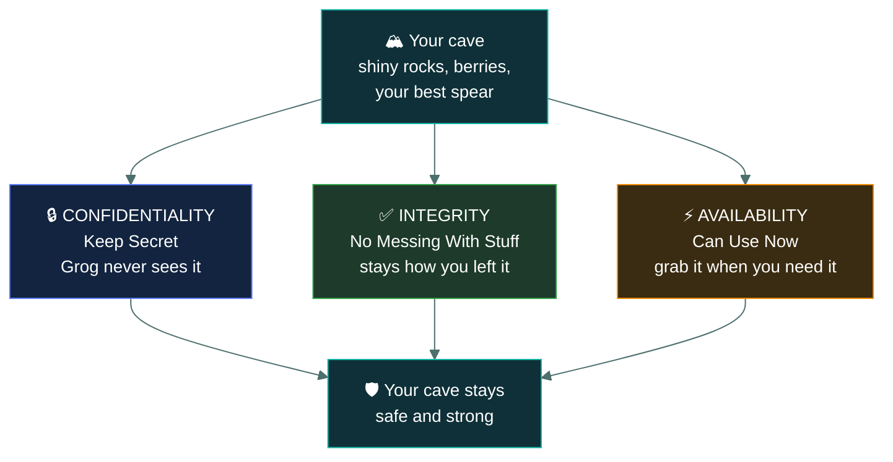
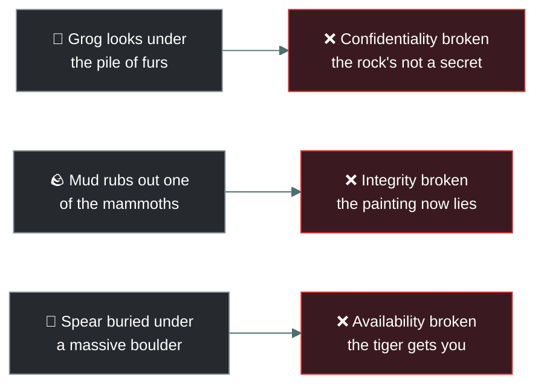
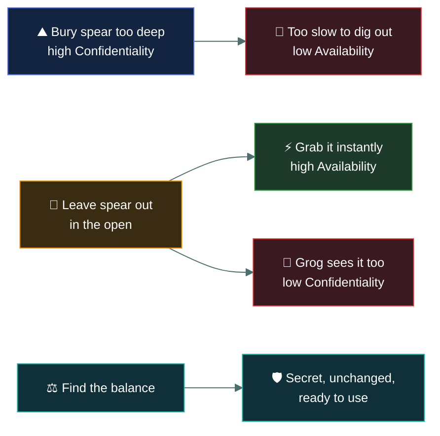

# 🔺 The C.I.A. Triad

### *The Three Big Rules of the Secret Cave*

---

Listen closely. You have a cave. Inside, you have shiny rocks, good berries, and a very nice spear.
You want to keep them safe from other tribes and saber-tooth tigers.

To keep your cave safe, you must follow three big rules. The wise shamans of information security
call this the CIA Triad.

Here is how it works:

---

## 🔒 C · Confidentiality (Keep Secret)

**What it means:** Only the right cavemen are allowed to see your things.

> [!NOTE]
> **Caveman Example:** You find a really shiny rock and hide it under a pile of furs. If Grog from
> the river tribe sneaks in and looks at your rock, your secret is broken! Confidentiality means
> making sure Grog never sees the rock.

---

## ✅ I · Integrity (No Messing With Stuff)

**What it means:** Your things stay exactly how you left them. Nobody changes or breaks them.

> [!TIP]
> **Caveman Example:** You paint four mammoths on the cave wall to remember how many you saw on
> the hunt. While you sleep, Grog sneaks in and rubs mud over one mammoth so it looks like three.
> The painting is wrong now! Integrity means making sure nobody messes with your mammoth painting.
> It must stay true.

---

## ⚡ A · Availability (Can Use Now)

**What it means:** When you need your things, you can get them right away.

> [!WARNING]
> **Caveman Example:** A saber-tooth tiger is attacking! You run to grab your best spear. But
> wait... you buried it under a massive boulder so Grog couldn't find it. Now it takes you ten
> minutes to dig it out, and the tiger eats you. Availability means your spear is ready to grab
> exactly when you need it.

---

## 💥 Each rule breaks a different way

---

## ⚖️ The Big Tribe Balance

The hardest part of protecting the cave is balancing the three rules. If you bury your spear too
deep (too much Confidentiality), you can't use it fast (low Availability). Good security means
finding the perfect balance so your stuff is secret, unchanged, and ready to use!

---

<a href="../README.md">← Back to 01 · Security Principles</a>

