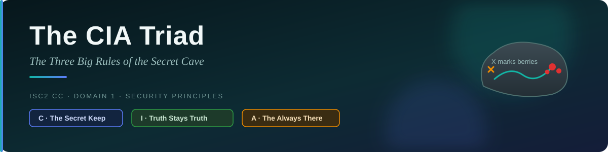
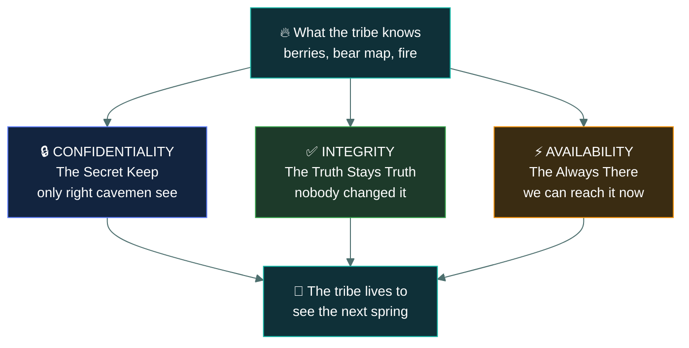
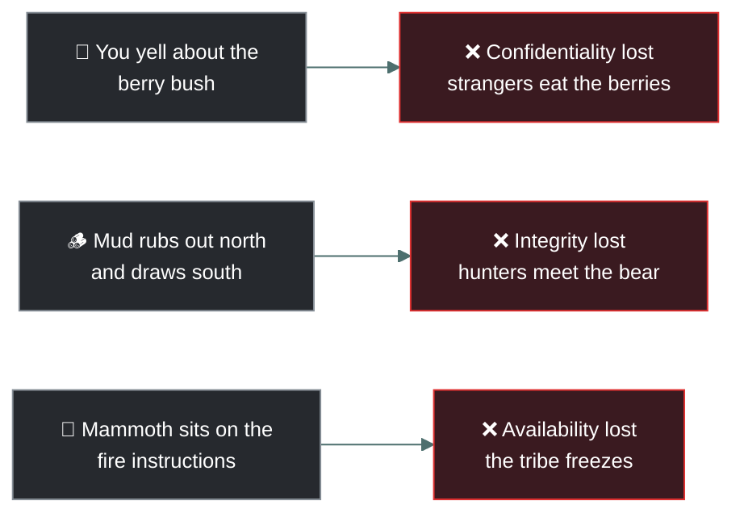
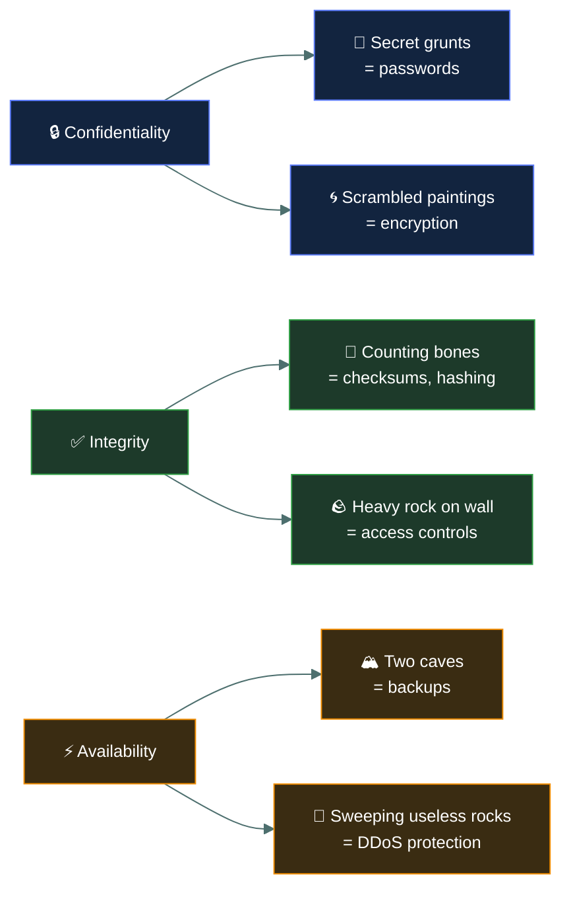

# 🔺 The C.I.A. Triad

### *The Three Big Rules of the Secret Cave*

---

Listen close, Thag. The world is dangerous. Saber-tooth tigers want to eat us. Rival tribes want to
steal our fire. To keep our tribe safe and strong, we must protect what we know.

We do this using the C.I.A. Triad.

No, it is not a new type of spear. It is the Three Big Rules of the Secret Cave. If you want to be
the Chief of Information, you must understand all three.

---

## 🔒 C · Confidentiality (The Secret Keep)

**What it means:** Only the right cavemen get to see the secret stuff.

Imagine you find a bush with the sweetest, fattest purple berries. If you yell about it, the whole
valley comes. The berries get eaten by strangers. Bad!

To practice Confidentiality, you only tell the hunters in your tribe.

> [!NOTE]
> **How we do it:**
>
> - **Secret Grunts (Passwords):** Before someone comes into the berry cave, they must make the
>   special owl noise. Wrong noise? Hit with club.
> - **Scrambled Cave Paintings (Encryption):** Instead of drawing a map to the berries, you draw
>   weird squiggles. Only our tribe knows that a squiggle of a snake actually means "go left at the
>   big rock." If a rival tribe looks at the wall, they just see snake squiggles and get confused.

---

## ✅ I · Integrity (The Truth Stays Truth)

**What it means:** Nobody changed the information. It is exactly how we left it.

Imagine the Chief draws a picture on the wall: "Big angry bear sleeps in the north cave. Do not go."
But in the night, a sneaky rival caveman sneaks in and rubs mud over "north" and draws "south." Now,
our hunters go north thinking it is safe, and they get eaten by the bear! The information was
tampered with. It lost its Integrity.

> [!TIP]
> **How we do it:**
>
> - **Counting the Mammoth Bones (Checksums/Hashing):** If you leave 10 mammoth bones in a pile to
>   build a tent, you count them. "One, two... many... ten!" When you come back, you count again. If
>   there are 9 bones, you know someone messed with your pile. The pile cannot be trusted anymore.
> - **Guarding the Wall (Access Controls):** We put a big heavy rock in front of the cave wall so
>   nobody can sneak in at night to change the bear drawing.

---

## ⚡ A · Availability (The Always There)

**What it means:** When we need the information, we can actually get it. Right now.

Imagine it is freezing cold. The snow is falling. We need to know how to rub the special sticks
together to make fire. The instructions are painted on a rock... but a giant mammoth sat on the rock
and went to sleep. You cannot read the rock. You freeze.

Even if the instructions are a secret (Confidentiality) and they are correct (Integrity), it does
not matter because you cannot reach them (Availability)!

> [!WARNING]
> **How we do it:**
>
> - **Two Caves (Backups):** Do not keep all the shiny rocks in one cave. If a river floods the
>   cave, you lose everything. Put half the shiny rocks in a cave up on the hill.
> - **Big Log Removal (DDoS Protection):** Sometimes rival tribes throw hundreds of useless rocks at
>   our cave entrance so we cannot get out to hunt. We must have strong guards to sweep the useless
>   rocks away so the hunters can always walk through the door.

---

## 💥 Each rule breaks a different way

---

## 🛠️ What the tribe does about it

---

## 🧔 Remember the Triad, Thag

1. Keep the berries a secret **(C)**.
2. Make sure nobody changes the bear map **(I)**.
3. Do not let the mammoth sit on the fire instructions **(A)**.

If you do these three things, your tribe's information will live to see the next spring!

---

<a href="../README.md">← Back to 01 · Security Principles</a>

