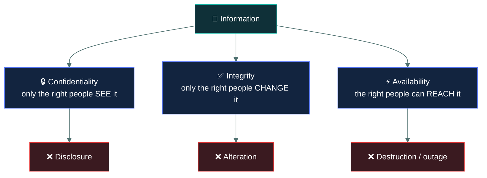
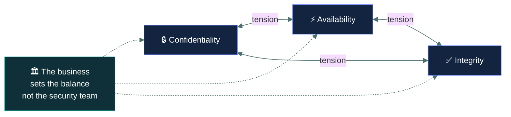

# 🔺 The CIA triad

### *The three things security exists to protect — and the exact wording of each*

📌 *Almost every question on this exam is ultimately about one of three properties. Getting them precisely apart is worth marks in all five domains.*

---

## 🧸 The big idea

Imagine you keep a diary in a wooden box under your bed. You want exactly three things to be
true about that box, always:

1. **Nobody else reads it.** Only you get to see what's inside.
2. **Nobody else writes in it.** If a page ever looks different, you can tell.
3. **You can always get to it.** When you want your diary, it's there, and it opens.

That's the whole idea. Security people gave those three things fancy names — **Confidentiality**
(nobody else reads it), **Integrity** (nobody else changes it, and you'd notice if they tried),
and **Availability** (you can always reach it) — but the diary box is the entire model. Every
attack on this exam is really just someone breaking one of those three promises about a box.

Ask what "security" means in the abstract and you get vague answers. ISC2 gives a precise one:
security is the protection of exactly those three properties of information, and nothing else.

That is the whole model. Every attack, every control, every incident on this exam maps to one
or more of those three.

The reason it is worth real study time despite being simple is that the exam tests the
**boundaries** between them, constantly. Someone reads a file they should not — confidentiality.
Someone edits it — integrity. Someone deletes it so nobody can use it — availability. The same
file, three different failures, and the distractors will offer you all three.

---

## 📖 Words you will keep seeing

| Word | What it means on this exam |
|---|---|
| **Confidentiality** | Ensuring information is not disclosed to unauthorised individuals, processes or devices. |
| **Integrity** | Ensuring information is not modified or destroyed in an unauthorised or undetected manner. |
| **Availability** | Ensuring authorised users have timely and reliable access to information and systems. |
| **Disclosure** | Information being seen by someone not authorised to see it. The failure mode of confidentiality. |
| **Alteration** | Information being changed without authorisation. The failure mode of integrity. |
| **Destruction** | Information or access being lost. The failure mode of availability. |
| **Sensitivity** | How much harm disclosure of a piece of information would cause. |
| **Criticality** | How badly the organisation is hurt if the information or system is unavailable. |

> 🎯 **Sensitivity and criticality are a tested pair.** Sensitivity is about *disclosure*
> (confidentiality). Criticality is about *loss of access* (availability). A question describing
> "how essential this system is to operations" is asking about criticality.

---

## 🔍 The three properties

### 🔒 Confidentiality

**Only authorised parties can see the information.**

The failure is **disclosure** — and note that disclosure is a failure whether it was malicious,
accidental, or the result of a misconfiguration. An email sent to the wrong recipient is a
confidentiality failure just as surely as a database breach.

**Controls that protect it:** encryption, access controls, classification and labelling,
need-to-know, masking and redaction, secure disposal, non-disclosure agreements, physical
barriers.

> ⚠️ Confidentiality is about *seeing*, not *having*. An attacker who copies an encrypted file
> they cannot read has not broken confidentiality. An insider who legitimately holds a file and
> shows it to an unauthorised colleague has.

### ✅ Integrity

**Information is not changed except by authorised parties, and unauthorised change is detectable.**

Two halves, and the exam tests both. Preventing improper change is one; being able to *tell*
whether change occurred is the other. That second half is why hashing is an integrity control
even though a hash prevents nothing — it makes alteration detectable.

Integrity also covers **accuracy and completeness**. Data corrupted by a failing disk, or a
record left half-written by a crashed transaction, is an integrity failure with no attacker
involved at all.

**Controls that protect it:** hashing, digital signatures, checksums, version control, input
validation, change management, access controls, database transaction controls.

> ⚠️ ISC2 extends integrity to **systems and people**, not just data. System integrity means the
> system behaves as intended and has not been tampered with. That is why hardening and
> configuration baselines are integrity controls.

### ⚡ Availability

**Authorised users get timely, reliable access when they need it.**

The word **timely** is doing work. A system that responds so slowly it cannot be used has an
availability failure even though it is technically running. So does a system that is up but
that authorised users have been locked out of.

**Controls that protect it:** redundancy, failover and clustering, backups, capacity planning,
patching, DDoS protection, maintenance windows, business continuity planning.

> ⚠️ The most-missed availability scenario is **a legitimate user locked out by an overly strict
> control.** An account lockout policy so aggressive that staff cannot work is a security control
> causing an availability failure. The exam likes this one because it shows the triad in tension.

---

## ⚖️ Told apart

This table is the reason to read the page. Every row is a distractor pattern.

| Scenario | Property broken | Why not the others |
|---|---|---|
| An unauthorised user **reads** a payroll file | **Confidentiality** | Nothing was changed (integrity intact) and nobody lost access (availability intact). |
| An unauthorised user **edits** a payroll figure | **Integrity** | Reading was incidental; the harm is the unauthorised change. |
| An unauthorised user **deletes** the payroll file | **Availability** | Authorised users can no longer reach it. (Integrity is arguably hit too — see the note below.) |
| Ransomware **encrypts** production data | **Availability** | The data still exists and is unchanged in substance; nobody can use it. *This is the single most common CIA question on the exam.* |
| Ransomware gang **publishes** stolen data | **Confidentiality** | Now it is disclosure — a separate failure from the encryption. |
| A DDoS attack floods a web server | **Availability** | No data is seen or altered; access is denied. |
| A laptop with unencrypted data is stolen | **Confidentiality** | Potential disclosure. (Availability too, if it was the only copy.) |
| A disk fails and corrupts records | **Integrity** | No attacker needed. Accuracy and completeness are lost. |
| An email is sent to the wrong recipient | **Confidentiality** | Accidental disclosure is still disclosure. |
| A user is locked out by an aggressive password policy | **Availability** | An authorised user cannot get timely access. |

> [!IMPORTANT]
> **Ransomware is availability.** This trips up more candidates than any other single item in
> Domain 1. The data is not disclosed and its content is not altered — it is *made unreachable*.
> If the same attack also exfiltrates and leaks data, that second act is confidentiality.

---

## 🔁 The triad in tension

The three properties pull against each other, and ISC2 expects you to recognise that.

| Strengthen | Often costs |
|---|---|
| **Confidentiality** — more encryption, tighter access | **Availability** — lost keys, lockouts, more friction |
| **Availability** — more copies, more replicas, broader access | **Confidentiality** — more places the data can leak from |
| **Integrity** — strict change control | **Availability** — slower changes, delayed fixes |

There is no configuration that maximises all three. Security is the business of choosing a
balance, and the balance is chosen by the business, not by the security team.

---

## ➕ Beyond the triad

Two extras appear in Domain 1 and are regularly offered as distractors on CIA questions.

**Non-repudiation** — a party cannot credibly deny having performed an action. It is *not* part
of the triad. If a question asks which CIA property is affected and non-repudiation is an
option, non-repudiation is the distractor.

**Authenticity** — information is genuine and from the claimed source. Closely related to
integrity, and sometimes bundled with it, but the exam treats the triad as exactly three.

> 🎯 Some courseware mentions the **DAD triad** — Disclosure, Alteration, Destruction — as the
> mirror image of CIA. It is a useful memory aid: each letter of DAD is the failure of the
> corresponding letter of CIA.

---

## ⚠️ Where your instinct is wrong

> [!WARNING]
> **In the job:** a ransomware incident is obviously a confidentiality problem too, because
> modern gangs exfiltrate before encrypting, and you would treat it as a breach.
>
> **On the exam:** unless the question explicitly mentions data being stolen or leaked,
> encryption-for-ransom is an **availability** failure. Answer the scenario you were given, not
> the one you have worked.

> [!WARNING]
> **In the job:** you would say a deleted file affects both integrity and availability, and
> argue the point.
>
> **On the exam:** pick the *primary* impact. Deletion and outage are availability. Modification
> of content is integrity. If the question says "the file was deleted", the answer is
> availability — do not reason your way into the more interesting answer.

---

## 🧠 How to remember it

🧠 **See · Change · Reach**

- **C**onfidentiality — who can **see** it
- **I**ntegrity — who can **change** it
- **A**vailability — who can **reach** it

Three verbs. For any scenario, ask which verb went wrong.

🧠 **CIA ↔ DAD.** Disclosure breaks Confidentiality, Alteration breaks Integrity, Destruction
breaks Availability. Same order, both ways.

---

## ✅ Check you actually got it

Answer all five before expanding anything.

**Q1.** A ransomware attack encrypts all files on a production file server. The attacker makes
no copy of the data. Which element of the CIA triad is PRIMARILY affected?

- **A.** Confidentiality
- **B.** Integrity
- **C.** Availability
- **D.** Non-repudiation

<b>Answer</b>

**C — Availability.** The data still exists and its substance is unchanged, but authorised
users cannot access it. Denial of access is an availability failure.

- **A** would require disclosure. The question states explicitly that no copy was taken, so
  nothing was disclosed to anyone.
- **B** is the most tempting distractor, since the files have visibly changed on disk. But
  integrity concerns *unauthorised modification of the information itself* — the payroll figures
  inside the encrypted file are still the payroll figures. What was taken away is access.
- **D** is not part of the CIA triad at all, and non-repudiation concerns proving who performed
  an action.

**Q2.** An employee emails a spreadsheet of customer records to the wrong external recipient.
Which principle has been violated?

- **A.** Integrity, because the data left the organisation's control
- **B.** Confidentiality, because the data was disclosed to an unauthorised party
- **C.** Availability, because the organisation no longer controls the copy
- **D.** No principle was violated, because the disclosure was accidental

<b>Answer</b>

**B — Confidentiality.** Information reached someone not authorised to see it. That is
disclosure, and disclosure is a confidentiality failure.

- **A** is wrong because nothing was modified. Data leaving your control is not the same as data
  being altered.
- **C** is wrong because the organisation retains its own copy and authorised users can still
  reach it.
- **D** is the important distractor: **intent is irrelevant.** Accidental disclosure is
  disclosure. This distinction appears repeatedly on the exam.

**Q3.** A hospital implements a password policy that locks accounts after three failed attempts
with a 24-hour reset delay. Clinical staff are repeatedly locked out during shifts. What has
happened?

- **A.** Confidentiality has been strengthened with no drawback
- **B.** Integrity has been compromised by the lockout mechanism
- **C.** A confidentiality control has created an availability problem
- **D.** Non-repudiation has been weakened

<b>Answer</b>

**C — a confidentiality control has created an availability problem.** Authorised users cannot
get timely, reliable access to systems they need. This is the triad in tension, which is exactly
what the question is testing.

- **A** is wrong because there is a clear drawback, described in the stem. "No drawback" should
  also read as an absolute worth suspecting.
- **B** is wrong because no information has been improperly modified or corrupted.
- **D** is wrong because the ability to attribute actions to individuals is unaffected — and in a
  clinical setting, lockouts more often *increase* credential sharing, which weakens
  attribution as a side effect rather than being the described failure.

**Q4.** Which control PRIMARILY supports integrity?

- **A.** Full-disk encryption on laptops
- **B.** Hashing files and comparing the values over time
- **C.** Clustering application servers across two data centres
- **D.** Requiring multi-factor authentication for remote access

<b>Answer</b>

**B — hashing and comparing the values.** Hashing does not prevent change; it makes change
*detectable*, and detectability of unauthorised modification is half the definition of integrity.

- **A** protects against disclosure if the laptop is lost or stolen — confidentiality.
- **C** keeps the service running if one site fails — availability.
- **D** strengthens the assurance that a user is who they claim, which primarily supports
  confidentiality by keeping unauthorised parties out. It supports integrity only indirectly.

**Q5.** A database administrator discovers that a failing storage array has silently corrupted
several thousand customer records. No attacker was involved. Which principle is affected?

- **A.** None — CIA applies only to deliberate attacks
- **B.** Availability, because the records can no longer be trusted
- **C.** Integrity, because the accuracy and completeness of the data has been lost
- **D.** Confidentiality, because corrupted records may expose fragments of other data

<b>Answer</b>

**C — Integrity.** Integrity covers the accuracy and completeness of information, and it is
violated by accidental corruption just as much as by malicious alteration. No attacker is
required.

- **A** is wrong, and it is the key misconception being tested. CIA describes properties of
  information, not categories of attack. Hardware failure, human error and natural disaster all
  break these properties.
- **B** is wrong because the records are still reachable — they are reachable and wrong, which is
  an integrity failure, not an availability one.
- **D** invents a disclosure that the scenario does not describe.

---

## 🎓 The grown-up version

<b>Extra depth — open this on a second read, never needed for the pass</b>

**Where the triad comes from, and its critics.** The three-property model has been the
organising idea of information security for decades and underpins most standards and legal
frameworks. It is also criticised for being incomplete: it says nothing directly about
authenticity, possession, utility or accountability. The best-known extension is the **Parkerian
hexad**, which adds possession or control, authenticity, and utility. That extension is not on
the CC syllabus, and offering it as an answer would be wrong on this exam — but it explains why
you occasionally see "possession" or "utility" floating around in security writing.

**Why "possession" is a genuinely useful idea.** Consider an encrypted backup tape that is
stolen. Confidentiality is arguably intact, because the thief cannot read it. Yet something
clearly went wrong. The hexad would call that a loss of *possession or control*. ISC2 handles the
same situation by treating it as a confidentiality *risk* rather than a realised failure —
which is why exam questions about stolen encrypted devices usually hinge on whether the
encryption was properly implemented.

**Integrity in the transactional sense.** Database people use "integrity" to mean something more
specific: referential integrity, entity integrity, the ACID properties of a transaction. That is
a narrower, technical usage nested inside the security one. Both are about data being correct
and consistent, but an exam question using the word "integrity" is asking about the security
property unless it is explicitly discussing database constraints.

**Availability has a measurement culture.** In operations, availability is quantified — nines of
uptime, error budgets, service level objectives. CC does not test those numbers, but it does
test the vocabulary that sits next to them: RTO, RPO and MTD in Domain 2 are all, at bottom,
availability metrics. When you reach that topic, it may help to recognise it as the same
property being measured rather than a new subject.

---

## 📝 Cram lines

Destined for [`EXAM-DAY.md`](../../EXAM-DAY.md):

- **See · Change · Reach** — Confidentiality, Integrity, Availability.
- **DAD mirrors CIA**: Disclosure, Alteration, Destruction.
- **Ransomware encryption = AVAILABILITY.** Ransomware *leak* = confidentiality.
- **Accidental disclosure is still a confidentiality failure.** Intent is irrelevant.
- **Integrity = no unauthorised change AND change is detectable.** Covers accidental corruption.
- **Availability includes "timely".** A lockout of legitimate users is an availability failure.
- **Sensitivity** → disclosure → confidentiality. **Criticality** → loss of access → availability.
- **Non-repudiation is NOT part of the triad.**

---

<a href="../README.md">← back to 01 · Security Principles</a> &nbsp;·&nbsp; <a href="../authentication/">next: Authentication →</a>

