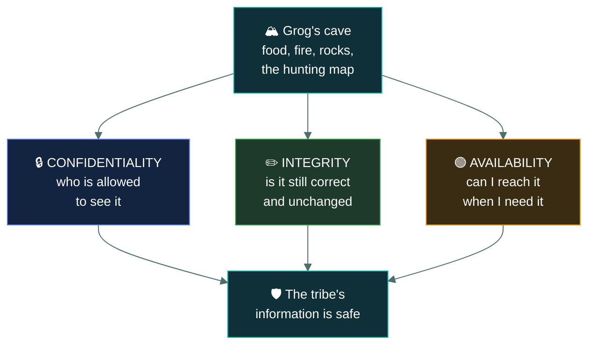
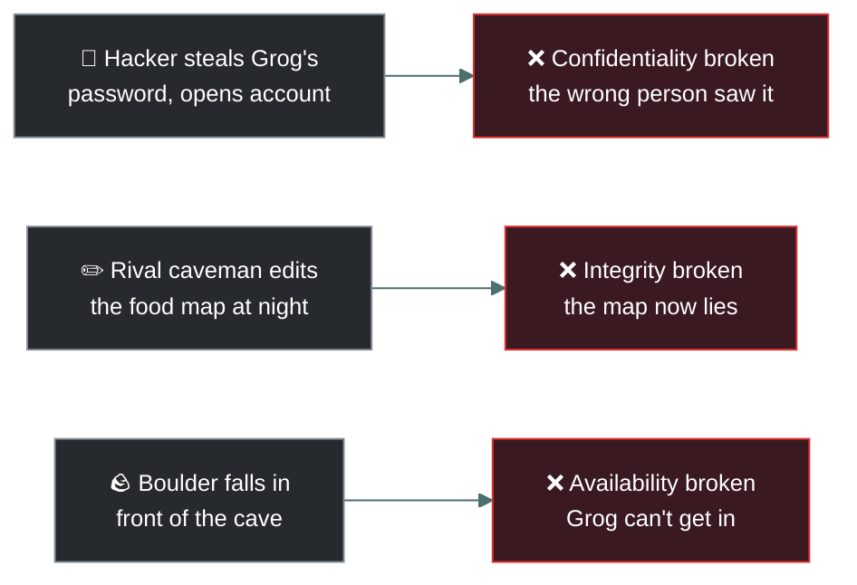
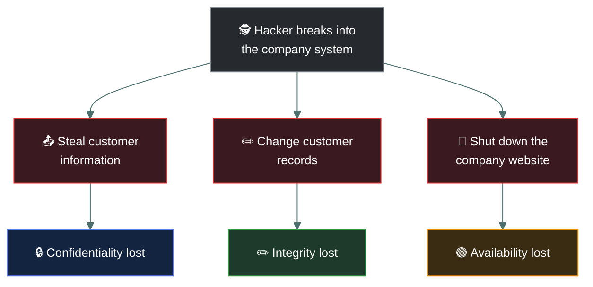

# 🪨 CIA Triad — Caveman Edition

---

Imagine you are **Grog**, a caveman. You live in a cave with your tribe.

Inside your cave you have:

- 🥩 Food
- 🔥 Fire
- 🪨 Valuable rocks
- 🗺️ A map showing where the tribe hunts
- 🧑‍🤝‍🧑 Information about your tribe

You want to protect all of this.

Cybersecurity says there are **three big things** you must protect:

> **C — Confidentiality**
> **I — Integrity**
> **A — Availability**

Together, these are called the **CIA Triad**.

---

## 1 · 🔒 C = Confidentiality

### Caveman version

Grog has a secret cave.

Inside the cave is a map showing where the tribe stores its food.

Grog doesn't want another tribe to see the map.

So Grog puts a big stone in front of the cave and gives the secret location only to his tribe.

That's **Confidentiality**.

### 💻 Computer version

Confidentiality means:

> **Only authorized people should be able to access information.**

For example, imagine a hospital has information about patients.

A patient's medical record should be visible to:

- 👨‍⚕️ Authorized doctors
- 👩‍⚕️ Authorized nurses
- 🏥 Appropriate hospital staff

But it shouldn't be visible to:

- ❌ Random people
- ❌ Hackers
- ❌ Unauthorized employees

### How do we achieve confidentiality?

We use things like:

- 🔑 Passwords
- 🔐 Encryption
- 👤 User accounts
- 🪪 Authentication
- 🛂 Access controls
- 🔒 Permissions

> [!NOTE]
> **Example:** Suppose your password is `Grog123`. A hacker gets your password and opens your
> account. Your information is no longer confidential.
>
> **Confidentiality = "Who is allowed to see this?"**

---

## 2 · ✏️ I = Integrity

Now Grog has another problem.

He has a **map** showing where the tribe's food is stored.

The map says:

> 🥩 Food is in Cave A.

While Grog is sleeping, another caveman changes the map:

> 🥩 Food is in Cave B.

Grog believes the fake map and goes to Cave B.

There is no food there.

😡 Grog gets very angry.

This is an **integrity problem**.

### 💻 Computer version

Integrity means:

> **Information should remain accurate, complete, and trustworthy.**

In other words: **nobody should be able to change your data without authorization.**

### Example: Bank account

Imagine your bank account says:

> 💰 Balance = $10,000

A hacker changes it to:

> 💰 Balance = $100

That's an **integrity violation**. The information was changed incorrectly.

### Another example

Imagine a school database says:

> Student: John
> Grade: A

Someone illegally changes it to:

> Student: John
> Grade: F

The information is no longer trustworthy.

### How do we protect integrity?

We can use:

- 🔐 Access controls
- 🧾 Hashes
- ✍️ Digital signatures
- 💾 Backups
- 📝 Audit logs
- 🔍 File integrity monitoring

> [!TIP]
> **Integrity = "Is the information still correct and unchanged?"**

---

## 3 · 🟢 A = Availability

Now imagine Grog has lots of food in his cave.

The food is safe. Nobody stole it. Nobody changed it.

So: Confidentiality ✅ · Integrity ✅

But there's one problem.

A giant boulder falls in front of the cave. 🪨💥

Grog can't get inside.

His food exists. It's correct. But **he can't access it when he needs it**.

That's an **availability problem**.

### 💻 Computer version

Availability means:

> **Authorized users should be able to access information and systems when they need them.**

For example, imagine your bank's website normally works 24/7. You need to transfer money. But
hackers launch a **DDoS attack**, overwhelming the website. You can't access your bank. Your
information wasn't necessarily stolen or changed. But the service isn't available. That's an
availability failure.

### How do we protect availability?

We can use:

- 💾 Backups
- 🖥️ Redundant servers
- 🌐 Multiple network connections
- ⚡ Uninterruptible power supplies
- 🛡️ DDoS protection
- 🔧 System maintenance
- ♻️ Disaster recovery

> [!WARNING]
> **Availability = "Can I access it when I need it?"**

---

## 💥 Each rule breaks a different way

---

## 🦴 Put all three together

Imagine Grog has a **secret food database**.

| CIA Principle | Caveman problem | Cybersecurity meaning |
| --- | --- | --- |
| 🔒 Confidentiality | Other tribes see Grog's food map | Prevent unauthorized access |
| ✏️ Integrity | Someone changes the food map | Prevent unauthorized/incorrect changes |
| 🟢 Availability | Boulder blocks the food cave | Make information accessible when needed |

The easiest way to remember:

### 🔒 Confidentiality

**"Don't let the wrong person SEE it."**

### ✏️ Integrity

**"Don't let the wrong person CHANGE it."**

### 🟢 Availability

**"Make sure I can USE it when I need it."**

---

## 🏦 Real-world example: Your bank account

Let's say you have **$5,000** in your bank account.

### 🔒 Confidentiality

A stranger shouldn't be able to see your:

- Account number
- Transactions
- Balance
- Personal information

If a hacker steals your banking credentials and views your account:

❌ **Confidentiality is broken.**

---

### ✏️ Integrity

You have:

> Balance = $5,000

A hacker changes your balance to:

> Balance = $50

The data has been changed incorrectly.

❌ **Integrity is broken.**

---

### 🟢 Availability

You need to transfer money. You open your banking app. But the bank's servers are down. You can't
access your account.

❌ **Availability is broken.**

---

## 🧠 One scenario can attack different parts

This is important for cybersecurity exams.

Imagine a hacker gets into your company's computer system.

They:

1. Steal customer information.
2. Change customer records.
3. Shut down the company's website.

You've potentially lost **all three**:

- **Steal information → Confidentiality**
- **Change information → Integrity**
- **Shut down service → Availability**

---

## 🎯 Easy exam definition

If you're studying cybersecurity, remember this:

> **Confidentiality:** Protect information from unauthorized access.

> **Integrity:** Protect information from unauthorized modification.

> **Availability:** Ensure authorized users can access information and systems when required.

---

## 🪨 The ultimate caveman memory trick

Imagine Grog's cave:

- **🔒 C — "WHO CAN SEE MY STUFF?"**
- **✏️ I — "DID SOMEONE CHANGE MY STUFF?"**
- **🟢 A — "CAN I GET MY STUFF WHEN I NEED IT?"**

That's the entire **CIA Triad**.

### One sentence to memorize:

> 🛡️ **CIA means: Keep information SECRET, CORRECT, and AVAILABLE.**

If you're learning cybersecurity, the next useful step is understanding **authentication,
authorization, encryption, hashing, and how each one helps the CIA Triad**.

---

<a href="../README.md">← Back to 01 · Security Principles</a>

