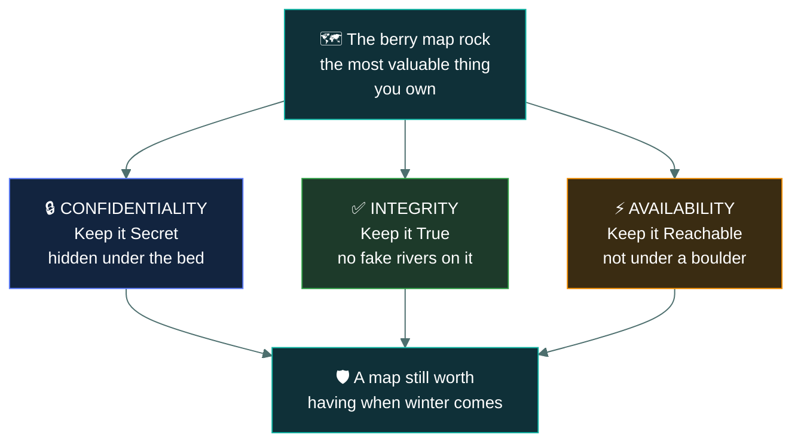
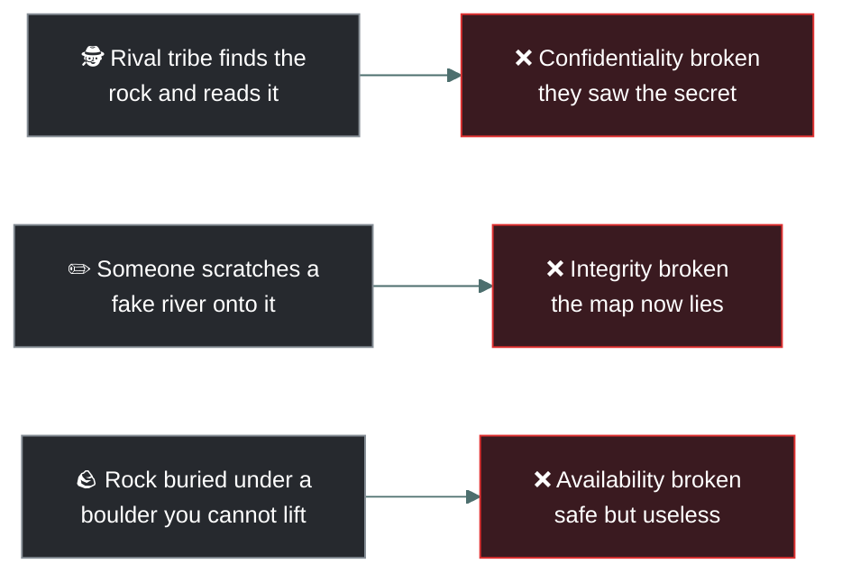
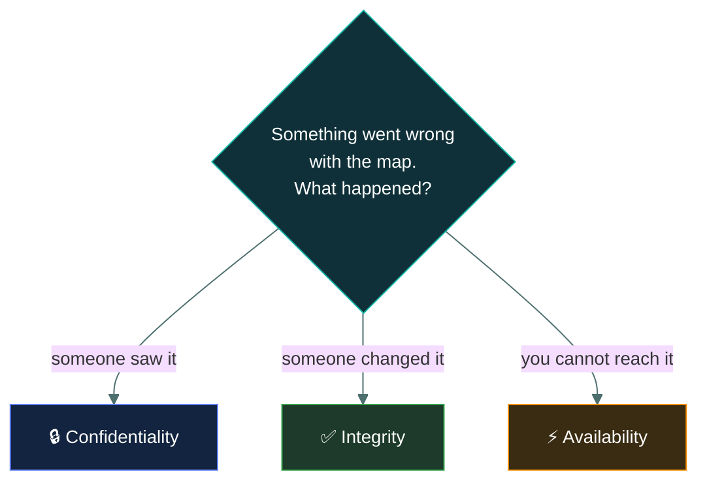

# 🔺 The CIA Triad

### *The three big rules of keeping information secure*

---

Imagine you just found the best patch of sweet berries in the entire forest. You paint a map to
the berries on a special, flat rock. Because the winter is coming, this map is the most valuable
thing you own.

To keep your map safe, you need the CIA Triad — the three big rules of keeping information secure.

---

## 🔒 1 · Confidentiality (Keep it Secret)

You don't want the rival tribe to find your berries. So, you hide your map rock deep under your
mammoth-skin bed. You only tell your hunting partner where it is.

> [!NOTE]
> **The Rule:** Only the right people are allowed to look at the secret information. Bad guys
> stay out.

---

## ✅ 2 · Integrity (Keep it True)

While you are out hunting, you want to make sure nobody sneaks into your cave and scratches a
fake river onto your map to trick you into walking off a cliff. When you look at the rock again,
it needs to be exactly how you painted it.

> [!TIP]
> **The Rule:** The information must be accurate and unchanged. Nobody is allowed to mess with it
> or alter it behind your back.

---

## ⚡ 3 · Availability (Keep it Reachable)

You wake up starving. You need the map now. If you buried the rock under a giant boulder that you
can't lift, the map is perfectly safe, but it's completely useless to you. You need to be able to
grab the rock whenever you are hungry.

> [!WARNING]
> **The Rule:** When the good guys need the information, they must be able to actually get to it
> and use it without things breaking or being blocked.

---

## 💥 Each rule breaks a different way

Same rock, three completely different disasters. Ask yourself which promise about the map got
broken, and the rule names itself.

---

## 🧔 The Caveman Explains it Back

> *"Me understand! CIA like protecting berry map!*
>
> - ***C** is for **C**over map (Confidentiality). Ogg no see my map. Only me see.*
> - ***I** is for **I**ntact map (Integrity). Ogg no draw fake river on my map. Map stay true.*
> - ***A** is for **A**lways get map (Availability). Map no stuck under big heavy rock. Me get map
>   when me hungry."*

---

<a href="../README.md">← Back to 01 · Security Principles</a>

