# 🤝 Due Care and Due Diligence

### *Check before you commit — then keep doing the reasonable thing*

📌 *Tell the two apart by timing — before vs ongoing — and know negligence is a failure of due care.*

---

## 🧸 The big idea

Buying a used car:

- **Before** you buy, you check its history and get a mechanic to inspect it. That's **due
  diligence** — *investigating first*.
- **After** you buy it, you service it regularly and replace worn brakes. That's **due care** —
  *doing the reasonable thing, every day*.
- If you ignore the worn brakes for a year and crash, that's **negligence** — a failure of due
  care.

> **Due diligence is investigating. Due care is acting on what you found — and keeping it up.**

---

## 📖 Words you will keep seeing

| Word | What it means on this exam |
|---|---|
| **Due diligence** | Research, investigation and verification done **before** a decision or commitment. |
| **Due care** | The **ongoing**, reasonable standard of protection a prudent organisation maintains. |
| **Negligence** | The failure that results from **not** exercising due care. |
| **Reasonable person standard** | The benchmark: what would a prudent person in the same position have done? |

---

## 🔍 The explanation

### It's all about timing

| Scenario | Term |
|---|---|
| Reviewing a vendor's security certifications **before** signing | **Due diligence** |
| Running a risk assessment **before** acquiring a company | **Due diligence** |
| Assessing a cloud provider **before** migrating workloads | **Due diligence** |
| Applying critical patches within the defined SLA | **Due care** |
| Keeping antivirus and OS patches current on every endpoint | **Due care** |
| Training staff every year | **Due care** |
| Leaving a known critical vulnerability unpatched for months → breach | **Negligence** |

> 🎯 If the scenario says *regularly*, *consistently*, *maintains* → due **care**. If it says
> *before signing*, *before acquiring*, *assesses first* → due **diligence**.

### Negligence is not the same as accepting a risk

Leaving something unfixed isn't automatically negligent — it depends on whether anyone actually
decided:

---

## ⚖️ Told apart

| | Means | Not to be confused with |
|---|---|---|
| **Due diligence** | Investigating **before** committing. | **Due care** — the ongoing standard of action. |
| **Due care** | The ongoing reasonable standard. | **Negligence** — the *failure* to exercise it. |
| **Negligence** | No considered decision; reasonable care skipped. | **Risk acceptance** — a deliberate, documented decision by management. |

---

## ⚠️ Where your instinct is wrong

> [!WARNING]
> **In the job:** "due diligence" gets used loosely to mean "being careful".
>
> **On the exam:** due diligence has a **timing** — it happens **before** a decision, as
> investigation. Anything ongoing ("regularly patches", "consistently trains") is due **care**,
> however carefully it's done.

---

## 🧠 How to remember it

**"Diligence digs, care carries out."** Dig first (investigate); then carry out the reasonable
standard, every day.

---

## ✅ Check you actually got it

Answer all five before expanding anything.

**Q1.** Before acquiring a smaller competitor, a company's security team reviews the target's
incident history, patch practices and existing vulnerabilities. What does this represent?

- **A.** Due care
- **B.** Due diligence
- **C.** Negligence
- **D.** Risk transfer

<b>Answer</b>

**B — due diligence.** Investigation *before* the decision is finalised.

- **A** is ongoing reasonable action, not pre-decision investigation.
- **C** is a failure to act reasonably — the opposite.
- **D** is shifting risk to a third party.

**Q2.** An organisation consistently applies security patches within its SLA and keeps endpoint
protection updated across its fleet. This ongoing practice is an example of:

- **A.** Due diligence
- **B.** Due care
- **C.** Risk avoidance
- **D.** A compliance audit

<b>Answer</b>

**B — due care.** The ongoing, reasonable standard of protection.

- **A** is pre-decision investigation.
- **C** is stopping a risky activity altogether.
- **D** is an independent check, not the practice itself.

**Q3.** An organisation knew about a critical vulnerability for eight months and did nothing,
resulting in a breach. This is BEST described as a failure of:

- **A.** Due diligence
- **B.** Due care
- **C.** Risk transfer
- **D.** Accounting

<b>Answer</b>

**B — due care.** Not maintaining the reasonable standard (patching a known critical flaw) is
textbook negligence.

- **A** would be failing to investigate *before* a decision.
- **C** is unrelated.
- **D** is the "who did what" part of AAA.

**Q4.** Which BEST distinguishes due diligence from due care?

- **A.** Due diligence is legally required; due care is optional
- **B.** Due diligence is investigation before acting; due care is the ongoing reasonable standard of action
- **C.** They are interchangeable terms for the same concept
- **D.** Due care applies only to technical staff; due diligence applies only to management

<b>Answer</b>

**B.** Timing is the whole distinction.

- **A** invents an optionality difference — both carry legal weight.
- **C** collapses a distinction the exam tests directly.
- **D** invents a role restriction.

**Q5.** A company hires an external firm to assess a cloud provider's security posture before
migrating sensitive workloads. This assessment is an example of:

- **A.** Due care
- **B.** Due diligence
- **C.** Negligence
- **D.** The ISC2 Code of Ethics

<b>Answer</b>

**B — due diligence.** Checking a third party **before** committing.

- **A** would be maintaining security *after* the migration.
- **C** is a failure, not a proactive step.
- **D** governs professional conduct, not vendor checks.

---

## 🎓 The grown-up version

<b>Extra depth — open this on a second read, never needed for the pass</b>

**Both come from legal liability.** Courts ask whether an organisation took the care a
"reasonable person" in its position would have, and whether it investigated adequately before
taking on an obligation. An organisation that ignored a known vulnerability can be found negligent
exactly like a landlord who ignored a known hazard.

**What real due diligence checks:** a standard security questionnaire (e.g. SIG), a **SOC 2 Type
II** report (an auditor saw the controls *operating over months*, not just on paper), recent pen
test results, breach history, cyber insurance, and outside-in scores (BitSight,
SecurityScorecard).

**Due care is increasingly measured continuously** — compliance platforms (Drata, Vanta) check
control status against a framework in near real time instead of once a year.

---

## 📝 Cram lines

Destined for [`EXAM-DAY.md`](../../EXAM-DAY.md):

- **Due diligence = investigate BEFORE. Due care = act reasonably, ONGOING.**
- **Negligence = failure of due care.** A documented management decision is risk acceptance, not negligence.
- **"Diligence digs, care carries out."**

---

<a href="../README.md">← back to 01 · Security Principles</a>

