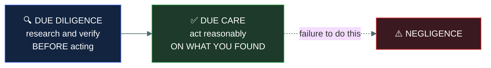

# 🤝 Due care and due diligence

### *Two Latin-flavoured terms the exam expects you to tell apart on sight*

📌 *One is doing the reasonable thing. The other is checking first. The exam swaps them constantly.*

---

## 🧸 The big idea

A caveman is offered a hunting dog in trade for three baskets of berries. Before he agrees, he
spends a day watching it — does it limp, does it snap at strangers, does it come when called.
That checking, *before* he commits to anything, is **due diligence.**

Once the dog is his, he feeds it every day, shelters it from the rain, and checks its paws for
thorns after every hunt — for as long as he owns it. That ongoing, reasonable upkeep is **due
care.**

If he skips the checking and trades for a dog that turns out to be sick and dangerous, or if he
owns the dog for a year and simply stops feeding it, both are failures — but they're failures of
two different things, at two different moments.

That's the whole idea. **Due care** is doing what a reasonable, prudent person or organisation
would do to avoid causing harm — locking the door, patching the known vulnerability, training
staff. **Due diligence** is the research and verification that happens *before* acting or
committing — checking a vendor's security practices before signing a contract, investigating a
system's risk before deploying it.

The one-line version the exam wants: **due diligence is investigating; due care is acting on
what the investigation found.**

---

## 📖 Words you will keep seeing

| Word | What it means on this exam |
|---|---|
| **Due care** | The ongoing, reasonable standard of protection a prudent organisation maintains — doing the right thing. |
| **Due diligence** | The research, investigation and verification performed *before* a decision or action — checking first. |
| **Negligence** | The legal/organisational failure that results from **not** exercising due care. |
| **Reasonable person standard** | The legal benchmark used to judge whether due care was exercised — what would a prudent person in the same position have done. |

---

## 🔍 Investigate, then act

**Examples, matched to the right term:**

| Scenario | Term |
|---|---|
| Reviewing a third-party vendor's security certifications before signing a contract | Due diligence |
| Applying a critical patch within the organisation's defined SLA | Due care |
| Conducting a risk assessment before acquiring another company | Due diligence |
| Maintaining up-to-date antivirus and a patched OS on all endpoints | Due care |
| Failing to patch a known critical vulnerability for months, leading to a breach | **Negligence** (failure of due care) |

---

## ⚖️ Told apart

| | Means | Not to be confused with |
|---|---|---|
| **Due diligence** | Investigating and verifying **before** committing to an action or decision. | **Due care**, which is the reasonable standard of action itself, exercised on an ongoing basis. |
| **Due care** | The ongoing reasonable standard of protection. | **Negligence**, which is the *failure* to exercise due care — not a separate positive action. |
| **Negligence** | A legal/organisational failure from lack of due care. | **Risk acceptance**, a deliberate, documented decision — negligence is the absence of a considered decision at all. |

---

## ⚠️ Where your instinct is wrong

> [!WARNING]
> **In the job:** "due diligence" is often used loosely to mean "being careful" in general.
>
> **On the exam:** due diligence has a specific *timing* — it happens **before** a decision or
> action, as investigation. If a scenario describes something happening on an ongoing basis
> ("regularly patches," "consistently trains staff"), that is due **care**, not due diligence,
> regardless of how carefully it's done.

---

## 🧠 How to remember it

🧠 **"Diligence digs, care carries out."** Due diligence is the digging (research, checking)
that happens first; due care is carrying out the reasonable standard afterward and ongoing.

---

## ✅ Check you actually got it

Answer all five before expanding anything.

**Q1.** Before acquiring a smaller competitor, a company's security team reviews the
target's incident history, patch practices and existing vulnerabilities. What does this
represent?

- **A.** Due care
- **B.** Due diligence
- **C.** Negligence
- **D.** Risk transfer

<b>Answer</b>

**B — due diligence.** This is investigation and verification performed *before* a decision
(the acquisition) is finalised.

- **A** describes ongoing reasonable action, not pre-decision investigation.
- **C** describes a failure to act reasonably, the opposite of what's described.
- **D** describes shifting risk to a third party (e.g. via insurance), unrelated to
  investigation.

**Q2.** An organisation consistently applies security patches within its defined SLA and
maintains updated endpoint protection across its fleet. This ongoing practice is an example
of which of the following?

- **A.** Due diligence
- **B.** Due care
- **C.** Risk avoidance
- **D.** A compliance audit

<b>Answer</b>

**B — due care.** This is the ongoing, reasonable standard of protection an organisation
maintains.

- **A** describes pre-decision investigation, not an ongoing maintained practice.
- **C** describes eliminating an activity that carries risk entirely, not maintaining
  protective practices.
- **D** describes an independent verification activity, not the practice itself.

**Q3.** An organisation knew about a critical vulnerability for eight months and took no
action, resulting in a breach. This is BEST described as a failure of which concept?

- **A.** Due diligence
- **B.** Due care
- **C.** Risk transfer
- **D.** Accounting

<b>Answer</b>

**B — a failure of due care (negligence).** Not maintaining the reasonable, ongoing standard
of protection — patching a known critical vulnerability — is the textbook definition of
negligence resulting from a due care failure.

- **A** would apply to a failure to investigate *before* a decision, not an ongoing failure to
  act on known information.
- **C** describes shifting risk to a third party, unrelated to this scenario.
- **D** is unrelated — accounting is the "who did what" part of AAA.

**Q4.** Which of the following BEST distinguishes due diligence from due care?

- **A.** Due diligence is legally required; due care is optional
- **B.** Due diligence is investigation before acting; due care is the ongoing reasonable
  standard of action
- **C.** They are interchangeable terms for the same concept
- **D.** Due care applies only to technical staff; due diligence applies only to management

<b>Answer</b>

**B — investigation before acting, versus the ongoing reasonable standard.** This timing
distinction is the core of the concept.

- **A** invents a legal-optionality distinction that doesn't hold; both concepts carry legal
  weight in negligence analysis.
- **C** collapses a distinction the exam tests directly.
- **D** invents a role-based restriction that does not exist.

**Q5.** A company hires an external firm to assess the security posture of a cloud provider
before migrating sensitive workloads to it. This assessment is an example of which concept?

- **A.** Due care
- **B.** Due diligence
- **C.** Negligence
- **D.** The ISC2 Code of Ethics

<b>Answer</b>

**B — due diligence.** Investigating a third party's practices *before* committing to a
decision (the migration) is the defining example of due diligence.

- **A** would describe the ongoing maintenance of security once the migration has happened.
- **C** describes a failure, not a proactive investigative step.
- **D** is unrelated — the Code of Ethics governs professional conduct, not vendor
  investigation.

---

## 🎓 The grown-up version

<b>Extra depth — open this on a second read, never needed for the pass</b>

**Where the terms come from.** Both concepts have roots in legal liability standards — courts
assess whether an organisation exercised the standard of care a "reasonable person" in the
same position would have exercised, and whether it performed adequate investigation before
taking on an obligation. Security borrowed both terms because the same liability logic applies
directly: an organisation that failed to patch a known vulnerability can be found negligent in
exactly the way a property owner who ignored a known hazard can be.

**Why professional conduct pages sit near it.** Due care and due diligence sit alongside the
ISC2 Code of Ethics because all three are about a practitioner's or organisation's standard of
professional behaviour — one governs personal conduct, the other two govern organisational
diligence, but a question testing "what should a responsible professional have done" often
draws on all three at once.

---

## 📝 Cram lines

Destined for [`EXAM-DAY.md`](../../EXAM-DAY.md):

- **Due diligence = investigate BEFORE. Due care = act reasonably, ONGOING.**
- **Negligence = failure of due care**, not a failure of due diligence.
- "Diligence digs, care carries out."

---

<a href="../README.md">← back to 01 · Security Principles</a> &nbsp;·&nbsp; <a href="../../04-network-security/README.md">next domain: 04 · Networking and Cloud Security Concepts →</a>

</content>
