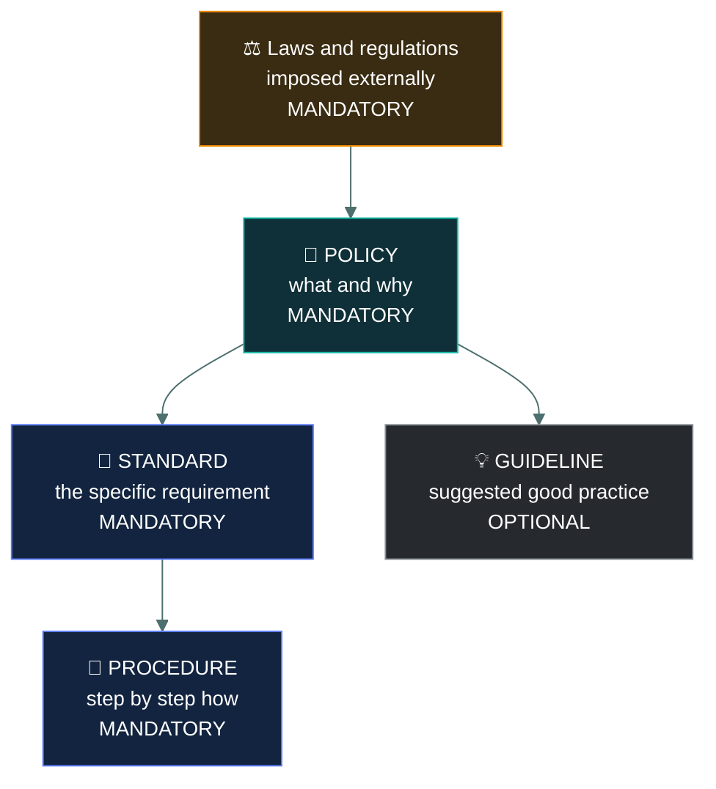
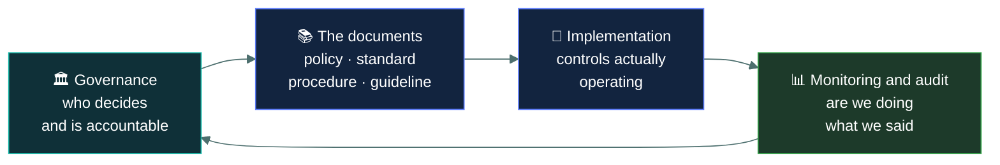
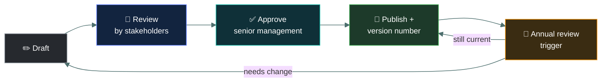

# 📜 Governance documents

### *Policy, standard, procedure, guideline — a hierarchy, and only one of them is optional*

📌 *Four document types the exam swaps around constantly. Learn the hierarchy, learn which are mandatory, and several marks are locked in.*

---

## 🧸 The big idea

Your tribe has rules about fire, written at four different levels of detail.

The chief declares, once, for everyone: *"Fires must never be left unwatched."* That's the big
"what and why" — nobody argues with it, and it barely ever changes. That's a **policy.**

The council turns that into an exact, mandatory number: *"A fire must have one person within
arm's reach at all times, and sit at least 10 paces from any tent."* Specific, still mandatory,
just more detailed. That's a **standard.**

The fire-keeper teaches the exact steps: *"Gather dry moss first. Strike the flint twice over it.
Blow gently until it catches."* Step by step, so anyone can follow it. That's a **procedure.**

And an old hunter mentions, almost as an aside: *"Birch bark catches faster than moss, if you can
find some."* Nobody has to do this — it's just good advice. That's a **guideline**, and the only
one of the four that's optional.

That's the whole idea. Organisations write down their rules, and the rules come in four layers
that get progressively more specific. Think of it as the difference between *what we want*,
*what exactly*, *how precisely*, and *some advice*.

> **Policy** says **what** and **why**.
> **Standard** says **what exactly** — the specific requirement.
> **Procedure** says **how**, step by step.
> **Guideline** says **you might consider this** — and is the only optional one.

A second worked example, this time on passwords:

| Layer | What it says |
|---|---|
| **Policy** | "All access to company systems must be authenticated, and credentials must be protected." |
| **Standard** | "Passwords must be at least 14 characters and MFA is required for all remote access." |
| **Procedure** | "To change your password: open Settings, select Account, click Change Password…" |
| **Guideline** | "Consider using a passphrase made of four unrelated words — they are easier to remember." |

Notice the pattern: **broad to specific, top to bottom.** The policy rarely changes; the
procedure changes whenever the software does.

---

## 📖 Words you will keep seeing

| Word | What it means on this exam |
|---|---|
| **Policy** | A high-level statement of management intent and direction. Mandatory. Approved by senior management. |
| **Standard** | A specific, mandatory requirement that supports a policy. Uniform across the organisation. |
| **Procedure** | Detailed step-by-step instructions for carrying out a task. Mandatory. |
| **Guideline** | Recommended, non-mandatory advice and good practice. |
| **Baseline** | The minimum acceptable level of security for a system or class of system. |
| **Regulation** | A rule imposed by an external authority and enforceable by law. |
| **Law** | Legislation. Non-compliance carries legal penalties. |
| **Framework** | A structured set of practices an organisation can adopt, such as ISO 27001 or NIST CSF. |
| **AUP** — Acceptable Use Policy | The policy defining permitted use of the organisation's systems. |

---

## 🔍 The hierarchy

### 📜 Policy

A **high-level statement of management intent**. It says what the organisation requires and why,
without saying how.

- **Mandatory.** Compliance is not optional for staff.
- **Approved by senior management**, which is what gives it authority.
- **Technology-neutral and stable** — it should not need rewriting when a product is replaced.
- Typically short, and written to last for years.

> ⚠️ A policy does not name products, settings or versions. Anything containing "must be at
> least 14 characters" or "use AES-256" is a **standard**, whatever the file is called.

### 📏 Standard

A **specific mandatory requirement** that implements a policy. This is where the actual numbers,
technologies and configurations live.

- **Mandatory.**
- **Uniform** — applies consistently across the organisation, so everyone does it the same way.
- Changes more often than policy, as technology moves.

**Baselines** are closely related: the minimum acceptable security configuration for a type of
system. A hardened server build is a baseline.

### 🔧 Procedure

**Step-by-step instructions** for performing a task. The most detailed layer.

- **Mandatory** where it applies — if there is a procedure for something, you follow it.
- Written so that a competent person can carry out the task consistently and repeatably.
- Changes most frequently, because interfaces and tools change.

> 🎯 The clue word is **steps**. Numbered instructions, a sequence of actions, "first do this then
> do that" — that is a procedure.

### 💡 Guideline

**Recommended practice.** Advice, not instruction.

- **Optional.** This is its defining feature and the single most tested fact on this page.
- Uses soft language: *should*, *consider*, *it is recommended*, *where practical*.
- Exists to help in situations the standards cannot fully anticipate, and to allow professional
  judgement.

> [!IMPORTANT]
> **The guideline is the only non-mandatory document in the hierarchy.** Policy, standard and
> procedure are all compulsory. If a question asks which is optional, or which is merely
> recommended, the answer is guideline.

---

## ⚖️ Told apart

| Document | Mandatory? | Says | Language | Example |
|---|---|---|---|---|
| **Policy** | ✅ Yes | **What** and **why** | *must*, *shall*, *will* | "Data must be protected commensurate with its classification." |
| **Standard** | ✅ Yes | **What exactly** | *must*, *shall* | "All laptops must use full-disk encryption with AES-256." |
| **Procedure** | ✅ Yes | **How**, in steps | numbered instructions | "1. Open the console. 2. Select the device. 3. Enable encryption." |
| **Guideline** | ❌ **No** | **What you might consider** | *should*, *consider*, *recommended* | "Staff should consider a privacy screen when working in public." |

| | Means | Not to be confused with |
|---|---|---|
| **Policy** | High-level intent, technology-neutral, stable. | **Standard**, which carries the specific requirement. If it has a number in it, it is a standard. |
| **Standard** | A uniform mandatory requirement. | **Guideline**, which is a suggestion. Mandatory versus optional is the distinction. |
| **Procedure** | Ordered steps to perform a task. | **Standard**, which states the requirement without saying how to achieve it. |
| **Guideline** | Optional recommendation. | Everything else in the hierarchy, all of which is mandatory. |
| **Policy** | Internal, written by the organisation. | **Regulation**, imposed externally and enforceable by law. |
| **Baseline** | Minimum acceptable configuration for a system. | **Standard**, which is broader. A baseline is a particular kind of minimum. |

> 🎯 **The fastest tell is the verb.** *Must* and *shall* → mandatory, so policy, standard or
> procedure. *Should*, *may*, *consider* → guideline.

---

## 🏛️ Where governance sits

Governance is the layer above all of this: the framework of rules, roles and accountability
through which the organisation directs its security.

Two responsibilities the exam expects you to place correctly:

- **Senior management approves policy** and is accountable for security. Without that approval a
  policy has no authority.
- **Policies must be reviewed periodically** — typically annually, and after any significant
  change or incident. A policy nobody has revisited in six years is a finding.

---

## 🏗️ Named standards and frameworks

The live outline names two examples explicitly, and expects you to recognise both as
**published external standards/frameworks** an organisation can adopt rather than write from
scratch:

| Name | What it is |
|---|---|
| **ISO** (e.g. ISO/IEC 27001) | An international standards body; ISO 27001 specifically defines requirements for an information security management system (ISMS). |
| **CIS** (Center for Internet Security) | Publishes the **CIS Controls** — a prioritised, practical set of safeguards — and **CIS Benchmarks**, configuration hardening guides for specific platforms. |

> 🎯 **ISO and CIS are examples of the "standards" and "frameworks" layer**, not a fifth
> document type of their own. An organisation's internal standard might simply say "configure
> servers per the relevant CIS Benchmark" — the internal standard points at the external one.

---

## 🔬 How documents are actually managed at scale

A five-person startup keeps policies in a shared drive. A regulated enterprise runs them through
a real **document lifecycle**, usually inside a dedicated GRC platform (ServiceNow GRC,
Archer, Vanta).

Every published document carries a **version number** and an **effective date**, so an auditor
(or an incident investigator, months later) can pin down exactly what rule was in force on a
given day — "the standard said 12-character minimums until v3.2 raised it to 14 in March." This
is also where the grown-up section's **exception process** actually lives operationally: a
formal ticket in the same platform, with its own approver, expiry date, and compensating-control
field, tracked alongside the documents it's an exception *to*.

**A CIS Benchmark citation, concretely:** an internal standard rarely reinvents server hardening
from scratch. It points outward — "Linux servers must be configured per the CIS Benchmark for
the relevant distribution" — and that benchmark is a genuinely enormous, specific document: for
Ubuntu, it runs to hundreds of individually numbered checks like "ensure SSH root login is
disabled" or "ensure the sticky bit is set on world-writable directories." The internal standard
stays one sentence long precisely because the detailed, versioned technical content already
exists externally and gets maintained by someone else.

---

## ⚠️ Where your instinct is wrong

> [!WARNING]
> **In the job:** "policy" is used loosely for any security rule — a firewall policy, a password
> policy, a group policy object.
>
> **On the exam:** the four layers are strictly separated. A document specifying a minimum
> password length is a **standard**, even if your organisation calls it the password policy.

> [!WARNING]
> **In the job:** guidelines are read as soft mandates — "recommended" means do it unless you have
> a reason not to.
>
> **On the exam:** a guideline is **optional**, full stop. That is the whole point of the category
> and it is what the questions test.

> [!WARNING]
> **In the job:** documentation feels like overhead next to the real work of building controls.
>
> **On the exam:** the document layer is where several marks live, and "establish a policy" is
> frequently the correct *first* step for an organisation-wide problem — ahead of any technical
> control.

---

## 🧠 How to remember it

🧠 **What · What exactly · How · Maybe.**
Policy, standard, procedure, guideline — in order, and the fourth one is the optional one.

🧠 **"Only the Guideline is a Guess."** Everything else is mandatory.

🧠 **Numbers mean standard. Steps mean procedure. Should means guideline.**

---

## ✅ Check you actually got it

Answer all five before expanding anything.

**Q1.** Which of the following documents is NOT mandatory?

- **A.** Policy
- **B.** Standard
- **C.** Procedure
- **D.** Guideline

<b>Answer</b>

**D — guideline.** Guidelines are recommended practice, offered as advice rather than
requirement. Being optional is what distinguishes them from every other document in the
hierarchy.

- **A** is mandatory: policy is approved by senior management and binds the organisation.
- **B** is mandatory: standards are the specific requirements that implement policy.
- **C** is mandatory where it applies — if a procedure exists for a task, it is to be followed.

**Q2.** A document states: "All portable devices must use full-disk encryption with a minimum key
length of 256 bits." What kind of document is this?

- **A.** Policy
- **B.** Standard
- **C.** Procedure
- **D.** Guideline

<b>Answer</b>

**B — a standard.** It states a specific, uniform, mandatory technical requirement. The presence
of a concrete figure is the strongest signal.

- **A** would be broader and technology-neutral — something like "data on portable devices must be
  protected against unauthorised disclosure". Policies avoid naming key lengths precisely so they
  do not need rewriting when cryptography moves on.
- **C** would give the steps to enable encryption, not state the requirement.
- **D** would use recommending language such as *should consider*. This says **must**.

**Q3.** Who is responsible for approving an organisation's information security policy?

- **A.** The information security manager
- **B.** Senior management
- **C.** The internal audit function
- **D.** The IT department

<b>Answer</b>

**B — senior management.** Their approval is what gives a policy authority across the
organisation, and it is a recurring pattern in Domain 1 that governance decisions belong to
management.

- **A** typically drafts the policy and owns it operationally, but drafting is not approving. This
  is the most tempting distractor for anyone who has actually written one.
- **C** assesses compliance with the policy independently. Approving it would compromise that
  independence.
- **D** implements what the policy requires, and a policy binding the whole organisation cannot
  derive its authority from one department.

**Q4.** An organisation has a policy requiring data classification. Which document would specify
the exact labels to be used — Public, Internal, Confidential, Restricted?

- **A.** The policy itself
- **B.** A standard
- **C.** A procedure
- **D.** A guideline

<b>Answer</b>

**B — a standard.** The specific, uniform, mandatory set of labels is exactly what a standard
carries: it implements the policy's intent with a concrete requirement everyone follows
identically.

- **A** would state that data must be classified and why, without fixing the label set.
- **C** would explain the steps for applying a label to a document once the labels exist.
- **D** would be optional, and a label scheme that individuals could opt out of would defeat the
  purpose of classification entirely.

**Q5.** Which statement about the governance document hierarchy is correct?

- **A.** Procedures are written first, and policies are derived from them
- **B.** Standards are optional recommendations supporting mandatory policies
- **C.** Policies are high-level and stable; procedures are detailed and change more often
- **D.** Guidelines carry the same enforcement weight as standards

<b>Answer</b>

**C — policies are high-level and stable; procedures are detailed and change more often.** Policy
states enduring intent; procedures track the tools and interfaces, which change constantly.

- **A** inverts the hierarchy. Policy sets direction and everything below implements it.
- **B** miscategorises standards. Standards are mandatory; guidelines are the optional layer.
- **D** is wrong on the central distinction of this topic — guidelines are recommendations and
  carry no enforcement weight.

---

## 🎓 The grown-up version

<b>Extra depth — open this on a second read, never needed for the pass</b>

**Why the separation is worth the bureaucracy.** Keeping intent separate from specification is
what lets an organisation change its encryption standard without reopening a board-approved
policy, and change a procedure whenever a vendor redesigns a console without touching either.
Organisations that collapse the layers — one enormous "security policy" containing key lengths
and click-by-click instructions — find that every product upgrade requires executive sign-off,
so in practice the document goes stale and everyone ignores it. The hierarchy exists to make the
stable parts stable and the volatile parts easy to change.

**"Policy" means something different in technical contexts.** A firewall policy, a group policy
object, an IAM policy — these are configurations, not governance documents. The overloading is
unavoidable in conversation; on the exam, "policy" means the governance document unless the stem
is clearly describing a technical artefact.

**Exceptions are part of the system.** Any mandatory standard will eventually meet a system that
cannot comply. Mature programmes handle this with a formal exception process: a documented
request, a risk assessment of the gap, compensating controls, an approval by someone with
authority to accept the residual risk, and a review date. This connects the document hierarchy to
risk treatment — an exception *is* a documented risk acceptance. Undocumented non-compliance is
just non-compliance.

**Frameworks versus documents.** ISO 27001, NIST CSF and similar are frameworks: structured sets
of control objectives an organisation adopts and then implements through its own policies,
standards and procedures. The framework tells you *what to have*; your documents say what *you*
do about it. An organisation cannot "implement ISO 27001" without writing its own document set.

**The review cycle is where most programmes fail.** Writing the document set is a project;
keeping it current is an operation. Annual review, review after significant change, review after
an incident — these are the standard triggers, and the absence of dated evidence that reviews
happened is one of the most common audit findings there is.

---

## 📝 Cram lines

Destined for [`EXAM-DAY.md`](../../EXAM-DAY.md):

- **Policy → Standard → Procedure → Guideline.** "What · What exactly · How · Maybe."
- **Only the GUIDELINE is optional.** Policy, standard and procedure are all mandatory.
- **Policy** = high-level intent, technology-neutral, stable, **approved by senior management**.
- **Standard** = specific mandatory requirement. **If it has a number in it, it's a standard.**
- **Procedure** = numbered steps. **Steps mean procedure.**
- **Guideline** = *should*, *consider*, *recommended*. **Soft verbs mean guideline.**
- **Baseline** = minimum acceptable configuration for a system.
- **ISO and CIS are named examples of standards/frameworks** — not a separate document type.
- **Regulation/law is external and enforceable**; policy is internal.
- **Policies must be reviewed periodically** — annually, and after major change or an incident.

---

<a href="../README.md">← back to 01 · Security Principles</a> &nbsp;·&nbsp; <a href="../isc2-code-of-ethics/">next: ISC2 Code of Ethics →</a>

