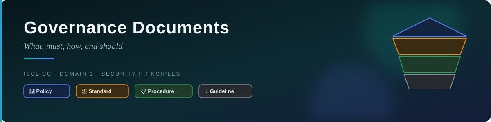
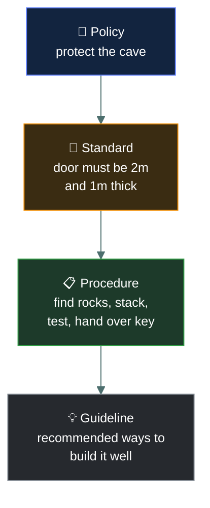
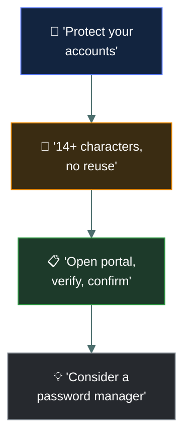
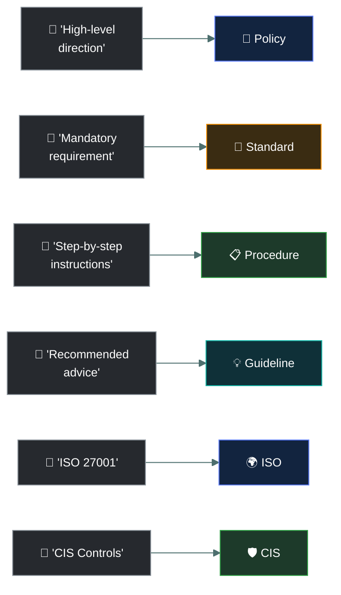

# 📜 Governance Documents — Caveman Style

---

Think of **governance documents** as the rules the tribe uses to keep everyone doing security the
right way.

The four you need to know are:

1. 📜 **Policy**
2. 📏 **Standard**
3. 📋 **Procedure**
4. 💡 **Guideline**

The exam may ask you to **rank them** and identify what each one does.

## 🪨 The Easy Ranking

A useful way to remember the hierarchy is:

> **Policy → Standard → Procedure → Guideline**

Think of Grog's tribe:

**Policy:** 🗣️ "We must protect the cave."

**Standard:** 📏 "Everyone must use a 12-character password."

**Procedure:** 📋 "Here are the exact steps to change your password."

**Guideline:** 💡 "Here are recommended ways to create a strong password."

---

## 1 · 📜 Policy — THE RULE

A **policy** is the highest-level statement.

It says:

> **"What does the organization require or believe?"**

It establishes management's direction and expectations.

**Caveman example:** The tribe leader says: 🗣️ **"All tribe members must protect the food cave."**
That's a **policy**. It doesn't necessarily explain every technical detail.

**Cybersecurity example:** "Company information must be protected from unauthorized access."
That's a policy.

> [!NOTE]
> 📜 **Policy = WHAT and WHY**

---

## 2 · 📏 Standard — THE REQUIRED SPECIFICATION

A **standard** takes the policy and makes it more specific and measurable.

It says:

> **"What specific requirement must everyone follow?"**

**Caveman example:**

Policy: "Protect the food cave."

Standard: "The cave entrance must have a stone door at least 2 meters high and 1 meter thick."

Now Grog knows the required specification.

**Cybersecurity example:**

Policy: "Passwords must be secure."

Standard: "Passwords must be at least 14 characters long."

That's a **standard** because it establishes a specific requirement.

> [!NOTE]
> 📏 **Standard = MUST follow this specific requirement**

---

## 3 · 📋 Procedure — THE STEPS

A **procedure** tells someone:

> **"Exactly how do I do this?"**

It's usually step-by-step.

**Caveman example:**

The standard says: "The cave must have a stone door."

The procedure says:

1. Find large rocks.
2. Move them to the entrance.
3. Stack them.
4. Test the door.
5. Give the key to the cave guard.

That's a **procedure**.

**Cybersecurity example:** A password-reset procedure might say:

1. Open the password-management system.
2. Enter your username.
3. Verify your identity.
4. Enter the new password.
5. Confirm the change.
6. Log out.

> [!NOTE]
> 📋 **Procedure = HOW to do it**

---

## 4 · 💡 Guideline — THE RECOMMENDATION

A **guideline** provides **recommended advice**.

Unlike a standard, it usually isn't a strict mandatory requirement.

**Caveman example:** The tribe says: "It is recommended that you keep your food away from the
fire." That's a **guideline**. It's advice.

**Cybersecurity example:** "Users should avoid using easily guessed words in passwords." That's a
guideline. It provides useful recommendations but generally offers more flexibility than a
standard.

> [!NOTE]
> 💡 **Guideline = SHOULD do this**

---

## 🎯 The Hierarchy

Here's the easiest exam table:

| Document | Main idea | Caveman meaning |
| --- | --- | --- |
| 📜 **Policy** | High-level requirement | "Protect the cave." |
| 📏 **Standard** | Specific mandatory requirement | "Cave door MUST be this strong." |
| 📋 **Procedure** | Step-by-step instructions | "Here's HOW to build it." |
| 💡 **Guideline** | Recommended advice | "Here's a good way to do it." |

### 🧠 Memory sentence

> **Policy says WHAT, Standard says MUST, Procedure says HOW, Guideline says SHOULD.**

---

## 🏢 Real Company Example

Imagine a company creates a password governance system.

**📜 Policy** — "Employees must protect their accounts from unauthorized access." High-level
direction.

**📏 Standard** — "Passwords must be at least 14 characters and must not be reused." Specific
mandatory requirements.

**📋 Procedure** — "To change your password, open the account portal, select 'Change Password,'
verify your identity, enter the new password, and confirm." Step-by-step instructions.

**💡 Guideline** — "Consider using a password manager to generate and store unique passwords."
Recommended advice.

---

## 🌐 ISO and CIS

Now the second part of your exam topic.

You need to recognize **ISO** and **CIS**.

### 🌍 ISO

**ISO** = **International Organization for Standardization**

ISO publishes international standards covering many areas, including information security.

A very important cybersecurity family is:

> 🔐 **ISO/IEC 27000 family**

For example: **ISO/IEC 27001** is associated with requirements for an **Information Security
Management System (ISMS)**.

Think:

> 🌍 **ISO = International standards**

### 🛡️ CIS

**CIS** = **Center for Internet Security**

CIS provides cybersecurity guidance and resources, including the:

> 🛡️ **CIS Controls**

The CIS Controls are a prioritized set of cybersecurity safeguards intended to help organizations
defend against common attacks.

Think:

> 🛡️ **CIS = Practical cybersecurity controls**

---

## ⚠️ Important Exam Distinction

Don't automatically call everything a **standard**.

Your exam may loosely group things as **standards/frameworks**, but technically they can serve
different purposes.

For your study purposes:

**🌍 ISO** — International standards, including the ISO/IEC 27000 family.

**🛡️ CIS** — Cybersecurity best-practice guidance, especially the CIS Controls.

---

## 🧠 Caveman Memory Trick

Imagine the tribe leader is building the world's best cave.

- **📜 Policy** — "PROTECT THE CAVE!"
- **📏 Standard** — "DO IT THIS WAY / MEET THIS REQUIREMENT."
- **📋 Procedure** — "FOLLOW THESE STEPS."
- **💡 Guideline** — "HERE'S A GOOD WAY TO DO IT."

Then remember:

- 🌍 **ISO = International standards**
- 🛡️ **CIS = Cybersecurity controls/guidance**

---

## 🎯 Exam Cheat Sheet

If the question says:

**"High-level management direction"** → 📜 **Policy**

**"Mandatory specific requirement"** → 📏 **Standard**

**"Step-by-step instructions"** → 📋 **Procedure**

**"Recommended advice / best practice"** → 💡 **Guideline**

**"International security standards / ISO 27001"** → 🌍 **ISO**

**"Prioritized cybersecurity safeguards / CIS Controls"** → 🛡️ **CIS**

### One line to memorize

> **Policy = WHAT → Standard = MUST → Procedure = HOW → Guideline = SHOULD → ISO = international
> standards → CIS = cybersecurity controls.**

---

<a href="../README.md">← Back to 01 · Security Principles</a>

