# 📜 Governance Documents

### *Policy, standard, procedure, guideline — and the only one you're allowed to ignore*

📌 *Rank the four documents, sort any sentence into the right one, and know the guideline is the only optional layer.*

---

## 🧸 The big idea

Think about the rules of the road. They come in four levels of detail:

- **"All drivers must drive safely."** — the big *what and why*. Rarely changes. That's a
  **policy**.
- **"The speed limit in town is 50 km/h."** — an exact, mandatory number. That's a **standard**.
- **"Hill start: 1. handbrake on, 2. find the bite, 3. release slowly."** — step by step. That's
  a **procedure**.
- **"Consider leaving a 3-second gap."** — good advice, but nobody fines you for ignoring it.
  That's a **guideline** — the **only optional one**.

**Broad to specific, top to bottom.** The policy rarely changes; the procedure changes whenever the
tools do.

---

## 📖 Words you will keep seeing

| Word | What it means on this exam |
|---|---|
| **Policy** | High-level statement of management **intent** — what and why. **Mandatory.** Approved by **senior management**. |
| **Standard** | A **specific, uniform, mandatory** requirement supporting a policy. |
| **Procedure** | Detailed **step-by-step** instructions. **Mandatory** where it applies. |
| **Guideline** | Recommended good practice. **Optional.** |
| **Baseline** | The **minimum** acceptable security configuration for a type of system. |
| **Regulation / Law** | Imposed by an **external** authority; enforceable by law. |
| **Framework** | A published set of practices an organisation adopts — e.g. ISO 27001, NIST CSF. |
| **AUP** | Acceptable Use Policy — what users may and may not do with company systems. |

---

## 🔍 The explanation

### The hierarchy

| Document | Mandatory? | Says | Typical language | Example |
|---|---|---|---|---|
| **Policy** | ✅ | **What** and **why** | *must, shall* | "Data must be protected according to its classification." |
| **Standard** | ✅ | **What exactly** | *must, shall* + a number | "All laptops must use full-disk encryption with AES-256." |
| **Procedure** | ✅ | **How**, in steps | numbered steps | "1. Open the console. 2. Select the device. 3. Enable encryption." |
| **Guideline** | ❌ **No** | **What you might consider** | *should, consider, recommended* | "Staff should consider a privacy screen in public." |

A few things the exam checks:

- **Policies are technology-neutral and stable.** A policy never names a key length or a
  product — anything with "at least 14 characters" is a **standard**, whatever the file is called.
- **Senior management approves policy** — that's what gives it authority.
- **Policies are reviewed periodically** — typically yearly, and after a major change or incident.
- A **baseline** is a kind of standard: the minimum configuration for a system type (e.g. a
  hardened server build).

### The fastest way to sort a sentence

> [!IMPORTANT]
> **The guideline is the only non-mandatory document.** If a question asks which is optional or
> merely recommended, it's the guideline.

### Where governance sits

Governance is the layer above the documents — who decides and who is accountable:

### Named external standards: ISO and CIS

| Name | What it is |
|---|---|
| **ISO** (e.g. ISO/IEC 27001) | International standards body. ISO 27001 defines requirements for an information security management system (ISMS). |
| **CIS** (Center for Internet Security) | Publishes the **CIS Controls** (a prioritised set of safeguards) and **CIS Benchmarks** (hardening guides per platform). |

ISO and CIS are **external standards/frameworks** you adopt — not a fifth document type. Your own
internal standard can simply point at one: *"Servers must be configured per the relevant CIS
Benchmark."*

---

## ⚖️ Told apart

| | Means | Not to be confused with |
|---|---|---|
| **Policy** | High-level intent; no numbers. | **Standard** — if it has a number, it's a standard. |
| **Standard** | Uniform, mandatory requirement. | **Guideline** — a suggestion. |
| **Procedure** | Ordered steps. | **Standard** — states the requirement, not how to do it. |
| **Guideline** | Optional recommendation. | Everything else — all mandatory. |
| **Policy** | Written internally. | **Regulation** — imposed externally, enforceable by law. |
| **Baseline** | Minimum config for a system type. | **Standard** — broader. |

---

## ⚠️ Where your instinct is wrong

> [!WARNING]
> **In the job:** "policy" means any rule — firewall policy, password policy, group policy.
>
> **On the exam:** a document setting a minimum password length is a **standard**, even if your
> company calls it "the password policy".

> [!WARNING]
> **In the job:** "recommended" means "do it unless you have a reason not to".
>
> **On the exam:** a guideline is **optional**, full stop.

> [!WARNING]
> **In the job:** documentation feels like overhead.
>
> **On the exam:** "establish a policy" is often the correct **first** step for an
> organisation-wide problem — before any technical control.

---

## 🧠 How to remember it

**What · What exactly · How · Maybe** — Policy · Standard · Procedure · Guideline.

**"Only the Guideline is a Guess."**

**Numbers → standard. Steps → procedure. Should → guideline.**

---

## ✅ Check you actually got it

Answer all five before expanding anything.

**Q1.** Which of the following documents is NOT mandatory?

- **A.** Policy
- **B.** Standard
- **C.** Procedure
- **D.** Guideline

<b>Answer</b>

**D — guideline.** Advice, not requirement.

- **A**, **B** and **C** are all mandatory — policy binds the organisation, standards implement
  it, and procedures must be followed where they apply.

**Q2.** A document states: "All portable devices must use full-disk encryption with a minimum key
length of 256 bits." What kind of document is this?

- **A.** Policy
- **B.** Standard
- **C.** Procedure
- **D.** Guideline

<b>Answer</b>

**B — standard.** A specific, uniform, mandatory requirement — the number gives it away.

- **A** would be technology-neutral ("data on portable devices must be protected").
- **C** would give the steps to switch encryption on.
- **D** would say *should consider*. This says **must**.

**Q3.** Who approves an organisation's information security policy?

- **A.** The information security manager
- **B.** Senior management
- **C.** The internal audit function
- **D.** The IT department

<b>Answer</b>

**B — senior management.** Their approval gives the policy authority.

- **A** usually *drafts* it — drafting isn't approving.
- **C** checks compliance independently; approving would compromise that.
- **D** implements it; one department can't give a company-wide policy authority.

**Q4.** An organisation's policy requires data classification. Which document would specify the
exact labels — Public, Internal, Confidential, Restricted?

- **A.** The policy itself
- **B.** A standard
- **C.** A procedure
- **D.** A guideline

<b>Answer</b>

**B — a standard.** A specific, uniform, mandatory set everyone uses identically.

- **A** would say data must be classified and why.
- **C** would explain how to apply a label.
- **D** is optional — an opt-out label scheme would defeat classification.

**Q5.** Which statement about the document hierarchy is correct?

- **A.** Procedures are written first, and policies are derived from them
- **B.** Standards are optional recommendations supporting mandatory policies
- **C.** Policies are high-level and stable; procedures are detailed and change more often
- **D.** Guidelines carry the same enforcement weight as standards

<b>Answer</b>

**C.** Policy is enduring intent; procedures track tools that change constantly.

- **A** inverts the hierarchy.
- **B** — standards are mandatory; guidelines are the optional layer.
- **D** — guidelines carry no enforcement weight.

---

## 🎓 The grown-up version

<b>Extra depth — open this on a second read, never needed for the pass</b>

**Why the layers are worth the bureaucracy.** Separating intent from detail lets you change an
encryption standard without reopening a board-approved policy, and update a procedure when a
console changes without touching either. Organisations that cram key lengths and click-by-click
steps into one "security policy" need executive sign-off for every product upgrade — so it goes
stale.

**Exceptions are part of the system.** When a system can't meet a standard: a documented request,
risk assessment, compensating controls, approval by someone with authority to accept the risk, and
an expiry date. An exception *is* a documented risk acceptance.

**Documents have a lifecycle.** Draft → review → senior-management approval → publish with a
version number and effective date → annual review. The version history lets an investigator prove
exactly which rule was in force on a given day. Missing evidence of reviews is one of the most
common audit findings.

**A framework tells you what to have; your documents say what you do.** You can't "implement ISO
27001" without writing your own policies, standards and procedures.

---

## 📝 Cram lines

Destined for [`EXAM-DAY.md`](../../EXAM-DAY.md):

- **Policy** (what/why) → **Standard** (what exactly) → **Procedure** (how, steps). **Guideline = optional.**
- **Numbers → standard. Steps → procedure. Should/consider → guideline.**
- **Senior management approves policy.** Policies are technology-neutral and reviewed periodically.
- **ISO 27001 and CIS Controls/Benchmarks** = external standards/frameworks you adopt.

---

<a href="../README.md">← back to 01 · Security Principles</a> &nbsp;·&nbsp; <a href="../isc2-code-of-ethics/">next: ISC2 Code of Ethics →</a>

