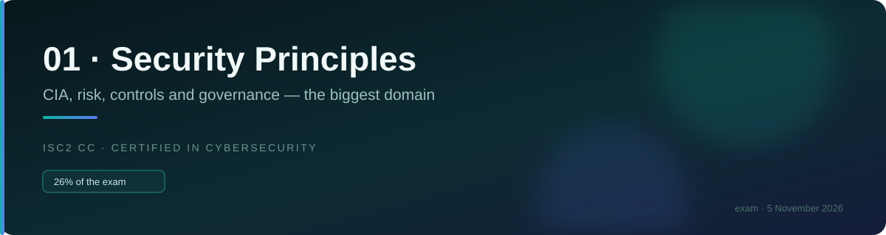

# ⚖️ The ISC2 Code of Ethics

### *Four canons, and the order they are in is the answer to the question*

📌 *Guaranteed marks. The canons are short, they are ranked, and the ranking is precisely what gets tested.*

---

## 🧸 The big idea

Before a caveman is allowed to become a tribe guard, he swears an oath to the elders, in a
strict order — and the order matters, because one day two parts of that oath will pull against
each other, and he needs to already know which one wins.

*"First, I will protect the whole tribe, even above the family who pays me to guard their
things. Second, I will act honestly and keep my word. Third, I will serve well whoever
specifically hired me. Fourth, I will bring honour to guards as a group, not shame."*

If the chief's own family asks him to look the other way while they steal from a neighbour, the
oath already answers it: protecting the whole tribe (first) beats serving the family who hired
him (third). He doesn't have to think hard — the order was fixed the day he swore it.

That's the whole idea. Every ISC2 certification holder agrees to abide by a Code of Ethics. It
has a preamble and **four canons**, and they are listed in a deliberate order.

**The order is not decorative. It is a priority ranking.** When two canons conflict, the one
listed first wins. That single fact answers most of the ethics questions on the exam.

The four, in order:

| | Canon |
|:--:|---|
| **1** | Protect society, the common good, necessary public trust and confidence, and the infrastructure. |
| **2** | Act honourably, honestly, justly, responsibly, and legally. |
| **3** | Provide diligent and competent service to principals. |
| **4** | Advance and protect the profession. |

Read down that list and the priority becomes intuitive: **society, then the law, then your
employer, then the profession.**

The public comes before your client. That is the point of a professional code, and it is the
thing candidates get wrong — because in daily work the employer's interests feel primary.

---

## 📖 Words you will keep seeing

| Word | What it means on this exam |
|---|---|
| **Canon** | One of the four principles of the Code. |
| **Principal** | The person or organisation you serve — employer, client, or the person whose interests you are engaged to protect. |
| **The common good** | The interests of society at large, beyond any one organisation. |
| **Necessary public trust** | Public confidence in information systems and in the profession that secures them. |
| **Ethics complaint** | A formal allegation that a certification holder has breached the Code. |
| **Preamble** | The introductory statement of the Code, which establishes that adherence is a condition of certification. |

---

## 🔍 The four canons

### 1 · Protect society, the common good, necessary public trust and confidence, and the infrastructure

**The highest duty, above every other consideration.**

This is why a security professional cannot stay silent about a flaw that endangers the public
merely because an employer prefers silence. Public safety and public trust outrank the
employer's convenience, reputation and commercial interest.

### 2 · Act honourably, honestly, justly, responsibly, and legally

**Personal integrity and obedience to the law.**

Covers honesty in your dealings, not misrepresenting your qualifications or findings, avoiding
conflicts of interest, and not breaking the law even when asked to. An instruction from an
employer does not make an illegal act acceptable.

> ⚠️ Being *told* to do something unlawful is not a defence, and "I was following orders" is
> never the correct answer.

### 3 · Provide diligent and competent service to principals

**Serve your employer and clients well — within the limits of the two canons above.**

Diligent means thorough and careful. Competent means within your actual ability — which carries
an obligation to decline work you are not qualified to do, rather than attempting it and hoping.

It also covers protecting the confidentiality of information your principals entrust to you.

### 4 · Advance and protect the profession

**Uphold the standing of the field.**

Maintain your skills, mentor others, do not bring the profession into disrepute, do not
associate your professional standing with dishonest activity, and do not certify or endorse
people who are not qualified.

---

## ⚔️ When canons conflict

This is what the exam actually tests.

**Society beats legality beats employer beats profession.**

Some worked conflicts:

| Situation | Resolution |
|---|---|
| Employer asks you to conceal a breach that endangers customers | **Canon 1 wins.** Public trust and safety outrank the employer's preference. |
| Employer asks you to do something illegal | **Canon 2 wins.** Serving the employer never requires breaking the law. |
| You are offered work you are not qualified to perform | **Canon 3.** Competent service means declining, not attempting it. |
| A colleague is falsifying certification credentials | **Canon 4.** Protecting the profession means not ignoring it. |
| Employer's commercial interest conflicts with public safety | **Canon 1 wins**, always. |

> [!IMPORTANT]
> **Society and the public come before your employer.** If an option protects the employer at the
> public's expense, it is wrong — no matter how loyal or commercially sensible it sounds.

---

## 🔬 How Canon 1 actually plays out: coordinated disclosure

The grown-up section mentions that "disclose or conceal" is too clean a choice in reality. The
real mechanism professionals use is called **Coordinated Vulnerability Disclosure (CVD)**, and
it has a genuinely standard shape.

A researcher who finds a flaw reports it **privately** to the vendor first, rather than
tweeting it — a vendor blindsided in public has no chance to protect users before attackers
notice too. A **CVE ID** is reserved immediately so the flaw has a stable reference, but kept
unpublished. The vendor typically gets a fixed window — **90 days is the industry-standard
figure**, popularised by Google's Project Zero team — to build and ship a fix before the
researcher publishes regardless of whether a patch exists, which is the actual teeth that
keeps vendors from sitting on reports indefinitely. Many companies now run this whole process
through a **bug bounty platform** (HackerOne, Bugcrowd), paying researchers for the reports and
formalising the embargo and payout in one system.

This is what a Canon 1 decision usually looks like in practice: not "say nothing" versus
"publish immediately," but choosing to work the CVD process responsibly instead of either
extreme.

---

## ⚖️ Told apart

| Canon | Protects | Trigger words in a question |
|---|---|---|
| **1 · Society** | The public, infrastructure, public trust | *public*, *safety*, *customers at large*, *critical infrastructure*, *concealment* |
| **2 · Honour** | Integrity and legality | *illegal*, *dishonest*, *misrepresent*, *conflict of interest*, *falsify* |
| **3 · Principals** | Employer and clients | *client*, *employer*, *confidential information*, *competence*, *qualified* |
| **4 · Profession** | The standing of the field | *colleague*, *credentials*, *reputation of the profession*, *mentoring* |

> 🎯 **Scan the question for whose interest is at stake.** Public → Canon 1. Law or honesty →
> Canon 2. Employer or client → Canon 3. The profession itself → Canon 4.

---

## ⚠️ Where your instinct is wrong

> [!WARNING]
> **In the job:** your first loyalty is to your employer. You do not go outside the organisation
> with a problem — you escalate internally and respect confidentiality.
>
> **On the exam:** **the public outranks your employer.** Canon 1 sits above Canon 3 precisely so
> that a professional cannot be instructed into concealing a danger to the public.

> [!WARNING]
> **In the job:** you take on unfamiliar work and learn it as you go. That is how careers are
> built.
>
> **On the exam:** accepting work you are not competent to perform breaches Canon 3. The expected
> answer is to decline, or to disclose the limitation, rather than to attempt it.

> [!WARNING]
> **In the job:** reporting a colleague feels disloyal and is rarely anyone's first move.
>
> **On the exam:** falsified credentials or dishonest conduct damages the profession, and Canon 4
> expects it to be addressed rather than ignored.

---

## 🧠 How to remember it

🧠 **Society · Honour · Principals · Profession** — **"SHPP"**, or read it as a sentence:
*protect the public, be honest, serve your client, uphold the field.*

🧠 **The ranking, in four words:** **Public → Legal → Employer → Profession.**

🧠 **Lower number wins.** Whenever two canons pull in different directions, take the earlier one.

---

## ✅ Check you actually got it

Answer all five before expanding anything.

**Q1.** A security professional discovers that their employer's product contains a flaw that
could endanger users. The employer instructs them to say nothing. According to the Code of
Ethics, what takes priority?

- **A.** The employer's instruction, under the duty of diligent service to principals
- **B.** Protecting society and the public trust
- **C.** Advancing and protecting the profession
- **D.** The professional's employment contract

<b>Answer</b>

**B — protecting society and the public trust.** Canon 1 is the first and highest duty, and it
sits above the duty to principals precisely so that a professional cannot be instructed into
concealing a public danger.

- **A** invokes Canon 3, which is genuinely a real duty — but it is third in the ranking and
  yields to Canon 1. This is the most tempting option because employer loyalty is the everyday
  instinct.
- **C** is Canon 4, the lowest priority of the four, and is not what the scenario turns on.
- **D** is not part of the Code at all. A contract cannot override an ethical obligation the
  professional accepted as a condition of certification.

**Q2.** What is the correct order of the four canons?

- **A.** Protect the profession; serve principals; act honourably; protect society
- **B.** Protect society; act honourably; serve principals; advance the profession
- **C.** Act honourably; protect society; advance the profession; serve principals
- **D.** Serve principals; protect society; act honourably; advance the profession

<b>Answer</b>

**B — protect society; act honourably; serve principals; advance the profession.** Public,
legal, employer, profession — and the order is a priority ranking, not a list.

- **A** is exactly reversed, putting the profession first and society last.
- **C** and **D** shuffle the middle and start from the wrong canon.

Since the ordering is the thing being tested, it is worth being able to recite it rather than
reconstruct it under pressure.

**Q3.** A consultant is offered a penetration testing engagement involving a specialised
technology they have never worked with. What does the Code require?

- **A.** Accept the work and research the technology during the engagement
- **B.** Accept the work but reduce the fee to reflect the inexperience
- **C.** Decline, or disclose the limitation and arrange appropriate support
- **D.** Accept, since practical experience is how professionals develop

<b>Answer</b>

**C — decline, or disclose the limitation and arrange support.** Canon 3 requires *competent*
service, and competence is an obligation rather than an aspiration. Honesty about one's limits is
also Canon 2.

- **A** delivers work of unknown quality to a client who believes they are getting expertise — a
  failure of both competence and honesty.
- **B** treats competence as something that can be discounted. A cheaper inadequate test is still
  an inadequate test, and the client's risk is unchanged.
- **D** describes how careers genuinely develop, which is what makes it a good distractor — but
  development belongs in supervised or disclosed arrangements, not in silently accepting work
  beyond your ability.

**Q4.** A certification holder discovers a colleague has falsified their security credentials on
a professional profile. Which canon is MOST directly engaged?

- **A.** Canon 1 — protect society
- **B.** Canon 2 — act honourably
- **C.** Canon 3 — provide diligent service to principals
- **D.** Canon 4 — advance and protect the profession

<b>Answer</b>

**D — Canon 4.** Falsified credentials devalue legitimate certifications and damage public
confidence in the profession, which is precisely what Canon 4 exists to protect.

- **A** would engage if the falsification placed the public in danger — for example, an unqualified
  person running safety-critical systems. The stem does not establish that.
- **B** concerns the *professional's own* honourable conduct. The colleague has breached it; the
  question asks which canon governs the discoverer's obligation.
- **C** concerns service to employers and clients, which this scenario does not describe.

**Q5.** An employer asks a security professional to access a competitor's systems without
authorisation to assess their defences. What should the professional do?

- **A.** Comply, since the employer is the principal and directs the work
- **B.** Refuse, because the request is illegal and breaches the Code
- **C.** Comply, but document the instruction to establish that it came from the employer
- **D.** Comply only if the employer provides written authorisation

<b>Answer</b>

**B — refuse.** Canon 2 requires acting legally, and unauthorised access to another
organisation's systems is a criminal offence in most jurisdictions. Canon 3's duty to principals
never extends to unlawful acts.

- **A** treats the duty to the employer as unlimited. It is explicitly subordinate to Canons 1
  and 2.
- **C** is the sophisticated-looking wrong answer. Documenting an instruction does not make the
  act lawful, and "following orders" is not a defence, ethically or legally.
- **D** misunderstands who can authorise access. Only the *owner* of the target systems can
  authorise testing against them. An employer cannot grant permission over property it does not
  own.

---

## 🎓 The grown-up version

<b>Extra depth — open this on a second read, never needed for the pass</b>

**The Code is short on purpose.** Four canons and a brief preamble, rather than an exhaustive
rulebook. Professional codes are written this way deliberately: an enumerated list of prohibited
acts invites the reading that anything not listed is permitted, whereas broad principles require
judgement and cover situations the drafters never imagined. The cost is ambiguity in genuine
edge cases, which is why the ordering matters so much — it is the tie-breaking mechanism built
into an otherwise open-textured document.

**Complaints are real and have consequences.** ISC2 operates a formal ethics complaint process,
and breaches can result in revocation of certification. Standing to complain is tiered: anyone
may bring a complaint under Canons 1 and 2, while complaints under Canon 3 may generally only be
brought by someone in a principal relationship with the professional, and under Canon 4 by other
professionals. That tiering exists to stop Canons 3 and 4 becoming vehicles for commercial
grievances between competitors.

**Where Canon 1 gets genuinely hard.** The exam presents clean conflicts — conceal a danger or
disclose it. Real disclosure decisions are far messier. Publishing a vulnerability protects the
public in the long run and arms attackers in the short run; the entire practice of coordinated
disclosure exists to navigate that tension, with negotiated timelines, embargoes and vendor
notification periods. A professional acting on Canon 1 is usually choosing *how* and *when* to
disclose responsibly, rather than choosing between silence and a press release.

**Whistleblowing has legal structure.** Going outside the organisation carries real personal risk,
and many jurisdictions provide statutory protections for disclosures made through defined
channels — regulators, ombudsmen, prescribed bodies — which are typically not extended to
disclosures made straight to the media. The ethical obligation and the legal protection are
separate things, and someone genuinely facing this situation should take advice rather than act
on a canon alone.

**Why ethics is on a technical exam at all.** Certification is a claim to the public that the
holder can be trusted, not merely that they know things. That claim is what gives a certification
value in a hiring market, and it only holds if holders can be removed for dishonourable conduct.
The Code is the mechanism that makes the claim enforceable.

---

## 📝 Cram lines

Destined for [`EXAM-DAY.md`](../../EXAM-DAY.md):

- **The four canons, in order:**
  1. **Protect society**, the common good, necessary public trust and confidence, and the infrastructure.
  2. **Act honourably, honestly, justly, responsibly, and legally.**
  3. **Provide diligent and competent service to principals.**
  4. **Advance and protect the profession.**
- **"Public → Legal → Employer → Profession."**
- **The order is a PRIORITY RANKING. When canons conflict, the lower number wins.**
- **Society beats your employer.** Concealing a public danger for an employer = Canon 1 breach.
- **An employer's instruction never legitimises an illegal act.** "Following orders" is never right.
- **Accepting work you are not competent to do breaches Canon 3.** Decline or disclose.

---

<a href="../README.md">← back to 01 · Security Principles</a> &nbsp;·&nbsp; <a href="../due-care-and-due-diligence/">next: Due care and due diligence →</a>

