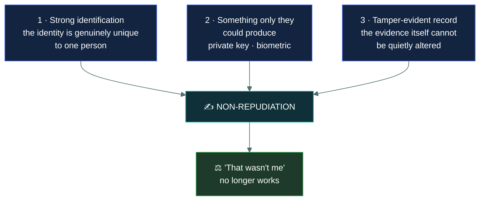
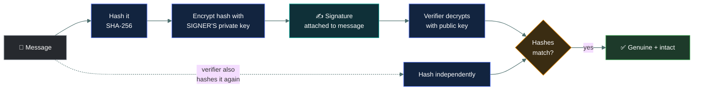

# ✍️ Non-repudiation

### *Making it impossible to credibly say "that wasn't me"*

📌 *A small topic that appears constantly as a distractor on CIA questions. Know what it is, what provides it, and that it is not part of the triad.*

---

## 🧸 The big idea

Imagine a caveman making a trade deal: three baskets of berries for a spear. To seal it, he
presses his thumb into a soft clay tablet, and the clay hardens overnight.

Weeks later he tries to back out: *"I never agreed to that trade."* The tribe elder just points
at the tablet. His exact thumbprint — the one ridge pattern nobody else on Earth has — is baked
into stone. He can't smudge it out without it being obvious, and nobody else could have pressed
that print. He's stuck. **He cannot credibly deny it.**

That's the whole idea. **Repudiation** means denying that you did something. *I never sent that
email. I never approved that payment. I never signed that agreement.*

**Non-repudiation** is the property that makes such a denial impossible to sustain — you can
prove, to someone who was not there, that a specific person did a specific thing.

The word "prove" is doing the work. Non-repudiation is not about *your* confidence that Ahmed
sent the message. It is about having evidence strong enough that Ahmed cannot successfully deny
it in front of a third party — an auditor, a manager, a court.

That is why an ordinary log entry is not enough on its own. A log says "the system recorded that
Ahmed did this". Ahmed can reply: *somebody used my account*, or *an administrator could have
edited that log*. Genuine non-repudiation requires evidence that only Ahmed could have produced.

---

## 📖 Words you will keep seeing

| Word | What it means on this exam |
|---|---|
| **Repudiation** | Denying having performed an action. |
| **Non-repudiation** | Assurance that someone cannot successfully deny having performed an action. |
| **Digital signature** | A value created with a signer's **private key** that proves origin and integrity. The classic non-repudiation mechanism. |
| **Private key** | A key held by exactly one party and never shared. Its uniqueness is what makes signatures binding. |
| **Public key** | The matching key, distributed freely, used to verify a signature. |
| **Certificate** | A document binding a public key to a verified identity, issued by a certificate authority. |
| **Audit trail** | A chronological record of actions. Supports non-repudiation; does not by itself guarantee it. |
| **Attribution** | Tying an action to an identity. |

---

## 🔍 How non-repudiation is achieved

The clay tablet worked because of three things at once: the thumbprint was uniquely his, only
his thumb could have made it, and the hardened clay couldn't be quietly edited afterward.
Non-repudiation needs those same three things together, digitally. Take any one away and the
denial becomes credible.

### ✍️ Digital signatures — the primary mechanism

If the exam asks what provides non-repudiation, **digital signature** is the expected answer.

The logic is short. The signer holds a private key that nobody else has. Signing produces a value
that could only have been created with that key. Anyone can verify it with the matching public
key. So the signature proves two things at once:

- **Origin** — it came from the holder of that private key, and nobody else could have made it.
- **Integrity** — the content has not changed since signing, because any change breaks
  verification.

The whole guarantee rests on the private key being genuinely private. If the key is shared,
stolen or held in a place several people can reach, non-repudiation evaporates — the signer can
truthfully say somebody else could have signed.

### 📋 Audit logs — supporting, not sufficient

Logs contribute, but they are weaker evidence, for two reasons: an account can be shared or
compromised, and logs can often be altered by the very administrators they record.

Logs approach genuine non-repudiation when they are made harder to dispute — unique per-person
accounts, strong authentication, write-once or centrally shipped storage, and integrity
protection on the log itself.

> 🎯 If a question offers both "audit logging" and "digital signatures" as sources of
> non-repudiation, **digital signatures** is the stronger and expected answer.

### 🎥 Other contributors

**Video recording** of a physical action. **Biometric authentication**, since a fingerprint
cannot be lent to a colleague the way a password can. **Witnessed signatures** and notarisation
in the physical world. **Blockchain-style append-only ledgers**, where the record cannot be
rewritten after the fact.

---

## 🔬 How a signature is actually built and checked

**A signature never encrypts the whole message — it signs a hash of it.** Signing algorithms
like **RSA** or **ECDSA** would be far too slow to run over a large file directly, so the signer
hashes the message down to a fixed-size fingerprint (SHA-256) and signs *that* instead. The
verifier independently hashes the received message and checks it against what the signature
reveals when opened with the signer's public key. If a single byte of the message changed in
transit, the two hashes won't match — which is exactly how one signature proves both origin and
integrity at once.

**The private key almost never sits on a laptop's hard drive in serious deployments.** It lives
inside a **Hardware Security Module (HSM)** or a smart card's own chip — hardware built so the
key can be *used* to sign but never *extracted*, even by the device's own owner. This is the
real-world answer to "how do you stop someone claiming their key was copied": if the key
physically cannot leave the hardware, that denial stops being credible.

**Where this shows up day to day:** **code signing** certificates are why your OS warns you
before running unsigned software, and refuses to warn for signed software from a known
publisher. **S/MIME and PGP** apply the same idea to email. **RFC 3161 timestamping** has a
trusted third party counter-sign a document with an authoritative time, closing the "the signer
could have backdated their own clock" gap mentioned below. And every cryptocurrency transaction
is, underneath the marketing, exactly this signature scheme — the "wallet" is really just a
private key, and a transaction is only valid on the network once signed with it.

---

## 🚫 What non-repudiation is not

> [!IMPORTANT]
> **Non-repudiation is not part of the CIA triad.** The triad is exactly three: confidentiality,
> integrity, availability. Non-repudiation is a separate security concept that sits alongside it.

This matters because non-repudiation is one of the most common distractors on CIA questions. Any
question that asks "which element of the CIA triad..." and offers non-repudiation as an option is
offering a wrong answer by construction.

It is also **not the same as integrity**, though the two travel together. Integrity says the
message was not changed. Non-repudiation says a particular person sent it. A message can be
perfectly intact and still anonymous — integrity intact, non-repudiation absent.

And it is **not authentication**. Authentication convinces *the system*, right now, that you are
who you say. Non-repudiation convinces *a third party*, later, that it was you. Authentication is
a gate; non-repudiation is evidence.

---

## ⚖️ Told apart

| | Means | Not to be confused with |
|---|---|---|
| **Non-repudiation** | The signer cannot credibly deny the action to a third party. | **Authentication**, which proves identity to the system at the moment of access. |
| **Non-repudiation** | Proof of *who* acted. | **Integrity**, which is proof that the content did not change. A digital signature delivers both, which is why they get confused. |
| **Digital signature** | Created with the signer's **private** key; verified with the public key. Proves origin and integrity. | **Encryption for confidentiality**, which uses the recipient's **public** key so only they can decrypt. Opposite keys, opposite purposes. |
| **Digital signature** | A cryptographic proof of origin. | **An electronic signature** — a typed name or scanned image — which carries no cryptographic proof at all. |
| **Audit log** | A record of what happened. Supports non-repudiation. | **Non-repudiation itself**, which needs evidence only the actor could have produced. |
| **Accountability** | Being able to trace an action to a person, mainly for internal purposes. | **Non-repudiation**, which is the stronger form that holds up against the person's own denial. |

> [!CAUTION]
> **The key direction is a reliable exam item.** Sign with your **private** key so everyone can
> verify. Encrypt with the recipient's **public** key so only they can read. If you can hold those
> two straight, several questions across Domains 1 and 5 fall out easily.

---

## ⚠️ Where your instinct is wrong

> [!WARNING]
> **In the job:** your SIEM logs are your evidence, and you would present them in an
> investigation without hesitation.
>
> **On the exam:** logs *support* non-repudiation but do not guarantee it, because accounts get
> shared and logs get edited. When a stronger option is present, take the cryptographic one.

> [!WARNING]
> **In the job:** non-repudiation is a legal-sounding word that rarely comes up in day-to-day
> operations.
>
> **On the exam:** it is a named concept with a defined mechanism, and it shows up repeatedly as a
> distractor. Learn it precisely even though it feels peripheral.

---

## 🧠 How to remember it

🧠 **"You can't say it wasn't you."** That sentence is the whole definition.

🧠 **Non-repudiation = signature.** If the question is about proving who did something, look for
the digital signature.

🧠 **Private signs, public verifies. Public encrypts, private decrypts.** Two short sentences that
settle most key-direction questions.

---

## ✅ Check you actually got it

Answer all five before expanding anything.

**Q1.** Which mechanism BEST provides non-repudiation for an electronic transaction?

- **A.** Encrypting the transaction with a symmetric key shared by both parties
- **B.** Digitally signing the transaction with the sender's private key
- **C.** Recording the transaction in the application's audit log
- **D.** Requiring multi-factor authentication before the transaction is submitted

<b>Answer</b>

**B — digitally signing with the sender's private key.** Only the sender holds that key, so only
the sender could have produced the signature. That is precisely what makes denial impossible.

- **A** provides confidentiality, and a *shared* symmetric key actively destroys non-repudiation —
  either party could have produced anything encrypted with it, so neither can be held to it.
- **C** supports non-repudiation but is weaker. Logs can be altered by administrators and accounts
  can be shared, both of which leave room for a credible denial.
- **D** strengthens authentication at the moment of the transaction. It makes the claim harder to
  dispute but produces no artefact a third party can independently verify afterwards.

**Q2.** A user denies having sent an email that was digitally signed with their private key. Which
statement is correct?

- **A.** The denial is credible, because private keys are routinely shared
- **B.** The signature provides non-repudiation, assuming the private key was properly protected
- **C.** The signature only proves the message was not modified, not who sent it
- **D.** Non-repudiation cannot apply to email under any circumstances

<b>Answer</b>

**B — the signature provides non-repudiation, assuming the key was properly protected.** The
caveat is essential and is exactly why this option is correctly worded: the guarantee rests
entirely on the private key being held by one person and nobody else.

- **A** is wrong on the premise. Private keys are *not* meant to be shared, and a properly
  operated system ensures they are not. This is the whole reason the mechanism works.
- **C** describes only half of what a signature does. It proves integrity *and* origin — origin
  is precisely the non-repudiation part.
- **D** is an absolute and false. Signed email (S/MIME, PGP) is a standard deployment of exactly
  this.

**Q3.** Which element of the CIA triad does non-repudiation belong to?

- **A.** Integrity
- **B.** Confidentiality
- **C.** Availability
- **D.** None — non-repudiation is not part of the CIA triad

<b>Answer</b>

**D — none.** The triad is exactly three properties. Non-repudiation is a separate concept that
sits alongside it, and questions offering it as a CIA element are offering a distractor.

- **A** is the strongest wrong answer, because digital signatures deliver integrity as well as
  non-repudiation. The two are related; they are not the same, and non-repudiation is not a
  sub-part of integrity.
- **B** is wrong — non-repudiation says nothing about who may *see* information.
- **C** is wrong — it says nothing about access or uptime.

**Q4.** An organisation wants staff-approved expense claims to be provably attributable to the
approver. Which combination BEST achieves this?

- **A.** A shared departmental approval account with detailed logging
- **B.** Individual accounts with password authentication and audit logging
- **C.** Individual accounts with digital signatures applied to each approval
- **D.** Email confirmations sent to the approver's manager

<b>Answer</b>

**C — individual accounts with digital signatures on each approval.** Unique identity plus a
cryptographic artefact only that person could produce is the full recipe.

- **A** is the weakest option. A shared account destroys attribution entirely, however good the
  logging is — the log names the account, not the person.
- **B** is a reasonable baseline and provides accountability, but a password can be shared or
  phished, leaving room for a credible denial. It is good; C is better, and the qualifier is BEST.
- **D** creates a notification, not evidence. It records that a message was sent, not that a
  specific person approved anything.

**Q5.** Which statement correctly describes key usage?

- **A.** A message is signed with the recipient's public key and verified with their private key
- **B.** A message is signed with the sender's private key and verified with the sender's public key
- **C.** A message is signed with a shared symmetric key held by both parties
- **D.** A message is signed with the sender's public key and verified with the recipient's private key

<b>Answer</b>

**B — signed with the sender's private key, verified with the sender's public key.** Only the
sender can sign; anybody can verify. That asymmetry is what makes the signature binding.

- **A** describes the direction used for *encryption* — you encrypt with the recipient's public
  key so only they can decrypt — not for signing.
- **C** is the symmetric case, which cannot provide non-repudiation at all, because both parties
  hold the same key and either could have produced the value.
- **D** mixes the pairs incorrectly. A public key never signs, and a recipient's private key never
  verifies a sender's signature.

---

## 🎓 The grown-up version

<b>Extra depth — open this on a second read, never needed for the pass</b>

**Non-repudiation is ultimately a legal claim, not a mathematical one.** Cryptography can
establish that a particular private key produced a signature. It cannot establish that the human
the certificate names was sitting at the keyboard. Real disputes turn on that gap: was the key
stored in hardware or in a file anyone could copy, was the device compromised, who had
administrative access to the machine. This is why key management and hardware-backed key storage
matter so much more than the choice of algorithm, and why legal frameworks for electronic
signatures spend most of their text on process rather than mathematics.

**Why a shared symmetric key cannot do this.** With symmetric cryptography both parties hold the
same secret, so anything one party can produce, the other could have forged. A message
authentication code proves the message came from *someone holding the key* — good enough for
integrity and authenticity between two trusting parties, useless the moment those parties are in
dispute. Non-repudiation fundamentally requires asymmetry: something one party can do that the
other cannot.

**Repudiation as an attack category.** In Microsoft's STRIDE threat model, the R stands for
Repudiation, treated as a threat in its own right — an attacker performing actions the system
cannot attribute to them, or denying actions they did perform. Controls against it are the ones
above: unique identity, strong authentication, tamper-evident logging, signatures.

**Timestamping.** A signature proves who, but not reliably *when* — a signer can set their own
clock. Trusted timestamping services counter-sign a document with an authoritative time, and for
anything with a deadline or a sequence that matters, the timestamp is as important as the
signature. Out of scope for CC, but it is the obvious next question once you understand what a
signature does and does not prove.

---

## 📝 Cram lines

Destined for [`EXAM-DAY.md`](../../EXAM-DAY.md):

- **Non-repudiation = "you can't say it wasn't you."** Proof to a *third party*.
- **Digital signature is the mechanism.** If the question asks what provides it, that is the answer.
- **Private key SIGNS, public key VERIFIES.** Public key ENCRYPTS, private key DECRYPTS.
- **NOT part of the CIA triad.** Common distractor on CIA questions.
- **Not the same as integrity.** Integrity = content unchanged. Non-repudiation = who did it.
- **Audit logs support it but don't guarantee it** — accounts get shared, logs get edited.
- **A shared symmetric key destroys non-repudiation** — either party could have produced it.

---

<a href="../README.md">← back to 01 · Security Principles</a> &nbsp;·&nbsp; <a href="../privacy/">next: Privacy →</a>

