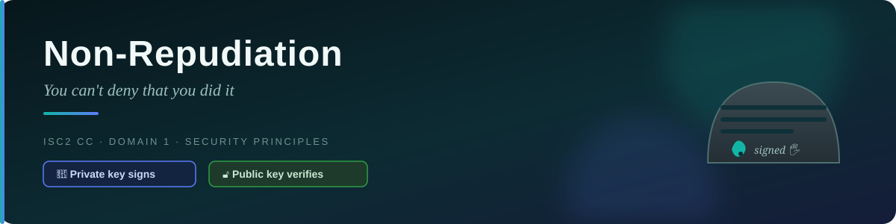
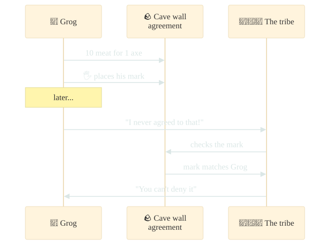

# 🧾 Non-Repudiation — Caveman Style

---

Let's continue with Grog. 🪨

You already know:

- 🔐 **Authentication** = "Who are you?"
- 🎫 **Authorization** = "What are you allowed to do?"
- 📋 **Accounting** = "What did you do?"

Now we have another important security concept:

> 🧾 **Non-repudiation = "You can't deny that you did it."**

## 🪨 Caveman example

Imagine Grog wants to trade 10 pieces of meat for another caveman's special stone axe.

They make a written agreement on a cave wall:

> Grog gives 10 meat → Grog receives 1 axe

Grog puts his special symbol next to the agreement. 🖐️

Later, Grog says:

> "I never agreed to that!"

But the tribe can look at the agreement and verify that Grog created/approved it.

Grog can't reasonably deny that he made the transaction.

That's the basic idea of non-repudiation.

## 💻 Computer example

Imagine you send someone a digitally signed document.

For example:

> "I agree to buy this company for $1 million."

You use a digital signature to sign the document.

Later, you say:

> "I never signed that!"

A properly implemented digital-signature system can provide evidence that:

1. The document was signed using your private key.
2. The document has not been altered since it was signed.
3. The signature can be verified using your public key.

Therefore, you have much less ability to falsely deny having signed it.

That's non-repudiation.

## 🔏 How does it work?

One major technology used for non-repudiation is a digital signature.

Think of it like Grog's special unforgeable cave mark.

Grog writes a message:

> "Give 10 meat to Bob."

Grog digitally signs it.

The recipient can verify the signature.

If the signature is valid, they have evidence that the message was signed by the holder of the
corresponding private key and that the signed data wasn't altered.

## 🔑 Private key and public key

Digital signatures commonly use public-key cryptography.

Think of it this way:

> [!IMPORTANT]
> **🔑 Private key** — Grog keeps this secret. "Only Grog should have this."
>
> **🔓 Public key** — Grog can give this to everyone. "Anyone can use this to verify my signature."

So:

> Private key → creates signature
> Public key → verifies signature

## ✏️ Non-repudiation vs Integrity

These two are easy to confuse.

### ✏️ Integrity

Asks:

> "Was the information changed?"

Example:

Grog signs:

> "Give Bob 10 meat."

Someone changes it to:

> "Give Bob 100 meat."

The signature verification should fail.

That's an integrity issue.

### 🧾 Non-repudiation

Asks:

> "Can Grog credibly deny that he signed/approved this?"

The digital signature provides evidence associated with Grog's signing key.

## 🔐 Non-repudiation vs Authentication

Also important:

**Authentication** — "Who are you?"

**Non-repudiation** — "Can you later deny performing this action?"

For example:

Grog logs into the system with his password.

That's authentication.

Grog digitally signs a contract.

That can provide non-repudiation evidence.

## 🏦 Real-world example

Imagine you make an online banking transaction.

You digitally authorize a payment.

The system records and cryptographically protects evidence of the authorization.

Later, you say:

> "I didn't authorize this payment."

Depending on the system and applicable rules, digital signatures, authentication records,
timestamps, and audit logs may help establish what happened.

This is why non-repudiation is useful in:

- 🏦 Banking
- 📄 Digital contracts
- 💼 Business transactions
- 📧 Secure communications
- 🏛️ Government systems
- 🛒 Online transactions

## 🧠 Caveman memory trick

Imagine Grog signs a stone agreement. 🪨

> [!NOTE]
> **Authentication:** "Are you Grog?"
>
> **Authorization:** "Is Grog allowed to make this agreement?"
>
> **Accounting:** "What did Grog do?"
>
> **Non-repudiation:** "Grog, you can't simply say you never signed it — the system has verifiable
> evidence of the signature."

## 🎯 One sentence for your exam

**Non-repudiation is a security property that provides evidence so that a party cannot credibly
deny performing or authorizing a particular action or transaction.**

Easy version:

🧾 **Non-repudiation = "You did it, and there's evidence you did it."**

---

<a href="../README.md">← Back to 01 · Security Principles</a>

