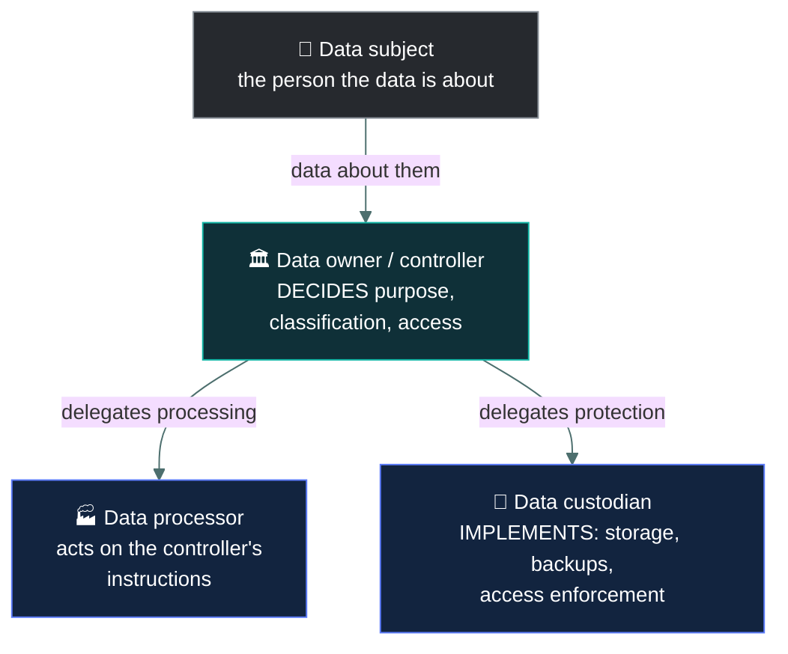

# 🕵️ Privacy

### *The right to control information about yourself — and why it is not the same as confidentiality*

📌 *PII, PHI, the roles that handle it, and the four regulation names the exam expects you to recognise on sight.*

---

## 🧸 The big idea

**Confidentiality** is a security property: information is not disclosed to unauthorised
parties. It is about *protection*.

**Privacy** is a right held by a person: the ability to control how information about them is
collected, used, shared and retained. It is about *control and permission*.

The distinction becomes obvious once you see that an organisation can protect data perfectly and
still violate privacy. Imagine a company that collects your location every minute, encrypts it
flawlessly, restricts access to three employees, and then sells it to advertisers — exactly as
its terms permitted. Confidentiality: intact. Privacy: gone.

The reverse also holds. A hospital that accidentally emails one patient's records to another
patient has broken confidentiality, and in doing so has also broken privacy. **Confidentiality is
one of the things that makes privacy possible, but it is not the same thing.**

> 🎯 If you hold one sentence from this page: **confidentiality protects data; privacy governs
> what the organisation is permitted to do with it.**

---

## 📖 Words you will keep seeing

| Word | What it means on this exam |
|---|---|
| **Privacy** | The right of an individual to control the collection, use and disclosure of information about them. |
| **PII** — Personally Identifiable Information | Any information that can identify a specific individual, alone or combined with other data. |
| **PHI** — Protected Health Information | Health information tied to an identifiable individual. A regulated subset of PII. |
| **Data subject** | The living person the data is about. |
| **Data owner** | The person accountable for a data set — its classification and who may access it. A business role. |
| **Data controller** | The party that decides *why* and *how* personal data is processed. |
| **Data processor** | A party that processes personal data **on behalf of** the controller. |
| **Data custodian** | The person who implements protection day to day — backups, access, storage. Usually IT. |
| **Consent** | The data subject's permission for a stated use of their data. |
| **Data minimisation** | Collecting only what is genuinely needed for the stated purpose. |
| **Purpose limitation** | Using data only for the purpose it was collected for. |
| **Retention** | How long data is kept before secure disposal. |

---

## 🔍 What counts as PII

PII is anything that identifies a specific person — **on its own or in combination with other
information.** That second half is the part the exam tests.

| Clearly PII on its own | PII in combination |
|---|---|
| Full name, national ID number | Postcode + date of birth + gender |
| Passport or driving licence number | Job title + employer, in a small company |
| Email address, phone number | IP address, device identifier |
| Biometric data | Browsing history, location traces |
| Home address, bank account number | A "de-identified" record with a rare attribute |

> [!IMPORTANT]
> **Data that is not identifying on its own can become PII when combined.** A postcode is not
> PII. A postcode plus a birth date plus a gender identifies a surprising share of a population.
> This is why "we removed the names" is not the same as anonymisation, and the exam expects you to
> know it.

**PHI** is health information linked to an identifiable person — diagnoses, treatments, test
results, insurance records. It attracts stricter handling than general PII in most jurisdictions.

---

## 👥 The roles

Questions about *who is responsible* are common, and the distinctions are clean once separated.

**Owner decides, custodian implements.** That one sentence answers most role questions. The data
owner is a business role holding accountability; the custodian is usually IT, holding
responsibility for the mechanics. A system administrator who backs up the customer database is
the custodian, never the owner.

**Controller and processor** come from data-protection law. The controller decides the why and
the how; the processor acts on instructions. A company using a cloud CRM is the controller; the
CRM vendor is the processor. Accountability stays with the controller — outsourcing the
processing does not outsource the responsibility.

---

## 📜 The privacy principles

These appear across most data-protection regimes and are the source of a lot of exam wording.

| Principle | Means |
|---|---|
| **Data minimisation** | Collect only what is necessary for the stated purpose. |
| **Purpose limitation** | Use it only for the purpose it was collected for. |
| **Consent** | Obtain permission, informed and specific, for that purpose. |
| **Accuracy** | Keep it correct and up to date. |
| **Retention limitation** | Keep it only as long as necessary, then dispose of it securely. |
| **Integrity and confidentiality** | Protect it appropriately. |
| **Accountability** | Be able to demonstrate compliance, not merely assert it. |
| **Transparency** | Tell people what you collect and why. |

> 🎯 **Collecting data "in case it is useful later" violates data minimisation and purpose
> limitation.** That scenario appears often, and the expected answer is that the collection itself
> is the problem — not that it should be encrypted more carefully.

---

## 🌍 Regulations the exam expects you to recognise

CC does not test legal detail. It tests whether you can match a name to a domain.

| | Covers | Where |
|---|---|---|
| **GDPR** — General Data Protection Regulation | Personal data of individuals in the EU. Rights of access, rectification, erasure, portability. Breach notification within 72 hours. | EU / EEA, with extraterritorial reach |
| **HIPAA** — Health Insurance Portability and Accountability Act | Protected health information held by covered entities and their business associates. | United States |
| **PCI DSS** — Payment Card Industry Data Security Standard | Cardholder data. **An industry standard, not a law.** | Global, contractual |
| **SOX** — Sarbanes-Oxley Act | Financial reporting integrity and records for public companies. | United States |

> [!CAUTION]
> **PCI DSS is a contractual industry standard, not legislation.** It is enforced by the card
> brands and acquiring banks through contracts, and non-compliance brings fines and loss of the
> ability to process cards rather than prosecution. This distinction is regularly tested.

> 🎯 **GDPR applies based on whose data it is, not where the company is.** An organisation outside
> the EU processing the personal data of people in the EU is still in scope. If a question sets up
> a non-EU company with EU customers, GDPR applies.

---

## ⚖️ Told apart

| | Means | Not to be confused with |
|---|---|---|
| **Privacy** | The individual's right to control information about them. | **Confidentiality**, a security property protecting data from unauthorised disclosure. You can have perfect confidentiality and still violate privacy. |
| **PII** | Information identifying a specific person. | **Sensitive business data** — trade secrets and financial forecasts are confidential but are not PII, because they identify no individual. |
| **Data owner** | Accountable. Decides classification and access. A business role. | **Data custodian**, responsible for implementing protection. Usually IT. |
| **Data controller** | Decides the purpose and means of processing. | **Data processor**, which acts on the controller's instructions. Accountability stays with the controller. |
| **Anonymisation** | Identifiers removed irreversibly; the data is no longer personal data. | **Pseudonymisation**, where identifiers are replaced by a token that *can* be reversed with a separate key. Pseudonymised data is still personal data. |
| **PCI DSS** | An industry standard enforced by contract. | **GDPR / HIPAA / SOX**, which are laws enforced by regulators. |

---

## ⚠️ Where your instinct is wrong

> [!WARNING]
> **In the job:** a privacy question is a legal question, and you route it to legal or compliance.
>
> **On the exam:** privacy is a named concept with defined principles and roles, and you are
> expected to answer directly. "Consult legal counsel" is occasionally right but is more often a
> distractor offered instead of the actual principle being tested.

> [!WARNING]
> **In the job:** the answer to a data-protection problem is usually a stronger technical control —
> encrypt it, restrict it, monitor it.
>
> **On the exam:** the answer to over-collection is **collect less**. Data minimisation means the
> best protection for data you do not need is not holding it. An option that proposes encrypting
> unnecessary data is solving the wrong problem.

> [!WARNING]
> **In the job:** "we anonymised it" usually means the direct identifiers were stripped.
>
> **On the exam:** that is **pseudonymisation** if it can be reversed, and pseudonymised data is
> still personal data. True anonymisation is irreversible and takes the data out of scope entirely.

---

## 🧠 How to remember it

🧠 **Confidentiality protects. Privacy permits.** Confidentiality asks *is it safe?* Privacy asks
*were we allowed to have it at all?*

🧠 **Owner decides, custodian implements.** Settles almost every role question.

🧠 **Four regulations, four domains:** GDPR = **people** (EU), HIPAA = **health**, PCI DSS =
**payment cards**, SOX = **financial reporting**. Three are laws; PCI DSS is a contract.

---

## ✅ Check you actually got it

Answer all five before expanding anything.

**Q1.** A company encrypts customer data, restricts access to three employees, and then sells the
data to advertisers as permitted by terms nobody reads. What is the situation?

- **A.** Both confidentiality and privacy are maintained
- **B.** Confidentiality is maintained but privacy is violated
- **C.** Confidentiality is violated but privacy is maintained
- **D.** Neither confidentiality nor privacy applies to commercial data sales

<b>Answer</b>

**B — confidentiality maintained, privacy violated.** The data is protected from unauthorised
disclosure, so the security property holds. But the individuals have lost meaningful control over
how information about them is used, which is what privacy protects.

- **A** ignores the sale. Protection and permission are different questions, and this scenario
  exists precisely to separate them.
- **C** inverts it. Nothing was disclosed to an *unauthorised* party — the sale was authorised by
  the organisation, which is the problem.
- **D** is wrong. Personal data remains personal data when it is sold, and commercial use is
  exactly what privacy regimes regulate.

**Q2.** Which of the following is NOT, on its own, considered PII?

- **A.** A national identification number
- **B.** A postcode
- **C.** A personal email address
- **D.** A fingerprint template

<b>Answer</b>

**B — a postcode.** On its own it identifies an area, not a person. Note the stem's qualifier
*on its own* — combined with a birth date and gender, a postcode contributes to identifying a
specific individual, which is why combination data matters.

- **A** identifies exactly one person by design.
- **C** is generally tied to one individual and is treated as PII.
- **D** is biometric data, which identifies a unique person and is usually treated as a sensitive
  category.

**Q3.** A system administrator configures backups and access permissions for a database of
customer records. Which role does the administrator hold?

- **A.** Data owner
- **B.** Data subject
- **C.** Data custodian
- **D.** Data controller

<b>Answer</b>

**C — data custodian.** The custodian implements protection day to day: storage, backups, access
enforcement. The administrator is doing exactly that.

- **A** is the accountable business role that decides classification and who may access the data.
  Administering the system does not confer that authority — a recurring exam pattern.
- **B** is the individual the data is *about*, in this case the customers.
- **D** is the party that decides why and how personal data is processed. That is the organisation,
  not the administrator.

**Q4.** Which statement about PCI DSS is correct?

- **A.** It is a law enforced by national data protection authorities
- **B.** It is an industry standard enforced contractually by payment brands and acquiring banks
- **C.** It applies only to organisations based in the United States
- **D.** It governs the protection of health information

<b>Answer</b>

**B — an industry standard enforced contractually.** Compliance is required by agreements with
the card brands and acquirers; failure brings fines and loss of card-processing ability rather
than prosecution.

- **A** confuses it with legislation such as GDPR or HIPAA. PCI DSS has no statutory basis.
- **C** is wrong — it applies globally to any organisation handling cardholder data.
- **D** describes HIPAA.

**Q5.** A marketing team wants to collect customers' dates of birth "in case it is useful for
future campaigns". Which privacy principle does this conflict with MOST directly?

- **A.** Data minimisation
- **B.** Confidentiality
- **C.** Accountability
- **D.** Data accuracy

<b>Answer</b>

**A — data minimisation.** Collect only what is necessary for a stated purpose. "In case it is
useful" is not a purpose, and it is the textbook phrasing of a minimisation breach. It also
offends purpose limitation, but minimisation is the most direct match.

- **B** is a security property about protecting data already held. It says nothing about whether
  collecting it was justified.
- **C** concerns being able to demonstrate compliance. It is engaged here, but indirectly — the
  primary failure is the collection itself.
- **D** concerns keeping data correct and current, which is unrelated to whether it should have
  been gathered.

---

## 🎓 The grown-up version

<b>Extra depth — open this on a second read, never needed for the pass</b>

**Why re-identification keeps surprising people.** A well-known line of research showed that a
large share of a national population can be uniquely identified from just postcode, date of birth
and gender. Later work re-identified individuals in released "anonymous" film-rating and
taxi-trip datasets by cross-referencing public sources. The practical lesson is that anonymisation
is a property of a dataset *in its environment*, not a one-time transformation you apply and then
stop worrying. Adding an outside dataset can un-anonymise something that was genuinely anonymous
yesterday.

**Pseudonymisation is a risk-reduction measure, not an exemption.** Under GDPR, pseudonymised data
is explicitly still personal data, because the token can be reversed with the separate key. It is
encouraged as a safeguard and it reduces the blast radius of a breach, but it does not remove the
data from scope. Teams routinely get this wrong and believe replacing names with customer IDs has
taken them out of the regime.

**Controller and processor obligations differ.** GDPR places most accountability on the
controller, but processors carry direct obligations too — security measures, breach notification
to the controller, restrictions on engaging sub-processors. The relationship must be governed by a
written contract. In cloud arrangements this is where a great deal of practical compliance work
actually happens.

**Privacy by design.** The idea that privacy protections should be built into a system from the
outset rather than added afterwards, with privacy-protective settings as the default. It is
codified in GDPR as "data protection by design and by default". CC does not test the term
directly, but it is the philosophy behind the data minimisation questions: the cheapest and most
reliable way to protect personal data is to never collect it.

**The 72-hour figure.** GDPR requires notification of a personal data breach to the supervisory
authority without undue delay and where feasible within 72 hours of becoming aware of it. That
number is worth knowing because it is concrete and occasionally appears. Notification to affected
individuals is a separate obligation with a different trigger — required when the breach is likely
to result in a high risk to their rights and freedoms.

---

## 📝 Cram lines

Destined for [`EXAM-DAY.md`](../../EXAM-DAY.md):

- **Confidentiality protects data. Privacy governs what you're PERMITTED to do with it.**
- **PII** = identifies a person, alone **or in combination**. Postcode + DOB + gender = PII.
- **Owner decides** (classification, access). **Custodian implements** (backups, storage). IT is the custodian.
- **Controller decides why/how. Processor acts on instructions.** Accountability stays with the controller.
- **Anonymisation is irreversible. Pseudonymisation is reversible** — still personal data.
- **GDPR** = EU people (72-hour breach notice, applies by whose data, not where the company is). **HIPAA** = health (US). **PCI DSS** = cards, **a contract not a law**. **SOX** = financial reporting (US).
- **"In case it's useful later" violates data minimisation.** The fix is collect less, not encrypt more.

---

<a href="../README.md">← back to 01 · Security Principles</a> &nbsp;·&nbsp; <a href="../risk-concepts/">next: Risk concepts →</a>

