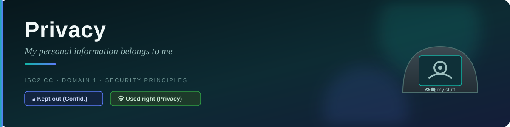
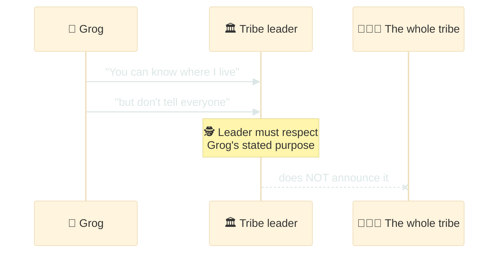
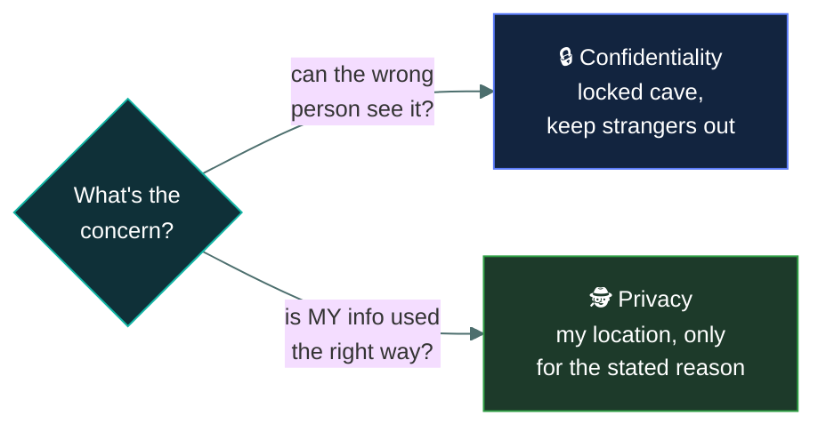
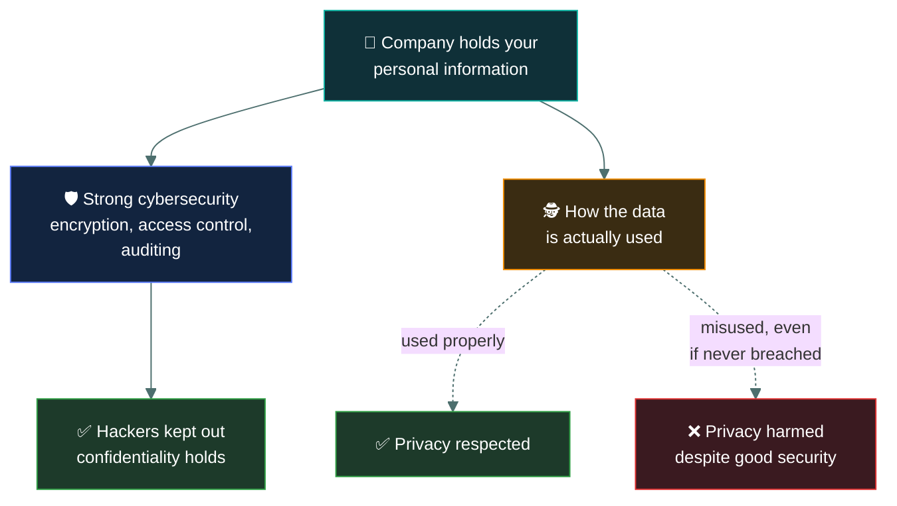

# 🕵️ Privacy — Caveman Style

---

Let's continue with Grog. 🪨

You already know:

- 🔐 **Authentication** = "Who are you?"
- 🎫 **Authorization** = "What are you allowed to do?"
- 📋 **Accounting** = "What did you do?"
- 🧾 **Non-repudiation** = "You can't deny that you did it."

Now:

> 🕵️ **Privacy = "Who is allowed to know my personal stuff, and how is it used?"**

## 🪨 Caveman example

Imagine Grog has a private cave.

Inside he has:

- ❤️ A diary about his family
- 🗺️ His personal hunting routes
- 🏠 Information about where he lives
- 💰 How much food he owns
- 🧑‍🤝‍🧑 Information about his family

Grog tells the tribe leader:

> "You can know where I live, but don't tell everyone."

The tribe leader shouldn't take that information and announce it to the entire tribe.

That's privacy.

## 💻 Privacy in the real world

Privacy is about personal information and how it is:

- Collected
- Used
- Stored
- Shared
- Protected
- Deleted

Examples of personal information include:

- 👤 Name
- 🏠 Address
- 📱 Phone number
- 📧 Email
- 📍 Location
- 💳 Financial information
- 🩺 Health information
- 🖼️ Photos
- 🌐 Browsing/activity information

Privacy asks questions like:

> "Why is this information being collected?"
> "Who can use it?"
> "Who can it be shared with?"
> "How long will it be kept?"

## 🔒 Privacy vs Confidentiality

This is very important. They sound similar, but they're not the same.

### 🔒 Confidentiality

Confidentiality is about:

> **Preventing unauthorized people from seeing information.**

Example: Grog's secret information is stored in a locked cave. Only authorized people can enter.
That's confidentiality.

### 🕵️ Privacy

Privacy is about:

> **Giving people appropriate control over their personal information and ensuring it is handled
> appropriately.**

Example: Grog gives the tribe leader his location for a specific reason. The leader shouldn't use
that information for an unrelated purpose or share it without appropriate permission. That's
privacy.

## 🧠 Simple example

Imagine you download a phone app.

The app asks:

> "Can I access your location?"

You say: Yes.

That's not the end of the privacy question. You might also ask:

> "Why does the app need my location?"
> "Does it store my location?"
> "Does it share my location with another company?"
> "How long does it keep my location?"

Those are privacy questions.

## 🏦 Example: Bank

Your bank has information about you. For example:

> **Grog**
> 💰 Balance: $5,000
> 🏠 Address: Cave #7
> 📱 Phone: 123456

**Confidentiality** — A random hacker shouldn't be able to access this information. 🔒 Keep
unauthorized people out.

**Privacy** — The bank should handle your personal information according to applicable laws,
policies, and the purposes for which it was collected. 🕵️ Use personal information appropriately.

## 🎯 Privacy and cybersecurity

Privacy is closely connected to cybersecurity.

Suppose a company collects your personal information. If hackers steal it:

> 🕵️ Your privacy may be harmed.

Cybersecurity controls such as:

- 🔐 Encryption
- 🔑 Access controls
- 🛡️ Authentication
- 💾 Secure storage
- 📋 Auditing

can help protect personal information.

But cybersecurity alone doesn't automatically guarantee privacy. A company could have excellent
security but still use personal information in an inappropriate way.

## 🧠 Caveman memory trick

Imagine Grog gives the tribe leader a secret piece of information. 🪨

> [!NOTE]
> **🔒 Confidentiality:** "Don't let unauthorized cavemen see it."
>
> **🕵️ Privacy:** "It's MY information. Use it appropriately and respect my choices."

## 🎯 Exam-ready definition

**Privacy is the protection and appropriate handling of an individual's personal information,
including how it is collected, used, stored, and shared.**

Super-simple version:

🕵️ **Privacy = "My personal information belongs to me, so handle it properly."**

---

<a href="../README.md">← Back to 01 · Security Principles</a>

