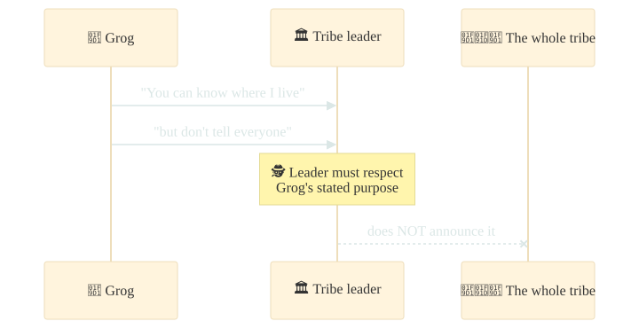

# 🕵️ Privacy

### *Not "is the data safe?" but "were we allowed to have it and use it this way?"*

📌 *Tell privacy from confidentiality, spot PII (including combinations), name the roles, and match each regulation to its domain.*

---

## 🧸 The big idea

Your doctor keeps your medical file in a locked cabinet. Nobody steals it. It is perfectly
**protected**.

Then the clinic sells a copy to a drug company, as allowed by a form you signed without reading.

Nothing leaked. Nothing was hacked. And yet something clearly went wrong — the clinic **used your
information in a way you never really agreed to**.

- **Confidentiality** = a *security property*: data isn't disclosed to unauthorised people. It's
  about **protection**.
- **Privacy** = a *person's right*: to control how information about them is collected, used,
  shared and kept. It's about **permission**.

> 🎯 **Confidentiality protects the data. Privacy governs what you're permitted to do with it.**

---

## 📖 Words you will keep seeing

| Word | What it means on this exam |
|---|---|
| **Privacy** | An individual's right to control the collection, use and disclosure of information about them. |
| **PII** | Personally Identifiable Information — identifies a specific person, **alone or combined** with other data. |
| **PHI** | Protected Health Information — health data tied to an identifiable person. A regulated subset of PII. |
| **Data subject** | The living person the data is about. |
| **Data owner** | Accountable for a data set — decides its classification and who may access it. A **business** role. |
| **Data controller** | Decides **why** and **how** personal data is processed. |
| **Data processor** | Processes personal data **on behalf of** the controller. |
| **Data custodian** | **Implements** protection day to day — storage, backups, access. Usually IT. |
| **Consent** | The data subject's permission for a stated use. |
| **Data minimisation** | Collect only what is genuinely needed. |
| **Purpose limitation** | Use data only for the purpose it was collected for. |
| **Retention** | How long data is kept before secure disposal. |

---

## 🔍 The explanation

### Protected is not the same as permitted

It works the other way too: a hospital that accidentally emails one patient's records to another
has broken **both** — the disclosure breaks confidentiality, and the patient's privacy with it.
Confidentiality helps make privacy possible, but it isn't the same thing.

### What counts as PII

PII identifies a specific person — **on its own, or in combination**. The combination part is
what the exam tests:

| PII on its own | PII in combination |
|---|---|
| Full name, national ID number | Postcode + date of birth + gender |
| Passport / licence number | Job title + employer (in a small company) |
| Email address, phone number | IP address, device ID |
| Biometric data, bank account | Location history, browsing history |

That's why *"we removed the names"* is **not** the same as anonymised.

### Who does what — the roles

- **Owner decides, custodian implements.** A sysadmin who backs up the customer database is the
  **custodian**, never the owner.
- **Controller decides, processor acts.** A company using a cloud CRM is the controller; the CRM
  vendor is the processor. **Outsourcing the processing doesn't outsource the accountability** —
  it stays with the controller.

### The privacy principles

| Principle | Means |
|---|---|
| **Data minimisation** | Collect only what's necessary. |
| **Purpose limitation** | Use it only for the stated purpose. |
| **Consent** | Informed, specific permission for that purpose. |
| **Accuracy** | Keep it correct and current. |
| **Retention limitation** | Keep it only as long as needed, then dispose securely. |
| **Transparency** | Tell people what you collect and why. |
| **Accountability** | Be able to *demonstrate* compliance. |

> 🎯 **Collecting data "in case it's useful later" breaks minimisation and purpose limitation.**
> The answer is to *not collect it* — not to encrypt it more carefully.

### The four regulations — match the name to the domain

CC doesn't test legal detail; it tests whether you can match each name to what it covers:

- **GDPR** applies by **whose** data it is, not where the company is. A non-EU company with EU
  customers is in scope. Breach notification within **72 hours**.
- **PCI DSS is not a law.** It's enforced through contracts with card brands and banks — fines
  and loss of card processing, not prosecution.

### Anonymised vs pseudonymised

---

## ⚖️ Told apart

| | Means | Not to be confused with |
|---|---|---|
| **Privacy** | The individual's right to control their information. | **Confidentiality** — protection from unauthorised disclosure. |
| **PII** | Identifies a specific person. | **Sensitive business data** — trade secrets are confidential but identify no person. |
| **Data owner** | Accountable; decides classification and access. | **Data custodian** — implements the protection. |
| **Data controller** | Decides purpose and means of processing. | **Data processor** — acts on instructions. Accountability stays with the controller. |
| **Anonymisation** | Irreversible; no longer personal data. | **Pseudonymisation** — reversible with a key; **still personal data**. |
| **PCI DSS** | Industry standard, enforced by contract. | **GDPR / HIPAA / SOX** — laws. |

---

## ⚠️ Where your instinct is wrong

> [!WARNING]
> **In the job:** a privacy question goes to legal or compliance.
>
> **On the exam:** privacy has defined principles and roles and you answer directly. "Consult
> legal counsel" is more often a distractor than the answer.

> [!WARNING]
> **In the job:** the fix for a data-protection problem is a stronger control — encrypt, restrict,
> monitor.
>
> **On the exam:** the fix for over-collection is **collect less**. Encrypting data you shouldn't
> hold solves the wrong problem.

> [!WARNING]
> **In the job:** "we anonymised it" usually means the names were stripped.
>
> **On the exam:** if it can be reversed, it's **pseudonymised** — and still personal data.

---

## 🧠 How to remember it

**Confidentiality protects. Privacy permits.**

**Owner decides, custodian implements.**

**Four regulations, four domains:** GDPR = **people** (EU) · HIPAA = **health** · PCI DSS =
**payment cards** · SOX = **financial reporting**. Three are laws; **PCI DSS is a contract**.

---

## ✅ Check you actually got it

Answer all five before expanding anything.

**Q1.** A company encrypts customer data, restricts access to three employees, and then sells the
data to advertisers as permitted by terms nobody reads. What is the situation?

- **A.** Both confidentiality and privacy are maintained
- **B.** Confidentiality is maintained but privacy is violated
- **C.** Confidentiality is violated but privacy is maintained
- **D.** Neither confidentiality nor privacy applies to commercial data sales

<b>Answer</b>

**B.** The data is protected (confidentiality holds), but individuals lost meaningful control over
its use (privacy broken).

- **A** ignores the sale.
- **C** inverts it — nothing reached an *unauthorised* party; the organisation authorised the sale.
- **D** — commercial use is exactly what privacy regimes regulate.

**Q2.** Which of the following is NOT, on its own, considered PII?

- **A.** A national identification number
- **B.** A postcode
- **C.** A personal email address
- **D.** A fingerprint template

<b>Answer</b>

**B — a postcode.** Alone it identifies an area. Note *on its own* — combined with birth date and
gender, it helps identify a person.

- **A** identifies exactly one person.
- **C** is tied to one individual.
- **D** is biometric data — unique to one person.

**Q3.** A system administrator configures backups and access permissions for a database of
customer records. Which role does the administrator hold?

- **A.** Data owner
- **B.** Data subject
- **C.** Data custodian
- **D.** Data controller

<b>Answer</b>

**C — custodian.** Implementing protection day to day is exactly the custodian's job.

- **A** — the owner is the accountable *business* role. Running the system doesn't make you owner.
- **B** — the subjects are the customers.
- **D** — the controller is the organisation that decides why and how data is processed.

**Q4.** Which statement about PCI DSS is correct?

- **A.** It is a law enforced by national data protection authorities
- **B.** It is an industry standard enforced contractually by payment brands and acquiring banks
- **C.** It applies only to organisations based in the United States
- **D.** It governs the protection of health information

<b>Answer</b>

**B.** Enforced by contracts with card brands and acquirers.

- **A** confuses it with GDPR or HIPAA.
- **C** — it applies globally to anyone handling card data.
- **D** describes HIPAA.

**Q5.** A marketing team wants to collect customers' dates of birth "in case it is useful for
future campaigns". Which privacy principle does this conflict with MOST directly?

- **A.** Data minimisation
- **B.** Confidentiality
- **C.** Accountability
- **D.** Data accuracy

<b>Answer</b>

**A — data minimisation.** "In case it's useful" is not a purpose — the textbook minimisation
breach.

- **B** is about protecting data already held, not whether to collect it.
- **C** is engaged only indirectly.
- **D** is about keeping data correct, unrelated to collection.

---

## 🎓 The grown-up version

<b>Extra depth — open this on a second read, never needed for the pass</b>

**Re-identification keeps surprising people.** Research has shown a large share of a population
can be uniquely identified from postcode + birth date + gender, and "anonymous" released datasets
have been re-identified by cross-referencing public sources. Anonymity is a property of data *in
its environment* — a new outside dataset can undo it.

**How real anonymisation is engineered:** *k-anonymity* generalises values until every record
matches at least *k−1* others; *differential privacy* adds calibrated noise so one person's
presence barely changes the output; *tokenisation* swaps a real value for a random token with the
original held in a separate vault (standard for card numbers).

**"Delete my data" is never one DELETE.** The record lives in the live database, backups (some
deliberately immutable), caches, analytics pipelines and every third-party processor. That's why
mature organisations keep a **data map** of where each category of personal data lives.

**Privacy by design** — build privacy in from the start, with privacy-protective defaults. It's
the philosophy behind minimisation: the cheapest data to protect is data you never collected.

---

## 📝 Cram lines

Destined for [`EXAM-DAY.md`](../../EXAM-DAY.md):

- **Confidentiality protects data. Privacy governs what you're PERMITTED to do with it.**
- **PII includes combinations** — postcode + DOB + gender identifies a person.
- **Owner decides, custodian implements.** Controller decides, processor acts.
- **GDPR** people/EU (by whose data) · **HIPAA** health · **SOX** financial reporting · **PCI DSS** cards — **a contract, not a law**.
- **Pseudonymised = still personal data.** Over-collection → collect less, don't encrypt more.

---

<a href="../README.md">← back to 01 · Security Principles</a> &nbsp;·&nbsp; <a href="../risk-concepts/">next: Risk concepts →</a>

