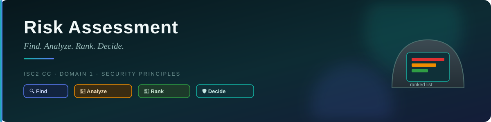

# ⚠️ Risk Assessment — Caveman Style

---

Let's continue with **Grog**. 🪨

You already know what **risk** means:

> **Risk = A threat exploiting a vulnerability and causing harm to an asset.**

Now the question is:

> 🧐 **"How do we figure out which risks are dangerous and what we should do about them?"**

That's **risk assessment**.

## 🧠 What is Risk Assessment?

### Simple definition

> **Risk assessment is the process of identifying risks, analyzing how likely they are and how
> much damage they could cause, and determining how serious they are.**

In caveman language:

> 🪨 **"Look at the cave, find the dangerous things, figure out how bad they would be, and decide
> which ones need fixing first."**

## 🏕️ Grog's Cave

Imagine Grog is responsible for protecting his tribe's cave.

He looks around and finds several problems.

### Problem 1 🕳️

There's a big hole in the cave wall.

### Problem 2 🔥

The fire is too close to the food.

### Problem 3 🐻

There is a bear living nearby.

### Problem 4 🪨

Some rocks are loose above the entrance.

Grog can't fix everything at once.

So he needs to **assess the risks**.

---

## 🔍 Step 1 — Identify the Assets

First, Grog asks:

> **"What do I need to protect?"**

His assets include:

- 🥩 Food
- 🪓 Weapons
- 🔥 Fire
- 👨‍👩‍👧 Tribe members
- 🗺️ Hunting maps

In cybersecurity, assets might include:

- Customer data
- Servers
- Applications
- Databases
- Financial information
- Company reputation

---

## 👹 Step 2 — Identify Threats

Next, Grog asks:

> **"What could hurt my assets?"**

Possible threats:

- 👹 Enemy tribe
- 🐻 Bear
- 🔥 Fire
- 🌧️ Flood
- 🪨 Falling rocks

Cybersecurity threats could include:

- Hackers
- Malware
- Phishing
- Ransomware
- Insider threats
- Natural disasters

---

## 🕳️ Step 3 — Identify Vulnerabilities

Now Grog asks:

> **"What weaknesses could allow these threats to cause damage?"**

For example:

**Threat:** Enemy tribe 👹 → **Vulnerability:** Hole in cave 🕳️

Another example:

**Threat:** Hacker 👨‍💻 → **Vulnerability:** Weak password 🔑

Another:

**Threat:** Malware 🦠 → **Vulnerability:** Unpatched software 💻

---

## 💥 Step 4 — Determine the Impact

Grog asks:

> **"If this happens, how bad will it be?"**

Suppose the enemy steals **one piece of meat**.

🟢 Low impact.

But if they steal **all the tribe's food**:

🔴 High impact.

In cybersecurity:

### Low impact

Maybe one unimportant file is lost.

### High impact

Maybe:

- 💰 Millions of dollars are lost
- 👤 Customer information is exposed
- 🏢 Business operations stop
- ⚖️ The organization faces legal consequences
- ⭐ Reputation is damaged

---

## 🎯 Step 5 — Determine Likelihood

Now Grog asks:

> **"How likely is this to happen?"**

Suppose there is a bear 10 meters from the cave every day.

🐻🐻🐻

That's a **high likelihood**.

But suppose there's another dangerous animal that appears once every 100 years.

That's a **low likelihood**.

So risk assessment considers both:

> **Likelihood + Impact**

---

## 🧮 Step 6 — Calculate/Determine Risk

A simple model is:

> **Risk = Likelihood × Impact**

For example:

| Risk | Likelihood | Impact | Risk |
| --- | --- | --- | --- |
| 🕳️ Enemy enters cave | 5 | 10 | 50 |
| 🔥 Fire damages food | 3 | 8 | 24 |
| 🐻 Bear attacks | 2 | 10 | 20 |
| 🪨 Falling rocks | 1 | 6 | 6 |

Grog looks at the results and says:

> "The enemy entering the cave is my biggest problem!"

So he fixes the hole first.

---

## 🚦 Risk Levels

Organizations often categorize risks.

For example:

### 🟢 Low Risk

Not very likely and/or not very damaging.

> "We can probably deal with this later."

### 🟡 Medium Risk

Needs attention.

> "Let's make a plan to fix this."

### 🔴 High Risk

Very likely and/or very damaging.

> "FIX THIS NOW!"

---

## 🛡️ Step 7 — Choose a Risk Response

Once Grog understands the risks, he needs to decide what to do.

There are several common approaches.

### 🔧 Mitigate

Reduce the risk.

> Grog blocks the hole with rocks.

**"Make the risk smaller."**

### 🚫 Avoid

Stop doing the risky activity.

> Grog stops hunting in the bear's territory.

**"Don't take the risk."**

### 🤝 Transfer

Shift some of the financial/consequential burden to another party.

> Grog gets an agreement with another tribe to share the consequences if something goes wrong.

**"Let someone else take on some of the risk."**

### 🤷 Accept

Know about the risk but decide to live with it.

> "The tiny crack isn't worth fixing right now."

**"We know about it, but we're okay with the remaining risk."**

---

## 🔄 Risk Assessment Is Not One-Time

This is an important point.

Grog shouldn't assess the cave **once and forget about it**.

Imagine he fixes the hole.

Six months later:

🌧️ Huge storm → cave gets flooded.

Now there's a **new risk**.

So organizations continuously reassess risks because:

- New threats appear
- New vulnerabilities are discovered
- Systems change
- Business operations change
- Attack methods evolve
- Existing controls may stop working

---

## 🏢 Real Cybersecurity Example

Imagine a company has an online shopping website.

**Asset** — 👤 Customer credit-card information

**Threat** — 👨‍💻 Cybercriminal

**Vulnerability** — 💻 Outdated web application

**Potential event** — The attacker exploits the vulnerability.

**Impact** — 💰 Financial loss + customer data exposure + reputation damage

**Likelihood** — Suppose the vulnerability is easy to exploit and attackers are actively targeting
it. ➡️ **High likelihood**

**Overall risk** — 🔴 **High risk**

**Response** — The company could:

- 🔄 Patch the application
- 🛡️ Add security controls
- 🔍 Monitor for attacks
- 🔐 Improve access controls
- 🧪 Perform security testing

---

## 🧠 Risk Assessment vs Risk Management

Don't confuse these two.

> [!IMPORTANT]
> **⚠️ Risk Assessment** — "What risks do we have, and how serious are they?"
>
> **🛡️ Risk Management** — "What are we going to do about those risks?"

Think of Grog:

**Assessment:**

> 🪨 "There is a huge hole. Enemy tribe is nearby. They could steal all our food."

**Management:**

> 🛡️ "Let's block the hole, put a guard outside, and create a backup food store."

---

## 🎯 Exam-ready definition

> **Risk assessment is the process of identifying assets, threats, vulnerabilities, and potential
> impacts, then analyzing and evaluating risks to determine which require treatment.**

### 🪨 Super-simple version

> **Risk Assessment = FIND → ANALYZE → RANK → DECIDE**

1. 🔍 Find the risks
2. 🧮 Analyze likelihood and impact
3. 🚦 Rank the risks
4. 🛡️ Decide what to do

### Ultimate caveman sentence

> 🪨 **"What can hurt my cave? How likely is it? How bad will it be? Which problem should I fix
> first?"**

That's **risk assessment**.

---

<a href="../README.md">← Back to 01 · Security Principles</a>

