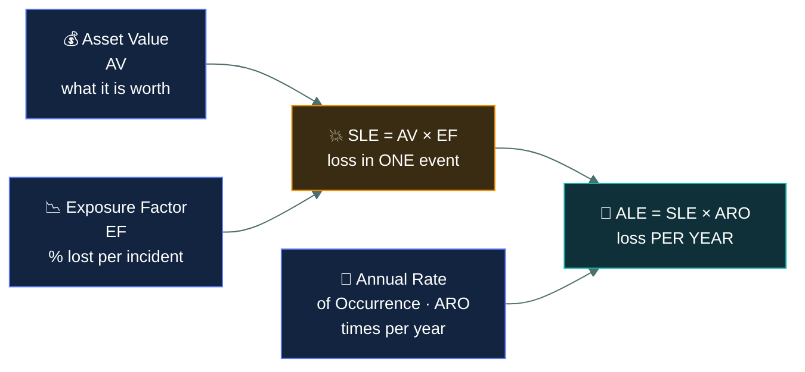
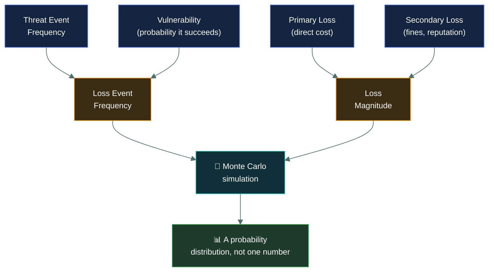

<div align="center">


# 📐 Risk assessment

### *Working out how bad a risk is — in words, or in money*

[](../README.md)
[](../README.md)
[](#)

📌 *Qualitative versus quantitative, and the three formulas — SLE, ARO, ALE — that the exam expects you to recognise and occasionally compute.*

</div>

---

## 🧸 The big idea

Back to the wolves and the gap in the cave wall. You already know it's a risk — now the tribe
needs to know exactly *how bad* a risk. There are two ways to answer that.

The tribe elder just looks at the gap and says: *"that looks pretty dangerous — I'd call it
high."* No counting, no records, just a gut call using words like high, medium, low. That's
**qualitative** assessment. It's fast, needs nothing written down beforehand, and works fine for
things you genuinely can't put a number on. Its weakness: your "high" and the elder's "high"
might not mean the same thing, and there's no way to settle the disagreement.

The hunter does it differently. She keeps count: *"wolves have actually gotten through 3 times
this year. Each time, we lost about 10 arrowheads' worth of grain."* Multiply those together —
3 raids × 10 arrowheads — and she can say, in hard numbers, **"this gap costs us 30 arrowheads a
year."** That's **quantitative** assessment: real numbers, comparable, and useful for deciding
whether a fence costing 15 arrowheads is worth building. Its weakness: you need actual history to
count, and plenty of real risks — like "the tribe's reputation for having a secure cave" — have no
honest number behind them.

That's the whole idea. Once you know a risk exists, the next question is *how bad is it?* There
are two ways to answer, and the exam wants you to know when each is appropriate.

**Qualitative** uses descriptive categories. High, medium, low. Likely, unlikely. It is fast,
cheap, needs no historical data, and works for things you cannot price — reputational damage,
staff morale, regulatory displeasure. Its weakness is that it is **subjective**: your "high" and
my "high" may be different, and two assessors can disagree with no way to settle it.

**Quantitative** uses numbers, usually money. This risk costs an expected $40,000 a year. It is
objective, comparable, and feeds straight into a budget conversation — you can hold a $40,000
risk next to a $15,000 control and make a decision. Its weakness is that it is **expensive and
data-hungry**, and many risks have no credible numbers behind them.

Most real assessments are **hybrid**: qualitative to triage everything quickly, then
quantitative on the handful of risks that matter enough to justify the effort.

---

## 📖 Words you will keep seeing

| Word | What it means on this exam |
|---|---|
| **Risk assessment** | Identifying risks and determining their likelihood and impact. |
| **Qualitative assessment** | Rating risk using descriptive categories rather than numbers. |
| **Quantitative assessment** | Rating risk using numeric values, usually monetary. |
| **Asset Value (AV)** | What the asset is worth, in money. |
| **Exposure Factor (EF)** | The proportion of the asset's value lost in a single incident, as a percentage or decimal. |
| **Single Loss Expectancy (SLE)** | The money lost in **one** occurrence. |
| **Annual Rate of Occurrence (ARO)** | How many times the event is expected **per year**. |
| **Annualised Loss Expectancy (ALE)** | The expected loss **per year**. |
| **Risk matrix** | A grid plotting likelihood against impact, used in qualitative assessment. |
| **Risk register** | The record of identified risks, their assessment, owner and treatment. |

---

## 🔍 Qualitative assessment

Risks are rated on descriptive scales — typically likelihood and impact, each rated low,
medium or high — and plotted on a **risk matrix**.

| | **Low impact** | **Medium impact** | **High impact** |
|---|---|---|---|
| **High likelihood** | Medium | High | **Critical** |
| **Medium likelihood** | Low | Medium | High |
| **Low likelihood** | Low | Low | Medium |

The matrix is a prioritisation tool. Everything in the top-right gets attention first;
bottom-left is usually accepted.

**Strengths:** fast, cheap, needs no historical data, handles intangibles like reputation,
understandable by non-specialists.

**Weaknesses:** subjective, hard to compare between assessors, and it cannot answer "is this
control worth the money?" because there are no numbers to compare.

---

## 🔢 Quantitative assessment

This is the hunter's arrowhead count, formalised. "10 arrowheads lost per raid" is a **Single
Loss Expectancy**. "3 raids a year" is an **Annual Rate of Occurrence**. Multiply them and you
get her **Annualised Loss Expectancy** — the real cost of the risk over a year.

Three formulas. They chain together, and the exam may ask you to compute one step.



### The three formulas

```
SLE = AV × EF          Single Loss Expectancy — one event
ALE = SLE × ARO        Annualised Loss Expectancy — per year
ALE = AV × EF × ARO    the two combined
```

### A worked example

A server is worth **$50,000**. A fire would destroy **60%** of its value. Fires of this kind are
expected once every **10 years**.

| Step | Working | Result |
|---|---|---|
| Asset Value | given | **AV = $50,000** |
| Exposure Factor | 60% | **EF = 0.6** |
| Single Loss Expectancy | $50,000 × 0.6 | **SLE = $30,000** |
| Annual Rate of Occurrence | once per 10 years | **ARO = 0.1** |
| Annualised Loss Expectancy | $30,000 × 0.1 | **ALE = $3,000** |

**So the risk costs $3,000 a year in expected terms.** That single number is the whole point of
the exercise, because it makes the control decision arithmetic:

- A control costing **$1,000/year** that eliminates the risk → **worth it**, saves $2,000/year.
- A control costing **$5,000/year** → **not worth it**, costs more than the risk.

> [!IMPORTANT]
> **A control should not cost more than the risk it mitigates.** This is the single most tested
> idea in quantitative assessment. If a question gives you an ALE and a control cost, it is
> almost certainly asking you to compare the two.

### ARO is where people slip

ARO is expressed **per year**, so anything less frequent than annual becomes a decimal:

| Frequency | ARO |
|---|---|
| Twice a year | **2.0** |
| Once a year | **1.0** |
| Once every 5 years | **0.2** |
| Once every 10 years | **0.1** |
| Once every 100 years | **0.01** |

> 🎯 Divide 1 by the number of years between occurrences. Once every 20 years → 1 ÷ 20 = **0.05**.

---

## 🔬 How real programmes go beyond a single ALE number

SLE/ALE gives one number, and the grown-up section above already flags the problem: a rare
catastrophe and a frequent nuisance can produce the identical ALE while being completely
different risks to actually manage. Modern quantitative risk work fixes this with a real,
named framework rather than a single multiplication.



**FAIR (Factor Analysis of Information Risk)** is the industry's standard answer to "ALE hides
the shape of the risk." Instead of one ARO and one SLE, an analyst estimates *ranges* — how
often a threat actor is likely to act (Threat Event Frequency), how likely they are to succeed
(Vulnerability), the direct cost if they do (Primary Loss), and the knock-on cost — fines,
customer churn, reputational damage (Secondary Loss). Those ranges get run through thousands of
random trials in a **Monte Carlo simulation**, producing not one figure but a distribution: "a
1-in-20 chance of losing more than $2M this year" is a genuinely different, more useful
statement than a flat $100,000 ALE.

**This is not exam material** — CC tests the AV/EF/SLE/ARO/ALE chain, and that's what to answer
with on the paper — but it's exactly the tool a real GRC or risk analyst reaches for the moment
someone asks "how confident are we in that number?"

---

## ⚖️ Told apart

| | Means | Not to be confused with |
|---|---|---|
| **Qualitative** | Descriptive categories — high, medium, low. Subjective, fast, cheap. | **Quantitative**, which uses numbers, usually money. Objective, slow, data-hungry. |
| **SLE** | Loss from **one** occurrence. | **ALE**, the loss **per year**. The difference is the ARO multiplier. |
| **EF** | The **percentage** of asset value lost per incident. | **AV**, the full value of the asset. EF is a fraction of AV, never a money figure. |
| **ARO** | How many times **per year**. | A count of past incidents. Once in 10 years is an ARO of 0.1, not 1. |
| **Risk assessment** | Determining likelihood and impact. | **Risk treatment**, deciding what to *do* about it. Assessment comes first. |

> [!CAUTION]
> **SLE and ALE are the most swapped pair in this topic.** If the question says "per year" or
> "annually", it wants ALE. If it describes a single event, it wants SLE.

---

## 🔀 Choosing between them

| Use **qualitative** when | Use **quantitative** when |
|---|---|
| You need results quickly and cheaply | You need to justify spending to management |
| There is no reliable historical data | Good loss and frequency data exists |
| The impact is intangible — reputation, morale | The impact is financial and measurable |
| You are triaging a large number of risks | You are deciding on one significant control |

> 🎯 **If a question mentions justifying a control's cost, or comparing spend against loss, it
> wants quantitative.** If it mentions reputation, speed, or a lack of data, it wants qualitative.

---

## ⚠️ Where your instinct is wrong

> [!WARNING]
> **In the job:** ALE figures are largely theatre. The ARO is a guess, the asset value is
> contested, and the result carries false precision.
>
> **On the exam:** the arithmetic is taken at face value. Compute it as given and pick the number.
> Do not reason about whether the inputs are credible.

> [!WARNING]
> **In the job:** if a control is clearly good practice you implement it, cost-benefit notwith­standing.
>
> **On the exam:** if the control costs more than the ALE, the expected answer is that it is
> **not** cost-effective. The arithmetic wins.

> [!WARNING]
> **In the job:** "qualitative" sounds like the weaker, less rigorous option.
>
> **On the exam:** it is the *correct* choice in several scenarios — no data, intangible impact,
> speed required. Neither method is universally better, and questions test that you know when
> each fits.

---

## 🧠 How to remember it

🧠 **"Single, then Annual."**
**SLE** = **S**ingle event. **ALE** = **A**nnual. Multiply SLE by ARO to move from one to the
other.

🧠 **The chain, left to right:**
**AV × EF = SLE**, then **SLE × ARO = ALE**.
*Value, times how much is lost, gives one hit. Times how often, gives the year.*

🧠 **Qual = words. Quant = numbers.** The first four letters tell you: **qual**ity is
descriptive, **quant**ity is countable.

---

## ✅ Check you actually got it

Answer all five before expanding anything.

**Q1.** An asset is valued at $200,000. A particular incident would destroy 25% of its value and
is expected to occur once every four years. What is the ALE?

- **A.** $12,500
- **B.** $50,000
- **C.** $200,000
- **D.** $800,000

<details>
<summary><b>Answer</b></summary>

**A — $12,500.**

- SLE = AV × EF = $200,000 × 0.25 = **$50,000**
- ARO = once per four years = 1 ÷ 4 = **0.25**
- ALE = SLE × ARO = $50,000 × 0.25 = **$12,500**

- **B** is the **SLE** — the loss from one occurrence. It is the answer to a different question,
  and it is the most common wrong choice because it is a real intermediate value.
- **C** is the full asset value, ignoring both the exposure factor and the frequency.
- **D** is what you get by *multiplying* by four instead of dividing — treating "once every four
  years" as an ARO of 4 rather than 0.25.

</details>

**Q2.** A risk has an ALE of $18,000. A proposed control costs $25,000 per year and would
eliminate the risk entirely. What should be concluded?

- **A.** Implement the control, since eliminating risk is always preferable
- **B.** The control is not cost-effective, as it costs more than the annual expected loss
- **C.** Implement the control, since $25,000 is close to $18,000
- **D.** The ALE must be recalculated, since controls cannot exceed asset value

<details>
<summary><b>Answer</b></summary>

**B — not cost-effective.** Spending $25,000 a year to avoid an expected annual loss of $18,000
loses $7,000 a year. A control should not cost more than the risk it addresses.

- **A** contains an absolute, *always*, and contradicts the whole purpose of quantitative
  assessment, which exists precisely to make this comparison.
- **C** substitutes a vague sense of proximity for the arithmetic. The numbers are unambiguous.
- **D** invents a rule. Nothing prevents a control from costing more than the asset — that is
  simply a sign it should not be bought.

</details>

**Q3.** An organisation must assess reputational damage from a potential data breach, and has no
historical data. Which approach is MOST appropriate?

- **A.** Quantitative, because breaches have measurable costs
- **B.** Qualitative, because the impact is intangible and no data exists
- **C.** Neither — reputational risk cannot be assessed
- **D.** Quantitative, using industry average breach costs as a substitute

<details>
<summary><b>Answer</b></summary>

**B — qualitative.** Descriptive rating is designed for exactly this: intangible impacts and an
absence of reliable data.

- **A** is wrong on the stem's own facts. Some breach costs are measurable, but *reputational*
  damage is not, and the organisation has no data to work from.
- **C** is too absolute. Reputational risk is assessed routinely — qualitatively.
- **D** is the thoughtful-sounding distractor. Borrowing industry averages produces a number with
  no relationship to this organisation, which is worse than an honest qualitative rating because
  it looks authoritative.

</details>

**Q4.** What does the Exposure Factor represent?

- **A.** The number of times per year an incident is expected
- **B.** The total monetary value of the asset
- **C.** The percentage of the asset's value lost in a single incident
- **D.** The annual expected loss from a risk

<details>
<summary><b>Answer</b></summary>

**C — the percentage of the asset's value lost in a single incident.** EF is always a proportion,
expressed as a percentage or decimal, never a money figure.

- **A** describes the **ARO**.
- **B** describes the **AV**.
- **D** describes the **ALE**.

Note that every wrong option here is a real term from the same formula chain — that is the
standard shape of a question on this topic.

</details>

**Q5.** Which statement about qualitative and quantitative risk assessment is correct?

- **A.** Quantitative assessment is always more accurate and should be preferred
- **B.** Qualitative assessment produces monetary values for each identified risk
- **C.** Both are legitimate, and organisations commonly use a hybrid of the two
- **D.** Qualitative assessment is used only when an organisation cannot afford a proper assessment

<details>
<summary><b>Answer</b></summary>

**C — both are legitimate and hybrid approaches are common.** Qualitative triages quickly across
many risks; quantitative is applied to the few that justify the effort.

- **A** contains *always*, and is wrong on substance: a quantitative figure built on guessed
  inputs is precise-looking rather than accurate.
- **B** inverts the definitions. Monetary values are the output of quantitative assessment.
- **D** is dismissive and incorrect. Qualitative assessment is the *right* method for intangible
  impacts and data-poor situations, not a budget compromise.

</details>

---

## 🎓 The grown-up version

<details>
<summary><b>Extra depth — open this on a second read, never needed for the pass</b></summary>

**Where ALE breaks down.** The formula computes an expected value, and expected values are
misleading for rare, severe events. A risk with an ARO of 0.01 and an SLE of $10 million has an
ALE of $100,000 — the same as a nuisance occurring twice a year at $50,000 a time. They are not
remotely the same problem: one is a budget line, the other could end the company. Expected value
also implies a long-run average that only means something across many repetitions, which a
single organisation facing a once-in-a-century event does not get. This is why serious
quantitative programmes model distributions and tail risk rather than reporting a single ALE.

**The subjectivity is often hidden rather than removed.** Quantitative assessment feels objective
because the output is a number, but the ARO and EF are usually expert judgement wearing a
decimal point. The method's real advantage is not accuracy — it is that it forces assumptions to
be *explicit* and therefore arguable. Someone can challenge an ARO of 0.1; nobody can
meaningfully challenge "high".

**Risk matrices have known flaws.** Research on qualitative matrices has shown they can rank
risks in the wrong order, particularly where the underlying likelihood and impact scales are not
evenly spaced, and that different people place the same risk in different cells with
distressing consistency. They remain overwhelmingly the most used tool in practice because they
are fast and communicate well to executives. Knowing the flaw matters more than abandoning the
tool.

**Where the numbers actually come from.** Credible ARO figures are hardest for exactly the risks
people most want to quantify. Insurers hold the best loss data and do not publish it; industry
breach-cost reports aggregate wildly different organisations; internal incident history is
usually too sparse. This is why the cyber insurance market is both a source of quantification
discipline and a genuine transfer mechanism — which is the connection to risk treatment.

**The risk register.** Whatever method is used, the output lands in a register: each risk with
its description, assessment, owner, chosen treatment, and current status. The **owner** field is
the one that makes the difference between a document and a programme — a risk without a named
accountable person does not get treated.

</details>

---

## 📝 Cram lines

Destined for [`EXAM-DAY.md`](../../EXAM-DAY.md):

- **SLE = AV × EF.** **ALE = SLE × ARO.** So **ALE = AV × EF × ARO**.
- **SLE = Single event. ALE = Annual.**
- **EF is a PERCENTAGE** of asset value, never a money figure.
- **ARO is per year.** Once every 10 years = **0.1**. Divide 1 by the number of years.
- **A control should not cost more than the ALE.** Compare the two — that's the question.
- **Qualitative** = words, subjective, fast, no data needed, handles intangibles like reputation.
- **Quantitative** = numbers, objective, slow, needs data, justifies spend to management.
- **Hybrid is normal.** Neither method is universally better.

---

<div align="center">
<sub><a href="../README.md">← back to 01 · Security Principles</a> &nbsp;·&nbsp; <a href="../risk-treatment/">next: Risk treatment →</a></sub>
</div>
