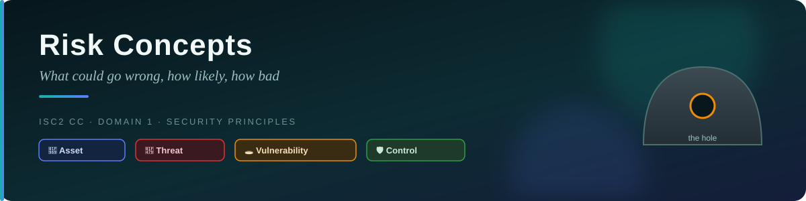

# ⚠️ Risk Concepts — Caveman Style

---

Let's continue with **Grog**. 🪨

In cybersecurity, **risk** is basically about:

> **"What bad thing could happen, how likely is it, and how bad would it be?"**

Imagine Grog's tribe has a cave full of food. 🥩

There are many things that could go wrong.

---

## 🪨 1. Asset

An **asset** is something valuable that you want to protect.

For Grog:

- 🥩 Food
- 🔥 Fire
- 🪓 Weapons/tools
- 🗺️ Hunting map
- 👨‍👩‍👧 Tribe members
- 🪨 Valuable stones

In cybersecurity, assets can include:

- 💻 Computers
- 🗄️ Databases
- 📄 Important files
- 💰 Money
- 👤 Customer information
- 🌐 Websites
- 🧑‍💼 Business reputation

### Easy definition

> **Asset = Something valuable that needs protection.**

---

## 👹 2. Threat

A **threat** is something that could potentially cause harm.

Grog's threats might be:

- 👹 Enemy tribe
- 🐻 Bear
- 🌊 Flood
- 🔥 Fire

Cybersecurity threats include:

- 🦹 Hackers
- 🦠 Malware
- 🎣 Phishing
- 🔥 Ransomware
- 🌪️ Natural disasters
- 👨‍💻 Malicious insiders

### Easy definition

> **Threat = Something that can potentially cause harm.**

---

## 🚪 3. Vulnerability

A **vulnerability** is a weakness that a threat can take advantage of.

Imagine Grog's cave has a **huge hole in the wall**. 🕳️

An enemy tribe sees the hole and thinks:

> "Easy way inside!"

The hole is the **vulnerability**.

In computers, vulnerabilities could include:

- Weak passwords
- Unpatched software
- Misconfigured servers
- Poor access controls
- Vulnerable applications

### Easy definition

> **Vulnerability = A weakness that can be exploited.**

---

## 💥 4. Exploit

An **exploit** is a method or technique used to take advantage of a vulnerability.

Grog's enemy sees the hole in the cave.

They climb through it.

🧗 → 🕳️ → 🏕️

The enemy is **exploiting the vulnerability**.

In cybersecurity:

> A hacker finds a software vulnerability and uses a technique/code to take advantage of it.

That's an **exploit**.

### Remember

**Vulnerability = weakness**

**Exploit = way of using the weakness**

---

## ⚠️ 5. Risk

Now put everything together.

Grog has:

🥩 **Asset:** Food

👹 **Threat:** Enemy tribe

🕳️ **Vulnerability:** Hole in the cave

The enemy could enter through the hole and steal the food.

That's a **risk**.

### Easy definition

> **Risk = The possibility that a threat will exploit a vulnerability and cause harm to an asset.**

---

## 💥 6. Impact

**Impact** means:

> **"How bad will it be if something goes wrong?"**

Suppose the enemy steals one piece of meat.

😐 Small impact.

But suppose they steal **all of Grog's food**.

😱 Huge impact.

In cybersecurity:

### Low impact

A small amount of information is lost.

### High impact

A company loses:

- 💰 Millions of dollars
- 👤 Customer information
- 🏢 Business operations
- ⭐ Reputation

---

## 🎯 7. Likelihood

Likelihood asks:

> **"How likely is this bad thing to happen?"**

Suppose Grog has a tiny hole in the cave.

There is an enemy tribe nearby every day.

The chance of an attack is high.

So:

**High likelihood + high impact = High risk**

---

## 🧮 8. Risk calculation

A simple way to think about risk is:

> **Risk = Likelihood × Impact**

For example:

**Likelihood = 5**

**Impact = 10**

So:

**Risk = 5 × 10 = 50**

The exact mathematical formulas used in real organizations can be more sophisticated, but this is a
useful basic model.

---

## 🛡️ 9. Security Control

A **security control** is something we use to reduce risk.

Grog sees the hole in his cave.

He puts a giant stone over it.

🪨 + 🕳️ = 🚫

That's a security control.

In cybersecurity, controls include:

- 🔥 Firewalls
- 🔐 Encryption
- 🔑 Strong passwords
- 👤 Access controls
- 🛡️ Antivirus/endpoint protection
- 💾 Backups
- 🔄 Security patches
- 🎓 Security training

---

## 🛠️ 10. Risk Mitigation

**Mitigation** means taking action to **reduce risk**.

Grog doesn't want enemies entering his cave.

So he:

1. Finds the hole 🕳️
2. Repairs it 🪨
3. Adds a guard 🛡️
4. Builds another exit 🚪

The risk is reduced.

That's **risk mitigation**.

> **Mitigation = Reduce the likelihood and/or impact of a risk.**

---

## 🤷 11. Risk Acceptance

Sometimes eliminating a risk isn't worth the cost.

Imagine Grog has a tiny crack in his cave.

Fixing it would require:

> 100 pieces of meat.

But the chance of the crack causing a problem is extremely low.

Grog says:

> "Meh. I'll accept the risk."

That's **risk acceptance**.

### Cybersecurity example

A company might identify a low-level risk and decide:

> "The cost of fixing this is greater than the potential damage."

So they knowingly accept the risk.

---

## 🚫 12. Risk Avoidance

Avoidance means:

> **Don't do the risky thing.**

Grog discovers that a particular hunting area is extremely dangerous because of a giant bear. 🐻

Instead of trying to protect himself from the bear, he says:

> "We're not hunting there anymore."

He avoids the activity.

Cybersecurity example:

A company decides not to offer a particularly risky online service.

**No activity → No associated risk from that activity.**

---

## 🤝 13. Risk Transfer

Sometimes Grog says:

> "I don't want to handle all this risk myself."

So he makes an agreement with another tribe:

> "If something happens, you help us recover."

That's similar to **risk transfer**.

In business, a common example is **insurance**.

The organization still has the underlying risk, but some of the financial consequences may be
transferred to another party.

---

## 🛡️ 14. Risk Deterrence

**Deterrence** tries to make someone think:

> "If I attack, bad things will happen to me."

Grog puts a huge sign outside his cave:

> ⚠️ **GUARDS ARE WATCHING**

Even if the guards aren't currently fighting anyone, the warning might discourage attackers.

Cybersecurity examples:

- Warning banners
- Security cameras
- Visible security controls
- Legal consequences
- Account lockout policies

---

## 🔍 15. Risk Detection

Detection means:

> **"Find out when something bad is happening."**

Grog puts a guard outside his cave.

The guard sees an enemy approaching:

> 👀 "ENEMY TRIBE!"

That's detection.

Cybersecurity examples:

- 🚨 Intrusion detection systems
- 📋 Security logs
- 👀 Monitoring
- 🔔 Alerts
- 🛡️ Security operations centers

---

## 🧠 Put everything together

Here's the most important chain:

> **Asset → Threat → Vulnerability → Exploit → Risk → Impact**

Example:

🥩 **Asset:** Grog's food

👹 **Threat:** Enemy tribe

🕳️ **Vulnerability:** Hole in cave

🧗 **Exploit:** Enemy enters through hole

⚠️ **Risk:** Food may be stolen

💥 **Impact:** Tribe has no food

🛡️ **Control:** Block the hole

Once you have a risk, there are several ways to respond to it:

---

## 🎯 Exam Cheat Sheet

| Concept | Caveman meaning | Simple meaning |
| --- | --- | --- |
| 🥩 **Asset** | Food | Something valuable |
| 👹 **Threat** | Enemy tribe | Potential source of harm |
| 🕳️ **Vulnerability** | Hole in cave | Weakness |
| 🧗 **Exploit** | Climbing through hole | Using a weakness |
| ⚠️ **Risk** | Food might be stolen | Possibility of loss/harm |
| 💥 **Impact** | Tribe goes hungry | Damage caused |
| 🎯 **Likelihood** | How likely enemy attacks | Probability/chance |
| 🛡️ **Control** | Block the hole | Protection |
| 🔧 **Mitigation** | Repair the cave | Reduce risk |
| 🤷 **Acceptance** | "We'll live with it" | Knowingly accept risk |
| 🚫 **Avoidance** | Don't go near bear | Eliminate activity/risk |
| 🤝 **Transfer** | Another tribe takes some burden | Shift consequences to another party |
| 👀 **Detection** | Guard spots enemy | Discover problems |

## 🪨 The ultimate caveman memory trick

Remember this story:

> **Grog has FOOD (asset).**
> **Enemy tribe is the THREAT.**
> **There's a HOLE (vulnerability).**
> **Enemy uses the hole (exploit).**
> **Food might be stolen (risk).**
> **Grog could lose all his food (impact).**
> **Grog blocks the hole (control/mitigation).**

### 🎯 One sentence to memorize

> **Risk happens when a threat can exploit a vulnerability and cause harm to an asset.**

---

<a href="../README.md">← Back to 01 · Security Principles</a>

