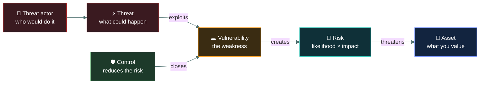
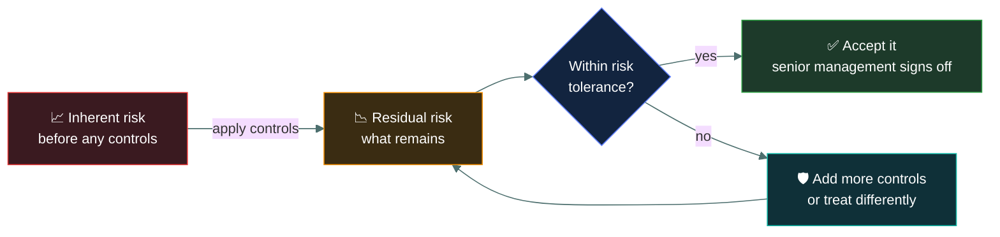

<div align="center">


# ⚠️ Risk concepts

### *Asset, threat, vulnerability, risk — four words the exam will deliberately swap around*

[](../README.md)
[](../README.md)
[](#)

📌 *The densest distractor material in Domain 1. If you can sort any phrase into the right one of these four boxes, you have several marks locked in.*

</div>

---

## 🧸 The big idea

Four words, and the whole of risk management is built from them. Most people use them
loosely in conversation. The exam does not.

> **A threat exploits a vulnerability to harm an asset. Risk is the chance that this
> happens, combined with how bad it would be.**

Read that sentence again — it is the entire topic, and every question here is testing whether
you can take a phrase out of a scenario and put it in the right slot.

A worked example, using a building:

- The **asset** is the laptop and the data on it.
- The **threat** is theft — something that could cause harm.
- The **threat actor** is the thief — the person who would do it.
- The **vulnerability** is that the office door is left unlocked at lunchtime.
- The **risk** is the chance a thief walks in and takes the laptop, together with what that
  would cost you.

Change one element and the risk changes. Lock the door and the vulnerability closes — the
threat still exists, but the risk drops. That relationship is what the exam tests.

---

## 📖 Words you will keep seeing

| Word | What it means on this exam |
|---|---|
| **Asset** | Anything of value to the organisation that is worth protecting — data, systems, facilities, people, reputation. |
| **Threat** | Any circumstance or event with the potential to cause harm. |
| **Threat actor** | The entity that carries out a threat — a person, group, or organisation. |
| **Threat vector** | The path or route a threat uses to reach the asset. |
| **Vulnerability** | A weakness that a threat could exploit. |
| **Exploit** | The act or tool that takes advantage of a vulnerability. |
| **Risk** | The likelihood that a threat exploits a vulnerability, combined with the resulting impact. |
| **Likelihood** | How probable it is that the event occurs. |
| **Impact** | How much harm results if it does occur. |
| **Inherent risk** | The risk before any controls are applied. |
| **Residual risk** | The risk that remains **after** controls are applied. |
| **Risk tolerance** | How much risk the organisation is willing to accept. Set by senior management. |
| **Control** | A safeguard that reduces risk, usually by closing a vulnerability or reducing impact. |

---

## 🔍 How the four fit together



### 💎 Asset

Anything worth protecting. Broader than people expect — it includes **data**, hardware,
software, facilities, **people**, and intangibles like reputation and brand.

Assets have **value**, and that value is what drives every later decision. You do not spend
more protecting something than it is worth, which is why asset valuation comes before control
selection.

### ⚡ Threat

Something that *could* cause harm. Note the conditional: a threat is a **potential**, and it
exists whether or not you are vulnerable to it.

Threats fall into three broad sources, and the exam expects you to know it is not only
attackers:

| Source | Examples |
|---|---|
| **Human, deliberate** | Attackers, malicious insiders, competitors, hacktivists |
| **Human, accidental** | Mistakes, misconfiguration, accidental deletion |
| **Environmental / natural** | Fire, flood, earthquake, power failure, hardware failure |

> ⚠️ **Threats are not always malicious, and not always human.** A flood is a threat. A tired
> administrator typing the wrong command is a threat. Options that define threats as "attacks"
> are usually too narrow.

**Threat actor** is the *who*; **threat** is the *what*; **threat vector** is the *route*. A
phishing email is a vector, a criminal group is the actor, and data theft is the threat.

### 🕳️ Vulnerability

A weakness that a threat could exploit. Like assets, the category is broader than software
bugs:

- **Technical** — unpatched software, weak encryption, misconfiguration, default passwords
- **Physical** — an unlocked door, no CCTV, a server room with a window
- **Administrative** — no security policy, no training, no joiner-mover-leaver process
- **Human** — staff who have never been taught to recognise phishing

> ⚠️ **A vulnerability with no matching threat produces little risk, and a threat with no
> matching vulnerability produces little risk.** You need both for risk to be meaningful. A
> flaw in software you do not run is not your risk.

### 🎲 Risk

The combination of **likelihood** and **impact**.

```
Risk = Likelihood × Impact
```

You do not calculate this numerically on the CC exam, but you must understand the
relationship, because it explains every prioritisation decision:

| Likelihood | Impact | Risk |
|---|---|---|
| High | High | **Critical** — act first |
| High | Low | Moderate — frequent nuisance |
| Low | High | Moderate — rare but severe |
| Low | Low | Low — often accepted |

**Reduce either factor and you reduce the risk.** Most controls reduce likelihood — a firewall
makes intrusion less probable. Some reduce impact instead — backups do not make ransomware less
likely, they make it hurt less. Recognising which a given control does is a common question.

---

## 🔄 Inherent, residual and the risk that is left



**Residual risk is never zero.** No set of controls eliminates risk entirely, and the exam
expects you to say so. The goal is to bring residual risk down to within the organisation's
risk tolerance — a level chosen by senior management, not by the security team.

> 🎯 Any option claiming a control "eliminates" or "removes all" risk is wrong twice over: it
> is an absolute, and it contradicts the definition of residual risk.

---

## ⚖️ Told apart

The table the whole page exists for.

| Phrase in a scenario | It is a… | Why |
|---|---|---|
| "The customer database" | **Asset** | Something of value being protected. |
| "Ransomware" | **Threat** | An event that could cause harm. |
| "An organised criminal group" | **Threat actor** | The entity that would carry it out. |
| "A phishing email" | **Threat vector** | The route the threat travels. |
| "Staff have never had security training" | **Vulnerability** | A weakness that could be exploited. |
| "Servers are missing six months of patches" | **Vulnerability** | A weakness. |
| "A 30% chance of a breach costing $200,000" | **Risk** | Likelihood combined with impact. |
| "The door is left unlocked" | **Vulnerability** | Weakness, not the event. |
| "Theft" | **Threat** | The potential event. |
| "Flooding in the region" | **Threat** | Threats need not be human or malicious. |

| | Means | Not to be confused with |
|---|---|---|
| **Threat** | What *could* happen. | **Vulnerability**, the weakness that would let it happen. Threats are events; vulnerabilities are conditions. |
| **Vulnerability** | A weakness. | **Exploit**, which is the act or tool that takes advantage of the weakness. |
| **Threat** | The event. | **Threat actor**, the entity behind it, and **threat vector**, the route it takes. |
| **Inherent risk** | Before controls. | **Residual risk**, after controls. Residual is never zero. |
| **Risk tolerance** | How much risk the organisation accepts. Set by **senior management**. | A technical judgement. It is a business decision, always. |
| **Likelihood** | How probable. | **Impact**, how bad. Risk needs both — high impact alone is not high risk. |

---

## ⚠️ Where your instinct is wrong

> [!WARNING]
> **In the job:** "threat" and "vulnerability" get used interchangeably in conversation, and
> everyone understands each other.
>
> **On the exam:** they are strictly separate and are swapped in distractors constantly. Threat
> = the potential event. Vulnerability = the weakness. Never let context talk you out of the
> definition.

> [!WARNING]
> **In the job:** a critical CVE in a product is "a risk", and you would say so in a meeting.
>
> **On the exam:** an unpatched CVE is a **vulnerability**. It becomes a risk only when combined
> with a threat that would exploit it and an impact if they did. If you do not run the affected
> product, there is no risk.

> [!WARNING]
> **In the job:** you decide what is worth fixing and what you will live with.
>
> **On the exam:** **you never set risk tolerance and you never accept risk.** Senior management
> does. Options where an analyst or administrator accepts risk are distractors, every time.

---

## 🧠 How to remember it

🧠 **The one sentence:**
**A threat exploits a vulnerability to harm an asset; risk is how likely and how bad.**

🧠 **Threats are events. Vulnerabilities are conditions.**
If it is something that *happens*, it is a threat. If it is a state the organisation is *in*,
it is a vulnerability. "Flooding" is a threat; "the server room is in the basement" is a
vulnerability.

🧠 **No threat, or no vulnerability, means little risk.** Both halves are needed.

---

## ✅ Check you actually got it

Answer all five before expanding anything.

**Q1.** A company's web server is missing a critical security patch. How should this be
classified?

- **A.** A threat
- **B.** A vulnerability
- **C.** A risk
- **D.** An exploit

<details>
<summary><b>Answer</b></summary>

**B — a vulnerability.** A missing patch is a weakness in the environment: a condition the
organisation is in, which an attacker could take advantage of.

- **A** is wrong because a threat is the potential *event* — the attack itself. The missing
  patch is not an event.
- **C** is the most tempting distractor, and it is how people speak at work. But risk requires
  likelihood and impact combined. The vulnerability is one ingredient of the risk, not the risk.
- **D** is the code or technique that *takes advantage* of the weakness, not the weakness.

</details>

**Q2.** Which of the following is a threat rather than a vulnerability?

- **A.** Employees have not received security awareness training
- **B.** The data centre is located on a floodplain
- **C.** A hurricane
- **D.** Administrative accounts use default passwords

<details>
<summary><b>Answer</b></summary>

**C — a hurricane.** It is a potential event that could cause harm, and it demonstrates that
threats need be neither human nor malicious.

- **A** is a weakness in the organisation's preparedness — a condition, so a vulnerability.
- **B** is the strongest distractor. The floodplain location is a *condition* the organisation
  is in, which makes it a vulnerability; the flood itself would be the threat.
- **D** is a technical weakness, so a vulnerability.

</details>

**Q3.** After implementing controls, an organisation determines that some risk remains. What is
this called?

- **A.** Inherent risk
- **B.** Residual risk
- **C.** Accepted risk
- **D.** Total risk

<details>
<summary><b>Answer</b></summary>

**B — residual risk.** It is what remains after controls have been applied, and it is never
zero.

- **A** is the risk *before* any controls — the starting point, not the end state.
- **C** describes a decision that may later be taken about the residual risk, but it is not the
  name for the remaining risk itself. Residual risk exists whether or not anyone formally
  accepts it.
- **D** is not a standard term in this model.

</details>

**Q4.** A backup system is implemented to protect against ransomware. Which component of risk
does it PRIMARILY reduce?

- **A.** Likelihood, because attackers are deterred by good backups
- **B.** Impact, because the organisation can recover without paying
- **C.** Both equally
- **D.** Neither — backups are a recovery measure, not a risk control

<details>
<summary><b>Answer</b></summary>

**B — impact.** Backups do nothing to make an attack less probable. They reduce the harm when
one succeeds, because the organisation can restore rather than lose the data.

- **A** is wrong. Attackers do not know your backup posture when targeting you, and backups do
  not make the infection less likely to occur.
- **C** is wrong for the same reason — there is no meaningful likelihood reduction to balance.
- **D** is wrong on the premise. Recovery measures are absolutely risk controls; they operate on
  the impact side of the equation rather than the likelihood side.

</details>

**Q5.** A risk assessment identifies a risk that exceeds the organisation's risk tolerance. Who
determines whether the organisation will nonetheless accept it?

- **A.** The security analyst who identified it
- **B.** The IT manager responsible for the affected system
- **C.** Senior management
- **D.** The external auditor

<details>
<summary><b>Answer</b></summary>

**C — senior management.** Risk tolerance is set by the business, and decisions to accept risk
outside that tolerance belong to the people accountable for the business.

- **A** is wrong because identifying and assessing a risk confers no authority to accept it. This
  distractor is written to feel natural to the person doing the work.
- **B** is wrong for the same reason — operating a system is not owning the business risk it
  carries.
- **D** is wrong because auditors assess and report independently. An auditor accepting risk would
  destroy the independence that makes the audit meaningful.

</details>

---

## 🎓 The grown-up version

<details>
<summary><b>Extra depth — open this on a second read, never needed for the pass</b></summary>

**Why "Risk = Likelihood × Impact" is a simplification.** Treating risk as a single product is
useful for teaching and hopeless for decision-making, because it flattens two very different
situations into the same number. A 1-in-1000 chance of a $10 million loss and a near-certain
$10,000 annual loss can score identically, yet one threatens the organisation's existence and
the other is a line item. Mature programmes look at the whole distribution rather than a single
expected value, and pay particular attention to the tail — the rare events that could be fatal.
CC teaches the product; be aware it is a starting model.

**Threat modelling gives structure to "what could happen".** Rather than brainstorming threats,
frameworks enumerate them systematically. **STRIDE** — Spoofing, Tampering, Repudiation,
Information disclosure, Denial of service, Elevation of privilege — walks a system and asks
which of six categories apply at each point. Not on the CC syllabus, but it is the natural next
step once these definitions are solid, and it explains why "repudiation" is treated as a threat
category in its own right.

**Vulnerability does not imply exploitability.** In practice a great many vulnerabilities cannot
actually be reached in a given deployment — the affected code path is never called, a
compensating control blocks the route, the component is not network-exposed. This is why
vulnerability management programmes that patch strictly by CVSS score waste effort, and why
exploitability data has become as important as severity. The exam works in the simpler model
where a vulnerability is a weakness, full stop.

**Risk appetite versus risk tolerance.** These get used interchangeably and are not quite the
same. *Appetite* is the broad amount and type of risk an organisation is willing to pursue in
order to meet its objectives — a strategic statement. *Tolerance* is the acceptable variation
around a specific objective — more operational and often expressed as a threshold. CC generally
uses tolerance; if both appear as options, tolerance is the safer pick for a specific threshold
and appetite for a strategic posture.

**Secondary risk.** Treating one risk frequently creates another. Outsourcing a process transfers
the original risk and introduces third-party risk. Encrypting everything protects
confidentiality and creates a key-management risk that can take down availability. Good risk
work asks what the treatment itself introduces — a question the exam touches only lightly, in
the risk treatment topic.

</details>

---

## 📝 Cram lines

Destined for [`EXAM-DAY.md`](../../EXAM-DAY.md):

- **A threat exploits a vulnerability to harm an asset. Risk = likelihood × impact.**
- **Threats are EVENTS. Vulnerabilities are CONDITIONS.** Flood = threat; basement server room = vulnerability.
- **Threats need not be human or malicious** — fire, flood, hardware failure, human error all count.
- **Threat actor** = who. **Threat** = what. **Threat vector** = the route.
- **Unpatched software = vulnerability**, not a risk. Risk needs a threat *and* an impact too.
- **Inherent** = before controls. **Residual** = after controls. **Residual is never zero.**
- **Backups reduce IMPACT, not likelihood.** Firewalls reduce likelihood.
- **Senior management sets risk tolerance and accepts risk.** Never the analyst.

---

<div align="center">
<sub><a href="../README.md">← back to 01 · Security Principles</a> &nbsp;·&nbsp; <a href="../risk-assessment/">next: Risk assessment →</a></sub>
</div>
