# 🎯 Risk Treatment

### *Four choices — accept, avoid, mitigate, transfer — and who gets to make them*

📌 *Match any business decision to one of the four treatments — especially avoid vs mitigate — and know management decides.*

---

## 🧸 The big idea

Your phone could get stolen. You only ever have **four** options:

- **Accept** — it rarely happens; you just live with it.
- **Avoid** — you stop carrying a phone at all. No phone, no theft.
- **Mitigate** — passcode, tracking app, keep it zipped in a pocket. Still possible, but less
  likely and less painful.
- **Transfer** — you buy phone insurance. It can still be stolen, but someone else pays.

Every risk response in any organisation — however fancy it sounds — is one of those four.

---

## 📖 Words you will keep seeing

| Word | What it means on this exam |
|---|---|
| **Risk treatment** | Deciding what to do with an assessed risk. Also called **risk response**. |
| **Accept** | Knowingly bearing the risk, with the decision **documented**. |
| **Avoid** | Eliminating the risk by **stopping the activity** that creates it. |
| **Mitigate** | Reducing likelihood or impact with controls. Also called **risk reduction**. |
| **Transfer** | Shifting the **financial** consequence to a third party. Also called **risk sharing**. |
| **Residual risk** | What's left after treatment. Never zero. |
| **Risk owner** | The named person accountable for a risk. |
| **Risk register** | The record of each risk, its assessment, owner and treatment. |

---

## 🔍 The explanation

### How the choice is made

### ✅ Accept

A **legitimate, deliberate** choice — not laziness. Right when treatment costs more than the risk,
or the risk is already within tolerance.

- It must be **informed and documented** — someone with authority signed off.
- **Not knowing a risk exists is not acceptance.** It's ignorance.

> 🎯 If a control costs more than the ALE, the expected answer is **accept**.

### 🚫 Avoid

**Stop doing the thing.** Cancel the product, leave the market, switch off the service, don't
collect that data.

- The **only** treatment that takes risk to **zero** — by giving up the benefit.
- **The most misidentified treatment.** People read "avoid" as "prevent". It isn't:

### 🛡️ Mitigate

Apply controls. The everyday work of security, and by far the most common treatment.

- **Lower likelihood:** firewalls, patching, MFA, training, access control.
- **Lower impact:** backups, redundancy, encryption, incident response plans.
- Never reaches zero — the remainder is **residual risk**, which then has to be accepted.

### 🤝 Transfer

Move the **financial** consequence to someone else — via **insurance** or **contracts**
(outsourcing, liability clauses, SLA penalties).

> [!IMPORTANT]
> **Transfer moves money, never accountability** — and it doesn't make the event any less likely.

### Who decides

**You recommend. Management decides and owns. You implement.** An option where an analyst
chooses or accepts a treatment is a distractor.

---

## ⚖️ Told apart

The scenario table — most questions on this topic are in here in some form.

| Scenario | Treatment | Why |
|---|---|---|
| Buying cyber insurance | **Transfer** | Financial loss moves to the insurer. |
| Installing a firewall | **Mitigate** | Lowers likelihood; activity continues. |
| Cancelling a planned product because of its risk | **Avoid** | Activity ends; risk gone. |
| A $500 risk isn't worth a $5,000 control | **Accept** | Informed decision to bear it. |
| Outsourcing card payments to a PCI-compliant provider | **Transfer** | Liability shifts by contract. |
| Implementing MFA | **Mitigate** | Lowers likelihood. |
| Taking backups | **Mitigate** | Lowers impact. |
| Not collecting customers' dates of birth at all | **Avoid** | Data never held. |
| Decommissioning an unpatchable legacy service | **Avoid** | Activity ends. |
| Signing an SLA that penalises a vendor for downtime | **Transfer** | Financial consequence shifts. |
| Documenting a low risk and moving on | **Accept** | Deliberate, recorded. |

| | Means | Not to be confused with |
|---|---|---|
| **Avoid** | Stop the activity. Risk → zero. | **Mitigate** — reduce risk while continuing. |
| **Transfer** | Move the **financial** consequence. | **Avoid** — insurance doesn't stop the event. |
| **Accept** | Informed, documented decision. | **Ignoring** a risk — not a treatment at all. |
| **Mitigate** | Reduce likelihood or impact. | **Eliminate** — residual risk always remains. |

---

## ⚠️ Where your instinct is wrong

> [!WARNING]
> **In the job:** "avoiding" a risk sounds like hardening something.
>
> **On the exam:** avoidance means **ceasing the activity**. Carrying on with better controls is
> **mitigation**.

> [!WARNING]
> **In the job:** you make accept-or-fix calls within your remit every day.
>
> **On the exam:** **you never accept risk.** Senior management does.

> [!WARNING]
> **In the job:** buying insurance can feel like giving up on security.
>
> **On the exam:** transfer is fully legitimate, equal to the other three.

---

## 🧠 How to remember it

**"Take it, ditch it, shrink it, share it."** — Accept · Avoid · Mitigate · Transfer.

**Avoid is the only one that reaches zero** — by giving up the activity.

**Transfer moves money, never accountability.**

---

## ✅ Check you actually got it

Answer all five before expanding anything.

**Q1.** An organisation cancels a planned mobile app after assessing that the security risks
outweigh the commercial benefit. Which treatment is this?

- **A.** Risk mitigation
- **B.** Risk avoidance
- **C.** Risk transfer
- **D.** Risk acceptance

<b>Answer</b>

**B — avoidance.** The activity is abandoned, so the risk stops existing.

- **A** would mean building it with controls.
- **C** would mean proceeding and insuring or contracting out the loss.
- **D** would mean proceeding and bearing the risk.

**Q2.** A company buys a cyber insurance policy covering breach response costs. What has it done?

- **A.** Eliminated the risk of a breach
- **B.** Reduced the likelihood of a breach occurring
- **C.** Transferred the financial impact while retaining accountability
- **D.** Avoided the risk entirely

<b>Answer</b>

**C.** Insurance pays for consequences; accountability stays.

- **A** — the breach is just as possible.
- **B** — a policy changes nothing about probability. Only impact moves.
- **D** — the company carries on operating.

**Q3.** A risk has an ALE of $2,000. The only control costs $15,000 per year. What is the MOST
appropriate treatment?

- **A.** Mitigate, because all identified risks should be controlled
- **B.** Avoid, by ceasing the activity that creates the risk
- **C.** Accept, documenting the decision and its rationale
- **D.** Transfer, by purchasing insurance

<b>Answer</b>

**C — accept, documented.** The control costs over 7× the expected annual loss.

- **A** — "every risk must be controlled regardless of cost" is exactly what quantitative
  assessment disproves.
- **B** — shutting an activity over a $2,000 risk gives up far more than it protects.
- **D** — an insurer would charge at least $2,000 plus margin.

**Q4.** Which of the following is risk mitigation rather than risk avoidance?

- **A.** Decommissioning a legacy server that can no longer be patched
- **B.** Applying network segmentation around a legacy server that cannot be patched
- **C.** Withdrawing from a market with unacceptable regulatory exposure
- **D.** Deciding not to collect a category of personal data

<b>Answer</b>

**B.** The server keeps running with a control around it.

- **A** — same server, but switched off: avoidance. That contrast is the question.
- **C** and **D** both stop an activity — avoidance.

**Q5.** After controls are implemented, some risk remains. What must happen to it?

- **A.** Further controls must be applied until it reaches zero
- **B.** It must be formally accepted by senior management, or treated another way
- **C.** It is automatically transferred to the control vendor
- **D.** It is removed from the risk register, as it has been mitigated

<b>Answer</b>

**B.** Residual risk is a decision point, and the decision belongs to the business.

- **A** — zero is impossible.
- **C** — buying a product transfers nothing.
- **D** — a real-world failure: mitigated risks stay on the register with their residual level.

---

## 🎓 The grown-up version

<b>Extra depth — open this on a second read, never needed for the pass</b>

**Frameworks word it differently.** ISO 31000 talks about retaining, sharing and even *taking
more* risk to pursue an opportunity. NIST uses accept/avoid/mitigate/transfer — what CC teaches.
"Risk sharing" = transfer; "risk reduction" = mitigate.

**Insurance transfers less than people think.** Policies have exclusions (acts of war,
known-unpatched vulnerabilities, failing to keep stated controls), **retentions** (deductibles),
**sub-limits** (ransomware often capped low) and **panel requirements** (you must use the
insurer's IR firm). Insurers increasingly demand mitigation as a condition of cover.

**Contractual transfer is only worth what the supplier can pay.** A liability cap set at a
multiple of fees won't cover a $50M loss.

**Mitigation controls come from catalogues** — NIST SP 800-53 (e.g. `AC-2` account management) or
the CIS Controls — and the register cites the control ID so an auditor can verify it.

---

## 📝 Cram lines

Destined for [`EXAM-DAY.md`](../../EXAM-DAY.md):

- **Accept · Avoid · Mitigate · Transfer** — "take it, ditch it, shrink it, share it".
- **Avoid = STOP the activity** (only route to zero). Hardening something = **mitigate**.
- **Transfer moves money, not accountability**, and doesn't lower likelihood.
- **Control cost > ALE → accept.** Acceptance must be informed and documented.
- **Senior management decides and owns.** You recommend and implement.

---

<a href="../README.md">← back to 01 · Security Principles</a> &nbsp;·&nbsp; <a href="../security-controls/">next: Security controls →</a>

