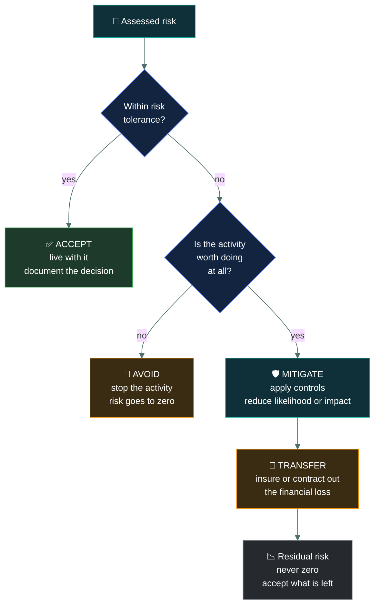
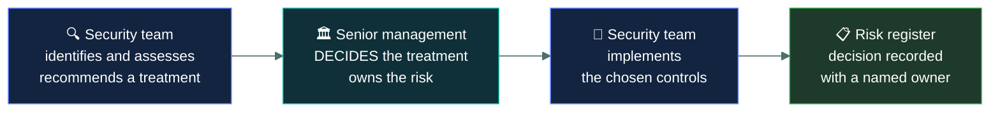

# 🎯 Risk treatment

### *The four things you can do about a risk — and only four*

📌 *Accept, avoid, mitigate, transfer. Expect several questions that describe a decision and ask which one it was.*

---

## 🧸 The big idea

The tribe has assessed it: the gap in the cave wall lets wolves through sometimes, and it costs
them real food every year. Now they have to decide what to actually do about it. There are only
four choices, ever.

1. **"Eh, it barely happens. We'll just live with it."** — do nothing, knowingly. That's
   **accept.**
2. **"Move the whole food store to a different valley with no wolves at all."** — stop doing the
   risky thing entirely. That's **avoid.**
3. **"Build a fence over the gap."** — the risk is still there, but smaller. That's **mitigate.**
4. **"Pay the neighbouring tribe's strongest hunters a few baskets of grain to guard the cave
   for us."** — if wolves get in now, it's their problem to make good on, not yours. That's
   **transfer.**

That's the whole idea. Once a risk is identified and assessed, there are exactly **four** things
an organisation can do about it. Every response, however it is dressed up, is one of these:

| | Treatment | In one line |
|---|---|---|
| ✅ | **Accept** | Live with it. Do nothing, knowingly. |
| 🚫 | **Avoid** | Stop doing the activity that creates the risk. |
| 🛡️ | **Mitigate** | Apply controls to reduce it. |
| 🤝 | **Transfer** | Make it someone else's financial problem. |

The exam's move is to describe a business decision and ask which treatment it represents. The
distinctions are clean once you have them, and two of them — avoid and transfer — are the ones
people get wrong.

**The decision belongs to the business.** You assess and recommend; senior management chooses.
An option in which an analyst selects the treatment is a distractor.

---

## 📖 Words you will keep seeing

| Word | What it means on this exam |
|---|---|
| **Risk treatment** | The decision about what to do with an assessed risk. Also called **risk response**. |
| **Risk acceptance** | Knowingly choosing to bear the risk without further action. |
| **Risk avoidance** | Eliminating the risk by ceasing the activity that creates it. |
| **Risk mitigation** | Reducing likelihood or impact by applying controls. Also called **risk reduction**. |
| **Risk transfer** | Shifting the financial consequence to a third party. Also called **risk sharing**. |
| **Residual risk** | What remains after treatment. Never zero. |
| **Risk tolerance** | How much risk the organisation is willing to bear. Set by senior management. |
| **Risk register** | The record of each risk, its assessment, its owner and its chosen treatment. |
| **Risk owner** | The named person accountable for a specific risk. |

---

## 🔍 The four treatments

### ✅ Accept

Decide the risk is tolerable and take no further action.

This is a **legitimate, deliberate choice**, not a failure to act. It is correct when the cost of
treatment exceeds the cost of the risk, or when the risk already falls within tolerance.

The key distinction: acceptance is **informed and documented**. Someone with authority looked at
the risk and signed off. Not knowing a risk exists is not acceptance — it is ignorance.

> 🎯 If a question describes a control costing more than the ALE, the expected answer is
> **accept**.

### 🚫 Avoid

Stop doing the thing that creates the risk.

Not "reduce it heavily" — **eliminate it by ending the activity**. Cancelling a product launch,
withdrawing from a market, decommissioning a service, deciding not to collect a category of
data.

Avoidance is the only treatment that takes the risk to zero, and it does so by giving up
whatever benefit the activity offered. That trade-off is why it is used sparingly.

> ⚠️ **This is the most misidentified treatment.** Candidates read "avoid" and think "prevent",
> and choose it for scenarios describing strong preventive controls. Installing a firewall is
> **mitigation**. Shutting down the internet-facing service entirely is **avoidance**.

### 🛡️ Mitigate

Apply controls to reduce likelihood, impact, or both. This is the everyday work of security and
by far the most common treatment.

- **Reducing likelihood:** firewalls, patching, MFA, awareness training, access controls.
- **Reducing impact:** backups, redundancy, encryption of data at rest, incident response plans.

Mitigation never reaches zero — whatever is left is residual risk, which then has to be accepted
in its own right.

### 🤝 Transfer

Shift the **financial consequence** to a third party. The two mechanisms are **insurance** and
**contracts** — outsourcing, or clauses that place liability on a supplier.

Two things the exam insists on:

> [!IMPORTANT]
> **Transfer moves the financial loss, not the responsibility.** Cyber insurance pays for the
> breach; it does not make the breach someone else's fault. Your customers, your regulator and
> the press still hold you accountable. **Accountability cannot be outsourced.**

> [!IMPORTANT]
> **Transfer does not reduce likelihood.** The event is exactly as probable after you buy the
> policy as before. Only the financial impact on you changes.

---

## ⚖️ Told apart

The scenario table. Most questions on this topic are in here in some form.

| Scenario | Treatment | Why |
|---|---|---|
| Buying cyber insurance | **Transfer** | The financial loss moves to the insurer. |
| Installing a firewall | **Mitigate** | Reduces likelihood; the activity continues. |
| Cancelling a planned product because of its risk | **Avoid** | The activity ceases; the risk disappears. |
| Deciding a $500 risk is not worth a $5,000 control | **Accept** | Informed decision to bear it. |
| Outsourcing payment processing to a PCI-compliant provider | **Transfer** | Liability shifts by contract. |
| Implementing MFA | **Mitigate** | Reduces likelihood of credential compromise. |
| Taking backups | **Mitigate** | Reduces impact, not likelihood. |
| Choosing not to collect customers' dates of birth at all | **Avoid** | The data is never held, so the risk never exists. |
| Discontinuing a legacy service that cannot be patched | **Avoid** | The activity ends. |
| Encrypting a database | **Mitigate** | Reduces impact of a disclosure. |
| Signing an SLA that penalises the vendor for downtime | **Transfer** | Financial consequence shifts contractually. |
| Documenting a low risk and moving on | **Accept** | Deliberate, recorded, no action. |

| | Means | Not to be confused with |
|---|---|---|
| **Avoid** | Stop the activity. Risk goes to zero. | **Mitigate**, which reduces the risk while continuing the activity. The most common confusion here. |
| **Transfer** | Move the **financial** consequence. | **Avoid.** Insurance does not stop the event happening — it pays for it afterwards. |
| **Accept** | An informed, documented decision to bear the risk. | **Ignoring** a risk, which is not a treatment at all. Acceptance requires that someone with authority knowingly signed off. |
| **Mitigate** | Reduce likelihood or impact with controls. | **Eliminate.** Residual risk always remains. |

---

## 👤 Who decides

You assess and recommend. **Management decides and owns.** You implement. The decision is
recorded in the risk register with a named risk owner.

---

## ⚠️ Where your instinct is wrong

> [!WARNING]
> **In the job:** "avoiding" a risk sounds like good preventive security, and you would use the
> word loosely for hardening something.
>
> **On the exam:** avoidance means **ceasing the activity**. If the business carries on doing the
> thing with better controls around it, that is mitigation, not avoidance.

> [!WARNING]
> **In the job:** you make accept-versus-fix calls constantly within your remit.
>
> **On the exam:** **you never accept risk.** Senior management does. Any option where an analyst,
> engineer or administrator accepts a risk is wrong.

> [!WARNING]
> **In the job:** buying insurance feels like admitting defeat rather than doing security.
>
> **On the exam:** transfer is a fully legitimate treatment, equal in standing to the other three.
> If a scenario describes insurance or a liability clause, transfer is the answer — with no
> implication that something better was available.

---

## 🧠 How to remember it

🧠 **"Take it, ditch it, shrink it, share it."**

- **Take it** — accept
- **Ditch it** — avoid
- **Shrink it** — mitigate
- **Share it** — transfer

🧠 **Avoid is the only one that reaches zero**, and it does so by giving up the activity.

🧠 **Transfer moves money, never accountability.**

---

## ✅ Check you actually got it

Answer all five before expanding anything.

**Q1.** An organisation cancels a planned mobile application after assessing that the security
risks outweigh the commercial benefit. Which treatment is this?

- **A.** Risk mitigation
- **B.** Risk avoidance
- **C.** Risk transfer
- **D.** Risk acceptance

<b>Answer</b>

**B — risk avoidance.** The activity creating the risk has been abandoned, so the risk ceases to
exist. Avoidance is the only treatment that takes a risk to zero.

- **A** would mean building the application with controls to reduce the risk. Nothing is being
  built here.
- **C** would mean shifting the financial consequence to an insurer or supplier while still
  proceeding.
- **D** would mean going ahead and bearing the risk knowingly, which is the opposite of what
  happened.

**Q2.** A company purchases a cyber insurance policy covering breach response costs. What has it
done?

- **A.** Eliminated the risk of a breach
- **B.** Reduced the likelihood of a breach occurring
- **C.** Transferred the financial impact while retaining accountability
- **D.** Avoided the risk entirely

<b>Answer</b>

**C — transferred the financial impact while retaining accountability.** The wording matters:
insurance pays for the consequences; it does not make the breach someone else's responsibility.

- **A** is wrong on two counts — the breach remains exactly as possible, and no treatment
  eliminates risk except avoidance.
- **B** is the most-missed point. A policy changes nothing about how probable an attack is. Only
  impact moves.
- **D** describes ceasing the activity, which has not happened — the company continues operating.

**Q3.** A risk has an ALE of $2,000. The only available control costs $15,000 per year. What is
the MOST appropriate treatment?

- **A.** Mitigate, because all identified risks should be controlled
- **B.** Avoid, by ceasing the activity that creates the risk
- **C.** Accept, documenting the decision and its rationale
- **D.** Transfer, by purchasing insurance

<b>Answer</b>

**C — accept, with the decision documented.** The control costs more than seven times the annual
expected loss. Spending it would destroy value, and acceptance is the rational, legitimate
choice.

- **A** contains the flawed premise that every risk must be controlled regardless of cost, which
  is exactly what quantitative assessment exists to disprove.
- **B** is disproportionate. Shutting down a business activity over a $2,000 annual risk gives up
  far more than it protects.
- **D** is possible in principle, but an insurer pricing a $2,000 expected annual loss will charge
  at least that plus margin, so it does not improve on simply accepting it.

**Q4.** Which of the following is an example of risk mitigation rather than risk avoidance?

- **A.** Decommissioning a legacy server that can no longer be patched
- **B.** Applying network segmentation around a legacy server that cannot be patched
- **C.** Withdrawing from a market with unacceptable regulatory exposure
- **D.** Deciding not to collect a category of personal data

<b>Answer</b>

**B — segmenting the legacy server.** The server stays in service and a control reduces the risk
around it. The activity continues, which is the defining feature of mitigation.

- **A** removes the server from service entirely, ending the activity — avoidance. Note how close
  A and B are: same server, same problem, different treatment, and that contrast is the question.
- **C** ceases an activity — avoidance.
- **D** prevents the risk from ever existing by not undertaking the collection — avoidance.

**Q5.** After controls are implemented, some risk remains. What must happen to it?

- **A.** Further controls must be applied until it reaches zero
- **B.** It must be formally accepted by senior management, or treated another way
- **C.** It is automatically transferred to the control vendor
- **D.** It is removed from the risk register, as it has been mitigated

<b>Answer</b>

**B — formally accepted by senior management, or treated another way.** Residual risk is a
decision point in its own right, and the decision belongs to the business.

- **A** is impossible. No amount of control reduces risk to zero, so this describes an infinite
  loop and contradicts the definition of residual risk.
- **C** is wrong. Buying a product transfers nothing; transfer requires insurance or a contractual
  liability arrangement.
- **D** is wrong and is a genuine real-world failure mode. A mitigated risk stays on the register
  with its residual level recorded, because it still exists and still needs an owner.

---

## 🎓 The grown-up version

<b>Extra depth — open this on a second read, never needed for the pass</b>

**Terminology varies between frameworks.** ISO 31000 uses a broader set of options including
"avoiding the risk by deciding not to start the activity", "taking or increasing risk in order to
pursue an opportunity", "sharing", and "retaining". NIST frames it as accept, avoid, mitigate,
transfer — which is what CC teaches. If an exam option says "risk sharing" or "risk reduction",
read them as transfer and mitigate respectively. Note also that ISO explicitly includes
*increasing* risk deliberately to chase an opportunity, a possibility the four-box model has no
room for and which is genuinely how businesses behave.

**Insurance transfers less than people assume.** Cyber policies carry exclusions that bite
precisely when they matter: acts of war or state-sponsored attack, failure to maintain stated
security controls, known-unpatched vulnerabilities, and prior knowledge of the incident. Several
prominent disputes have turned on war exclusions after state-attributed attacks. The practical
lesson is that transfer is a treatment whose effectiveness depends on reading the contract, and
that insurers increasingly require mitigation as a condition of cover — so the treatments
interact rather than substituting for one another.

**Contractual transfer has the same limits.** An indemnity clause with a supplier is worth
whatever the supplier can actually pay, and most liability caps are set at a multiple of fees
rather than the size of a potential loss. Transferring to a small vendor a risk that could cost
$50 million is transfer in name only.

**Secondary risk.** Every treatment introduces new risk. Outsourcing transfers the original
exposure and creates third-party and concentration risk. Encrypting everything mitigates
disclosure and creates key-management risk that can cause an availability failure. Avoiding a
market avoids its regulatory risk and creates a commercial risk of ceding ground to competitors.
Good risk work asks what the treatment itself brings with it — a question CC touches only
lightly.

**Why documentation is the real deliverable.** The difference between "we accepted that risk" and
"we had no idea" is, in practice, entirely a matter of what was written down and who signed it.
After an incident, a documented acceptance with a named owner and a rationale is a defensible
governance decision. The same risk, undocumented, is negligence. This is why acceptance is
defined as *informed and recorded* rather than simply "no action taken".

---

## 📝 Cram lines

Destined for [`EXAM-DAY.md`](../../EXAM-DAY.md):

- **Four treatments: Accept · Avoid · Mitigate · Transfer.** "Take it, ditch it, shrink it, share it."
- **AVOID = stop the activity.** The only one that reaches zero. Not the same as preventing.
- **MITIGATE = controls, activity continues.** Firewall = mitigate. Shutting the service down = avoid.
- **TRANSFER = insurance or contract.** Moves **financial loss only** — never accountability, never likelihood.
- **ACCEPT = informed and documented.** Not the same as ignoring it.
- **Control costs more than the ALE → accept.**
- **Residual risk must itself be accepted** by senior management. It's never zero.
- **Management decides the treatment.** You assess, recommend, implement.

---

<a href="../README.md">← back to 01 · Security Principles</a> &nbsp;·&nbsp; <a href="../security-controls/">next: Security controls →</a>

