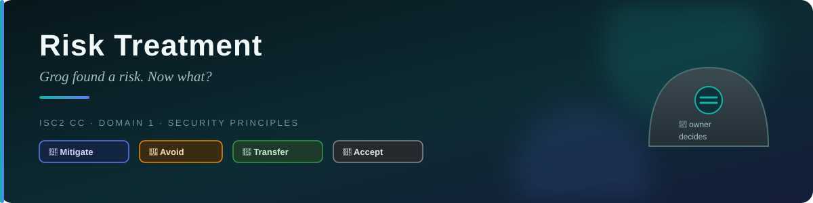

# 🛡️ Risk Treatment — Caveman Style

---

Think of **risk treatment** as:

> 🪨 **"Grog found a risk. Now what should Grog do about it?"**

There are **4 main risk treatments** you should know:

1. 🔧 **Risk Mitigation**
2. 🚫 **Risk Avoidance**
3. 🤝 **Risk Transfer**
4. 🤷 **Risk Acceptance**

---

## 1 · 🔧 Risk Mitigation

### Meaning

> **Reduce the risk by putting controls in place.**

Grog sees a big hole in his cave. 🕳️

He doesn't abandon the cave.

Instead, he puts rocks over the hole.

🪨🪨🪨

The risk is **reduced**.

### Scenario

A company discovers that employees use weak passwords.

The company:

- Requires strong passwords
- Enables MFA
- Locks accounts after repeated failed attempts

➡️ **Risk Mitigation**

> [!NOTE]
> **Caveman memory:** "I have a problem → I'll make it smaller."

---

## 2 · 🚫 Risk Avoidance

### Meaning

> **Eliminate the risk by stopping or avoiding the risky activity.**

Grog discovers that a particular hunting area contains a dangerous bear. 🐻

Instead of trying to fight the bear, he says:

> "We don't hunt there anymore."

The activity stops.

➡️ **Risk Avoidance**

### Cybersecurity scenario

A company is considering storing highly sensitive data on a particular internet-facing system.

After assessing the risks, management decides:

> "We're not going to provide this service at all."

The risky activity is eliminated.

> [!NOTE]
> **Caveman memory:** "Dangerous thing? DON'T DO IT."

---

## 3 · 🤝 Risk Transfer

### Meaning

> **Shift some of the risk or its consequences to another party.**

Grog doesn't want to carry all the risk of losing his food.

He makes an agreement with another tribe:

> "If our food storage is destroyed, you'll help us replace it."

The risk hasn't magically disappeared.

Instead, **some consequences have been transferred**.

### Cybersecurity scenario

A company purchases **cybersecurity insurance**.

If certain covered losses occur, the insurer may provide financial compensation according to the
policy.

➡️ **Risk Transfer**

Other examples can include certain contractual arrangements or outsourcing where responsibilities
and risks are allocated between parties.

> [!NOTE]
> **Caveman memory:** "I don't want to carry all the risk → share/shift it to someone else."

---

## 4 · 🤷 Risk Acceptance

### Meaning

> **Knowingly accept the risk without implementing additional treatment.**

Grog notices a tiny crack in his cave. 🕳️

He calculates that fixing it would cost 100 pieces of meat, while the chance of serious damage is
extremely small.

Grog says:

> "It's not worth fixing. We'll accept it."

➡️ **Risk Acceptance**

### Cybersecurity scenario

A company discovers a low-impact vulnerability in an old internal system.

Fixing it would cost $50,000, while the expected risk is very low.

Management decides:

> "We'll accept the risk for now."

> [!NOTE]
> **Caveman memory:** "I know the risk exists → I'm willing to live with it."

---

## 🎯 The Four Treatments Together

| Treatment | What does it mean? | Caveman example |
| --- | --- | --- |
| 🔧 **Mitigation** | Reduce the risk | Block the cave hole |
| 🚫 **Avoidance** | Stop the risky activity | Don't hunt near the bear |
| 🤝 **Transfer** | Shift some risk/consequences to another party | Get another tribe/insurer to take some financial burden |
| 🤷 **Acceptance** | Knowingly live with the risk | "The tiny crack isn't worth fixing" |

---

## 👑 Who Is Allowed to Choose?

This part is **very important for exams**.

A normal employee **cannot simply decide to accept a major organizational risk**.

Risk treatment decisions should be made by the person or group with the **appropriate authority
and accountability**, usually **management/risk owners**, according to the organization's risk
policies and risk appetite.

### 🧑‍💼 Risk Owner

The **risk owner** is the person responsible for managing a particular risk.

They may:

- Evaluate the risk
- Recommend a treatment
- Implement or oversee controls
- Monitor the risk

But their authority depends on the organization's policies.

---

## 🚨 Important: Risk Acceptance

Risk acceptance is particularly important.

Imagine an employee says:

> "I know our customer database has a serious vulnerability, but I'm accepting the risk."

❌ They normally **cannot make that decision just because they discovered it**.

Why?

Because accepting a significant risk means the organization is consciously agreeing to live with
potential consequences.

The decision needs to come from someone with **appropriate authority**.

For example:

> 👨‍💼 Senior management / authorized risk owner → can approve acceptance within their authority.

---

## 🧠 Scenario Matching

Let's practice.

### Scenario 1

A company installs a firewall to reduce the likelihood of unauthorized network access.

**Answer:** 🔧 **Mitigation**

### Scenario 2

A company stops offering a service because the associated risk is too high.

**Answer:** 🚫 **Avoidance**

### Scenario 3

A company purchases cybersecurity insurance to help cover certain financial losses.

**Answer:** 🤝 **Transfer**

### Scenario 4

A company identifies a very low-risk issue and decides not to spend money fixing it.

**Answer:** 🤷 **Acceptance**

---

## 🎯 Exam Trick

When you see:

**"Install a security control"** → 🔧 **Mitigation**

**"Stop doing something"** → 🚫 **Avoidance**

**"Insurance / contract / another party takes some consequences"** → 🤝 **Transfer**

**"Know the risk but consciously do nothing more"** → 🤷 **Acceptance**

---

## 🪨 Ultimate Caveman Memory

Imagine Grog sees a dangerous bear. 🐻

### 🔧 Mitigation

> **"I'll build a stronger fence."**

**Make risk smaller.**

### 🚫 Avoidance

> **"I won't go near the bear."**

**Stop the risky activity.**

### 🤝 Transfer

> **"Another tribe will help handle the consequences."**

**Shift some risk.**

### 🤷 Acceptance

> **"The bear is far away. I'm okay with the remaining risk."**

**Knowingly live with it.**

And the key rule:

> 👑 **The person with appropriate authority — typically the risk owner/management under
> organizational policy — makes or approves the risk-treatment decision.**

**Employee finds risk → reports/recommends.**
**Authorized risk owner/management → decides within their authority.**

---

<a href="../README.md">← Back to 01 · Security Principles</a>

