# 🛡️ Security Controls

### *Every control gets two labels: what it IS, and what it DOES*

📌 *Classify any control by type AND function — and never answer a type question with a function, or vice versa.*

---

## 🧸 The big idea

Think about protecting your home. A "Beware of the dog" sign, a locked door, a doorbell camera,
and a glazier fixing the broken window afterwards all protect the same house — but they do
**completely different jobs**.

A **control** is anything that reduces risk. The exam labels every control on **two separate
axes**:

- **Type** — *what kind of thing is it?* Technical, administrative or physical.
- **Function** — *what does it do about the risk?* Deterrent, preventive, detective, corrective,
  directive or compensating.

A CCTV camera is **physical** (type) and **detective** (function). A security policy is
**administrative** and **directive**. Encryption is **technical** and **preventive**.

> 🎯 "Which **type** of control…" → technical / administrative / physical. "Which is a
> **detective** control…" → it's asking about function. Mixing the axes is the standard trap.

---

## 📖 Words you will keep seeing

| Word | What it means on this exam |
|---|---|
| **Control** | A safeguard or countermeasure that reduces risk. |
| **Technical** | Implemented in hardware, software or firmware. Also called **logical**. |
| **Administrative** | Implemented through policy, procedure and people. Also called **managerial**. |
| **Physical** | Tangible protection of facilities, equipment and people. |
| **Deterrent** | Discourages the attempt. |
| **Preventive** | Stops it happening. |
| **Detective** | Identifies that it happened (or is happening). |
| **Corrective** | Repairs and restores afterwards. |
| **Directive** | Instructs or mandates required behaviour. |
| **Compensating** | An **alternative** used when the primary control isn't feasible. |
| **Defence in depth** | Layering independent controls so no single failure is fatal. |

---

## 🔍 The explanation

### Axis one — type

| Type | What it is | Examples |
|---|---|---|
| **Technical** (logical) | Technology | Firewall, encryption, antivirus, IDS/IPS, ACLs, MFA, audit logging |
| **Administrative** (managerial) | People and process | Policies, procedures, awareness training, background checks, access reviews, IR plans |
| **Physical** | Tangible things | Locks, fences, guards, badges, mantraps, CCTV, bollards, fire suppression |

The rule and its enforcement are **different types**:

> ⚠️ **Security awareness training is administrative** — even though it's about technology. It's
> delivered through process and changes behaviour.

### Axis two — function

The main four read like a timeline:

The home version:

Plus two that sit outside the timeline:

- **Directive** — *tells people what to do.* Policies, procedures, "staff only" signs.
- **Compensating** — *the stand-in.* The right control isn't possible, so you use another that
  gives comparable protection. Classic case: a legacy system **can't be patched**, so you
  **segment it and monitor it** instead.

### The two that cause trouble

- **Deterrent vs preventive.** A deterrent works on the **mind** — they decide not to try. A
  preventive works on the **situation** — the attempt fails whatever they decide. A "CCTV in
  operation" sign deters; a locked door prevents.
- **A visible camera is both** deterrent and detective. Question stresses *conspicuous /
  signposted* → **deterrent**. Stresses *reviewing footage* → **detective**.

### Both axes together

| Control | Type | Function |
|---|---|---|
| Firewall | Technical | Preventive |
| Audit log / IDS | Technical | Detective |
| Backup and restore | Technical | **Corrective** |
| Antivirus quarantining a file | Technical | Corrective |
| Security policy | Administrative | Directive |
| Awareness training | Administrative | Preventive |
| Background check | Administrative | Preventive |
| Access review | Administrative | Detective |
| Incident response plan | Administrative | Corrective |
| Sanctions policy | Administrative | Deterrent |
| Door lock / bollards | Physical | Preventive |
| CCTV camera | Physical | Detective (deterrent if visible) |
| Warning sign | Physical | Deterrent |
| Fire suppression | Physical | Corrective |

> [!IMPORTANT]
> **Backups are corrective, not preventive.** They don't stop the loss — they repair it. One of the
> most-missed classifications on the whole exam.

### Defence in depth

Never rely on one control. Layer independent ones — and mix the **types**, because controls of the
same kind tend to fail for the same reasons:

---

## ⚖️ Told apart

| | Means | Not to be confused with |
|---|---|---|
| **Technical** | Hardware or software. | **Administrative** — people and process. Policy document vs the setting enforcing it. |
| **Preventive** | Stops the event. | **Deterrent** — discourages the attempt. Situation vs mind. |
| **Detective** | Finds out it happened. | **Preventive** — logging detects; a firewall prevents. |
| **Corrective** | Restores afterwards. | **Preventive** — backups are corrective. |
| **Compensating** | A **substitute** for an infeasible control. | An *additional* layer for depth. |
| **Directive** | Instructs behaviour. | **Preventive** — "don't share passwords" directs; blocking shared sessions prevents. |

---

## ⚠️ Where your instinct is wrong

> [!WARNING]
> **In the job:** backups save you from ransomware, so they feel protective.
>
> **On the exam:** backups are **corrective**. They restore after the loss.

> [!WARNING]
> **In the job:** awareness training is a compliance tick-box.
>
> **On the exam:** it's an **administrative, preventive** control — and often the answer to "BEST
> way to reduce phishing susceptibility".

> [!WARNING]
> **In the job:** a camera is a camera.
>
> **On the exam:** read the emphasis — visible → **deterrent**; footage reviewed → **detective**.

---

## 🧠 How to remember it

**Two questions: "What is it?" (type) and "What does it do?" (function).**

**TAP** for types: **T**echnical · **A**dministrative · **P**hysical.

**The function timeline:** *discourage → stop → notice → fix.*

**Backups fix, they don't stop.**

---

## ✅ Check you actually got it

Answer all five before expanding anything.

**Q1.** An organisation performs nightly backups of its file servers. How is this control
classified by function?

- **A.** Preventive
- **B.** Detective
- **C.** Corrective
- **D.** Deterrent

<b>Answer</b>

**C — corrective.** Backups restore after loss; they don't stop it.

- **A** — the most common wrong answer. Holding a copy doesn't stop the deletion or ransomware.
- **B** — something else detects the incident; backups are what you reach for after.
- **D** — attackers aren't discouraged by backups they don't know about.

**Q2.** A company publishes a policy requiring staff to lock their workstations when leaving
their desk. How is this control classified by **type**?

- **A.** Technical
- **B.** Administrative
- **C.** Physical
- **D.** Compensating

<b>Answer</b>

**B — administrative.** It's a documented rule implemented through behaviour.

- **A** would be the auto-lock *setting* enforcing it.
- **C** would be something tangible, like a door lock.
- **D** is a *function*, not a type — the classic axis mix-up.

**Q3.** A legacy application can't be patched because the vendor no longer supports it. The
organisation isolates it on a dedicated segment with enhanced monitoring. What kind of control
is the segmentation?

- **A.** Preventive
- **B.** Compensating
- **C.** Corrective
- **D.** Directive

<b>Answer</b>

**B — compensating.** Patching isn't feasible, so an alternative gives comparable protection.

- **A** is defensible alone, but the stem frames it as a **substitute** — the signal for
  compensating.
- **C** — nothing is being restored.
- **D** — no behaviour is mandated.

**Q4.** Which classifies a visible CCTV camera with prominent warning signage?

- **A.** Technical type, preventive function
- **B.** Physical type, corrective function
- **C.** Physical type, deterrent and detective function
- **D.** Administrative type, directive function

<b>Answer</b>

**C.** A tangible device (physical); conspicuous so it deters; recording so it detects.

- **A** — wrong type, and a camera doesn't block anything.
- **B** — right type, wrong function.
- **D** — wrong on both axes.

**Q5.** Which is an administrative control with a **preventive** function?

- **A.** An intrusion detection system
- **B.** Pre-employment background screening
- **C.** A fire suppression system
- **D.** A quarterly review of user access rights

<b>Answer</b>

**B.** A human process that stops an unsuitable person getting a position of trust.

- **A** — technical, detective.
- **C** — physical, corrective.
- **D** — administrative, but **detective**: it finds bad access that already exists.

---

## 🎓 The grown-up version

<b>Extra depth — open this on a second read, never needed for the pass</b>

**The taxonomy is a teaching device.** A security guard prevents, deters, detects and responds.
Exam stems resolve this by stressing one aspect — so read what the question emphasises. The real
value is gap analysis: "do we have anything *detective* here, or only preventive?"

**NIST words it differently** — technical, operational and management — where CC uses technical,
physical and administrative.

**Compensating controls are formal under PCI DSS**: documented justification, must meet the intent
and rigour of the original requirement, validated by an assessor. Not just "we did something
else".

**Defence in depth inside the technical layer:** perimeter firewall → WAF → IDS/IPS → internal
segmentation → EDR → encryption at rest. Each layer fails *differently* from its neighbours.

**Existing isn't operating.** A camera not recording or a log nobody reviews is a control on paper
only.

---

## 📝 Cram lines

Destined for [`EXAM-DAY.md`](../../EXAM-DAY.md):

- **Two axes:** TYPE (technical / administrative / physical) and FUNCTION (deterrent / preventive / detective / corrective / directive / compensating).
- **Backups = CORRECTIVE.** Awareness training = **administrative, preventive**.
- **Policy document = administrative; the setting enforcing it = technical.**
- **Visible camera = deterrent; reviewing footage = detective.**
- **Compensating = substitute** when the right control (e.g. patching) isn't possible.

---

<a href="../README.md">← back to 01 · Security Principles</a> &nbsp;·&nbsp; <a href="../governance-documents/">next: Governance documents →</a>

