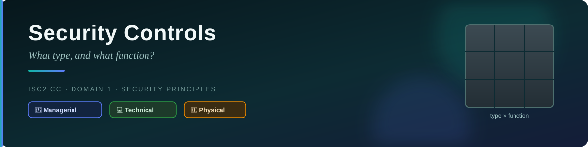
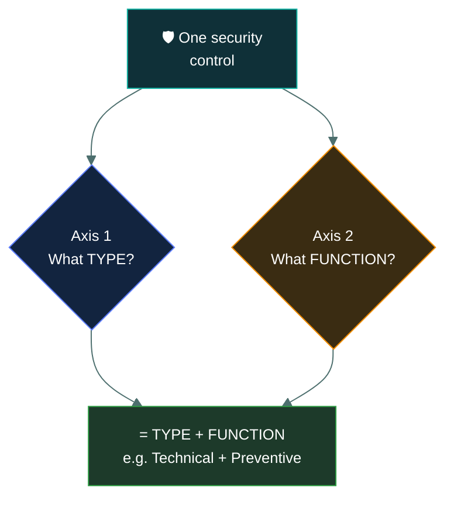
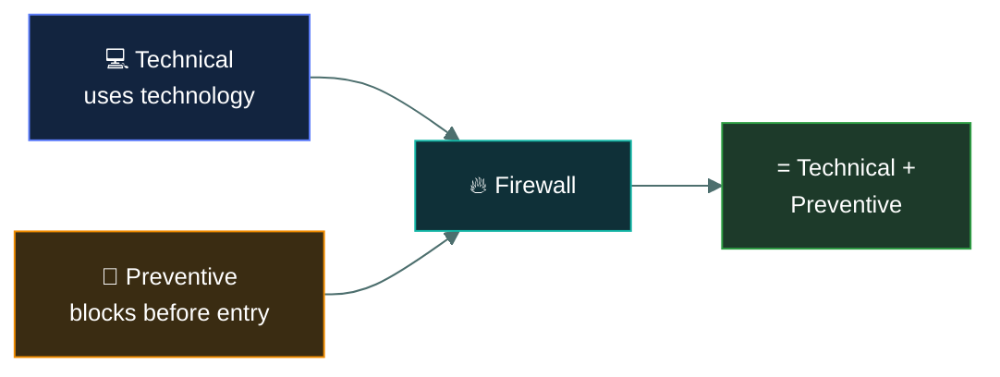
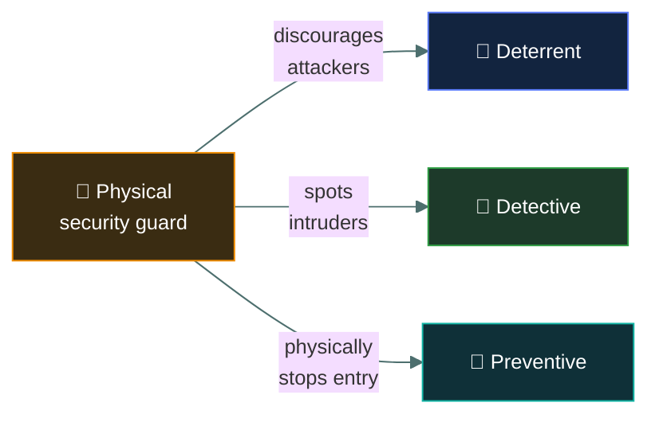

# 🛡️ Security Controls — Caveman Style

---

This is a **very important exam topic** because a security control can be classified in **two
different ways at the same time**.

Think of it as asking **two separate questions** about the same control:

> **Axis 1: What TYPE of control is it?**
> **Axis 2: What FUNCTION does it perform?**

A single control can therefore have **one type + one function**.

---

## 🪨 Axis 1: Control TYPE

The first axis asks:

> **"What is the nature of the control?"**

There are usually **three types**:

### 1 · 🧑‍💼 Managerial

Managerial controls come from **management decisions, policies, procedures, and risk
management**.

Think:

> 👑 "The tribe leader makes the rules."

Examples:

- Security policies
- Risk assessments
- Security awareness programs
- Security procedures
- Background checks
- Security governance

**Caveman example:** Grog's chief says: "Nobody enters the food cave without permission." That's a
**managerial control** because leadership established the rule.

### 2 · 💻 Technical

Technical controls use **technology** to protect systems or information.

Think:

> 🤖 "The computer protects the cave."

Examples:

- 🔥 Firewall
- 🔐 Encryption
- 🔑 Password systems
- 👤 Access-control systems
- 🛡️ Antivirus/endpoint protection
- 🚨 Intrusion detection systems
- MFA

**Caveman example:** Instead of a guard checking people manually, Grog installs a **magical stone
scanner** that automatically blocks unauthorized cavemen. That's **technical**.

### 3 · 🚪 Physical

Physical controls protect through **physical means**.

Think:

> 🧱 "Something physically stops you."

Examples:

- 🔒 Locks
- 🚪 Doors
- 🧱 Fences
- 📹 Security cameras
- 👮 Security guards
- 💡 Lighting
- 🔑 Physical access cards
- Mantraps

**Caveman example:** Grog puts a giant rock in front of the cave entrance. 🪨🚪 That's **physical**.

> [!TIP]
> **Axis 1 memory trick:**
> 👑 **Managerial = RULES**
> 💻 **Technical = TECHNOLOGY**
> 🚪 **Physical = THINGS**

---

## ⚙️ Axis 2: Control FUNCTION

Now forget about _what the control is made of_.

Instead ask:

> **"What is this control trying to DO?"**

The major functions are:

1. 🛑 **Preventive**
2. 👀 **Detective**
3. 🔧 **Corrective**
4. 🚧 **Deterrent**
5. 🔄 **Compensating**
6. 💾 **Recovery**

### 1 · 🛑 Preventive

**Purpose:** Stop something bad before it happens.

Grog builds a wall around his cave. 🧱 The enemy can't get in. That's **preventive**.

Cybersecurity examples: Firewall blocking malicious traffic · Access controls · Strong passwords ·
MFA · Encryption · Security policies

**Memory:** Preventive = STOP IT BEFORE

### 2 · 👀 Detective

**Purpose:** Find out that something bad is happening or has happened.

Grog puts a guard outside the cave. 👀 The guard sees an enemy approaching. That's **detective**.

Cybersecurity examples: Intrusion detection system · Security logs · SIEM monitoring · Security
cameras · File-integrity monitoring · Alerts

**Memory:** Detective = FIND IT

### 3 · 🔧 Corrective

**Purpose:** Fix the problem after something has gone wrong.

The enemy breaks the cave door. Grog repairs it. 🔨🪨 That's **corrective**.

Cybersecurity examples: Removing malware · Patching a compromised system · Resetting compromised
credentials · Fixing a configuration problem

**Memory:** Corrective = FIX IT

### 4 · 🚧 Deterrent

**Purpose:** Discourage someone from doing something bad.

Grog puts a giant sign outside the cave: ⚠️ "GUARDS ARE WATCHING". An enemy sees it and thinks:
"Hmm... maybe I'll attack another cave." That's **deterrent**.

Cybersecurity examples: Warning banners · Visible security cameras · Security guards · Legal
notices · "Unauthorized access prohibited" messages

**Memory:** Deterrent = SCARE THEM AWAY

### 5 · 🔄 Compensating

**Purpose:** Provide an alternative control when the preferred control isn't possible.

Imagine Grog normally protects his cave with a giant stone door. But the stone door is broken. So
he puts two guards at the entrance instead. 👮👮 The guards provide an **alternative protection**.
That's **compensating**.

Cybersecurity example: Suppose an old system can't support modern MFA. The organization might use
additional controls such as stronger network restrictions, extra monitoring, restricted access, or
additional authentication controls. The exact control depends on the situation.

**Memory:** Compensating = SUBSTITUTE

### 6 · 💾 Recovery

**Purpose:** Restore normal operations after an incident.

A flood destroys Grog's food storage. 🌊💥 Luckily, Grog has food stored in another cave. He uses
the backup food to recover. That's **recovery**.

Cybersecurity examples: Backups · Disaster recovery · System restoration · Backup sites · Recovery
procedures

**Memory:** Recovery = GET BACK TO NORMAL

---

## 🧠 The Big Exam Trick

Here's where students often make mistakes.

**Type and function are NOT the same thing.**

For example:

> 🔥 Firewall

You might say:

**Type:** Technical
**Function:** Preventive

Both answers can be correct.

---

## 🎯 Example 1: Firewall

A firewall blocks unauthorized network traffic.

**Type?** 💻 **Technical** — Because it uses technology.

**Function?** 🛑 **Preventive** — Because it blocks the traffic before it reaches the protected
system.

**Answer:** **Technical + Preventive**

## 🎯 Example 2: Security Camera

A security camera records activity around a building.

**Type?** 🚪 **Physical** — It is part of physical security.

**Function?** 👀 **Detective** — It helps detect/identify activity.

**Answer:** **Physical + Detective**

## 🎯 Example 3: Security Policy

A company creates a policy requiring employees to use MFA.

**Type?** 🧑‍💼 **Managerial** — It's a management/governance control.

**Function?** 🛑 **Preventive** — Its purpose is to reduce unauthorized access before it occurs.

**Answer:** **Managerial + Preventive**

## 🎯 Example 4: Backup

A company keeps backups so it can restore data after ransomware.

**Type?** 💻 **Technical** _(if referring to the technical backup system)_

**Function?** 💾 **Recovery** — It helps restore operations after an incident.

**Answer:** **Technical + Recovery**

But be careful: if the question is specifically about a **backup policy/procedure**, its type
could be **managerial**. The wording matters.

## 🎯 Example 5: Security Guard

A security guard stands at the entrance.

**Type?** 🚪 **Physical**

**Function?** It depends on the scenario.

If the guard is there mainly to **discourage attackers**: 🚧 **Deterrent**

If the guard **spots unauthorized people**: 👀 **Detective**

If the guard **physically stops someone from entering**: 🛑 **Preventive**

This is why you should focus on **what the control actually does in the scenario**, not just
memorize a fixed label.

---

## 📊 The Two-Axis Cheat Sheet

| Control | Type | Function |
| --- | --- | --- |
| 🔥 Firewall blocking traffic | Technical | Preventive |
| 👀 IDS | Technical | Detective |
| 📹 Security camera | Physical | Detective |
| 🚪 Locked door | Physical | Preventive |
| 👮 Guard discouraging attackers | Physical | Deterrent |
| 📜 Security policy | Managerial | Preventive |
| 🎓 Security awareness training | Managerial | Preventive |
| 🦠 Malware removal | Technical | Corrective |
| 💾 Backup used after disaster | Technical | Recovery |
| 🔄 Alternative security mechanism | Varies | Compensating |

---

## 🧠 How to Answer Exam Questions

When they give you a scenario, **do NOT immediately pick one label**.

Ask yourself **two questions**:

**Question 1️⃣** — "What TYPE is this?" Is it: 👑 Managerial? 💻 Technical? 🚪 Physical?

**Question 2️⃣** — "What FUNCTION does it perform?" Is it: 🛑 Preventive? 👀 Detective? 🔧
Corrective? 🚧 Deterrent? 🔄 Compensating? 💾 Recovery?

Then give **both**.

---

## 🪨 Ultimate Caveman Trick

Imagine Grog's cave.

**First ask:** "WHO/WHAT is doing the protecting?"

- 👑 **Rules/management** → Managerial
- 💻 **Computer/technology** → Technical
- 🚪 **Physical object/person** → Physical

**Then ask:** "WHAT is it doing?"

- 🛑 **Stop** → Preventive
- 👀 **Find** → Detective
- 🔧 **Fix** → Corrective
- 🚧 **Scare away** → Deterrent
- 🔄 **Alternative** → Compensating
- 💾 **Restore** → Recovery

### 🎯 Exam formula

> **Security Control = TYPE + FUNCTION**

For example:

> 🔥 **Firewall = Technical + Preventive**

> 📹 **Security camera = Physical + Detective**

> 📜 **Security policy = Managerial + Preventive**

If you remember **"What is it?" + "What does it do?"**, you'll be able to classify most exam
scenarios.

---

<a href="../README.md">← Back to 01 · Security Principles</a>

