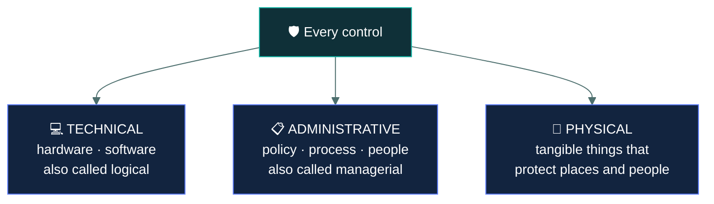
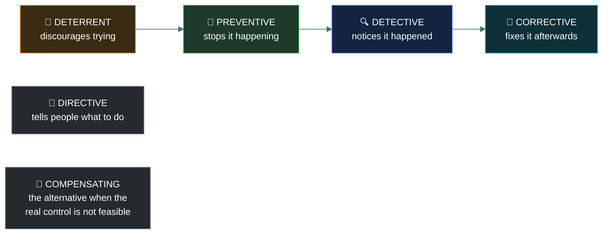

# 🛡️ Security controls

### *Every safeguard is classified twice — by what it is, and by what it does*

📌 *Two independent axes — type and function. Almost every control question is asking about one of them, and the exam rarely tells you which.*

---

## 🧸 The big idea

A **control** is anything that reduces risk. A lock, a firewall, a policy, a security guard, a
training course, a backup, a warning sign.

Controls are classified along **two separate axes**, and that is the whole topic:

- **Type** — *what kind of thing it is.* Technical, administrative, or physical.
- **Function** — *what it does about the risk.* Preventive, detective, corrective, deterrent,
  compensating, directive.

Every control has both. A CCTV camera is **physical** by type and **detective** by function.
A security policy is **administrative** by type and **directive** by function. Encryption is
**technical** by type and **preventive** by function.

Candidates lose marks by learning one axis and being asked about the other. When a question
says "which type of control", it means technical / administrative / physical. When it says
"which of the following is a detective control", it is asking about function.

---

## 📖 Words you will keep seeing

| Word | What it means on this exam |
|---|---|
| **Control** | A safeguard or countermeasure that reduces risk. Also called a **countermeasure** or **safeguard**. |
| **Technical control** | Implemented in hardware, software or firmware. Also called a **logical control**. |
| **Administrative control** | Implemented through policy, procedure and human process. Also called a **managerial** control. |
| **Physical control** | Something tangible that protects facilities, equipment and people. |
| **Preventive** | Stops an incident before it happens. |
| **Detective** | Identifies that an incident has happened or is happening. |
| **Corrective** | Restores or repairs after an incident. |
| **Deterrent** | Discourages someone from attempting the act at all. |
| **Compensating** | An alternative control used when the primary one is not feasible. |
| **Directive** | Instructs or mandates required behaviour. |
| **Defence in depth** | Layering multiple controls so no single failure is fatal. |

---

## 🔍 Axis one — control types

| Type | What it is | Examples |
|---|---|---|
| **Technical** (logical) | Implemented in technology | Firewalls, encryption, antivirus, IDS/IPS, access control lists, MFA, audit logging, password complexity enforcement |
| **Administrative** (managerial) | Implemented through people and process | Policies, procedures, standards, security awareness training, background checks, risk assessments, access reviews, incident response plans |
| **Physical** | Tangible protection of places and things | Locks, fences, guards, badges, mantraps, CCTV, bollards, fire suppression, server-room cooling |

> 🎯 **A password *policy* is administrative; the system *enforcing* password complexity is
> technical.** The document is process, the enforcement is technology. That pair is a recurring
> exam item.

> ⚠️ **Security awareness training is administrative**, not technical — even though it is about
> technology. It is delivered through process and changes human behaviour.

---

## 🔍 Axis two — control functions

Read the chain as a timeline: **before · before · during · after.**

| Function | Timing | Does what | Examples |
|---|---|---|---|
| **Deterrent** | Before | Discourages the attempt | Warning signs, visible cameras, sanctions policy, guard presence |
| **Preventive** | Before | Stops it occurring | Locks, firewalls, encryption, MFA, access controls, fences |
| **Detective** | During / after | Identifies that it occurred | IDS, audit logs, CCTV review, alarms, monitoring, audits |
| **Corrective** | After | Fixes and restores | Backups and restoration, patching, incident response, failover, antivirus quarantine |
| **Directive** | Before | Mandates behaviour | Policies, procedures, signage instructing action, training requirements |
| **Compensating** | Varies | Substitutes for an infeasible primary control | Segmenting a server that cannot be patched; extra monitoring where separation of duties is impossible |

### The two that cause trouble

**Deterrent versus preventive.** A deterrent works on a person's *mind* — it makes them decide
not to try. A preventive works on the *situation* — it makes the attempt fail, whatever they
decide. A sign saying "CCTV in operation" deters. A locked door prevents.

> 🎯 A **visible** camera is both deterrent and detective. If the question emphasises that it is
> conspicuous or signposted, it wants deterrent. If it emphasises reviewing footage, it wants
> detective.

**Compensating.** Used when the control you *should* have is not possible — for cost, technical
or operational reasons. The compensating control gives comparable protection by another route.

The classic case: a legacy system that cannot be patched. Patching is the right control and it
is unavailable, so you compensate with network segmentation and heightened monitoring.

---

## 🧩 The two axes together

Every control has a position on both. Some worked examples:

| Control | Type | Function |
|---|---|---|
| Firewall | Technical | Preventive |
| Audit log | Technical | Detective |
| Backup and restore | Technical | Corrective |
| Encryption | Technical | Preventive |
| IDS | Technical | Detective |
| Antivirus quarantining a file | Technical | Corrective |
| Security policy | Administrative | Directive |
| Security awareness training | Administrative | Preventive |
| Background check | Administrative | Preventive |
| Access review | Administrative | Detective |
| Incident response plan | Administrative | Corrective |
| Sanctions policy | Administrative | Deterrent |
| Door lock | Physical | Preventive |
| Security guard | Physical | Preventive and deterrent |
| CCTV camera | Physical | Detective (and deterrent if visible) |
| Warning sign | Physical | Deterrent |
| Fire suppression system | Physical | Corrective |
| Bollards | Physical | Preventive |

> [!IMPORTANT]
> **Backups are corrective, not preventive.** They do nothing to stop data loss; they repair it
> afterwards. This is among the most frequently missed items on the whole exam.

---

## 🧱 Defence in depth

No single control should be the only thing between an attacker and an asset. **Defence in depth**
layers multiple, independent controls so that one failure is survivable.

Good layering mixes both axes — a technical control, an administrative one and a physical one
protecting the same asset — because controls of the same kind tend to fail for the same reasons.

---

## ⚖️ Told apart

| | Means | Not to be confused with |
|---|---|---|
| **Technical** | Implemented in hardware or software. | **Administrative**, implemented through people and process. A password policy document is administrative; the setting enforcing it is technical. |
| **Preventive** | Stops the event occurring. | **Deterrent**, which discourages the attempt. Preventive acts on the situation; deterrent acts on the mind. |
| **Detective** | Finds out it happened. | **Preventive**, which stops it. Logging detects; a firewall prevents. |
| **Corrective** | Restores afterwards. | **Preventive.** Backups are corrective. Redundancy that keeps a service running is usually treated as corrective too. |
| **Compensating** | An alternative where the primary control is infeasible. | An *additional* control layered on for depth. Compensating implies a substitution. |
| **Directive** | Instructs required behaviour. | **Preventive.** A policy saying "do not share passwords" directs; a system blocking shared sessions prevents. |

---

## ⚠️ Where your instinct is wrong

> [!WARNING]
> **In the job:** backups are the thing that saves you from ransomware, so they feel protective.
>
> **On the exam:** backups are **corrective**. They restore after the loss and do nothing to
> prevent it. The most commonly missed control classification on the paper.

> [!WARNING]
> **In the job:** awareness training is a compliance exercise you would not call a security
> control.
>
> **On the exam:** it is an **administrative, preventive** control, and it is frequently the
> correct answer to "what is the BEST way to reduce susceptibility to phishing".

> [!WARNING]
> **In the job:** a camera is a camera.
>
> **On the exam:** read the emphasis. Signposted and visible → **deterrent**. Footage reviewed
> after an incident → **detective**. The same device, classified by what the question stresses.

---

## 🧠 How to remember it

🧠 **Two axes: "What is it?" and "What does it do?"**
Type = technical / administrative / physical. Function = what it does about the risk.

🧠 **TAP** for the types: **T**echnical, **A**dministrative, **P**hysical.

🧠 **The function timeline:** *discourage → stop → notice → fix.*
Deterrent, preventive, detective, corrective — in time order.

🧠 **Backups fix, they do not stop.** Corrective.

---

## ✅ Check you actually got it

Answer all five before expanding anything.

**Q1.** An organisation performs nightly backups of its file servers. How is this control
classified by function?

- **A.** Preventive
- **B.** Detective
- **C.** Corrective
- **D.** Deterrent

<b>Answer</b>

**C — corrective.** Backups restore data after it has been lost or damaged. They have no effect
on whether the loss occurs.

- **A** is the most common wrong answer, because backups feel protective. But nothing about
  holding a copy stops the deletion, the ransomware or the disk failure from happening.
- **B** is wrong — backups do not identify that an incident occurred. Something else detects it;
  the backup is what you reach for afterwards.
- **D** is wrong. An attacker is not discouraged by the existence of backups, and generally does
  not know about them.

**Q2.** A company publishes a policy requiring all staff to lock their workstations when leaving
their desk. How is this control classified by **type**?

- **A.** Technical
- **B.** Administrative
- **C.** Physical
- **D.** Compensating

<b>Answer</b>

**B — administrative.** It is a policy: a documented rule implemented through process and human
behaviour.

- **A** would describe a group policy setting that locks the screen automatically after a timeout
  — the technology enforcing the same outcome. The distinction between the rule and its
  enforcement is exactly what this question tests.
- **C** would be something tangible, such as a physical lock on the office door.
- **D** names a *function*, not a type. The question asked for the type, and mixing the two axes
  is the standard trap on this topic.

**Q3.** A legacy application cannot be patched because the vendor no longer supports it. The
organisation isolates it on a dedicated network segment with enhanced monitoring. What kind of
control is the segmentation?

- **A.** Preventive
- **B.** Compensating
- **C.** Corrective
- **D.** Directive

<b>Answer</b>

**B — compensating.** The primary control, patching, is not feasible, so an alternative provides
comparable protection by another route. That substitution is what defines a compensating control.

- **A** is defensible in isolation — segmentation does prevent lateral movement — but the stem
  specifically frames it as a substitute for an unavailable control, which is the signal for
  compensating. Read what the question emphasises.
- **C** is wrong: nothing is being restored or repaired.
- **D** is wrong: no behaviour is being mandated to people.

**Q4.** Which combination correctly classifies a visible CCTV camera with prominent warning
signage?

- **A.** Technical type, preventive function
- **B.** Physical type, corrective function
- **C.** Physical type, deterrent and detective function
- **D.** Administrative type, directive function

<b>Answer</b>

**C — physical type, deterrent and detective function.** The camera is a tangible physical
control. Being conspicuous and signposted makes it deter attempts; recording footage makes it
detect what occurred.

- **A** misclassifies the type. A camera is physical, and it does not prevent anything — it
  neither blocks entry nor stops an act in progress.
- **B** has the right type but the wrong function. Nothing is repaired or restored by a camera.
- **D** is wrong on both axes; the signage supports the camera rather than making the control
  administrative.

**Q5.** Which of the following is an administrative control with a **preventive** function?

- **A.** An intrusion detection system
- **B.** Pre-employment background screening
- **C.** A fire suppression system
- **D.** A quarterly review of user access rights

<b>Answer</b>

**B — pre-employment background screening.** It is administrative, being a human process, and
preventive, because it stops an unsuitable person being placed in a position of trust in the
first place.

- **A** is technical by type and detective by function — wrong on both axes.
- **C** is physical by type and corrective by function.
- **D** is administrative, which is half right, but an access review is **detective** — it finds
  inappropriate access that already exists rather than stopping it being granted.

---

## 🎓 The grown-up version

<b>Extra depth — open this on a second read, never needed for the pass</b>

**The classification is a teaching device, not a natural law.** Most real controls sit in several
boxes at once depending on how you look at them. A security guard prevents entry, deters
attempts, detects intrusions, and responds to incidents — all four functions in one person. Exam
questions resolve this by emphasising one aspect in the stem, which is why reading *what the
question stresses* matters more than knowing a fixed answer for each control. In practice, the
value of the taxonomy is that it prompts the question "do we have anything detective here, or
only preventive?" — which is a genuinely useful gap analysis.

**NIST's version differs slightly.** NIST SP 800-53 groups controls into families and describes
them as technical, operational and management, rather than technical, physical and
administrative. "Operational" covers much of what CC calls physical plus the day-to-day human
processes, while "management" covers governance and risk activity. If you continue to further
certifications you will meet both schemes; CC uses technical / administrative / physical.

**Compensating controls in compliance.** The term has a specific, stricter meaning in regulated
regimes. Under PCI DSS, a compensating control requires documented justification of why the
original requirement cannot be met, and the alternative must meet the intent and rigour of the
original, provide a comparable level of defence, and be validated by an assessor. It is not "we
did something else instead" — it is a formal process with paperwork. That rigour exists because
compensating controls are otherwise an obvious route to declaring non-compliance compliant.

**Control effectiveness is separate from control existence.** A control that exists but is not
operating — the camera not recording, the policy nobody has read, the log nobody reviews —
provides no risk reduction at all while appearing in every inventory as present. This is the gap
between a control being *implemented* and being *effective*, and it is what audits actually test.
CC does not examine this distinction, but it is why "we have a policy" is rarely a complete
answer to anything in practice.

**Why layering across types matters.** Controls of the same type tend to share failure modes. Three
technical controls all depending on the same directory service fail together when it does. Mixing
a physical barrier, a human process and a technical enforcement gives genuinely independent
layers — which is the real content of defence in depth, as opposed to simply buying more
security products.

---

## 📝 Cram lines

Destined for [`EXAM-DAY.md`](../../EXAM-DAY.md):

- **Two axes: TYPE (what it is) and FUNCTION (what it does).** Read which one the question wants.
- **Types — TAP:** **T**echnical (hardware/software, aka logical) · **A**dministrative (policy/process/people, aka managerial) · **P**hysical (tangible).
- **Functions in time order: deter → prevent → detect → correct.** Plus **directive** (mandates behaviour) and **compensating** (substitute when the real control isn't feasible).
- **BACKUPS ARE CORRECTIVE.** Most-missed classification on the exam.
- **Awareness training = administrative + preventive.**
- **Access review = administrative + DETECTIVE** (finds existing bad access).
- **Password policy = administrative. The system enforcing it = technical.**
- **Deterrent works on the mind; preventive works on the situation.** Visible camera = deterrent; reviewing footage = detective.
- **Compensating = the primary control is not feasible** (can't patch → segment instead).

---

<a href="../README.md">← back to 01 · Security Principles</a> &nbsp;·&nbsp; <a href="../governance-documents/">next: Governance documents →</a>

