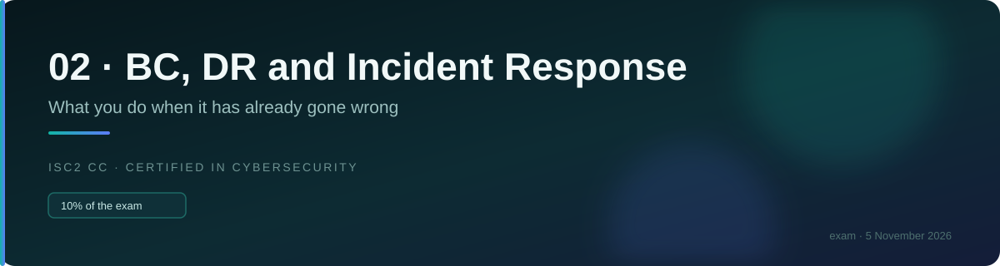
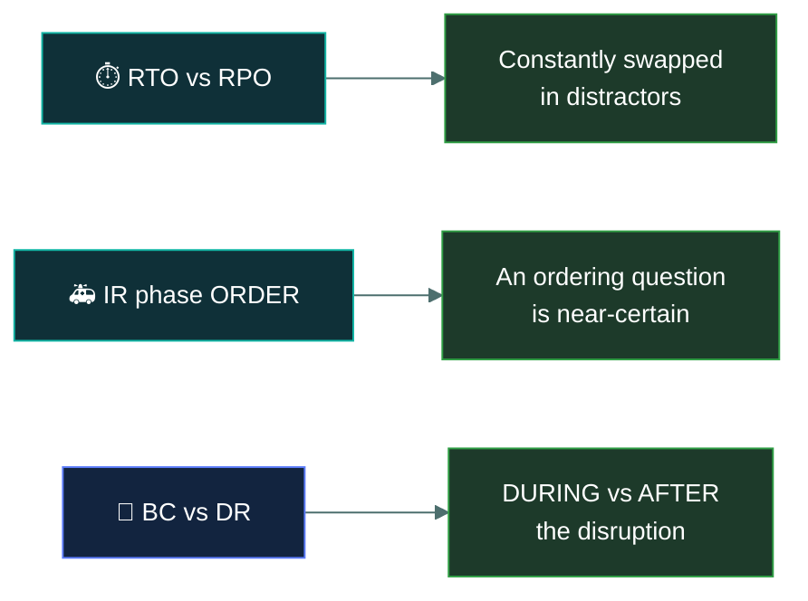

# 🚨&nbsp; 02 · BC, DR & Incident Response

### *What you do once it has already gone wrong.*

---

## 👋 01 · Read this first

The **smallest** domain at 10%, and among the easiest content on the paper. Six short topics,
heavily definitional, with almost all the marks concentrated in two places:

- **RTO versus RPO.** Two time metrics that are constantly swapped in distractors. Get them
  straight and you have several marks.
- **The order of the incident response phases.** An ordering question is near-certain.

Everything else here is vocabulary: knowing that **business continuity** keeps things running
*during* a disruption while **disaster recovery** restores normal operations *afterwards*, and
that an **event** is not an **incident** is not a **breach**.

Two themes carry through every topic, and both come straight from Domain 1:

- **Human safety outranks everything.** Every BC/DR scenario involving an emergency has "protect
  people" as the answer, without exception.
- **Follow the documented plan.** The correct first action in an incident is almost never
  technical — it is to follow the incident response plan and notify the right people.

> 🎯 **This is the domain to study last**, because it is worth least and its marks are the
> quickest to secure. But do not skip it — ten questions is the difference between passing and
> not.

---

## 📂 02 · The 6 topics

Work top to bottom. The terminology topic sets up everything after it.

| | Topic | What you will be able to do afterwards |
|:--:|---|---|
| &#9745; | 🏷️ [`incident-terminology/`](incident-terminology/) | Tell event, alert, incident and breach apart without hesitating. |
| &#9745; | 🚑 [`incident-response-plan/`](incident-response-plan/) | Recite the phases **in order** and say who does what. |
| &#9745; | 📊 [`business-impact-analysis/`](business-impact-analysis/) | Say what a BIA produces and why it comes before the plans. |
| &#9745; | ⏱️ [`rto-rpo-mtd/`](rto-rpo-mtd/) | Place all three metrics on a timeline and never swap RTO and RPO. |
| &#9745; | 🏃 [`business-continuity/`](business-continuity/) | Explain what keeps running *during* a disruption. |
| &#9745; | 🔧 [`disaster-recovery/`](disaster-recovery/) | Compare the site types and the testing types by cost and readiness. |

---

## 🎯 03 · Where the marks are

If you have one hour for this entire domain, spend it on
[`rto-rpo-mtd/`](rto-rpo-mtd/) and [`incident-response-plan/`](incident-response-plan/).

---

## ⏭️ 04 · Where to go next

When all six boxes are ticked, every domain is covered. Move to the drill material:
[`06-term-bank/`](../06-term-bank/README.md), then
[`07-question-bank/`](../07-question-bank/README.md), then
[`08-mock-exams/`](../08-mock-exams/README.md).

---

<a href="../README.md">← back to the repo index</a>

