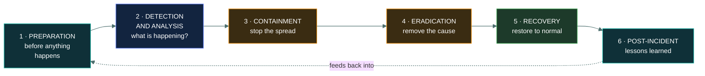
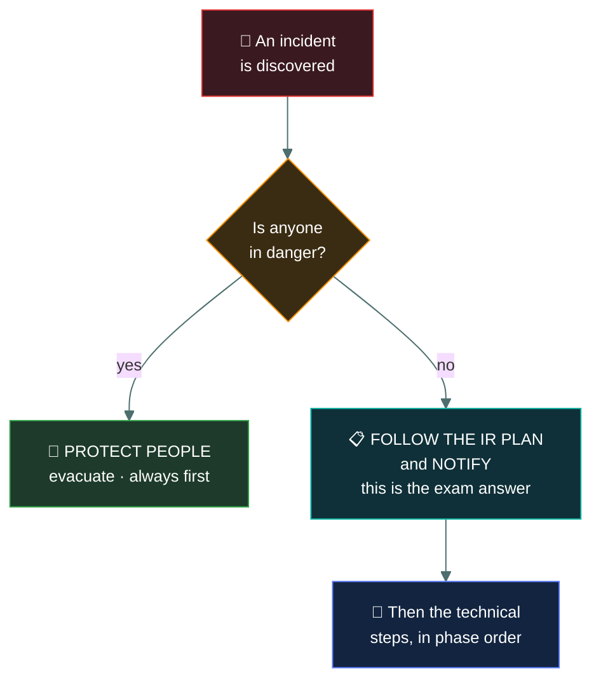

# 🚑 The incident response plan

### *The phases, in order — and an ordering question is near-certain*

📌 *Learn the phase order cold. Then remember that the correct FIRST action in any incident scenario is to follow the plan — not to fix anything.*

---

## 🧸 The big idea

An incident response plan says, in advance, **what happens when something goes wrong**: who is
involved, what they do, in what order, and who gets told.

It exists because incidents are a bad time to be making decisions. Under pressure, at three in the
morning, with executives asking questions, people improvise — and improvisation destroys evidence,
tips off attackers, and misses notification deadlines.

**The phases, in order:**

> **Preparation → Detection and Analysis → Containment → Eradication → Recovery →
> Post-Incident Activity**

Two things the exam does with this:

- **Asks you to put the phases in order**, or to say which phase a described action belongs to.
- **Asks what to do FIRST** in a scenario — where the answer is almost always **follow the plan
  and notify**, not the technical action you would actually take.

> [!IMPORTANT]
> **Containment is a phase, not a first move.** In real life you isolate the host immediately. On
> this exam, the correct first action is to follow the documented incident response plan.

---

## 📖 Words you will keep seeing

| Word | What it means on this exam |
|---|---|
| **Incident response plan (IRP)** | The documented process for handling incidents. |
| **CSIRT / CIRT** | Computer Security Incident Response Team. |
| **Preparation** | Everything done **before** an incident: plan, team, tools, training. |
| **Detection and analysis** | Identifying that an incident is occurring and determining its nature. |
| **Containment** | Limiting the damage and stopping the spread. |
| **Eradication** | Removing the cause — malware, the attacker's access, the vulnerability. |
| **Recovery** | Restoring systems to normal operation and confirming they are clean. |
| **Post-incident activity** | The lessons-learned review. Also called **post-mortem**. |
| **Chain of custody** | The documented handling of evidence from collection to use. |
| **Order of volatility** | Collecting the most perishable evidence first. |
| **Escalation** | Raising the incident to higher authority or expertise. |
| **Playbook** | A procedure for one specific incident type. |

---

## 🔄 The six phases

Note the dotted line: **the cycle closes.** Lessons learned feed back into preparation, which is
what makes the next response better.

### 1 · Preparation

**Everything done before an incident occurs.** It is the only phase you control the timing of,
and the one that determines how the others go.

- The plan itself, written, approved and **accessible when systems are down**
- A defined team with named roles and contact details
- Tools ready — forensic capability, communication channels
- **Training and exercises**, so the team has done this before
- Playbooks for likely incident types

> ⚠️ **A plan stored only on the network is unavailable during a network outage.** Offline copies
> matter, and this is a reasonable exam point.

### 2 · Detection and analysis

**Identifying that something is happening and working out what.** Sources include monitoring
alerts, user reports, third-party notification, and routine log review.

This phase answers: what is affected, how did it start, is it still ongoing, and how bad is it.
**Incident declaration** happens here, along with initial notification and escalation.

> 🎯 **A user reporting a suspicious email is detection.** It is why the reporting behaviour from
> awareness training matters so much.

### 3 · Containment

**Limiting the damage and stopping the spread.**

| | Means |
|---|---|
| **Short-term containment** | Immediate action — isolate the host, block an address, disable an account |
| **Long-term containment** | Temporary fixes allowing business to continue while a proper fix is prepared |

> ⚠️ **Containment and evidence preservation pull against each other.** Powering off a machine
> stops the damage and destroys everything in memory. The plan should say which matters more for
> each scenario, decided in advance rather than at 3am.

### 4 · Eradication

**Removing the cause.** Deleting malware, closing the vulnerability that allowed entry, removing
the attacker's persistence and any accounts they created.

> 🎯 **Eradication must remove the attacker's access, not just the malware.** An eradication that
> cleans the infection and leaves the backdoor means the attacker returns next week.

### 5 · Recovery

**Restoring systems to normal operation, and confirming they are clean.**

- Restore from known-good backups
- Rebuild systems where compromise was deep
- **Verify** systems are clean before returning them to service
- **Monitor closely** afterwards, because reinfection is common

> ⚠️ **Restore from a backup taken *before* the compromise.** A backup taken after the attacker was
> already present reinstates them.

### 6 · Post-incident activity

**The lessons-learned review.** What happened, what worked, what did not, and what changes
follow.

It should be **blameless** — focused on what allowed the incident, not on who to blame. A review
that hunts for someone to punish gets no honest information, and the next incident is concealed.

> 🎯 **Post-incident is the phase organisations skip, and it is the one that improves the next
> response.** If a question asks how to prevent a recurrence, this is where the answer lives.

---

## 🚦 What to do FIRST

> [!CAUTION]
> **This is the highest-value pattern in the domain.** When a scenario asks what to do FIRST and
> offers technical actions alongside "follow the incident response plan" or "notify management",
> the process option is the answer. Containment is right — it is simply not first.

---

## 🔬 Evidence handling

Where an incident may lead to legal action or discipline, evidence must be handled so it remains
usable.

| Concept | Means |
|---|---|
| **Chain of custody** | A documented record of who handled evidence, when, and why. Unbroken |
| **Order of volatility** | Collect the **most perishable first** — memory before disk, disk before backups |
| **Working copies** | Analyse a copy; preserve the original untouched |
| **Hashing** | Hash evidence at collection and verify later, proving it has not changed |

> 🎯 **Order of volatility: memory is lost when you power off; disk survives.** Collect the volatile
> data first, which is exactly what conflicts with immediate containment by shutdown.

---

## ⚖️ Told apart

| | Means | Not to be confused with |
|---|---|---|
| **Preparation** | Everything **before** an incident. | Detection, which begins when something happens. |
| **Containment** | **Stop the spread.** Damage limitation. | **Eradication**, which removes the cause. Contain first, then eradicate. |
| **Eradication** | **Remove the cause** — malware, access, vulnerability. | **Recovery**, which restores service. |
| **Recovery** | **Restore to normal** and verify clean. | Eradication. You cannot safely recover onto a system still compromised. |
| **Post-incident activity** | **Lessons learned**, blameless. | Recovery, which ends when service is normal. |
| **Incident response** | Handling a security incident. | **Disaster recovery**, which restores after a disaster of any kind. |
| **Chain of custody** | Documented handling of evidence. | **Order of volatility**, which is the sequence of collection. |

---

## ⚠️ Where your instinct is wrong

> [!WARNING]
> **In the job:** you isolate the host first and tell people afterwards, because every minute of
> delay costs you more of the environment.
>
> **On the exam:** **follow the plan and notify first.** Containment is a phase within the process,
> not a substitute for starting it. This is the most commonly missed question in the domain.

> [!WARNING]
> **In the job:** you pull the power to stop ransomware encrypting.
>
> **On the exam:** powering off **destroys volatile evidence** in memory. Whether that is
> acceptable is a decision the plan should have made in advance — and questions about evidence
> favour preserving it.

> [!WARNING]
> **In the job:** once service is restored, the incident is over and everyone moves on.
>
> **On the exam:** **post-incident activity is a phase** and is where recurrence is prevented. An
> incident is not finished at recovery.

---

## 🧠 How to remember it

🧠 **P · D · C · E · R · P**
**P**reparation, **D**etection, **C**ontainment, **E**radication, **R**ecovery, **P**ost-incident.

🧠 **"Prepare, Detect, Contain, Eradicate, Recover, Review."**

🧠 **Contain stops the bleeding. Eradicate removes the cause. Recover restores the patient.** In
that order, medically and on the exam.

🧠 **First action: people, then the plan, then the technology.**

---

## ✅ Check you actually got it

Answer all five before expanding anything.

**Q1.** A security analyst discovers ransomware actively encrypting a file server. What should they
do FIRST?

- **A.** Disconnect the server from the network
- **B.** Follow the organisation's incident response plan
- **C.** Restore the affected files from backup
- **D.** Power off the server to stop the encryption

<b>Answer</b>

**B — follow the organisation's incident response plan.** The qualifier is **FIRST**, and the
ISC2 position is that a documented process exists and governs the response. Every other option is
a step *within* that process.

- **A** is containment — the right action, at the wrong point. It is what you would genuinely do,
  and it is a phase of the plan rather than a replacement for starting it.
- **C** is recovery, which is the wrong phase entirely. Restoring while encryption is still running
  re-encrypts the restored data.
- **D** contains the damage and destroys all volatile evidence in memory, which is a decision the
  plan should make rather than an analyst improvising.

**Q2.** What is the correct order of the incident response phases?

- **A.** Detection → Preparation → Containment → Recovery → Eradication → Post-incident
- **B.** Preparation → Detection and analysis → Containment → Eradication → Recovery → Post-incident
- **C.** Preparation → Containment → Detection → Eradication → Recovery → Post-incident
- **D.** Detection → Containment → Eradication → Recovery → Preparation → Post-incident

<b>Answer</b>

**B — Preparation → Detection and analysis → Containment → Eradication → Recovery →
Post-incident.**

- **A** swaps eradication and recovery, which is illogical: you cannot safely restore onto a system
  where the cause is still present.
- **C** puts containment before detection, which is impossible — you cannot contain something you
  have not yet identified.
- **D** places preparation near the end. Preparation is everything done **before** an incident, so
  it can only be first.

**Q3.** During which phase would an organisation remove malware and close the vulnerability that
allowed the attacker in?

- **A.** Containment
- **B.** Eradication
- **C.** Recovery
- **D.** Post-incident activity

<b>Answer</b>

**B — eradication.** Removing the cause — the malware, the attacker's access, and the
vulnerability that allowed entry — is exactly what this phase is for.

- **A** limits the spread without removing the cause: isolating a host, blocking an address,
  disabling an account.
- **C** restores systems to normal operation after the cause has been removed.
- **D** is the lessons-learned review once the incident is resolved.

**Q4.** Why should volatile data such as system memory be collected before powering off a
compromised system?

- **A.** Memory is easier to analyse than disk storage
- **B.** Memory contents are lost when power is removed — the order of volatility
- **C.** Disk evidence is not admissible in legal proceedings
- **D.** Powering off would alert the attacker

<b>Answer</b>

**B — memory contents are lost when power is removed.** The order of volatility says collect the
most perishable evidence first, and memory frequently holds the most valuable material: running
processes, network connections, injected code and encryption keys.

- **A** is not generally true; memory analysis is specialised work.
- **C** is false — disk evidence is routinely used, with proper chain of custody.
- **D** is a genuine operational consideration in some intrusions and is not the reason for the
  collection order.

**Q5.** Why is the post-incident review important, and how should it be conducted?

- **A.** To identify who was at fault so they can be disciplined
- **B.** To identify what allowed the incident and improve the response, conducted blamelessly
- **C.** To satisfy insurance requirements only
- **D.** It is optional once systems have been restored

<b>Answer</b>

**B — to identify what allowed the incident and improve the response, conducted blamelessly.**
The output feeds back into preparation, which is what makes the next response better.

- **A** is precisely what destroys a review's value. People who expect blame withhold information,
  and the review learns nothing — the same principle as phishing simulations.
- **C** reduces a learning exercise to paperwork and misses its purpose.
- **D** treats the incident as over at recovery. Post-incident activity is a defined phase, and
  skipping it means the same incident recurs.

---

## 🎓 The grown-up version

<b>Extra depth — open this on a second read, never needed for the pass</b>

**Phase models differ slightly between frameworks.** NIST uses four phases — Preparation;
Detection and Analysis; Containment, Eradication and Recovery; Post-Incident Activity — grouping
the middle three because in practice they interleave rather than running strictly in sequence.
SANS teaches six, separating them out, which is the model CC follows. If an exam option shows four
phases with containment, eradication and recovery combined, it is not wrong, merely a different
framework. Answer with six unless the question names a framework.

**The phases overlap in reality.** You contain one host while still detecting the extent of the
compromise elsewhere, and you may eradicate from some systems while others are still being
analysed. The clean sequence is a teaching model. What it does capture correctly is the
*dependency*: you cannot safely recover a system you have not eradicated from, and you cannot
eradicate what you have not analysed.

**Containment strategy is a genuine trade-off decided in advance.** Isolating immediately stops
damage and tells the attacker they have been seen, which may cause them to destroy evidence or
deploy ransomware early. Watching quietly preserves intelligence about their full footprint at the
cost of ongoing damage. Plans for sophisticated intrusions frequently favour observation until the
full extent is mapped, then simultaneous eviction — because a partial eviction leaves the attacker
in place and alerted.

**Recovery is where reinfection happens.** Restoring from a backup taken after the initial
compromise reinstates the attacker, and this is common because the intrusion often predates
discovery by months. Determining the point of initial compromise — the dwell time — is therefore
essential before choosing a restore point, and it is one of the hardest parts of a serious
investigation.

**Chain of custody matters beyond courtrooms.** Even where no prosecution follows, defensible
evidence handling matters for insurance claims, regulatory enquiries, employment disputes and
contractual arguments with suppliers. The discipline is the same: document who touched what and
when, hash originals, work on copies.

**Tabletop exercises are the cheapest preparation there is.** Walking a team through a scenario
around a table, with no systems touched, reliably surfaces that the contact list is out of date,
that nobody knows who declares an incident, and that the plan is stored on the file server that
the scenario has just taken offline. These findings cost an afternoon rather than an incident.

---

## 📝 Cram lines

Destined for [`EXAM-DAY.md`](../../EXAM-DAY.md):

- **Phases: PREPARATION → DETECTION & ANALYSIS → CONTAINMENT → ERADICATION → RECOVERY → POST-INCIDENT.**
- *Prepare, Detect, Contain, Eradicate, Recover, Review.*
- **The FIRST action in any incident scenario = FOLLOW THE PLAN and NOTIFY.** Containment is a phase, not a first move.
- **Human safety still outranks everything**, including the plan.
- **Contain** = stop the spread. **Eradicate** = remove the cause (including the attacker's access, not just malware). **Recover** = restore and verify clean.
- **Restore from a backup taken BEFORE the compromise.**
- **Post-incident = lessons learned, BLAMELESS**, and feeds back into preparation. Don't skip it.
- **Order of volatility: memory before disk.** Powering off destroys memory evidence.
- **Chain of custody** = unbroken documented record of who handled evidence, when.
- **Keep offline copies of the plan** — it's useless on a network that's down.

---

<a href="../README.md">← back to 02 · BC, DR & IR</a> &nbsp;·&nbsp; <a href="../business-impact-analysis/">next: Business impact analysis →</a>

