# 🚨&nbsp; 02 · Security Governance

### *Planning resilience and proving the programme works — before anything goes wrong.*

---

## 👋 01 · Read this first

**New as its own domain under the live outline**, effective 1 September 2026. Under the
previous outline, business continuity and disaster recovery sat in a 10%-weighted domain
alongside incident response. That domain has been split: **incident response moved to Domain
5**, and what remains — BC/DR, GRC, awareness, and measuring effectiveness — became its own
domain at **17.3%**.

Seven topics, organised around four sub-areas from the outline:

- **Plan GRC** — governance, risk and compliance as an integrated programme
- **Redundancy** — business continuity and disaster recovery
- **Security awareness** — culture, leadership, social engineering, phishing
- **Measuring effectiveness** — KRIs, KPIs, dashboards, scorecards, reports

Most of the marks concentrate in a few places:

- **RTO versus RPO.** Two time metrics that are constantly swapped in distractors.
- **BC versus DR.** During the disruption, versus after it.
- **KRI versus KPI.** A forward-looking warning, versus a performance grade.

> [!NOTE]
> **Incident response is not here.** If you studied the old outline, retrain the instinct to
> look for it in this domain — it now lives in
> [`05-security-operations/`](../05-security-operations/README.md).

> 🎯 **Domain 2 and Domain 5 are tied at 17.3% each** — neither is "the small domain" the way
> the old 10%-weighted BC/DR domain was. Give this real study time.

---

## 📂 02 · The 7 topics

Work top to bottom.

| | Topic | What you will be able to do afterwards |
|:--:|---|---|
| &#9745; | 🧭 [`grc-fundamentals/`](grc-fundamentals/) | Explain why governance, risk and compliance run as one programme. |
| &#9745; | 📊 [`business-impact-analysis/`](business-impact-analysis/) | Say what a BIA produces and why it comes before the plans. |
| &#9745; | ⏱️ [`rto-rpo-mtd/`](rto-rpo-mtd/) | Place all three metrics on a timeline and never swap RTO and RPO. |
| &#9745; | 🏃 [`business-continuity/`](business-continuity/) | Explain what keeps running *during* a disruption. |
| &#9745; | 🔧 [`disaster-recovery/`](disaster-recovery/) | Compare the site types and the testing types by cost and readiness. |
| &#9745; | 🎣 [`security-awareness-training/`](security-awareness-training/) | Tell awareness, training and education apart, and name the social engineering angles. |
| &#9745; | 📈 [`measuring-cybersecurity-effectiveness/`](measuring-cybersecurity-effectiveness/) | Tell a KRI from a KPI, and match a dashboard/scorecard/report to its audience. |

---

## 🎯 03 · Where the marks are

If you have one hour for this entire domain, spend it on
[`rto-rpo-mtd/`](rto-rpo-mtd/) and [`measuring-cybersecurity-effectiveness/`](measuring-cybersecurity-effectiveness/).

---

## ⏭️ 04 · Where to go next

When all seven boxes are ticked, every domain is covered. Move to the drill material:
[`06-term-bank/`](../06-term-bank/README.md), then
[`07-question-bank/`](../07-question-bank/README.md), then
[`08-mock-exams/`](../08-mock-exams/README.md).

---

<a href="../README.md">← back to the repo index</a>

</content>
