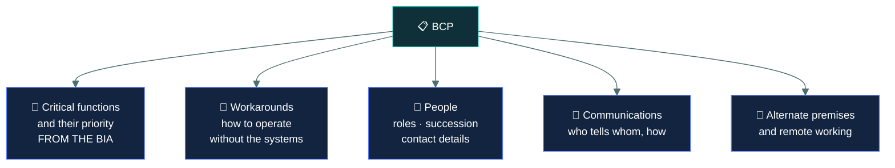
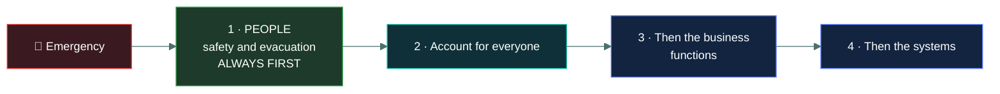

# 🏃 Business continuity

### *Keeping the business running DURING the disruption*

📌 *One word carries this topic: DURING. Continuity keeps things going while it is broken; recovery restores normal afterwards.*

---

## 🧸 The big idea

**Business continuity** is about carrying on while something is broken.

> **Continuity = keeping the business running DURING the disruption.**
> **Recovery = restoring normal operations AFTER it.**

The distinction is one word, and it is the most swapped pair in this domain after RTO and RPO.

Continuity is deliberately **business-focused rather than technical**. The question it asks is not
"how do we restore the server" but "**how do we keep taking orders while the server is down**".
Those often have different answers — a manual paper process, a phone line, staff relocated to
another office, a supplier picking up the work.

> 🎯 **Continuity answers include manual workarounds and alternate ways of working.** If an option
> describes carrying on by different means while systems are unavailable, that is continuity — not
> recovery.

---

## 📖 Words you will keep seeing

| Word | What it means on this exam |
|---|---|
| **Business continuity (BC)** | Keeping critical functions operating **during** a disruption. |
| **BCP** — Business Continuity Plan | The documented plan for doing so. |
| **Disaster recovery (DR)** | Restoring normal operations **after** a disruption. A subset of continuity. |
| **Critical business function** | A function the organisation cannot operate without for long. |
| **Manual workaround** | Carrying out a process without the usual systems. |
| **Alternate site** | Another location from which work can continue. |
| **Succession planning** | Ensuring key roles can be filled if a person is unavailable. |
| **Crisis management** | Handling the wider organisational response — decisions, communications, stakeholders. |
| **Communications plan** | Who is told what, by whom, through which channel. |
| **Resilience** | The ability to absorb disruption and keep functioning. |

---

## 🔀 Continuity versus recovery

| | **Business continuity** | **Disaster recovery** |
|---|---|---|
| **When** | **During** the disruption | **After** the disruption |
| **Goal** | Keep critical functions running | Restore normal operations |
| **Scope** | The **whole business** — people, process, premises, suppliers | Mainly **IT systems and data** |
| **Typical answer** | Manual process, alternate site, relocated staff | Restore from backup, fail over, rebuild |
| **Relationship** | The broader discipline | A **subset** of continuity |

> [!IMPORTANT]
> **Disaster recovery is a subset of business continuity.** Continuity covers the whole business;
> recovery covers restoring the systems. If a question offers both and describes restoring IT
> systems, it wants DR. If it describes the business carrying on, it wants BC.

---

## 📋 What a continuity plan contains

| Element | Why it matters |
|---|---|
| **Critical functions, prioritised** | From the BIA — what to keep running, in what order |
| **Manual workarounds** | How to operate the function without its usual systems |
| **People and succession** | Who performs each role, and who does it if they are unavailable |
| **Communications plan** | Staff, customers, regulators, suppliers, press — who, what, when |
| **Alternate working arrangements** | Another site, remote working, another team |
| **Supplier arrangements** | Who is contacted, what contracts commit them to |
| **Activation criteria** | **Who decides** the plan is invoked, and on what basis |

> ⚠️ **A plan with no named activator does not get activated.** Under pressure, if nobody has the
> authority to declare, everyone waits for someone else. Activation criteria and a named
> decision-maker are essential elements, not paperwork.

> ⚠️ **The plan must be available when systems are down.** A BCP stored only on the file server is
> unavailable in exactly the scenario it was written for. Offline and off-site copies are part of
> the control.

---

## 🧍 People come first

Every continuity scenario involving an emergency has the same answer.

> [!CAUTION]
> **Human safety outranks every other consideration, in every scenario, without exception.**
> Evacuation and accounting for staff come before assets, data, evidence and continuity of
> operations. This is Canon 1 of the Code of Ethics expressed as an operational priority.

**People also matter in a second way:** continuity depends on staff being available and able to
perform roles. That is why **succession planning** and **cross-training** are continuity controls
— a function that only one person knows how to perform has a single point of failure wearing
shoes.

---

## 📢 Communications

Frequently the part that fails, and a recognised element in its own right.

| Audience | Needs |
|---|---|
| **Staff** | What has happened, whether to come in, what to do |
| **Customers** | What is affected and when it will be resolved |
| **Regulators** | Notification, where obligations are triggered |
| **Suppliers and partners** | What is needed from them |
| **Media** | A single authorised spokesperson |

> 🎯 **One authorised spokesperson.** Multiple people commenting produces contradictory
> statements and makes the situation worse. A communications plan names who speaks.

> ⚠️ **Contact details go stale.** A call tree that has not been checked in two years is a list of
> old phone numbers. Verification is part of maintaining the plan.

---

## 🧪 Testing and maintenance

**An untested plan is an assumption.** Testing finds the out-of-date contact list, the workaround
that depends on a system also affected, and the fact that nobody knows who activates it.

Plans must also be **maintained** — reviewed periodically and after significant change, because a
plan describing an organisation that has since restructured is worse than none, since people trust
it.

---

## ⚖️ Told apart

| | Means | Not to be confused with |
|---|---|---|
| **Business continuity** | Keeping functions running **DURING** a disruption. | **Disaster recovery**, restoring normal **AFTER**. One word apart. |
| **Business continuity** | The **whole business** — people, process, premises, suppliers. | **DR**, which is mainly IT systems and data. DR is a **subset** of BC. |
| **BCP** | The plan for continuing operations. | The **BIA**, which produces the information the plan is built on. |
| **Manual workaround** | Operating without the usual systems. A **continuity** measure. | A recovery measure, which restores the systems themselves. |
| **Crisis management** | The wider organisational response — decisions, stakeholders, reputation. | **Incident response**, which handles the security incident itself. |
| **Succession planning** | Ensuring roles can be filled when people are unavailable. | An HR exercise only. It is a continuity control. |

---

## ⚠️ Where your instinct is wrong

> [!WARNING]
> **In the job:** continuity planning means arranging failover and replication.
>
> **On the exam:** that is **disaster recovery**. Continuity is broader and often **non-technical**
> — manual processes, relocated staff, alternative suppliers. If the answer keeps the business
> working without the systems, it is continuity.

> [!WARNING]
> **In the job:** during a serious incident, restoring service is the priority everyone feels.
>
> **On the exam:** **people first, always.** Evacuation and accounting for staff precede systems,
> data and evidence in every scenario.

> [!WARNING]
> **In the job:** the continuity plan lives on the intranet with everything else.
>
> **On the exam:** it must be **available when systems are down**. Offline and off-site copies are
> part of the plan, not an administrative nicety.

---

## 🧠 How to remember it

🧠 **Continuity = DURING. Recovery = AFTER.** One word.

🧠 **BC is the whole business. DR is the systems.** DR sits inside BC.

🧠 **Continuity answers are often manual.** Paper, phones, another office, another supplier.

🧠 **People, then business, then systems.** Every time.

---

## ✅ Check you actually got it

Answer all five before expanding anything.

**Q1.** What distinguishes business continuity from disaster recovery?

- **A.** Business continuity applies to natural disasters; disaster recovery applies to cyber attacks
- **B.** Business continuity keeps functions running during a disruption; disaster recovery restores normal operations afterwards
- **C.** Disaster recovery is broader and includes business continuity
- **D.** They are the same process with different names

<b>Answer</b>

**B — continuity keeps functions running **during**; recovery restores normal operations
**after**.** That single word is the distinction the exam tests.

- **A** invents a split by cause. Both apply regardless of what caused the disruption.
- **C** reverses the relationship. **Business continuity is the broader discipline**, and disaster
  recovery is a subset of it focused on restoring systems.
- **D** loses the distinction entirely.

**Q2.** A manufacturer's order system fails. Staff begin recording orders on paper and entering
them later. What does this represent?

- **A.** Disaster recovery, because operations continue
- **B.** A business continuity measure — a manual workaround keeping the function running
- **C.** Incident response containment
- **D.** A failure of the recovery plan

<b>Answer</b>

**B — a business continuity measure.** The function — taking orders — continues by different means
while the system is unavailable. That is exactly what continuity is for, and it illustrates that
continuity answers are frequently non-technical.

- **A** would involve restoring or failing over the system itself. Nothing is being restored here.
- **C** would involve limiting the spread of a security incident, which the stem does not describe.
- **D** inverts it. A workaround that lets the business keep operating is the plan **working**, not
  failing.

**Q3.** A fire alarm sounds during a major system outage that staff are working to resolve. What
takes priority?

- **A.** Completing the system restoration before evacuating
- **B.** Evacuating and accounting for all personnel
- **C.** Securing the server room before leaving
- **D.** Notifying customers of the outage

<b>Answer</b>

**B — evacuating and accounting for all personnel.** Human safety outranks every other
consideration in every scenario on this exam, with no exceptions.

- **A** keeps people in a building that may be on fire to protect a system. The trade is never
  acceptable.
- **C** is a conscientious-sounding distractor that risks locking doors during an evacuation.
- **D** is a legitimate communications obligation that does not outrank getting people out of the
  building.

**Q4.** Which element is MOST likely to be missing from a continuity plan that fails during a real
disruption?

- **A.** A list of critical business functions
- **B.** Current contact details and a named person authorised to activate the plan
- **C.** A description of the organisation's structure
- **D.** The names of the plan's authors

<b>Answer</b>

**B — current contact details and a named activator.** Contact lists go stale quickly, and if
nobody holds the authority to declare, everyone waits for someone else while the disruption
continues.

- **A** is normally present, because it comes directly from the BIA and is the obvious starting
  point.
- **C** is background information that rarely determines whether a plan works.
- **D** is administrative metadata with no operational bearing.

**Q5.** Why is succession planning considered a business continuity control?

- **A.** It reduces recruitment costs
- **B.** It ensures critical roles can still be performed if key people are unavailable
- **C.** It is required by data protection regulations
- **D.** It improves employee retention

<b>Answer</b>

**B — it ensures critical roles can still be performed if key people are unavailable.** People are
a dependency like any other, and a function only one person knows how to perform is a single point
of failure.

- **A** is an HR benefit and not the continuity rationale.
- **C** invents a regulatory requirement.
- **D** is another genuine HR benefit that is not why it appears in a continuity plan.

---

## 🎓 The grown-up version

<b>Extra depth — open this on a second read, never needed for the pass</b>

**Manual workarounds decay silently.** A plan written when staff remembered the paper process
becomes unusable a decade later, when nobody has ever worked without the system and the forms no
longer exist. Processes also become too complex to perform manually — a workflow with automated
credit checks, tax calculation and fraud screening cannot realistically be done on paper. Honest
continuity planning sometimes has to conclude that there is no workaround, which makes a short RTO
the only option and is a genuinely useful finding.

**Crisis management and incident response are different disciplines.** Incident response handles
the technical event. Crisis management handles the organisational consequences — executive
decisions, regulatory engagement, customer communications, reputation, legal exposure. They run in
parallel during a major incident and need different people. Organisations that conflate them end
up with technical responders briefing journalists, or executives making containment decisions.

**Concentration risk in suppliers.** Continuity plans that assume a supplier will step in
frequently discover that the supplier serves every competitor too, and cannot absorb everyone at
once. The same applies to alternate sites shared between subscribers. The contract wording matters:
guaranteed capacity costs considerably more than best-efforts availability, and the difference only
becomes visible during a regional event when everyone invokes simultaneously.

**Pandemic planning revealed the gaps.** Most continuity plans assumed a disruption affecting a
*place* — a fire, a flood, a failed building — and answered it by relocating people elsewhere.
2020 disrupted the **people** while the places remained intact, invalidating that assumption
almost universally. It is a useful reminder that plans encode assumptions about the shape of the
disruption, and that testing against one scenario does not validate them against another.

**The plan is less valuable than the planning.** Documents go stale; the shared understanding built
by working through scenarios together lasts longer and adapts to situations nobody anticipated.
This is the strongest argument for regular exercises: the team that has reasoned through three
scenarios handles the fourth, unplanned one far better than a team with an excellent unread
document.

---

## 📝 Cram lines

Destined for [`EXAM-DAY.md`](../../EXAM-DAY.md):

- **CONTINUITY = DURING the disruption. RECOVERY = AFTER it.** One word apart.
- **BC is the WHOLE BUSINESS** (people, process, premises, suppliers). **DR is mainly IT systems.**
- **DR is a SUBSET of BC** — not the other way round.
- **Continuity answers are often NON-TECHNICAL** — manual workarounds, paper, phones, another site, another supplier.
- **PEOPLE FIRST, ALWAYS.** Evacuate and account for staff before assets, data, evidence or operations.
- **The plan needs ACTIVATION CRITERIA and a NAMED person** authorised to invoke it.
- **Keep OFFLINE and OFF-SITE copies** — a plan on the downed file server is useless.
- **One authorised spokesperson** for media.
- **Succession planning and cross-training are CONTINUITY controls** — a one-person function is a single point of failure.
- **An untested plan is an assumption.**

---

<a href="../README.md">← back to 02 · Security Governance</a> &nbsp;·&nbsp; <a href="../disaster-recovery/">next: Disaster recovery →</a>

