# 🏢 Business Continuity — Caveman Style

---

Think about Grog's tribe. 🪨

A huge storm destroys part of their cave.

🌪️💥 DISRUPTION!

The tribe can't operate normally.

But the tribe still needs to survive.

So they ask:

> "What important things must keep running while the cave is damaged?"

That's business continuity.

## 🧠 What is Business Continuity?

**Business continuity is the ability of an organization to continue delivering critical products
or services during and after a disruption.**

The key word is:

> ⭐ **CONTINUE**

It's not necessarily about restoring everything immediately.

It's about keeping the most important business functions running.

## 🪨 Caveman Example

Imagine Grog's tribe normally does this:

- 🥩 Hunt for food
- 💧 Collect water
- 🏠 Maintain the cave
- 🎨 Paint pictures
- 🪨 Make decorations

Then a huge storm hits.

The cave is damaged.

The tribe can't do everything.

So they prioritize.

**Must continue:** 🥩 Food collection · 💧 Water supply · 🏥 Medical care

**Can wait:** 🎨 Cave paintings · 🪨 Decorations

The important activities continue even though the tribe isn't operating normally.

That's business continuity.

---

## ⭐ What keeps running?

The answer is:

> **Critical business functions and services.**

Not necessarily everything.

This is why the BIA (Business Impact Analysis) is important.

The BIA identifies:

> **Which functions are critical and how long they can tolerate disruption.**

Then the organization develops continuity strategies to keep those critical functions operating.

---

## 🏢 Real-World Example

Imagine an online bank.

Normally it has:

- 💰 Payment processing
- 🏦 Online banking
- 📞 Customer support
- 📧 Marketing
- 👥 HR
- 🧑‍💼 Office operations

A major disaster hits the headquarters.

The organization might prioritize:

**⭐ Critical** — 💰 Payment processing · 🏦 Online banking · 🔐 Security operations

**🟡 Important but temporarily reduced** — 📞 Customer support

**🟢 Can wait** — 📧 Marketing · 🏢 Some office activities

The objective is to keep critical services available.

---

## 🔄 How does the organization keep running?

Business continuity can use strategies such as:

**🏢 Alternate location** — If the main office is destroyed: 💻🏠 "Move critical employees to
another location."

**🏠 Remote work** — Employees work from home. 💻🏠

**🖥️ Redundant systems** — If one server fails: Server A 💥. Another server takes over: Server B
✅.

**👥 Alternate personnel** — If key employees are unavailable, trained backups take over. "Grog is
injured, so Bob performs the job."

**📦 Alternate suppliers** — If the normal supplier cannot provide materials: "Use another
supplier."

---

## 🧠 Business Continuity vs Disaster Recovery

This is another common exam trap.

**🏢 Business Continuity** — "How do we keep critical business operations running during a
disruption?"

**🖥️ Disaster Recovery** — "How do we restore IT systems and infrastructure after a disruption?"

They work together, but they're not identical.

### 🪨 Example

A company's main server room catches fire. 🔥

**Business Continuity** — The company says: "Customers still need to place orders." So employees
use: 🖥️ Backup systems / alternate processes to keep the business operating.

**Disaster Recovery** — Meanwhile, the IT team works on: "How do we restore the damaged systems?"

So:

> **Business Continuity = Keep the business going.**
> **Disaster Recovery = Restore systems.**

---

## ⏱️ Connection to RTO and MTD

Remember what you learned earlier:

**RTO** — How quickly should we recover?

**MTD** — How long can we tolerate the disruption?

Business continuity strategies are designed to help the organization operate within those
requirements.

For example:

> MTD = 8 hours, RTO = 4 hours

The organization needs a continuity/recovery strategy that can meet those requirements.

---

## 🎯 Exam-Ready Answer

If the exam asks:

> "What keeps running during a disruption?"

Answer:

> **Business continuity keeps critical business functions and services operating during and
> after a disruption, using predefined strategies and alternate methods when normal operations are
> unavailable.**

**Caveman version:**

> "Cave breaks, but tribe must keep eating, drinking, treating injuries, and doing the most
> important work."

That's business continuity.

### 🧠 Remember

**BC** = Keep critical BUSINESS running.

**DR** = Recover IT/system capabilities.

---

<a href="../README.md">← Back to 02 · Security Governance</a>

